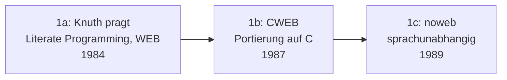

# Evolution und Architekturen digitaler Notebook-Vorläufer

Literate-Programming-Vorläufer & erste Notebook-Interfaces bilden Generation 1 der [Evolution digitaler Notebook-Systeme](evolution-digitaler-notebook-systeme.md). Diese eigenständige Zeitachse zoomt in genau diese Architekturlinie hinein: von Donald Knuths ursprünglichem Literate-Programming-Konzept über sprachunabhängige Weiterentwicklungen, Computer-Algebra-System-Notebooks, Sweave und Emacs Org-mode/Babel bis zum Sage Notebook unmittelbar vor der eigentlichen Jupyter-Ära.

!!! note "Hinweis: Generationen überlappen sich"
    Die Zeiträume sind grobe Orientierung, keine scharfen Grenzen — Emacs Org-mode (Generation 4) wird bis heute aktiv weiterentwickelt, parallel zu Jupyter (Generation 2 der übergeordneten Zeitachse). Entscheidend ist die **Architektur** (Code, Ausgabe und Text im selben Dokument, Ausführungsmodell), nicht allein das Erscheinungsjahr.

---

## Generation 1: Knuths Literate Programming, WEB & CWEB, 1984 – 1990

Die Gründergeneration eint drei Prinzipien: **Dokumentation und Code in derselben Quelldatei**, ein **Weberwerkzeug**, das daraus getrennt sowohl lesbare Dokumentation als auch kompilierbaren Code erzeugt, und eine **zunächst enge Sprachbindung**. Sie lässt sich in drei technologische Entwicklungsstufen unterteilen:

### 1a. Knuth prägt „Literate Programming", WEB-System, 1984

- **Architektur:** Donald Knuth veröffentlicht das Konzept „Literate Programming" und das dazugehörige Werkzeug **WEB** — Quelltext wird primär für Menschen geschrieben, ein Werkzeug extrahiert daraus sowohl kompilierbaren Pascal-Code als auch typografisch gesetzte Dokumentation.
- **Bedeutung:** die konzeptionelle Wurzel jedes späteren Notebook-Systems — Code und Erklärung leben von Anfang an im selben Dokument statt in getrennten Dateien.

### 1b. CWEB — Portierung auf C, 1987

- **Architektur:** Knuth und Silvio Levy portieren das WEB-Prinzip von Pascal auf C — dieselbe Weber-Idee, jetzt für eine deutlich verbreitetere Programmiersprache.

### 1c. noweb — sprachunabhängiges Literate Programming, 1989

- **Architektur:** Norman Ramsey verallgemeinert das Prinzip auf beliebige Programmiersprachen statt einer fest eingebauten Sprachbindung — ein einfacheres, sprachagnostisches Werkzeug als WEB/CWEB.

---

## Generation 2: Computer-Algebra-System-Notebooks, 1982 – 1988

Parallel zur reinen Literate-Programming-Bewegung entstehen die ersten echten **grafischen Notebook-Oberflächen** — nicht mehr nur ein Text-Werkzeug, sondern eine interaktive Anwendung mit Eingabe-/Ausgabezellen.

| System | Jahr | Bedeutung |
|---|---|---|
| **Maple Worksheets** | 1982 | Frühe interaktive Arbeitsblatt-Oberfläche für das Computer-Algebra-System Maple. |
| **Mathematica Notebooks** | 1988 | Prägt den Begriff „Notebook" für diese Systemkategorie, siehe [Generation 1a der übergeordneten Zeitachse](evolution-digitaler-notebook-systeme.md#1a-mathematica-notebooks-der-ursprung-des-begriffs-1988). |

---

## Generation 3: Sweave — Literate Programming trifft Statistik, 2002

**Sweave** überträgt das WEB-Prinzip auf die statistische Programmiersprache R und kombiniert es mit professionellem LaTeX-Textsatz.

| Baustein | Rolle |
|---|---|
| **Sweave** | Kombiniert LaTeX mit eingebetteten R-Codeblöcken, die beim Kompilieren durch ihre Ausgabe ersetzt werden — direkter Vorläufer von [R Markdown](evolution-digitaler-notebook-systeme.md#generation-4-r-markdown-okosystem-multi-sprachen-publishing-2012-2022). |

---

## Generation 4: Emacs Org-mode & Babel — Literate Programming im Texteditor, 2003 – 2009

Statt einer eigenständigen Notebook-Anwendung entsteht diese Generation direkt im Texteditor **Emacs** — ein einfaches, klartextbasiertes Gliederungsformat wird um ausführbare Codeblöcke erweitert.

| Baustein | Jahr | Rolle |
|---|---|---|
| **Org-mode** | 2003 | Carsten Dominik entwickelt ein klartextbasiertes Gliederungs- und Notizformat für Emacs. |
| **Org-Babel** | 2009 | Eric Schulte und Dan Davison erweitern Org-mode um ausführbare Multi-Sprachen-Codeblöcke — reine Klartextdatei statt JSON, dadurch von Beginn an Git-diff-freundlich. |

---

## Generation 5: Sage Notebook — browserbasiert vor Jupyter, 2005 – 2006

Die Mathematik-Software **Sage** bringt ein browserbasiertes Notebook-Interface Jahre bevor IPython sein eigenes vorstellt.

| Baustein | Rolle |
|---|---|
| **Sage Notebook** | Browserbasiertes Interface für das Open-Source-Mathematiksystem Sage, siehe [Generation 1c der übergeordneten Zeitachse](evolution-digitaler-notebook-systeme.md#1c-sage-notebook-browserbasiert-vor-jupyter-2005-2006). |

---

## Generation 6: Der Übergang zu IPython, 2007 – 2011

Die letzten Vorläufer-Jahre vor der eigentlichen Jupyter-Ära: **Fernando Pérez** und Mitstreiter erweitern die interaktive IPython-Shell schrittweise um Fähigkeiten, die direkt in das spätere Notebook-Interface münden.

| Baustein | Jahr | Rolle |
|---|---|---|
| **IPython Qt Console** | 2010 | Grafische Konsole mit Inline-Grafikausgabe — ein Zwischenschritt zwischen reiner Terminal-Shell und vollem Browser-Notebook. |
| **IPython Notebook (Release)** | Dezember 2011 | Direkte Fortsetzung in [Generation 2 der übergeordneten Zeitachse](evolution-digitaler-notebook-systeme.md#generation-2-ipython-notebook-die-geburt-von-jupyter-2011-2014). |

---

## Alternative Sortier- & Klassifikationskriterien für Notebook-Vorläufer

### 1. Werkzeugtyp

- **Eigenständiges Weber-Kommandozeilenwerkzeug** — WEB, CWEB, noweb.
- **Eigenständige grafische Notebook-Anwendung** — Maple Worksheets, Mathematica Notebooks, Sage Notebook.
- **Erweiterung eines bestehenden Texteditors** — Org-mode/Babel.

### 2. Ausgabeformat

- **Getrennte Dokumentation & kompilierter Code** — WEB, CWEB (zwei Ausgabeartefakte).
- **Gerendertes Dokument mit eingebetteter Ausgabe** — Sweave, Mathematica Notebooks.

### 3. Dateiformat

- **Klartext** — WEB, noweb, Org-mode, Sweave.
- **Proprietäres Binär-/Strukturformat** — frühe Mathematica-Notebook-Dateien.

---

## Verwandte Themen

- [Einflussreichste Literate-Programming-Vorläufer (Top 10)](literate-programming-vorlaeufer-topliste.md) — nach historischem Einfluss gerankte Momentaufnahme, die diese Chronologie zusammenfasst
- [Evolution und Architekturen digitaler Notebook-Systeme](evolution-digitaler-notebook-systeme.md) — übergeordnetes Generationenmodell, Generation 1 dort entspricht diesem Artikel im Ganzen
- [Evolution und Architekturen digitaler IPython & Jupyter](evolution-digitaler-ipython-jupyter.md) — nachfolgende Generation
- [Evolution und Architekturen digitaler R-Markdown- & Quarto-Publishing](evolution-digitaler-rmarkdown-quarto.md) — direkte Fortsetzung von Sweave aus Generation 3 dieses Artikels
