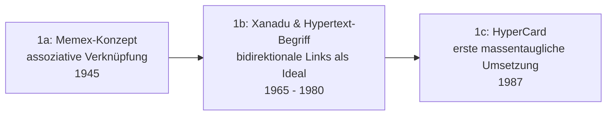

# Evolution und Architekturen digitaler PKM-Wissensgraphen & Block-Editoren

Bidirektionale Wissensgraphen und Echtzeit-Block-Editoren — die technische Grundlage moderner **Personal-Knowledge-Management (PKM)**-Werkzeuge — bilden in [Evolution und Architekturen digitaler Wissenssysteme](evolution-digitaler-wissenssysteme.md) die Generation 3. Diese eigenständige Zeitachse zoomt in genau diese Architekturlinie hinein: von den hypertextuellen Grundideen der 1960er über digitale Zettelkasten-Pioniere, den Roam-Research-Auslöser der modernen Backlink-Bewegung und CRDT-basierte Echtzeit-Kollaboration bis zu räumlichen, KI-nativen und agentischen Gedächtnissystemen. Die **methodische** Seite (Zettelkasten, PARA, CODE, Evergreen Notes) behandelt [Personal Knowledge Management (PKM) & Second Brain](pkm-second-brain-methoden.md) — dieser Artikel ordnet stattdessen die **Werkzeug-Architekturen** nach technologischen Generationen, analog zu [Docs-as-Code](evolution-digitaler-docs-as-code.md) und [CMS](evolution-digitaler-cms.md).

!!! note "Hinweis: Generationen überlappen sich"
    Die Zeiträume sind grobe Orientierung, keine scharfen Grenzen — TiddlyWiki (Generation 2) wird bis heute aktiv weiterentwickelt, parallel zu KI-nativen Canvas-Systemen (Generation 6). Entscheidend ist die **Architektur der Wissensverknüpfung** (wie Notizen technisch miteinander verbunden und synchronisiert werden), nicht allein das Erscheinungsjahr.

---

## Generation 1: Hypertext-Vorläufer & konzeptionelle Grundlagen, 1945 – 1987

Vor jeder Software entstehen die konzeptionellen Grundideen, auf denen alle späteren Generationen aufbauen: **assoziative Verknüpfung statt hierarchischer Ablage** und **maschinell navigierbare Referenzen** zwischen Wissenseinheiten.

### 1a. Das Memex-Konzept, 1945

- **Idee:** Vannevar Bush beschreibt in „As We May Think" ein hypothetisches Gerät (**Memex**), das Dokumente über assoziative „Trails" statt alphabetischer/hierarchischer Ordnung verknüpft — nie gebaut, aber die konzeptionelle Wurzel jedes späteren Backlink-Systems.

### 1b. Xanadu & die Prägung des Begriffs „Hypertext", 1965 – 1980

- **Idee:** Ted Nelson prägt 1965 den Begriff **„Hypertext"** und entwirft mit **Project Xanadu** ein System mit nativ **bidirektionalen Links** (jede Verknüpfung sichtbar von beiden verbundenen Dokumenten aus) — ein Architekturideal, das die meisten realen Systeme erst Jahrzehnte später (Generation 3) technisch einlösen.

### 1c. HyperCard — erste massentaugliche Umsetzung, 1987

- **Architektur:** „Karten" (Stacks) mit verknüpfbaren Schaltflächen, ausgeliefert kostenlos mit jedem Macintosh.
- **Bedeutung:** erste breit verfügbare Software, die Endnutzern eigenständiges Verknüpfen von Wissenseinheiten ermöglicht — ohne Programmierkenntnisse, aber noch ohne automatische Backlink-Erkennung.

---

## Generation 2: Digitale Zettelkasten-Pioniere & Personal Wikis, 1996 – 2014

Niklas Luhmanns analoger Zettelkasten (ab den 1950er-Jahren) wird schrittweise digitalisiert — erste dedizierte Werkzeuge für vernetztes persönliches Wissen entstehen, meist noch mit manueller Link-Syntax statt automatischer Graph-Bildung.

**Architektur:** lokale Desktop-Anwendungen oder einzelne portable HTML-Dateien, manuell gesetzte Wikilinks (`[[Klammern]]`), noch ohne Echtzeit-Sync oder CRDT-Kollaboration.

| System | Jahr | Besonderheit |
|---|---|---|
| **The Brain (TheBrain)** | 1996 | Visuelle Mindmap-Metapher mit verknüpften „Gedanken" statt Ordnerstruktur. |
| **Tinderbox** | 2001 | Strukturierte Notizen mit regelbasierten „Agenten", die Notizen automatisch nach Kriterien gruppieren — früher Vorläufer automatisierter Organisation. |
| **TiddlyWiki** | 2004 | Nicht-lineares „Personal Wiki" in einer einzigen portablen HTML-Datei, community-getrieben bis heute aktiv gepflegt. |
| **The Archive / Zettelkasten-Method-Software** | ab ca. 2013 | Erste Werkzeuge, die explizit als digitale Umsetzung von Luhmanns Methode vermarktet werden, siehe [PKM & Second Brain: Methoden](pkm-second-brain-methoden.md). |

---

## Generation 3: Bidirektionale Verlinkung & Local-First-Markdown-Tresore, 2019 – 2021

**Roam Research** (2019) löst die moderne „Second-Brain"-Bewegung aus, indem es **automatische bidirektionale Links** und **Block-Referenzen** (Verknüpfung einzelner Absätze statt ganzer Seiten) zum zentralen UI-Paradigma macht — Xanadus Architekturideal aus Generation 1b wird damit erstmals massentauglich eingelöst.

**Architektur:** Outliner-Datenmodell (jede Zeile ein referenzierbarer Block), automatisch generierte Backlinks-Panels, bei den Open-Source-Nachfolgern zusätzlich **Local-First**-Speicherung als reine Markdown-/Org-Mode-Dateien im Dateisystem statt in einer proprietären Cloud-Datenbank.

| System | Speicher | Besonderheit |
|---|---|---|
| **Roam Research** (2019) | Proprietäre Cloud-Datenbank | Popularisierte automatische Backlinks und Block-Referenzen, löste den „Second-Brain"-Hype aus. |
| **Obsidian** (2020) | Lokale Markdown-Dateien | Local-First-Antwort auf Roam — volle Datenhoheit, Plugin-Ökosystem, Graph-Ansicht. |
| **Logseq** (2020, Open Source) | Lokale Markdown-/Org-Mode-Dateien | Dateibasiertes Outliner-System mit integriertem Wissensgraphen, siehe [Dokumentenerstellung, Wikis & Notebooks](index.md#local-first-personal-knowledge-management-pkm). |
| **Foam / Dendron** | Lokale Markdown-Dateien | VS-Code-Erweiterungen, bringen dasselbe Prinzip direkt in den Code-Editor statt eine eigenständige App zu benötigen. |

---

## Generation 4: Block-Datenbanken & CRDT-Echtzeit-Kollaboration, 2016 – 2022

Parallel zur Backlink-Bewegung verschmilzt eine zweite Strömung den Block-Editor mit **Datenbank-Ansichten** (Tabellen, Kanban-Boards, Kalender auf denselben Daten) und macht **Echtzeit-Mehrbenutzer-Bearbeitung** zum Standard-Feature — technisch ermöglicht durch **CRDTs** (Conflict-free Replicated Data Types), die konfliktfreies gleichzeitiges Editieren ohne zentralen Lock-Mechanismus erlauben.

**Architektur:** JSON-Block-Datenmodell (jeder Absatz, jede Tabellenzeile ein eigenständiges, typisiertes Objekt), CRDT-Synchronisation (z. B. **Yjs**, **Automerge**) für Echtzeit-Multiplayer-Editing, mehrere Ansichten auf denselben Datenbestand statt einer festen Seitenstruktur.

| System | Prinzip |
|---|---|
| **Notion** (2016/2018) | Etabliert das Block-als-Datenbank-Prinzip für ein Massenpublikum, Team-Kollaboration in Echtzeit. |
| **Yjs / Automerge** | Die zugrundeliegenden CRDT-Bibliotheken, die Echtzeit-Kollaboration in Notion-ähnlichen und vielen späteren Tools erst praktikabel machen. |
| **Coda** | Kombiniert Dokument, Tabellenkalkulation und App-Baukasten auf demselben Block-Datenmodell. |

---

## Generation 5: Local-First CRDT & Ende-zu-Ende-verschlüsselte P2P-Systeme, 2021 – 2023

Die dritte Synthese: das **Local-First-Prinzip** aus Generation 3 (Datenhoheit, Offline-Fähigkeit) verschmilzt mit der **CRDT-Echtzeit-Kollaboration** aus Generation 4 — ganz ohne die Kompromisse einer zentralen Cloud-Datenbank.

**Architektur:** CRDT-Sync über Peer-to-Peer- oder Ende-zu-Ende-verschlüsselte Kanäle statt zentralem Server, lokale Objektdatenbank statt Flat-Files, Offline-First als Grundannahme statt Ausnahmefall.

| System | Prinzip |
|---|---|
| **Anytype** | Verschlüsselte, objektbasierte Wissensdatenbank auf IPFS-Basis, Peer-to-Peer-Sync ohne zentralen Anbieter-Server. |
| **AppFlowy** | Open-Source-Notion-Alternative mit CRDT-Sync und lokaler Datenhaltung. |
| **Tana** | Supertag-basiertes System, kombiniert strukturierte Abfragen (wie eine Datenbank) mit dem freien Verlinkungsprinzip aus Generation 3. |
| **Logseq DB** | Fortentwicklung von Logseq (Generation 3) hin zu einem echten, CRDT-fähigen Datenbank-Backend statt reiner Markdown-Dateien. |

---

## Generation 6: Räumliche, KI-native & agentische Wissenssysteme, ab 2023

Zwei parallele Entwicklungen prägen die aktuelle Generation: **räumliche/visuelle** Notizführung auf unendlichen Leinwänden statt linearer Seiten, und die Integration **generativer KI** direkt in den Erfassungs- und Organisationsprozess — bis hin zu Agenten, die die Wissensbasis kontinuierlich selbst pflegen.

**Architektur:** Infinite-Canvas-Rendering (räumliche statt listenbasierte Anordnung), LLM-Integration direkt im Editor (Zusammenfassen, Verlinken, Kategorisieren per KI-Vorschlag), agentische Gedächtnisarchitekturen mit persistentem, selbstaktualisierendem Kontext.

| Baustein | Rolle |
|---|---|
| **Heptabase, Obsidian Canvas** | Räumliches Wissensmanagement auf unendlichen Zeichenflächen statt linearer Notizlisten. |
| **Notion AI, Mem.ai, Reflect Notes** | KI automatisiert den „Organize"-Schritt aus dem CODE-Framework — siehe [PKM & Second Brain: Methoden](pkm-second-brain-methoden.md#wie-ki-die-methoden-verandert) und [Native „LLM-first" Wiki-Tools & Agenten](llm-first-wiki-tools-agenten.md). |
| **MemGPT (Letta) & Agentic Memory Systems** | Kontinuierlich selbstaktualisierende Wissensspeicher für autonome KI-Agenten mit Langzeitgedächtnis — die persönliche PKM-Entsprechung agentischer Team-Wissenssysteme. |

!!! tip "Bezug zu diesem Repository"
    Dieses Repository selbst ist kein PKM-Tool im engeren Sinn, nutzt aber dasselbe Grundprinzip auf Team-/Repository-Ebene: Das [LLM-Wiki-Pattern (Karpathy-Muster)](llm-wiki-pattern-karpathy.md) automatisiert Verlinkung und Strukturierung von Dokumentation ähnlich wie KI-native PKM-Tools das für persönliche Notizen tun, siehe [KI strukturiert das Wiki autonom & Selfhosting-Migration](ki-autonome-wiki-strukturierung-selfhosting-migration.md).

---

## Alternative Sortier- & Klassifikationskriterien für PKM-Wissensgraphen

Neben dem chronologischen/technologischen Generationenmodell lassen sich PKM-Werkzeuge nach folgenden Dimensionen einordnen:

### 1. Speicher- & Synchronisationsmodell

- **Zentrale proprietäre Cloud-Datenbank** — Daten liegen ausschließlich beim Anbieter, kein lokaler Dateizugriff (Roam Research, Notion in der Grundkonfiguration).
- **Local-First / dateibasiert** — Markdown-/Org-Mode-Dateien im eigenen Dateisystem, Sync optional (Obsidian, Logseq).
- **CRDT-P2P/verschlüsselt** — konfliktfreie Synchronisation ohne zentralen Server, oft Ende-zu-Ende verschlüsselt (Anytype, AppFlowy).

### 2. Verknüpfungsgranularität

- **Seiten-zu-Seiten** — ein Link verweist auf ein ganzes Dokument (klassische Wiki-Links, HyperCard-Stacks).
- **Block-zu-Block** — ein Link verweist auf einen einzelnen Absatz/eine einzelne Zeile, unabhängig einbettbar (Roam-Block-Referenzen, Notion).
- **Räumlich/kontextuell** — Verknüpfung durch physische Nähe auf einer Canvas statt expliziten Link (Heptabase, Obsidian Canvas).

### 3. Strukturbildung

- **Manuell/explizit** — Nutzer setzt jeden Link selbst (frühe Wikilinks, Generation 2).
- **Automatisch aus Erwähnung** — das System erkennt `[[Klammern]]` und erzeugt Backlinks automatisch (Generation 3+).
- **KI-vorgeschlagen** — ein Sprachmodell schlägt Verknüpfungen und Kategorien basierend auf semantischer Ähnlichkeit vor (Generation 6).

### 4. Kollaborationsmodell

- **Einzelnutzer/lokal** — für eine Person konzipiert, Team-Sync ist Zusatzfunktion (frühe Obsidian-Nutzung).
- **Echtzeit-Multiplayer** — mehrere Personen bearbeiten dasselbe Dokument gleichzeitig, CRDT-basiert (Notion, Generation 4).
- **Agent-augmentiert** — ein KI-Agent nimmt als zusätzlicher „Mitbearbeiter" aktiv an der Strukturierung teil (Generation 6).

---

## Verwandte Themen

- [Beste PKM-Wissensgraphen & Block-Editoren 2026 (Top 20)](pkm-wissensgraphen-2026-topliste.md) — aktuelle Top-20-Topliste, die diese Chronologie in eine Momentaufnahme 2026 übersetzt
- [Personal Knowledge Management (PKM) & Second Brain: Methoden](pkm-second-brain-methoden.md) — die methodische Seite (Zettelkasten, PARA, CODE, Evergreen Notes) zu dieser technischen Zeitachse
- [Evolution und Architekturen digitaler Wissenssysteme](evolution-digitaler-wissenssysteme.md) — übergeordnetes Generationenmodell, Generation 3 dort entspricht diesem Artikel im Ganzen
- [Evolution und Architekturen digitaler Visueller, Local-First & Agentischer Wissenssysteme](evolution-digitaler-visuell-agentische-wissenssysteme.md) — Schwester-Zeitachse entlang der Canvas-/Sync-/Agenten-Architektur, teilt sich mehrere Werkzeuge mit diesem Artikel
- [Evolution und Architekturen digitaler Docs-as-Code](evolution-digitaler-docs-as-code.md) — analoges Generationenmodell für Docs-as-Code-Werkzeuge
- [Evolution und Architekturen digitaler Content-Management-Systeme](evolution-digitaler-cms.md) — analoges Generationenmodell für CMS
- [Native „LLM-first" Wiki-Tools & Agenten](llm-first-wiki-tools-agenten.md) — Vertiefung zu den KI-nativen PKM-Tools aus Generation 6
- [Wissensdatenbanken mit KI & semantischer Suche](wissensdatenbanken-ki-semantische-suche.md) — Vertiefung zur semantischen Suchtechnik hinter KI-vorgeschlagenen Verknüpfungen
- [LLM-Wiki-Pattern (Karpathy-Muster)](llm-wiki-pattern-karpathy.md) — dasselbe Automatisierungsprinzip auf Team-/Repository-Ebene
- [Dokumentenerstellung, Wikis & Notebooks](index.md) — Gesamtübersicht aller Dokumentations-Systeme
- [Evolution und Architekturen digitaler Programmiersprachen für Wissenssysteme](evolution-digitaler-wissenssystem-programmiersprachen.md) — Logseqs ClojureScript/Datascript-Kern als Sprachbeispiel aus Generation 5 dieser Zeitachse
