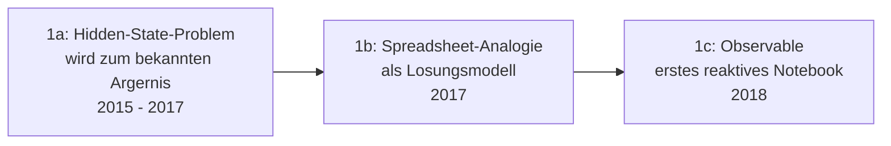

# Evolution und Architekturen digitaler Reaktiver Notebooks

Reaktive Notebooks ohne versteckten Zustand bilden Generation 5 der [Evolution digitaler Notebook-Systeme](evolution-digitaler-notebook-systeme.md). Diese eigenständige Zeitachse zoomt in genau diese Architekturlinie hinein: von der Erkenntnis des Hidden-State-Problems klassischer Jupyter-Notebooks über Observables Dataflow-Runtime, Pluto.jl für Julia und Marimo für Python bis zu reaktiven Notebooks als eigenständigem App-Deployment-Ziel und der Koexistenz mit dem dominanten Jupyter-Ökosystem.

!!! note "Hinweis: Generationen überlappen sich"
    Die Zeiträume sind grobe Orientierung, keine scharfen Grenzen — klassische Jupyter-Notebooks bleiben trotz dieser Generation der mit Abstand verbreitetste Standard. Entscheidend ist die **Architektur** (automatische Dataflow-Neuberechnung statt manueller, beliebiger Zellreihenfolge), nicht allein das Erscheinungsjahr.

---

## Generation 1: Das Hidden-State-Problem wird erkannt, 2011 – 2018

Die Gründergeneration eint drei Prinzipien: die **Erkenntnis**, dass beliebige Zellausführungsreihenfolge in Jupyter zu unsichtbaren Inkonsistenzen führt, die **Spreadsheet-Analogie** als alternatives mentales Modell und ein **erstes konkretes System**, das dieses Modell umsetzt. Sie lässt sich in drei technologische Entwicklungsstufen unterteilen:

### 1a. Das Hidden-State-Problem wird zum bekannten Ärgernis, 2015 – 2017

- **Beobachtung:** in klassischen Jupyter-Notebooks lassen sich Zellen in beliebiger Reihenfolge mehrfach ausführen — der sichtbare Code im Dokument entspricht dadurch nicht mehr zwingend dem tatsächlichen Ausführungszustand des Kernels, ein häufiger Fehlerquell in der Praxis.

### 1b. Die Spreadsheet-Analogie als Lösungsmodell, 2017

- **Idee:** Excel-Tabellenzellen aktualisieren sich automatisch, sobald sich eine referenzierte Zelle ändert — dieses Grundprinzip wird auf Code-Notebooks übertragen: eine Zelle „weiß", von welchen anderen Zellen sie abhängt.

### 1c. Observable — erstes reaktives Notebook, 2018

- **Architektur:** Mike Bostock (Schöpfer von D3.js) veröffentlicht mit **Observable** das erste breit genutzte reaktive Notebook, siehe [Generation 5 der übergeordneten Zeitachse](evolution-digitaler-notebook-systeme.md#generation-5-reaktive-notebooks-ohne-versteckten-zustand-2018-2024).

---

## Generation 2: Der Dataflow-Graph als Kernarchitektur, 2018

Statt Zellen von oben nach unten abzuarbeiten, berechnet die Runtime einen **Abhängigkeitsgraphen** und führt Zellen in topologischer Reihenfolge aus — unabhängig von ihrer Position im Dokument.

| Baustein | Rolle |
|---|---|
| **Observable Runtime** (`@observablehq/runtime`) | Berechnet aus den Variablenreferenzen zwischen Zellen einen Abhängigkeitsgraphen und aktualisiert bei einer Änderung ausschließlich die betroffenen Folgezellen. |

---

## Generation 3: Pluto.jl — Reaktivität für wissenschaftliches Rechnen, 2020

Das Julia-Ökosystem überträgt dasselbe Dataflow-Prinzip auf wissenschaftliches, numerisches Rechnen.

| Baustein | Rolle |
|---|---|
| **Pluto.jl** | Reaktives Notebook für Julia — ändert sich eine Zelle, berechnen sich alle abhängigen Zellen automatisch neu, inklusive integrierter Paketverwaltung pro Notebook-Datei. |

---

## Generation 4: Marimo — reaktive Python-Notebooks als reine .py-Dateien, 2023 – 2024

**Marimo** überträgt das Dataflow-Prinzip auf Python und löst gleichzeitig ein zweites Problem klassischer Jupyter-Notebooks: das schwer diffbare JSON-Dateiformat.

| Baustein | Rolle |
|---|---|
| **Marimo** | Speichert das gesamte Notebook als reine `.py`-Datei statt JSON — dadurch Git-diff-freundlich und direkt als reguläres Python-Modul importierbar, siehe [Dokumentenerstellung, Wikis & Notebooks, Abschnitt 3](index.md#3-interaktive-executable-notebook-systeme). |

---

## Generation 5: Reaktive Notebooks als App-Deployment-Ziel, ab 2023

Da Zellreihenfolge und Datenfluss bei reaktiven Notebooks bereits eindeutig definiert sind, lässt sich dasselbe Notebook ohne Umweg über ein separates Dashboard-Tool direkt als interaktive Web-App ausliefern.

| Baustein | Rolle |
|---|---|
| **Marimo-App-Modus** | Rendert dasselbe Notebook wahlweise als Entwicklungsansicht mit sichtbarem Code oder als bereinigte, interaktive App-Oberfläche. |
| **Pluto.jl-Export** | Exportiert reaktive Julia-Notebooks als statische, interaktive HTML-Seiten. |

---

## Generation 6: Koexistenz statt Ablösung, ab 2023

Reaktive Notebooks bleiben eine Nische neben dem weiterhin dominanten `.ipynb`-Ökosystem — statt eines vollständigen Generationswechsels entstehen Interoperabilitäts-Werkzeuge zwischen beiden Welten.

| Baustein | Rolle |
|---|---|
| **Marimo-Jupyter-Import** | Erlaubt den Import bestehender `.ipynb`-Dateien in das reaktive Marimo-Format, statt einen kompletten Neustart zu erzwingen. |

---

## Alternative Sortier- & Klassifikationskriterien für reaktive Notebooks

### 1. Ausführungsmodell

- **Linear, manuell** — klassisches Jupyter (Vorgänger-Generation).
- **Dataflow-Graph, automatisch** — Observable, Pluto.jl, Marimo.

### 2. Sprachbindung

- **JavaScript** — Observable.
- **Julia** — Pluto.jl.
- **Python** — Marimo.

### 3. Dateiformat

- **JSON** (`.ipynb`) — klassisches Jupyter, nicht Teil dieser Generation.
- **Klartext-Quellcode** (`.py`, `.jl`) — Marimo, Pluto.jl — Git-diff-freundlich.

---

## Verwandte Themen

- [Evolution und Architekturen digitaler Notebook-Systeme](evolution-digitaler-notebook-systeme.md) — übergeordnetes Generationenmodell, Generation 5 dort entspricht diesem Artikel im Ganzen
- [Evolution und Architekturen digitaler IPython- & Jupyter-Systeme](evolution-digitaler-ipython-jupyter.md) — Vorgänger-Architektur, deren Hidden-State-Problem diese Zeitachse adressiert
- [Evolution und Architekturen digitaler KI-nativer Notebook-Umgebungen](evolution-digitaler-ki-native-notebooks.md) — nachfolgende Generation
