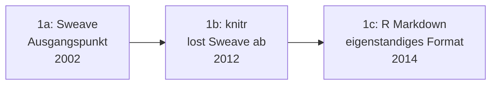

# Evolution und Architekturen digitaler R-Markdown- & Quarto-Publishing-Systeme

R-Markdown-Ökosystem & Multi-Sprachen-Publishing bilden Generation 4 der [Evolution digitaler Notebook-Systeme](evolution-digitaler-notebook-systeme.md). Diese eigenständige Zeitachse zoomt in genau diese Architekturlinie hinein: von knitr als Sweave-Nachfolger über R Markdown selbst, Buch- und Website-Publishing, Enterprise-Reporting-Dashboards bis zu Quarto als sprachunabhängigem Nachfolger und der Konvergenz mit dem Jupyter-Ökosystem.

!!! note "Hinweis: Generationen überlappen sich"
    Die Zeiträume sind grobe Orientierung, keine scharfen Grenzen — R Markdown wird trotz Quarto als Nachfolger bis heute aktiv weitergepflegt und produktiv genutzt. Entscheidend ist die **Architektur** (Sprachbindung, Ausgabeformat-Vielfalt), nicht allein das Erscheinungsjahr.

---

## Generation 1: Von Sweave zu R Markdown, 2002 – 2014

Die Gründergeneration eint drei Prinzipien: **Markdown statt LaTeX** als lesbarere Basis-Syntax, eine **verbesserte Chunk-Engine** für die Codeausführung und **mehrere Ausgabeformate** aus derselben Quelldatei statt nur PDF. Sie lässt sich in drei technologische Entwicklungsstufen unterteilen:

### 1a. Sweave als Ausgangspunkt, 2002

- **Architektur:** siehe [Generation 3 der Notebook-Vorläufer-Zeitachse](evolution-digitaler-notebook-vorlaeufer.md#generation-3-sweave-literate-programming-trifft-statistik-2002) — LaTeX-Text mit eingebetteten R-Codeblöcken.

### 1b. knitr löst Sweave ab, 2012

- **Architektur:** Yihui Xie entwickelt **knitr** als deutlich flexiblere Chunk-Engine — unterstützt zusätzlich zu LaTeX auch Markdown als Basis-Syntax und erlaubt feingranulare Kontrolle über Caching und Grafikausgabe.

### 1c. R Markdown wird eigenständiges Format, 2014

- **Architektur:** das `rmarkdown`-Paket (RStudio, heute Posit) macht Markdown statt LaTeX zur primären Syntax — Ausgabe wahlweise als HTML, Word oder PDF aus derselben Quelldatei.

---

## Generation 2: bookdown & blogdown — Buch- und Website-Publishing, 2016

Yihui Xie erweitert R Markdown von einzelnen Dokumenten auf **mehrkapitlige Bücher und vollständige Websites**.

| System | Prinzip |
|---|---|
| **bookdown** | Verknüpft mehrere R-Markdown-Kapitel zu einem zusammenhängenden Buch mit Querverweisen, Bibliografie und mehreren Ausgabeformaten. |
| **blogdown** | Baut vollständige Websites aus R-Markdown-Inhalten auf Basis des Static-Site-Generators Hugo, siehe [Generation 4 der Docs-as-Code-Zeitachse](evolution-digitaler-docs-as-code.md#generation-3-markdown-native-docs-as-code-frameworks-yaml-konfiguration-2014-2020) für die allgemeine Hugo-Einordnung. |

---

## Generation 3: R Markdown als Enterprise-Reporting-Standard, 2014 – 2018

R Markdown etabliert sich für **reproduzierbare, parametrisierte Unternehmensberichte** — derselbe Bericht lässt sich mit unterschiedlichen Eingabeparametern automatisiert neu erzeugen.

| Baustein | Rolle |
|---|---|
| **flexdashboard** | Erzeugt interaktive Dashboards direkt aus R-Markdown-Dokumenten. |
| **Parametrisierte Reports** | Derselbe R-Markdown-Bericht wird mit unterschiedlichen Parametern (z. B. Kunde, Zeitraum) automatisiert für verschiedene Empfänger neu gerendert. |

---

## Generation 4: Quarto löst R Markdown als sprachunabhängiger Nachfolger ab, 2022

**Posit** (vormals RStudio) veröffentlicht mit **Quarto** einen kompletten Nachfolger, der die R-Markdown-Philosophie über die R-Sprachbindung hinaus verallgemeinert.

**Architektur:** eigenständiges CLI-Werkzeug statt R-Paket, unterstützt Python, R, Julia und Observable JS im selben Dokument statt nur R.

| Baustein | Rolle |
|---|---|
| **Quarto** | Rendert Notebooks aus mehreren Sprachen in hochqualitative PDFs, HTML-Seiten, wissenschaftliche Arbeiten und Präsentationen, siehe [Generation 4 der übergeordneten Zeitachse](evolution-digitaler-notebook-systeme.md#generation-4-r-markdown-okosystem-multi-sprachen-publishing-2012-2022). |

---

## Generation 5: Jupyter Book — dieselbe Philosophie für die Jupyter-Welt, 2020

Parallel zur R-Markdown-Linie entsteht ein analoges Buch-Publishing-Werkzeug für die Jupyter-Notebook-Welt — auf Sphinx aufbauend statt einem eigenen Renderer.

| Baustein | Rolle |
|---|---|
| **Jupyter Book** | Veröffentlicht eine Sammlung von `.ipynb`-Dateien als zusammenhängendes, durchsuchbares Online-Buch, aufbauend auf Sphinx (vgl. [Generation 2 der Docs-as-Code-Zeitachse](evolution-digitaler-docs-as-code.md#generation-2-sphinx-die-geburt-des-eigentlichen-docs-as-code-workflows-2008-2014)). |

---

## Generation 6: Quarto trifft Jupyter — Konvergenz der beiden Publishing-Stränge, ab 2022

Die aktuelle Generation lässt die beiden bisher getrennten Linien zusammenlaufen: Quarto kann `.ipynb`-Dateien **nativ** rendern, statt eine eigene Notebook-Syntax zu erzwingen.

| Baustein | Rolle |
|---|---|
| **Quarto-Jupyter-Integration** | Rendert bestehende Jupyter-Notebooks direkt mit der Quarto-Publishing-Pipeline — die R-Markdown-Linie (Generation 1–4) und die Jupyter-Linie ([Generation 2 der übergeordneten Notebook-Zeitachse](evolution-digitaler-ipython-jupyter.md)) laufen damit in einem gemeinsamen Werkzeug zusammen. |

---

## Alternative Sortier- & Klassifikationskriterien für R-Markdown & Quarto

### 1. Sprachbindung

- **Nur R** — Sweave, knitr, R Markdown, bookdown, blogdown.
- **Sprachunabhängig** — Quarto (Python, R, Julia, Observable JS).

### 2. Ausgabeziel

- **Einzeldokument** — klassisches R Markdown.
- **Mehrkapitliges Buch** — bookdown, Jupyter Book.
- **Vollständige Website** — blogdown, Quarto-Websites.
- **Interaktives Dashboard** — flexdashboard.

### 3. Quell-Notebook-Format

- **R-Markdown-Syntax (`.Rmd`)** — klassische Linie.
- **Quarto-Syntax (`.qmd`)** — sprachunabhängiger Nachfolger.
- **Natives Jupyter-Format (`.ipynb`)** — Jupyter Book, Quarto-Jupyter-Integration.

---

## Verwandte Themen

- [Beste R-Markdown- & Quarto-Werkzeuge 2026 (Top 15)](rmarkdown-quarto-2026-topliste.md) — Momentaufnahme 2026, die diese Chronologie in eine gerankte Topliste übersetzt
- [Evolution und Architekturen digitaler Notebook-Systeme](evolution-digitaler-notebook-systeme.md) — übergeordnetes Generationenmodell, Generation 4 dort entspricht diesem Artikel im Ganzen
- [Evolution und Architekturen digitaler Notebook-Vorläufer](evolution-digitaler-notebook-vorlaeufer.md) — Sweave als Ursprung von Generation 1 dieses Artikels
- [Evolution und Architekturen digitaler IPython- & Jupyter-Systeme](evolution-digitaler-ipython-jupyter.md) — Schwester-Zeitachse, konvergiert in Generation 6 dieses Artikels
- [Evolution und Architekturen digitaler Docs-as-Code](evolution-digitaler-docs-as-code.md) — direkte Schnittmenge bei Hugo (blogdown) und Sphinx (Jupyter Book)
