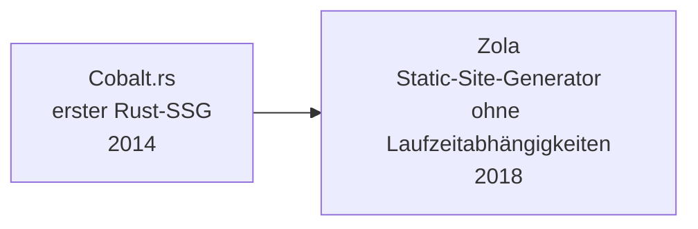

# Evolution und Architekturen digitaler Rust-CMS

Content-Management-Systeme selbst entstehen bislang kaum vollständig in Rust — stattdessen etabliert sich Rust seit Mitte der 2010er Jahre als **quer zu allen fünf Generationen von [Evolution digitaler Content-Management-Systeme](evolution-digitaler-cms.md) liegende Implementierungsachse**: Static-Site-Build-Engines, die JavaScript-/CSS-Toolchain hinter Headless-/JAMstack-Frontends, WASM-Edge-Laufzeiten für Composable-Commerce-Personalisierung und zuletzt der Edge-Proxy-Layer selbst wandern zunehmend auf einen Rust-Kern — meist unsichtbar hinter einem etablierten CMS- oder Frontend-Namen. Dieser Artikel ordnet diese Rust-Bausteine chronologisch nach **technologischen Generationen** — die allgemeine Rust-Werkzeuglandschaft jenseits von CMS behandelt [Rust in der Praxis](../../entwicklung/system/rust-praxis.md).

!!! note "Hinweis: Eine Implementierungsachse, keine Konkurrenz-Zeitachse"
    Anders als ein eigenständiges CMS-Produkt entspricht diese Zeitachse keiner einzelnen Generation von [Evolution digitaler Content-Management-Systeme](evolution-digitaler-cms.md), sondern schneidet quer durch alle fünf — ein Rust-Bundler aus Generation 2 kann z. B. dieselbe Next.js-Frontend-Instanz beschleunigen, die als Headless-Client aus [Generation 2 der CMS-Zeitachse](evolution-digitaler-cms.md#generation-2-headless-decoupled-cms-api-first-ca-2015-2021) Inhalte bezieht. Die Zeiträume sind grobe Orientierung, keine scharfen Grenzen.

---

## Generation 1: Rust-native Static-Site-Generatoren als früher CMS-Gegenentwurf, 2014 – 2018

Bevor Rust in bestehende CMS-Toolchains eindringt, entstehen eigenständige, Rust-native Static-Site-Generatoren — ein radikaler Gegenentwurf zum datenbankgestützten CMS aus [Generation 1 der CMS-Zeitachse](evolution-digitaler-cms.md#generation-1-klassische-monolithische-cms-datenbank-templates-serverseitiges-rendering): kein Server, keine Datenbank, nur eine einzelne Binärdatei, die Markdown zu statischem HTML kompiliert.

- **Cobalt.rs** (2014) — einer der ersten Static-Site-Generatoren überhaupt in Rust geschrieben, nach dem Vorbild von Jekyll.
- **Zola** (2018) — eigenständige Binärdatei ohne externe Laufzeitabhängigkeiten (kein Node.js, kein Ruby), vertieft in [Evolution und Architekturen digitaler Rust-Wissenssysteme, Generation 1c](evolution-digitaler-rust-wissenssysteme.md#1c-tantivy-zola-such-engine-und-static-site-generator-2017-2018) — dort primär als Wissenssystem-Werkzeug behandelt, hier als früher CMS-Gegenentwurf ohne Redaktionsoberfläche.

**Bedeutung:** Beide Generatoren bleiben Nischenwerkzeuge für technisch versierte Autoren ohne Redaktions-UI — der eigentliche Rust-Durchbruch im CMS-Umfeld findet in Generation 2 nicht als eigenes Produkt, sondern als unsichtbarer Baustein etablierter Frontend-Frameworks statt.

---

## Generation 2: Rust im JavaScript-Build-Toolchain für Headless-/JAMstack-Frontends, 2019 – 2022

Headless-CMS aus [Generation 2 der CMS-Zeitachse](evolution-digitaler-cms.md#generation-2-headless-decoupled-cms-api-first-ca-2015-2021) liefern Inhalte nur noch per API — das Rendering übernimmt ein eigenständiges JavaScript-Frontend, meist React/Next.js. Genau in dieser Kompilierungs- und Minifizierungs-Schicht setzt sich Rust als erstes durch, ohne dass Redakteure oder selbst die meisten Entwickler es bemerken.

**Architektur:** Rust-Kern ersetzt einzelne, performancekritische Schritte einer bestehenden JavaScript-Toolchain (Kompilieren, Minifizieren), statt das gesamte Frontend-Framework zu ersetzen.

| Werkzeug | Jahr | Rolle |
|---|---|---|
| **SWC** | 2019/2020 | Rust-basierter JavaScript-/TypeScript-Compiler, ersetzt ab **Next.js 12** (2021) Babel und Terser als Standard-Kompilierungs- und Minifizierungs-Engine — die mit Abstand häufigste Frontend-Wahl für Headless-CMS-Setups. |
| **Lightning CSS** | 2022 | Von Parcel-Autor Devon Govett entwickelter Rust-CSS-Parser, -Bundler und -Minifizierer, integriert in **Parcel 2**. |

---

## Generation 3: WASM-Edge-Laufzeiten für Composable-/MACH-Commerce, 2019 – 2022

Composable-/MACH-Architekturen aus [Generation 3 der CMS-Zeitachse](evolution-digitaler-cms.md#generation-3-composable-mach-architektur-digital-experience-platforms-dxp-ab-ca-2020) kombinieren austauschbare Best-of-Breed-Microservices über APIs. Damit einzelne Kunden diese Services ohne eigenes Hosting anpassen können, entsteht eine neue Laufzeit-Kategorie: WebAssembly-Sandboxes, die fremden Anpassungscode sicher und mit nativer Geschwindigkeit direkt am Edge ausführen — mit einem Rust-Kern im Zentrum.

**Architektur:** WASM-Runtime in Rust implementiert, Kundencode (oft ebenfalls in Rust geschrieben) läuft isoliert innerhalb der Runtime, keine eigene VM oder Container pro Kunde nötig.

| System | Jahr | Rolle |
|---|---|---|
| **Wasmtime** (Bytecode Alliance) | 2019 | Rust-native WebAssembly-Runtime, technisches Fundament für mehrere der folgenden Edge-Angebote. |
| **Shopify Functions** | 2022 | Erlaubt Händlern, Checkout- und Rabattlogik als Rust-Code zu schreiben, der zu WASM kompiliert und sicher in Shopifys Infrastruktur läuft — eine der sichtbarsten Produktionsanwendungen von Rust/WASM im Commerce-Umfeld. |
| **Fastly Compute** (vormals Compute@Edge) | 2019/2020 | Edge-Compute-Plattform mit Rust als First-Class-Sprache, häufig für Personalisierung und A/B-Testing direkt am CDN-Edge eingesetzt, statt Anfragen erst zum Origin-Server zu leiten. |

---

## Generation 4: Rust vervollständigt die Frontend-Toolchain — Bundler & Linter, 2022 – 2023

Nach Compiler (SWC) und CSS-Engine (Lightning CSS) wandern auch Bundler und Linter/Formatter der JAMstack-Toolchain auf Rust-Kerne — die letzten verbliebenen, oft langsamsten Schritte im Build-Prozess großer Headless-CMS-Frontends.

**Architektur:** vollständiger Ersatz etablierter JavaScript-Werkzeuge (Webpack, ESLint/Prettier) durch funktional kompatible, aber deutlich schnellere Rust-Implementierungen.

| Werkzeug | Jahr | Rolle |
|---|---|---|
| **Turbopack** | 2022 (Alpha in Next.js 13) | Von Webpack-Schöpfer Tobias Koppers bei Vercel entwickelter Rust-Nachfolge-Bundler, inkrementelle Kompilierung statt vollständigem Rebuild. |
| **Biome** (Fork von Rome) | 2023 | Rust-basierter JavaScript-/TypeScript-Linter und -Formatter, entstanden als Community-Fork, nachdem das ursprüngliche Rome-Projekt (2020, von Babel-Schöpfer Sebastian McKenzie) eingestellt wurde. |

---

## Generation 5: Rust im Edge-Proxy-Layer für KI-gestützte Content-Auslieferung, ab 2024

Die jüngste Generation bringt Rust direkt in den **Netzwerk-Proxy-Layer**, der Inhalte an Endnutzer ausliefert — parallel zur KI-gestützten Content-Erstellung aus [Generation 4 der CMS-Zeitachse](evolution-digitaler-cms.md#generation-4-ki-gestutzte-content-erstellung-personalisierung-ab-ca-2023), die zunehmend Echtzeit-Personalisierung pro Anfrage statt statischer Auslieferung verlangt.

**Architektur:** Rust-Framework für den Bau eigener Edge-Proxy-/Reverse-Proxy-Dienste, ersetzt bzw. ergänzt traditionelle C-basierte Lösungen (NGINX) an Stellen, die granulare, programmierbare Logik pro Anfrage brauchen.

| System | Jahr | Rolle |
|---|---|---|
| **Pingora** (Cloudflare) | 2024 | Von Cloudflare als Open Source veröffentlichtes Rust-Framework für Netzwerkdienste, ersetzt intern große Teile der NGINX-basierten Edge-Infrastruktur, auf der auch Content-Auslieferung und Personalisierung vieler DXP-/Composable-CMS-Setups laufen. |

!!! tip "Bezug zur KI-Content-Erstellung"
    Die eigentliche Generierungslogik (Textentwürfe, Bildgenerierung) läuft meist weiterhin über externe LLM-APIs statt lokaler Rust-Inferenz — für lokale, Rust-gestützte KI-/RAG-Inferenz siehe [Evolution und Architekturen digitaler Rust-Wissenssysteme, Generation 5](evolution-digitaler-rust-wissenssysteme.md#generation-5-rust-gestutzte-ki-rag-inferenz-fur-wissenssysteme-2023-2024).

---

## Alternative Sortier- & Klassifikationskriterien für Rust-CMS

Neben dem chronologischen Generationenmodell lassen sich diese Rust-Bausteine nach folgenden Dimensionen einordnen:

### 1. Rolle im Gesamtsystem

- **Eigenständiger Content-Generator** — Cobalt.rs, Zola (Generation 1).
- **Compiler/Minifizierer** — SWC, Lightning CSS (Generation 2).
- **Sandbox-Laufzeit** — Wasmtime, Shopify Functions, Fastly Compute (Generation 3).
- **Bundler/Linter** — Turbopack, Biome (Generation 4).
- **Edge-Proxy** — Pingora (Generation 5).

### 2. Sichtbarkeit für Redakteure und Entwickler

- **Vollständig Rust, sichtbar als Produkt** — Zola, Cobalt.rs (Nutzer wählt das Werkzeug bewusst).
- **Rust-Kern hinter fremder Oberfläche** — SWC hinter Next.js, Lightning CSS hinter Parcel, Pingora hinter Cloudflare — für die meisten Redakteure und selbst viele Entwickler unsichtbar.

### 3. Konsummodell

- **CLI-Binärdatei** — Zola, Cobalt.rs.
- **In bestehende Build-Pipeline integriert** — SWC, Lightning CSS, Turbopack, Biome.
- **Verwaltete Cloud-Laufzeit** — Shopify Functions, Fastly Compute, Pingora-basierte Cloudflare-Dienste.

### 4. Migrationsmuster

- **Von Grund auf Rust** — Zola, Wasmtime.
- **Rust-Rewrite eines bestehenden Werkzeugs** — Turbopack ersetzt Webpack, Biome ersetzt/forkt Rome, Pingora ersetzt Teile der NGINX-Infrastruktur.
- **Neue Rust-Kategorie ohne direkten Vorgänger** — Shopify Functions (Rust/WASM-Checkout-Anpassung gab es zuvor nicht in dieser Form).

---

## Verwandte Themen

- [Beste Rust-Bausteine für CMS 2026 (Top 15)](rust-cms-2026-topliste.md) — Momentaufnahme 2026, die diese Chronologie in eine gerankte Topliste übersetzt
- [Evolution und Architekturen digitaler Content-Management-Systeme](evolution-digitaler-cms.md) — übergeordnetes Generationenmodell, das diese Rust-Implementierungsachse quer durchzieht
- [Evolution und Architekturen digitaler Rust-KI-Anwendungen](../../künstliche-intelligenz/evolution-digitaler-rust-ki-anwendungen.md) — analoge Rust-Implementierungsachse für KI-Anwendungen
- [Evolution und Architekturen digitaler Rust-Wissenssysteme](evolution-digitaler-rust-wissenssysteme.md) — Zola als geteilter Baustein, analoge Rust-Implementierungsachse für Wissenssysteme
- [Evolution und Architekturen digitaler Rust-Webframeworks](../../entwicklung/webentwicklung/evolution-digitaler-rust-webframeworks.md) — Axum/Actix-web als mögliche Backend-Basis für Headless-CMS-APIs
- [Evolution und Architekturen digitaler Rust-LMS](../e-learning/evolution-digitaler-rust-lms.md) — Wasmtime/WASM-Tooling als geteilter Baustein, analoge Rust-Implementierungsachse für LMS
- [Evolution und Architekturen digitaler Rust-Notebooks](evolution-digitaler-rust-notebooks.md) — Wasmtime/WASM-Tooling als geteilter Baustein, analoge Rust-Implementierungsachse für Notebook-Systeme
- [Evolution und Architekturen digitaler Headless-CMS](evolution-digitaler-headless-cms.md) — vertiefendes Generationenmodell zu Generation 2 der CMS-Zeitachse, in der SWC/Lightning CSS primär zum Einsatz kommen
- [Evolution und Architekturen digitaler Composable-CMS](evolution-digitaler-composable-cms.md) — vertiefendes Generationenmodell zu Generation 3, in der Wasmtime/Shopify Functions/Fastly Compute primär zum Einsatz kommen
- [Rust in der Praxis](../../entwicklung/system/rust-praxis.md) — allgemeine Rust-Werkzeuglandschaft jenseits von CMS
