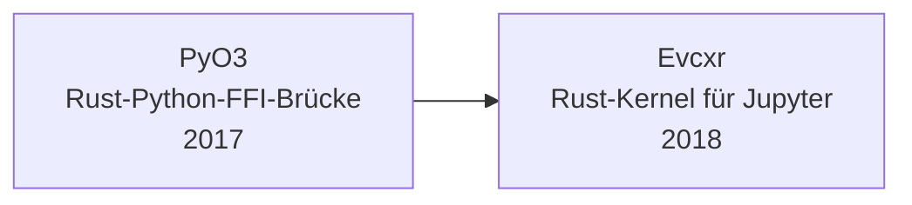

# Evolution und Architekturen digitaler Rust-Notebooks

Notebook-Systeme selbst entstehen bislang kaum vollständig in Rust — stattdessen etabliert sich Rust seit 2017 als **quer zu allen sechs Generationen von [Evolution digitaler Notebook-Systeme](evolution-digitaler-notebook-systeme.md) liegende Implementierungsachse**: die Python-Rust-Brücke, ein eigener Rust-Jupyter-Kernel, massentaugliche DataFrame- und Query-Engines, Linter/Formatter und zuletzt Paket-/Umgebungsverwaltung wandern zunehmend auf einen Rust-Kern — meist unsichtbar innerhalb einer Python-Zelle, aber mit spürbarem Geschwindigkeitsgewinn. Dieser Artikel ordnet diese Rust-Bausteine chronologisch nach **technologischen Generationen** — die allgemeine Rust-Werkzeuglandschaft jenseits von Notebooks behandelt [Rust in der Praxis](../../entwicklung/system/rust-praxis.md).

!!! note "Hinweis: Eine Implementierungsachse, keine Konkurrenz-Zeitachse"
    Anders als ein eigenständiges Notebook-System entspricht diese Zeitachse keiner einzelnen Generation von [Evolution digitaler Notebook-Systeme](evolution-digitaler-notebook-systeme.md), sondern schneidet quer durch alle sechs — Polars aus Generation 2 läuft z. B. in derselben klassischen Jupyter-Zelle aus [Generation 2 der Notebook-Zeitachse](evolution-digitaler-notebook-systeme.md#generation-2-ipython-notebook-die-geburt-von-jupyter-2011-2014), die auch reaktive Notebooks aus Generation 5 verwenden können. Die Zeiträume sind grobe Orientierung, keine scharfen Grenzen.

---

## Generation 1: Die Python-Rust-Brücke & der erste Rust-Kernel, 2017 – 2018

Bevor Rust-Bibliotheken innerhalb von Python-Notebook-Zellen nutzbar werden, braucht es zunächst eine belastbare Brücke zwischen beiden Sprachen — sowie, parallel dazu, einen Weg, Rust-Code überhaupt direkt in einer Jupyter-Zelle auszuführen.

- **PyO3** (2017) — Rust-Bibliothek für native Python-Erweiterungen und umgekehrten Aufruf von Python aus Rust; das technische Fundament, auf dem praktisch jede spätere Rust-beschleunigte Python-Bibliothek in diesem Artikel aufbaut.
- **Evcxr** (2018) — eigener Jupyter-Kernel, der Rust-Code direkt in Notebook-Zellen ausführt, inklusive iterativer Neudefinition von Variablen trotz Rusts eigentlich statischem Kompilierungsmodell — die Notebook-Entsprechung zu Rustlings' interaktivem Lernansatz (vgl. [Generation 1 der Rust-LMS-Zeitachse](../e-learning/evolution-digitaler-rust-lms.md#generation-1-rust-lernt-sich-selbst-beibringen-erste-lernwerkzeuge-aus-dem-eigenen-okosystem-2018)).

---

## Generation 2: Maturin & Polars — die Rust-Python-Paket-Pipeline reift, 2019 – 2020

Mit einer stabilen Build-Pipeline für PyO3-basierte Pakete entsteht die erste massentaugliche Rust-Bibliothek für den Notebook-Alltag: eine DataFrame-Engine, die klassische Data-Science-Zellen direkt beschleunigt, ohne dass Nutzer Rust selbst schreiben müssen.

**Architektur:** Rust-Kern kompiliert über Maturin zu einem regulären Python-Wheel, Endnutzer installieren per `pip install` wie jede andere Python-Bibliothek — die Rust-Herkunft bleibt für die meisten Anwender unsichtbar.

| Werkzeug | Jahr | Rolle |
|---|---|---|
| **Maturin** | 2019 | Build- und Publish-Werkzeug für PyO3-basierte Rust-Erweiterungen, macht „Rust-Bibliothek als `pip`-Paket" zum praktikablen Standardweg. |
| **Polars** | 2020 | Rust-native DataFrame-Bibliothek von Ritchie Vink, Pandas-Alternative mit spaltenorientiertem Apache-Arrow-Speicherformat und paralleler Ausführung — in tausenden Notebooks als direkter `import polars`-Ersatz für `import pandas` im Einsatz. |

---

## Generation 3: Rust-native Big-Data-Query-Engines in Data-Science-Notebooks, 2020 – 2022

Für Datenmengen, die über eine einzelne DataFrame im Arbeitsspeicher hinausgehen, wandern auch SQL-Query-Engines und Tabellenformate auf Rust-Kerne — direkt aus dem Apache-Arrow-Ökosystem, demselben Speicherformat, das bereits Polars nutzt.

**Architektur:** Rust-Implementierung des Apache-Arrow-Columnar-Formats als gemeinsame Grundlage, SQL-Abfrageschicht darüber, in Notebooks meist über Python-Bindings angesprochen.

| System | Jahr | Rolle |
|---|---|---|
| **DataFusion** (Apache Arrow) | 2019/2020 | Rust-natives SQL-Query-Engine-Framework, häufig eingebettet in größere Datenverarbeitungs-Notebooks statt als eigenständiges Produkt genutzt. |
| **delta-rs** | 2020/2021 | Rust-Implementierung des Delta-Lake-Tabellenformat-Protokolls, erlaubt Notebooks direkten Lese-/Schreibzugriff auf versionierte Data-Lake-Tabellen ohne JVM-Abhängigkeit. |

---

## Generation 4: Ruff erobert die Python-/Notebook-Tooling-Kette, 2022 – 2023

Nach DataFrame- und Query-Engines wandert auch die Code-Qualitätsprüfung selbst auf einen Rust-Kern — ein Werkzeug, das mittlerweile über Jupyter-/IDE-Erweiterungen auch direkt in Notebook-Zellen hinein wirkt.

**Architektur:** einzelne Rust-Binärdatei ersetzt mehrere separate Python-Linting-Werkzeuge (Flake8, isort, pyupgrade u. a.) durch eine gebündelte, deutlich schnellere Implementierung.

| Werkzeug | Jahr | Rolle |
|---|---|---|
| **Ruff** (Astral) | 2022 | Rust-basierter Python-Linter von Charlie Marsh, 10- bis 100-fach schneller als etablierte Python-Linter, später um einen Formatter erweitert — per Jupyter-/JupyterLab-Erweiterung auch direkt für Notebook-Zellen nutzbar. |

---

## Generation 5: Rust-WASM-Tooling ermöglicht browserbasierte reaktive Notebooks, 2023

Neue, nicht-Python-basierte Notebook-Kernel setzen zunehmend auf dieselbe Rust-WASM-Infrastruktur, die bereits Composable-Commerce-Edge-Laufzeiten antreibt (vgl. [Generation 3 der Rust-CMS-Zeitachse](evolution-digitaler-rust-cms.md#generation-3-wasm-edge-laufzeiten-fur-composable-mach-commerce-2019-2022)) — anders als der vollständige Browser-/WASM-Modus reaktiver Notebooks aus [Generation 5 der Notebook-Zeitachse](evolution-digitaler-notebook-systeme.md#generation-5-reaktive-notebooks-ohne-versteckten-zustand-2018-2024), der (z. B. bei Marimo) über die separate, Rust-freie Pyodide/Emscripten-Toolchain läuft.

**Architektur:** Rust-zu-WebAssembly-Kompilierungswerkzeuge als gemeinsames Fundament für Rust-native WASM-Notebook-Kernel — eine von mehreren parallel existierenden WASM-Toolchains, neben der Python-/Emscripten-basierten Pyodide-Kette.

| Baustein | Jahr | Rolle |
|---|---|---|
| **wasm-bindgen / wasm-pack** | ab 2018, breite Adoption ab 2023 | Rust-Werkzeugkette, die Rust-Code zu WebAssembly kompiliert und mit JavaScript verzahnt — dieselbe Bytecode-Alliance-nahe WASM-Infrastruktur wie Wasmtime, nicht jedoch die Grundlage von Marimos Browser-Modus: Der läuft über **Pyodide** (CPython, via Emscripten zu WASM kompiliert), eine eigenständige, Rust-freie Toolchain. |
| **Deno-Jupyter-Kernel** | 2023 | Deno (JavaScript-/TypeScript-Runtime mit Rust-Kern, V8 + eigener Rust-Unterbau) erhält nativen Jupyter-Kernel-Support — TypeScript-Notebooks laufen damit direkt auf einer Rust-gestützten Runtime statt Node.js. |

---

## Generation 6: Rust-gestützte Paket- und Umgebungsverwaltung als Fundament für KI-native Notebook-Workflows, ab 2024

Bevor überhaupt eine Zelle ausgeführt wird, muss die Notebook-Umgebung selbst stehen — genau hier setzt die jüngste Generation an: Rust beschleunigt nicht mehr nur einzelne Bibliotheken, sondern die komplette Python-Umgebungsverwaltung, auf der KI-native Notebook-Workflows aus [Generation 6 der Notebook-Zeitachse](evolution-digitaler-notebook-systeme.md#generation-6-ki-native-agentengestutzte-notebook-umgebungen-ab-2023) aufsetzen.

**Architektur:** Rust-Kern ersetzt `pip`/`venv`/`conda` als Paket-Resolver und Umgebungsmanager, deutlich schnellere Environment-Erstellung als direkte Voraussetzung für spontan von einem KI-Agenten gestartete Notebook-Sessions.

| Werkzeug | Jahr | Rolle |
|---|---|---|
| **uv** (Astral) | 2024 | Rust-basierter Python-Paketmanager und -Resolver, ersetzt `pip`/`pip-tools`/`virtualenv` durch eine deutlich schnellere Implementierung — reduziert die Rüstzeit neu gestarteter Notebook-Umgebungen von Minuten auf Sekunden. |

!!! tip "Bezug zur lokalen KI-Inferenz in Notebooks"
    Für die eigentliche Modell-Inferenz in KI-nativen Notebook-Zellen (Generation 6 der Notebook-Zeitachse) siehe die identische Rust-ML-Infrastruktur in [Evolution und Architekturen digitaler Rust-Wissenssysteme, Generation 5](evolution-digitaler-rust-wissenssysteme.md#generation-5-rust-gestutzte-ki-rag-inferenz-fur-wissenssysteme-2023-2024) — Candle und fastembed-rs sind nicht Notebook-spezifisch, laufen aber problemlos in einer Notebook-Zelle.

---

## Alternative Sortier- & Klassifikationskriterien für Rust-Notebooks

Neben dem chronologischen Generationenmodell lassen sich diese Rust-Bausteine nach folgenden Dimensionen einordnen:

### 1. Rolle im Gesamtsystem

- **Brücke/Kernel** — PyO3, Evcxr (Generation 1).
- **Datenverarbeitung** — Polars, DataFusion, delta-rs (Generation 2, 3).
- **Code-Qualität** — Ruff (Generation 4).
- **Laufzeit-/Kompilierungs-Infrastruktur** — wasm-bindgen, Deno (Generation 5).
- **Umgebungsverwaltung** — uv (Generation 6).

### 2. Sichtbarkeit für Data Scientists

- **Vollständig Rust, sichtbar als Werkzeug** — Evcxr, uv (Nutzer ruft sie bewusst auf).
- **Rust-Kern hinter Python-Import** — Polars, DataFusion, delta-rs, Ruff — für Notebook-Autoren meist nur an der Geschwindigkeit erkennbar, nicht an der Implementierungssprache.

### 3. Konsummodell

- **`pip`-installierbares Paket** — Polars, DataFusion-Python-Bindings, Ruff (via Maturin gebaut).
- **Eigener Jupyter-Kernel** — Evcxr, Deno-Jupyter-Kernel.
- **CLI-Werkzeug außerhalb der Notebook-Zelle** — uv, Ruff (auch als Editor-/CI-Integration).

### 4. Migrationsmuster

- **Von Grund auf Rust** — Polars, DataFusion, Evcxr.
- **Rust-Rewrite eines etablierten Python-Werkzeugs** — Ruff ersetzt Flake8/isort, uv ersetzt pip/virtualenv.
- **Geteilte Infrastruktur aus anderer Domäne** — wasm-bindgen/Wasmtime sind keine Notebook-spezifischen Neuentwicklungen, sondern Übernahmen derselben WASM-Bausteine, die bereits CMS-Edge-Laufzeiten antreiben.

---

## Verwandte Themen

- [Beste Rust-Bausteine für Notebooks 2026 (Top 10)](rust-notebooks-2026-topliste.md) — Momentaufnahme 2026, die diese Chronologie in eine gerankte Topliste übersetzt
- [Evolution und Architekturen digitaler Notebook-Systeme](evolution-digitaler-notebook-systeme.md) — übergeordnetes Generationenmodell, das diese Rust-Implementierungsachse quer durchzieht
- [Evolution und Architekturen digitaler Rust-KI-Anwendungen](../../künstliche-intelligenz/evolution-digitaler-rust-ki-anwendungen.md) — Candle als geteilter Baustein, analoge Rust-Implementierungsachse für KI-Anwendungen
- [Evolution und Architekturen digitaler Rust-Wissenssysteme](evolution-digitaler-rust-wissenssysteme.md) — Candle/fastembed-rs als geteilter Baustein, analoge Rust-Implementierungsachse für Wissenssysteme
- [Evolution und Architekturen digitaler Rust-CMS](evolution-digitaler-rust-cms.md) — Wasmtime/WASM-Tooling als geteilter Baustein, analoge Rust-Implementierungsachse für CMS
- [Evolution und Architekturen digitaler Rust-LMS](../e-learning/evolution-digitaler-rust-lms.md) — Candle als geteilter Baustein, analoge Rust-Implementierungsachse für LMS
- [Evolution und Architekturen digitaler Rust-Webframeworks](../../entwicklung/webentwicklung/evolution-digitaler-rust-webframeworks.md) — Axum als mögliche Backend-Basis für Jupyter-artige Notebook-Web-Services
- [Evolution und Architekturen digitaler Reaktiver Notebooks](evolution-digitaler-reaktive-notebooks.md) — vertiefendes Generationenmodell zu Generation 5, in dem WASM-Tooling primär zum Einsatz kommt
- [Evolution und Architekturen digitaler KI-nativer Notebook-Umgebungen](evolution-digitaler-ki-native-notebooks.md) — vertiefendes Generationenmodell zu Generation 6, in dem uv primär zum Einsatz kommt
- [Rust in der Praxis](../../entwicklung/system/rust-praxis.md) — allgemeine Rust-Werkzeuglandschaft jenseits von Notebooks
