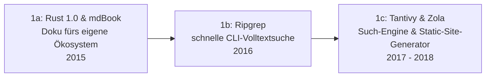

# Evolution und Architekturen digitaler Rust-Wissenssysteme

Rust hat sich seit Version 1.0 (2015) schrittweise als Implementierungssprache für zentrale Infrastruktur-Bausteine von Wissenssystemen etabliert — nicht als eigene Systemklasse neben Wikis, PKM-Tools oder RAG-Plattformen, sondern als **quer zu allen sechs Generationen von [Evolution digitaler Wissenssysteme](evolution-digitaler-wissenssysteme.md) liegende Implementierungsachse**: Volltextsuche, Vektordatenbanken, CRDT-Synchronisation, ML-Inferenz und zuletzt Static-Site-Build-Engines wandern zunehmend auf einen Rust-Kern, meist aus Performance- und Speichersicherheitsgründen, oft unsichtbar hinter einer Python-, JavaScript- oder Web-Oberfläche. Dieser Artikel ordnet diese Rust-Bausteine chronologisch nach **technologischen Generationen** — die allgemeine Rust-Werkzeuglandschaft jenseits von Wissenssystemen behandelt [Rust in der Praxis](../../entwicklung/system/rust-praxis.md).

!!! note "Hinweis: Eine Implementierungsachse, keine Konkurrenz-Zeitachse"
    Anders als die übrigen Spezialisierungs-Artikel dieser Reihe entspricht diese Zeitachse keiner einzelnen Generation von [Evolution digitaler Wissenssysteme](evolution-digitaler-wissenssysteme.md), sondern schneidet quer durch alle sechs — ein Rust-Vektordatenbank-Kern (hier Generation 3) kann z. B. hinter einer Generation-5-RAG-Plattform aus [Evolution digitaler Semantischer & RAG-Wissenssysteme](evolution-digitaler-semantische-rag-wissenssysteme.md) laufen. Die Zeiträume sind grobe Orientierung, keine scharfen Grenzen.

---

## Generation 1: Rust erreicht Praxisreife — Doku- & Suchwerkzeuge aus dem eigenen Ökosystem, 2015 – 2018

Die ersten Rust-Wissenswerkzeuge entstehen, um **Rust selbst** zu dokumentieren und dessen Quellcode zu durchsuchen — Eigenbedarf des jungen Ökosystems, nicht extern motivierte Produktentwicklung. Sie lässt sich in drei technologische Entwicklungsstufen unterteilen:

### 1a. Rust 1.0 & mdBook, 2015

- **Architektur:** Rust erreicht mit Version 1.0 Stabilitätsgarantien; **mdBook** entsteht direkt aus dem offiziellen Rust-Team, um „The Rust Programming Language" als durchsuchbares Markdown-Buch zu bauen — siehe [Dokumentenerstellung, Wikis & Notebooks](index.md#1-die-book-first-generatoren-markdownasciidoc).
- **Fokus:** ein Rust-Werkzeug für Rust-eigene Dokumentation, das erst später als generisches Docs-as-Code-Tool für andere Projekte adoptiert wird.

### 1b. Ripgrep — schnelle CLI-Volltextsuche, 2016

- **Architektur:** Ripgrep kombiniert einen selbst geschriebenen Regex-Kern mit paralleler Verzeichnis-Traversierung — deutlich schneller als etablierte Vorgänger wie `grep` oder `ack`.
- **Bedeutung:** kein Wissenssystem im engeren Sinn, aber die Referenzimplementierung für „Rust macht Textsuche drastisch schneller" — eine Erwartungshaltung, die alle folgenden Generationen prägt.

### 1c. Tantivy & Zola — Such-Engine und Static-Site-Generator, 2017 – 2018

- **Architektur:** **Tantivy** (2017) ist eine Rust-Bibliothek für Volltextsuche nach dem Vorbild von Apache Lucene — invertierter Index, BM25-Scoring, eingebettet statt als separater Server. **Zola** (2018) ist ein eigenständiger, Rust-nativer Static-Site-Generator ohne externe Laufzeitabhängigkeiten (eine einzelne Binärdatei), eine Alternative zu **Cobalt.rs** (2014) in derselben Kategorie.
- **Fokus:** Rust wird von der internen CLI-Nische zur allgemein nutzbaren Bibliothek/Anwendung für Content-Verarbeitung.

---

## Generation 2: Rust-native Such- & Content-Engines als Produkt, 2018 – 2022

Aus Bibliotheken werden fertige, eigenständig betreibbare Dienste — Rust-Kerne treten erstmals hinter einer eigenen API auf, statt nur in ein CLI-Tool eingebettet zu sein.

**Architektur:** Rust-Kern mit eigenem HTTP-Server, typo-tolerante oder domänenspezifische Textverarbeitung als Kernfeature statt reiner Geschwindigkeitsoptimierung.

| System | Jahr | Rolle |
|---|---|---|
| **Meilisearch** | 2018 | Typo-tolerante, entwicklerfreundliche Such-API — häufig hinter Docs- und Wiki-Suchleisten eingesetzt, als selbst gehostete Alternative zu Algolia DocSearch aus [Generation 4 der Docs-as-Code-Zeitachse](evolution-digitaler-docs-as-code.md#generation-4-komponentenbasierte-interaktive-docs-frameworks-2020-2023). |
| **Wikijump / ftml** | 2019 – 2022 | Rust-Bibliothek, die Wikidot-Wikitext-Syntax in eine Abstract-Syntax-Tree/HTML übersetzt — Kernstück des Rewrites der SCP-Foundation-Wiki-Plattform Wikijump, Ersatz für den betagten `Text_Wiki`-Parser aus der ursprünglichen Wikidot-Engine. |

---

## Generation 3: Rust-native Vektordatenbanken für RAG, 2021 – 2023

Mit dem Aufstieg von Retrieval-Augmented Generation (vgl. [Generation 3/4 der Semantische-&-RAG-Zeitachse](evolution-digitaler-semantische-rag-wissenssysteme.md#generation-3-dedizierte-vektordatenbanken-2019-2022)) entstehen mehrere zentrale Vektordatenbanken direkt in Rust — Performance und Speichersicherheit zählen hier unmittelbar zur Produktqualität, da diese Systeme oft im Dauerbetrieb riesige Embedding-Mengen verwalten.

**Architektur:** HNSW-Indexstrukturen in reinem Rust implementiert, sowohl als eigenständiger Server (Qdrant) als auch als eingebettete Bibliothek ohne externe Infrastruktur (LanceDB) und als Teil eines Multi-Model-Datenbank-Kerns (SurrealDB).

| System | Jahr | Betriebsmodell |
|---|---|---|
| **Qdrant** | 2021 | Selbst gehostet oder Cloud, vollständig in Rust implementiert. |
| **SurrealDB** | 2022 | Multi-Model-Datenbank in Rust — Dokument-, Graph- und Vektorsuche im selben Kern statt getrennter Systeme. |
| **LanceDB** | 2023 | Eingebettete Vektordatenbank auf dem Rust-basierten Lance-Spaltenformat, keine externe Infrastruktur nötig — siehe [Vektordatenbanken im Vergleich](wissensdatenbanken-ki-semantische-suche.md#vektordatenbanken-im-vergleich). |

---

## Generation 4: Rust-CRDTs für Local-First-Wissenssysteme, 2018 – 2022

Parallel zur Vektordatenbank-Welle wandert auch die CRDT-Synchronisationslogik hinter Local-First-PKM-Tools (vgl. [Generation 3/4 der Visuell-Agentischen-Zeitachse](evolution-digitaler-visuell-agentische-wissenssysteme.md#generation-3-crdt-forschung-erste-praxisreife-2011-2019)) zunehmend auf Rust-Kerne — Speichersicherheit ohne Garbage-Collector-Pausen ist bei latenzkritischer Echtzeit-Synchronisation ein direkter Produktvorteil.

**Architektur:** Rust-CRDT-Bibliotheken, oft nach JavaScript kompiliert (WebAssembly), um sowohl native Apps als auch Web-Clients aus derselben Implementierung zu bedienen.

| Bibliothek | Rolle |
|---|---|
| **yrs (Y-CRDT)** | Rust-Portierung von **Yjs** (vgl. [Generation 4 der Visuell-Agentischen-Zeitachse](evolution-digitaler-visuell-agentische-wissenssysteme.md)) — dieselbe CRDT-Logik, aber ohne JavaScript-Laufzeit-Overhead. |
| **diamond-types** | Eigenständige Rust-CRDT-Bibliothek, auf Textbearbeitungs-Performance bei sehr langer Bearbeitungshistorie spezialisiert. |
| **Automerge** (Rust-Kern ab v2) | Migriert seinen Kern von reinem JavaScript auf eine Rust-Implementierung (nach WebAssembly kompiliert), um Speicherverbrauch und Performance bei großen Dokumenten zu verbessern. |

---

## Generation 5: Rust-gestützte KI-/RAG-Inferenz für Wissenssysteme, 2023 – 2024

Auch die Ausführung der Sprach- und Embedding-Modelle selbst — nicht nur ihre Ergebnisse in einer Vektordatenbank — wandert teilweise auf Rust-Laufzeiten, um lokale RAG-Pipelines ohne Python-Overhead zu betreiben.

**Architektur:** Rust-native Tensor- und Inferenz-Bibliotheken als leichtgewichtige Alternative zu PyTorch/TensorFlow, kompilierbar zu einer einzelnen Binärdatei ohne Python-Laufzeit.

| System | Jahr | Rolle |
|---|---|---|
| **Candle** (Hugging Face) | 2023 | Rust-natives ML-Framework für lokale Inferenz, u. a. Embedding-Modelle für RAG-Pipelines ohne Python-Abhängigkeit. |
| **fastembed-rs** | 2023/2024 | Leichtgewichtige Rust-Bibliothek speziell für Embedding-Inferenz, eng verwandt mit den Chunking-/Embedding-Schritten aus [Wie Embeddings funktionieren](wissensdatenbanken-ki-semantische-suche.md#wie-embeddings-funktionieren). |

---

## Generation 6: Rust im Kern KI-nativer Docs-as-Code-Plattformen, ab 2025

Die jüngste Generation bringt Rust direkt in den **Build-Prozess** von Dokumentations-Websites selbst — nicht mehr nur in Suche, Datenbank oder Modell-Inferenz im Hintergrund, sondern im zentralen Werkzeug, das Markdown zu einer fertigen Website kompiliert.

**Architektur:** Hybrid-Build-Engines aus Rust-Kern (für performancekritische Datei-Verarbeitung) und einer bestehenden Konfigurations-/Plugin-Sprache (Python) für Kompatibilität zum etablierten Ökosystem, statt eines vollständigen Rewrites wie bei Zola in Generation 1c.

| System | Jahr | Rolle |
|---|---|---|
| **Zensical** | 2025 | Nachfolger von MkDocs + Material for MkDocs mit **Rust- und Python-Build-Engine** — liest `mkdocs.yml` nativ weiter, differenzielle Rebuilds in Millisekunden statt Minuten. |

!!! tip "Bezug zu diesem Repository"
    Wissen Ahrensburg wird mit **Zensical** gebaut — dieses Repository nutzt damit selbst ein Rust-gestütztes Wissenssystem-Werkzeug, siehe `CLAUDE.md` sowie [Zensical statt MkDocs in diesem Repository](evolution-digitaler-wissenssysteme.md#generatoren-arten-fur-wissensportale-static-site-docs-generators). Details zur Rust-Architektur: [Zensical-Blogbeitrag von Squidfunk](https://squidfunk.github.io/mkdocs-material/blog/2025/11/05/zensical/) und die [Zensical-Roadmap](https://zensical.org/about/roadmap/).

---

## Alternative Sortier- & Klassifikationskriterien für Rust-Wissenssysteme

Neben dem chronologischen Generationenmodell lassen sich diese Rust-Bausteine nach folgenden Dimensionen einordnen:

### 1. Rolle im Gesamtsystem

- **Suchmaschine/Index** — Tantivy, Meilisearch (Generation 1c, 2).
- **Datenbank** — Qdrant, SurrealDB, LanceDB (Generation 3).
- **Synchronisationsschicht** — yrs, diamond-types, Automerge (Generation 4).
- **ML-Laufzeit** — Candle, fastembed-rs (Generation 5).
- **Build-Engine** — Zola, Zensical (Generation 1c, 6).

### 2. Konsummodell

- **Eingebettete Bibliothek/Crate** — direkt im eigenen Prozess verlinkt, keine separate Infrastruktur (Tantivy, LanceDB, yrs).
- **Eigenständiger Server** — läuft als separater Dienst mit eigener API (Meilisearch, Qdrant).
- **CLI-Binärdatei** — einzelne ausführbare Datei ohne Laufzeitabhängigkeiten (Ripgrep, Zola, mdBook).

### 3. Sichtbarkeit für Endnutzer

- **Vollständig Rust, sichtbar als Produkt** — Nutzer interagiert direkt mit einem Rust-Tool (mdBook, Zola, Ripgrep).
- **Rust-Kern hinter fremder Oberfläche** — Rust-Bibliothek treibt ein Python-/JS-/Web-Frontend an, meist unsichtbar (Zensical, Candle-basierte RAG-Pipelines, yrs hinter einem JS-Editor).

### 4. Migrationsmuster

- **Von Grund auf Rust** — kein Vorgänger in anderer Sprache (Qdrant, Tantivy).
- **Rust-Rewrite eines bestehenden Systems** — ersetzt einen Kern, der ursprünglich in einer anderen Sprache geschrieben war (ftml ersetzt `Text_Wiki`, Automerge-Kern migriert von JS zu Rust).
- **Hybrid-Koexistenz** — Rust-Kern ergänzt statt ersetzt eine bestehende Sprache im selben Projekt (Zensical: Rust + Python).

---

## Verwandte Themen

- [Evolution und Architekturen digitaler Wissenssysteme](evolution-digitaler-wissenssysteme.md) — übergeordnetes Generationenmodell, das diese Rust-Implementierungsachse quer durchzieht
- [Evolution und Architekturen digitaler Docs-as-Code](evolution-digitaler-docs-as-code.md) — Zola und Zensical als Rust-Bausteine dieser Zeitachse
- [Evolution und Architekturen digitaler Semantischer & RAG-Wissenssysteme](evolution-digitaler-semantische-rag-wissenssysteme.md) — Qdrant, LanceDB und SurrealDB als Rust-Bausteine dieser Zeitachse
- [Evolution und Architekturen digitaler Visueller, Local-First & Agentischer Wissenssysteme](evolution-digitaler-visuell-agentische-wissenssysteme.md) — yrs, diamond-types und Automerge als Rust-Bausteine dieser Zeitachse
- [Wissensdatenbanken mit KI & semantischer Suche](wissensdatenbanken-ki-semantische-suche.md) — technische Mechanismen (Embeddings, Chunking, Vektordatenbanken), die mehrere hier genannte Rust-Systeme umsetzen
- [Evolution und Architekturen digitaler Rust-Webframeworks](../../entwicklung/webentwicklung/evolution-digitaler-rust-webframeworks.md) — analoge Rust-Implementierungsachse für Web-Frameworks statt Wissenssysteme
- [Evolution und Architekturen digitaler Rust-CMS](evolution-digitaler-rust-cms.md) — analoge Rust-Implementierungsachse für CMS, Zola als geteilter Baustein
- [Evolution und Architekturen digitaler Rust-LMS](../e-learning/evolution-digitaler-rust-lms.md) — analoge Rust-Implementierungsachse für LMS, Candle als geteilter Baustein
- [Evolution und Architekturen digitaler Rust-Notebooks](evolution-digitaler-rust-notebooks.md) — analoge Rust-Implementierungsachse für Notebook-Systeme, Candle/fastembed-rs als geteilter Baustein
- [Rust in der Praxis](../../entwicklung/system/rust-praxis.md) — allgemeine Rust-Werkzeuglandschaft jenseits von Wissenssystemen
- [Beste KI-Agent-SDKs für Rust-Bibliotheken (Top 20)](../../künstliche-intelligenz/coding/ki-agent-sdk-rust-bibliotheken-topliste.md) — verwandte Rust-Bibliotheken für agentische statt reiner Wissenssystem-Infrastruktur
