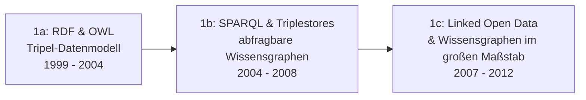

# Evolution und Architekturen digitaler Semantischer & RAG-Wissenssysteme

Semantische und RAG-gestützte Wissenssysteme bilden Generation 4 der [Evolution digitaler Wissenssysteme](evolution-digitaler-wissenssysteme.md) — diese eigenständige Zeitachse zoomt in genau diese Architekturlinie hinein: von symbolischen Semantic-Web-Wissensgraphen über neuronale Embeddings und dedizierte Vektordatenbanken bis zu Retrieval-Augmented Generation, selbst gehosteten RAG-Plattformen und schließlich GraphRAG als Verschmelzung von Wissensgraph und Vektorsuche. Die konkreten technischen Mechanismen (Chunking, Embeddings, Vektordatenbanken, RAG-Pipeline) erklärt vertieft [Wissensdatenbanken mit KI & semantischer Suche](wissensdatenbanken-ki-semantische-suche.md) — dieser Artikel ordnet stattdessen die Architekturen chronologisch nach **technologischen Generationen**, analog zu [Docs-as-Code](evolution-digitaler-docs-as-code.md) und [PKM-Wissensgraphen](evolution-digitaler-pkm-wissensgraphen.md).

!!! note "Hinweis: Generationen überlappen sich"
    Die Zeiträume sind grobe Orientierung, keine scharfen Grenzen — Triplestores und SPARQL (Generation 1) laufen bis heute produktiv in Enterprise-Wissensgraphen, parallel zu GraphRAG-Systemen (Generation 6), die beide Architekturlinien wieder zusammenführen. Entscheidend ist die **Architektur der Wissensrepräsentation** (explizite Tripel vs. gelernte Vektoren), nicht allein das Erscheinungsjahr.

---

## Generation 1: Semantic Web & symbolische Wissensgraphen, 1999 – 2012

Die Gründergeneration verfolgt einen rein **symbolischen** Ansatz: Wissen wird explizit als maschinenlesbare **Tripel** (Subjekt–Prädikat–Objekt) modelliert, durchsuchbar über eine eigene Abfragesprache — ohne jedes neuronale Lernen. Sie lässt sich in drei technologische Entwicklungsstufen unterteilen:

### 1a. RDF & OWL — das Tripel-Datenmodell, 1999 – 2004

- **Architektur:** **Resource Description Framework (RDF, 1999)** modelliert Aussagen als Subjekt–Prädikat–Objekt-Tripel, **Web Ontology Language (OWL, 2004)** ergänzt formale Klassenhierarchien und Inferenzregeln.
- **Fokus:** maschinenlesbare Semantik als W3C-Standard, Vision eines „Semantic Web", in dem Software Bedeutung statt nur Text verarbeitet.

### 1b. SPARQL & Triplestores — abfragbare Wissensgraphen, 2004 – 2008

- **Architektur:** **SPARQL (2008 als W3C-Standard)** als Abfragesprache für Tripel-Daten, spezialisierte **Triplestore**-Datenbanken statt relationaler Tabellen.
- **Vertreter:** **Apache Jena** (Java-Framework für RDF/SPARQL), **Blazegraph**, **Virtuoso** — bis heute im Einsatz für Enterprise-Wissensgraphen, siehe [Evolution digitaler Wissenssysteme, Generation 4](evolution-digitaler-wissenssysteme.md#generation-4-semantische-rag-ki-unterstutzte-wissenssysteme).

### 1c. Linked Open Data & Wissensgraphen im großen Maßstab, 2007 – 2012

- **Architektur:** öffentlich vernetzte RDF-Datensätze, die sich gegenseitig referenzieren (**Linked Open Data**), sowie Property-Graph-Datenbanken (Knoten/Kanten mit Attributen) als pragmatischere Alternative zu reinem RDF.
- **Vertreter:** **DBpedia** (2007, aus Wikipedia extrahierte strukturierte Daten), **Freebase** (2007, später in den Google Knowledge Graph integriert), **Neo4j** (2007, Property-Graph-Datenbank), **Google Knowledge Graph** (2012, macht Wissensgraphen massentauglich in der Websuche).

---

## Generation 2: Neuronale Embeddings & Vektorsuche als Suchgrundlage, 2013 – 2019

Statt Bedeutung explizit in Tripeln zu kodieren, **lernen** neuronale Netze Bedeutungsrepräsentationen aus großen Textkorpora — der entscheidende Architekturbruch, der symbolische Semantik (Generation 1) durch gelernte, kontinuierliche Vektorräume ergänzt.

**Architektur:** dichte Vektoren (Embeddings) statt diskreter Tripel, **Cosine Similarity** statt Graph-Traversierung als Ähnlichkeitsmaß, approximative Nächste-Nachbarn-Suche (ANN) für Skalierbarkeit.

| Meilenstein | Jahr | Bedeutung |
|---|---|---|
| **word2vec** (Google) | 2013 | Erste praxistaugliche Wort-Embeddings — Wörter mit ähnlicher Bedeutung liegen im Vektorraum nahe beieinander. |
| **GloVe** (Stanford) | 2014 | Alternative Embedding-Methode auf Basis globaler Wort-Kookkurrenz-Statistiken. |
| **FAISS** (Meta) / **Annoy** (Spotify) | 2015/2017 | Bibliotheken für approximative Nächste-Nachbarn-Suche — machen Ähnlichkeitssuche über Millionen Vektoren praktikabel. |
| **Sentence-BERT** | 2019 | Erste Embedding-Modelle für ganze Sätze/Absätze statt einzelner Wörter — direkte technische Grundlage heutiger Chunk-Embeddings, siehe [Wie Embeddings funktionieren](wissensdatenbanken-ki-semantische-suche.md#wie-embeddings-funktionieren). |

---

## Generation 3: Dedizierte Vektordatenbanken, 2019 – 2022

Vektorsuche wird zur eigenständigen Datenbank-Kategorie statt einer Bibliotheksfunktion — mit Persistenz, Metadaten-Filterung und Skalierung über einzelne Prozesse hinaus.

**Architektur:** spezialisierte Indexstrukturen (HNSW — Hierarchical Navigable Small World) für schnelle Ähnlichkeitssuche bei gleichzeitiger Persistenz und Metadaten-Filterung, im Gegensatz zu reinen In-Memory-ANN-Bibliotheken aus Generation 2.

| System | Jahr | Betriebsmodell |
|---|---|---|
| **Milvus** | 2019 | Selbst gehostet, für große Skalierung ausgelegt. |
| **Weaviate** | 2019 | Selbst gehostet oder Cloud, mit eingebauter Hybrid-Suche. |
| **Pinecone** | 2019 | Vollständig gemanagter Cloud-Dienst — keine eigene Infrastruktur nötig. |
| **Qdrant** | 2021 | Rust-basiert, selbst gehostet oder Cloud. |
| **Chroma** | 2022 | Eingebettete Vektordatenbank ohne externe Infrastruktur, verbreitet in lokalen RAG-Setups. |

Ein vollständiger Vergleich inklusive Einsatz in konkreten Tools findet sich unter [Vektordatenbanken im Vergleich](wissensdatenbanken-ki-semantische-suche.md#vektordatenbanken-im-vergleich).

---

## Generation 4: Retrieval-Augmented Generation (RAG) mit LLMs, 2020 – 2023

Vektorsuche allein liefert nur Fundstellen — **Retrieval-Augmented Generation** fügt ein Sprachmodell hinzu, das aus den gefundenen Chunks eine zusammenhängende Antwort formuliert. Der Begriff und die Grundarchitektur stammen aus der Forschung, werden aber erst mit dem Aufstieg der LLMs praxisrelevant.

**Architektur:** Retrieval-Schritt (Vektorsuche über Generation-3-Datenbanken) gefolgt von einem Generation-Schritt (LLM formuliert Antwort aus Kontext), Prompt-Injection der Top-K-Chunks statt Fine-Tuning auf firmeneigenen Daten.

| Baustein | Jahr | Rolle |
|---|---|---|
| **„Retrieval-Augmented Generation for Knowledge-Intensive NLP Tasks"** (Lewis et al., Meta AI) | 2020 | Forschungspapier, das den Begriff **RAG** und die grundlegende Retrieval-plus-Generation-Architektur prägt. |
| **LangChain / LlamaIndex** | 2022 | Orchestrierungs-Frameworks, die RAG-Pipelines (Laden, Chunken, Einbetten, Abfragen) für Entwickler standardisieren. |
| **ChatGPT Retrieval Plugin** | 2023 | Mainstreamt RAG für Endnutzer — LLM-Chat-Anwendungen greifen erstmals breit auf externe, aktuelle Dokumente zu. |

---

## Generation 5: Selbst gehostete RAG-Plattformen & lokale KI-Wissensdatenbanken, ab 2023

RAG wird von einer Entwickler-Bibliothek zu einer fertig bedienbaren Anwendung — All-in-One-Plattformen bündeln Dokumenten-Upload, Chunking, Vektordatenbank und Chat-Oberfläche in einem einzigen, oft selbst hostbaren System.

**Architektur:** vollständige RAG-Pipeline hinter einer Weboberfläche, Unterstützung mehrerer Vektordatenbank-Backends (Generation 3), lokale oder Cloud-LLMs frei wählbar.

| System | Prinzip |
|---|---|
| **[AnythingLLM](anythingllm-rag-plattform.md)** | All-in-One-Desktop-/Docker-Anwendung, lokale Dokumente in private Chat-Kontexte übersetzt. |
| **[Onyx (ehem. Danswer)](onyx-danswer-rag-plattform.md)** | Verbindet sich mit bestehenden Datenquellen (Slack, Google Drive, Wikis), fest integrierter Hybrid-Index. |
| **[Open WebUI](open-webui-rag-agenten-plattform.md)** | Web-Frontend für LLMs mit integriertem, konfigurierbarem RAG-System. |
| **[Dify](dify-agenten-workflow-plattform.md) / [Flowise](flowise-visueller-flow-builder.md)** | Visuelle Workflow-Editoren, RAG als ein Baustein unter mehreren in einer größeren Agenten-Pipeline. |

---

## Generation 6: GraphRAG & agentische, multi-hop Wissenssysteme, ab 2024

Reine Vektorsuche scheitert an Fragen, die **mehrere verknüpfte Fakten** über ein ganzes Dokumentenkorpus hinweg kombinieren müssen („Wie hängen Person A und Ereignis C zusammen?"). **GraphRAG** schließt den Kreis zu Generation 1: Ein LLM extrahiert aus unstrukturiertem Text einen Wissensgraphen, RAG-Retrieval läuft anschließend über diesen Graphen statt nur über flache Vektor-Chunks.

**Architektur:** LLM-generierte Wissensgraphen aus Rohtext (statt manuell modellierter Ontologien wie in Generation 1), Community-Detection/Graph-Clustering für thematische Zusammenfassungen, Multi-Hop-Retrieval über Graph-Kanten statt reiner Vektor-Nachbarschaft; agentische Varianten stellen iterativ mehrere Suchanfragen statt einer einzigen.

| System | Prinzip |
|---|---|
| **Microsoft GraphRAG** (2024) | LLM extrahiert Entitäten und Beziehungen aus Textkorpora, baut daraus einen durchsuchbaren Wissensgraphen. |
| **LlamaIndex Property Graphs** | Property-Graph-Index als Alternative/Ergänzung zum klassischen Vektor-Index innerhalb desselben Frameworks. |
| **Agentische RAG-Loops** | Ein Agent bewertet Zwischenergebnisse und stellt bei Bedarf weitere, verfeinerte Suchanfragen — statt eines einmaligen Retrieval-Schritts, siehe [AI Agents Praxis-Handbuch](../../künstliche-intelligenz/coding/ai-agents-praxis.md). |

!!! tip "Bezug zu diesem Repository"
    Das [LLM-Wiki-Pattern (Karpathy-Muster)](llm-wiki-pattern-karpathy.md), nach dem dieses Repository selbst gepflegt wird, verfolgt bewusst den entgegengesetzten Ansatz zu RAG: Wissen wird **einmalig** in ein strukturiertes, verlinktes Wiki kompiliert statt bei jeder Anfrage neu durchsucht — vgl. den Abgrenzungshinweis in [Wissensdatenbanken mit KI & semantischer Suche](wissensdatenbanken-ki-semantische-suche.md#von-der-suche-zur-antwort-rag-pipeline).

---

## Alternative Sortier- & Klassifikationskriterien für semantische & RAG-Wissenssysteme

Neben dem chronologischen/technologischen Generationenmodell lassen sich diese Systeme nach folgenden Dimensionen einordnen:

### 1. Wissensrepräsentation

- **Explizite Tripel/Ontologie** — Subjekt-Prädikat-Objekt, formal definierte Klassenhierarchien (Generation 1).
- **Gelernte Vektoren** — kontinuierliche Bedeutungsrepräsentation ohne explizite Struktur (Generation 2–5).
- **Hybrid-Graph** — LLM-generierter Graph aus Entitäten und Beziehungen, kombiniert beide Prinzipien (Generation 6).

### 2. Abfragemechanismus

- **Deklarative Graph-Abfrage** — SPARQL/Cypher, exakte strukturelle Muster (Generation 1).
- **Vektor-Ähnlichkeitssuche** — Cosine Similarity/ANN über Embeddings (Generation 2–3).
- **Generativ synthetisiert** — LLM formuliert die finale Antwort aus abgerufenem Kontext, statt nur Fundstellen zu liefern (Generation 4–6).

### 3. Betriebsmodell

- **Forschungs-/Standard-Infrastruktur** — W3C-Standards, meist selbst betriebene Triplestores (Generation 1).
- **Bibliothek/eingebettet** — FAISS, Chroma direkt im eigenen Prozess (Generation 2–3, teils bis heute).
- **Fertige Plattform** — All-in-One-Web-Anwendung mit Chat-Oberfläche (Generation 5).

### 4. Aktualität des Wissens

- **Statisch modelliert** — Ontologie wird manuell gepflegt, ändert sich selten (Generation 1).
- **Statisch trainiert** — Embedding-Modell-Gewichte fix, aber Vektordatenbank-Inhalt laufend aktualisierbar (Generation 2–5).
- **Laufend neu extrahiert** — Wissensgraph wird bei jedem neuen Dokument-Batch neu generiert (Generation 6).

---

## Verwandte Themen

- [Wissensdatenbanken mit KI & semantischer Suche](wissensdatenbanken-ki-semantische-suche.md) — technische Mechanismen (Chunking, Embeddings, Vektordatenbanken, RAG-Pipeline) hinter diesem Generationenmodell
- [Evolution und Architekturen digitaler Wissenssysteme](evolution-digitaler-wissenssysteme.md) — übergeordnetes Generationenmodell, Generation 4 dort entspricht diesem Artikel im Ganzen
- [Evolution und Architekturen digitaler PKM-Wissensgraphen & Block-Editoren](evolution-digitaler-pkm-wissensgraphen.md) — analoges Generationenmodell für persönliche statt semantische Wissensgraphen
- [Evolution und Architekturen digitaler Docs-as-Code](evolution-digitaler-docs-as-code.md) — analoges Generationenmodell für Docs-as-Code-Werkzeuge
- [Evolution und Architekturen digitaler KI-Anwendungen](../../künstliche-intelligenz/evolution-digitaler-ki-anwendungen.md) — Generation 5 dort (RAG & werkzeugnutzende KI-Anwendungen) überschneidet sich direkt mit Generation 4–5 dieses Artikels
- [LLM-Wiki-Pattern (Karpathy-Muster)](llm-wiki-pattern-karpathy.md) — Alternative/Ergänzung zu RAG, die dieses Repository selbst nutzt
- [Klassische Wiki-Systeme mit LLM-Integration](klassische-wiki-systeme-llm-integration.md) — Nachrüstung von Generation 1/2 der Wissenssysteme-Zeitachse mit RAG
- [AI Agents – Das Praxis-Handbuch & Architektur-Leitfaden](../../künstliche-intelligenz/coding/ai-agents-praxis.md) — Vertiefung zu agentischer RAG (Generation 6)
- [Evolution und Architekturen digitaler Frameworks & Bibliotheken für Wissenssysteme](evolution-digitaler-wissenssystem-frameworks.md) — Nachbarachse mit weiteren Graph-Query-Frameworks (Gremlin/TinkerPop, Neo4j-Treiber) und such-spezifischen Retrieval-Bibliotheken (Haystack, txtai) neben den hier behandelten Systemen
