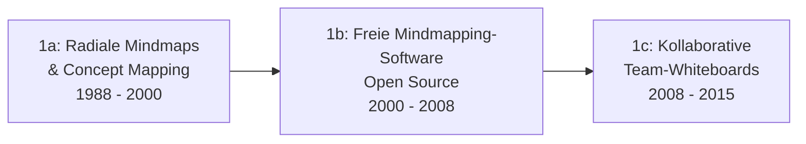

# Evolution und Architekturen digitaler Visueller, Local-First & Agentischer Wissenssysteme

Visuelle, Local-First und autonom-agentische Wissenssysteme bilden Generation 5 der [Evolution digitaler Wissenssysteme](evolution-digitaler-wissenssysteme.md) — diese eigenständige Zeitachse verfolgt drei zunächst getrennte technische Entwicklungslinien, die erst in der Gegenwart zusammenfließen: **räumliche/visuelle Notizführung** (vom Mindmap zur unendlichen Canvas), **konfliktfreie Offline-Synchronisation** (von naiver Mehrgeräte-Sync zu CRDT-basiertem Local-First) und **autonome KI-Gedächtnisarchitekturen** (von statischem Kontext zu persistenten Agenten-Speichern). Wo [Evolution und Architekturen digitaler PKM-Wissensgraphen & Block-Editoren](evolution-digitaler-pkm-wissensgraphen.md) die Werkzeug-Geschichte entlang des **Verlinkungs-/Block-Editor-Paradigmas** nachzeichnet, folgt dieser Artikel den **drei Architektur-Strängen selbst** — auch wenn beide Zeitachsen sich in einzelnen Werkzeugen (Anytype, Heptabase, Obsidian Canvas, MemGPT/Letta) zwangsläufig überschneiden.

!!! note "Hinweis: Generationen überlappen sich — und diese Zeitachse überlappt mit der PKM-Zeitachse"
    Die Zeiträume sind grobe Orientierung, keine scharfen Grenzen. Zusätzlich gilt hier ein zweiter Überlappungshinweis: Da Generation 3 der übergeordneten [Wissenssysteme-Zeitachse](evolution-digitaler-wissenssysteme.md) und diese Generation 5 historisch denselben Werkzeugraum (PKM-Software) durchlaufen, tauchen Anytype, Heptabase und Obsidian Canvas in beiden Spezial-Artikeln auf — dort im Kontext der Verlinkungs-Evolution, hier im Kontext der Canvas-/Sync-/Agenten-Architektur.

---

## Generation 1: Frühe Mindmapping- & visuelle Organisationswerkzeuge, 1988 – 2015

Vor der unendlichen Canvas etabliert sich radiales, nicht-lineares Notieren als eigene Software-Kategorie — zunächst als Einzelnutzer-Werkzeug, zuletzt als Team-fähiges Whiteboard, aber durchgehend ohne Offline-Konfliktauflösung oder KI-Beteiligung.

### 1a. Radiale Mindmaps & Concept Mapping, 1988 – 2000

- **Architektur:** proprietäre Desktop-Anwendungen, radiale Baumstruktur um ein Zentralthema statt freier Fläche.
- **Vertreter:** **Inspiration** (1988), **MindManager** (1994) — bis heute im Enterprise-Umfeld verbreitet.

### 1b. Freie Mindmapping-Software, 2000 – 2008

- **Architektur:** Open-Source-Alternativen demokratisieren die Kategorie, weiterhin radiale Baumstruktur, lokale Dateispeicherung ohne Sync.
- **Vertreter:** **FreeMind** (2000), **XMind** (2006), **Freeplane** (2008, Fork von FreeMind).

### 1c. Kollaborative Team-Whiteboards, 2008 – 2015

- **Architektur:** cloud-zentrierte Mehrbenutzer-Leinwände mit freier Objektplatzierung statt starrer Baumstruktur — der eigentliche konzeptionelle Vorläufer der „Infinite Canvas" aus Generation 5.
- **Vertreter:** **Miro** (2011, ursprünglich RealtimeBoard), **Mural** (2011) — Team-Kollaboration ja, aber zentral gehostet ohne Local-First-Prinzip und ohne strukturierte Wissensverlinkung.

---

## Generation 2: Naive Mehrgeräte-Synchronisation ohne CRDTs, 2004 – 2015

Bevor CRDTs Konflikte mathematisch garantiert auflösen können, behelfen sich frühe Notiz-Tools mit einfacheren, fehleranfälligen Sync-Strategien.

**Architektur:** Dateisynchronisation über generische Cloud-Speicher (Dropbox, iCloud) oder proprietäre Sync-Server mit **Last-Write-Wins** oder manueller Konfliktlösung — gleichzeitige Bearbeitung auf zwei Geräten führt im Zweifel zu Datenverlust oder doppelten Notizen statt sauberer Zusammenführung.

| System | Sync-Strategie | Schwäche |
|---|---|---|
| **Evernote** (früh) | proprietärer Sync-Server, Last-Write-Wins | gleichzeitige Offline-Änderungen überschreiben sich gegenseitig |
| **nvALT / Notational Velocity** | Dropbox-Ordner mit Klartextdateien | kein Konfliktschutz — Dropbox erzeugt bei echten Konflikten Duplikate |
| **Simplenote** (früh) | proprietärer Sync-Server | ähnliche Last-Write-Wins-Problematik wie Evernote |

---

## Generation 3: CRDT-Forschung & erste Praxisreife, 2011 – 2019

**Conflict-free Replicated Data Types (CRDTs)** liefern erstmals eine mathematisch fundierte Antwort auf das Sync-Problem aus Generation 2: Datenstrukturen, die sich garantiert konfliktfrei zusammenführen lassen, unabhängig von Reihenfolge oder Netzwerklatenz — ganz ohne zentralen Locking-Server.

**Architektur:** replizierte Datentypen mit kommutativen Merge-Operationen, im Gegensatz zum alternativen **Operational-Transform (OT)**-Ansatz (u. a. in Google Docs eingesetzt), der eine zentrale Transformationslogik statt symmetrischer Merges benötigt.

| Meilenstein | Jahr | Bedeutung |
|---|---|---|
| **CRDT-Grundlagenpapier** (Shapiro, Preguiça, Baquero, Zawirski) | 2011 | Formalisiert das CRDT-Konzept erstmals akademisch. |
| **Automerge** | 2017 | Erste breit nutzbare JavaScript-CRDT-Bibliothek für JSON-artige Dokumente. |
| **Yjs** | 2018 | Performance-optimierte CRDT-Bibliothek, wird zur häufigsten CRDT-Grundlage in Block-Editoren (vgl. [Generation 4 der PKM-Zeitachse](evolution-digitaler-pkm-wissensgraphen.md#generation-4-block-datenbanken-crdt-echtzeit-kollaboration-2016-2022)). |

---

## Generation 4: Local-First-Manifest & verschlüsselte P2P-Wissenssysteme, 2019 – 2022

Der Essay **„Local-first software"** (Kleppmann, Wiegand, van Hardenberg, Beattie — Ink & Switch, 2019) prägt den Begriff und formuliert sieben Prinzipien (u. a. Offline-Fähigkeit als Grundannahme statt Ausnahme, volle Datenhoheit, keine zentrale Autorität) — CRDTs aus Generation 3 liefern die technische Umsetzung dieses Manifests.

**Architektur:** lokale Datenhaltung als primäre Quelle der Wahrheit, Peer-to-Peer- oder Ende-zu-Ende-verschlüsselte Synchronisation statt zentralem Cloud-Server, CRDT-Merge für Mehrgeräte- und Mehrbenutzer-Konsistenz.

| System | Prinzip |
|---|---|
| **„Local-first software"-Manifest** (2019) | Formuliert die sieben Leitprinzipien, an denen sich alle folgenden Systeme dieser Generation messen lassen. |
| **Anytype** (2021) | Verschlüsselte, objektbasierte Wissensdatenbank auf IPFS-Basis — konsequente Umsetzung des Manifests für persönliches Wissensmanagement. |
| **Actual Budget** und weitere lokale CRDT-Apps | Referenzimplementierungen des Local-First-Prinzips außerhalb des reinen PKM-Bereichs, zeigen die Architektur als domänenübergreifendes Muster. |

---

## Generation 5: Unendliche Canvas- & räumliche Wissenssysteme, 2020 – 2023

Die Whiteboard-Metapher aus Generation 1c verschmilzt mit strukturierten, verlinkbaren Notizen: Statt reinem Freihand-Zeichnen ordnen Nutzer echte Dokumente, Karten und Verknüpfungen räumlich auf einer unendlichen Fläche an.

**Architektur:** Infinite-Canvas-Rendering mit Zoom-/Pan-Interaktion, Notizkarten als eigenständige, verlinkbare Objekte statt reiner Zeichenelemente, teils kombiniert mit Local-First-Sync aus Generation 4.

| System | Prinzip |
|---|---|
| **Heptabase** (2022) | Explizit für vernetztes Lernen konzipiert — Notizkarten, Whiteboards und automatisch generierte Karteikarten auf derselben räumlichen Fläche. |
| **Obsidian Canvas** (2023) | Erweitert das dateibasierte Obsidian-Vault (siehe [PKM-Zeitachse, Generation 3](evolution-digitaler-pkm-wissensgraphen.md#generation-3-bidirektionale-verlinkung-local-first-markdown-tresore-2019-2021)) um eine räumliche Anordnungsebene für dieselben Markdown-Dateien. |

---

## Generation 6: Autonome & agentische Gedächtnissysteme, ab 2023

Die dritte, jüngste Entwicklungslinie: KI-Agenten benötigen ein **persistentes Gedächtnis über einzelne Sitzungen hinweg** — ein fundamental anderes Problem als das Kurzzeit-Kontextfenster eines LLM-Prompts. Autonome Gedächtnisarchitekturen lösen das, indem sie Wissen aktiv verwalten, priorisieren und bei Bedarf aus einem Langzeitspeicher in den Kontext zurückladen.

**Architektur:** mehrstufige Speicherhierarchie (Kurzzeit-Kontext im Prompt, Langzeit-Speicher in einer Datenbank), aktives Selbst-Editieren des eigenen Gedächtnisses durch den Agenten selbst, statt passiver Log-Speicherung.

| System | Rolle |
|---|---|
| **MemGPT** (2023, UC Berkeley) | Forschungspapier und Referenzimplementierung, die LLM-Agenten ein virtuelles, seitenweise verwaltetes Gedächtnis nach dem Vorbild klassischer Betriebssystem-Speicherverwaltung gibt. |
| **Letta** (2024) | Nachfolgeprojekt/Unternehmen der MemGPT-Autoren, produktisiert die Architektur für Entwickler agentischer Anwendungen. |
| **Mem0, Zep** | Weitere spezialisierte Agentic-Memory-Infrastrukturen, die Langzeitgedächtnis als eigenständigen Dienst statt integrierten Anwendungsbestandteil anbieten. |

!!! tip "Bezug zu diesem Repository"
    Agentische Gedächtnisarchitekturen wie MemGPT/Letta lösen für autonome KI-Agenten dasselbe Grundproblem, das das [LLM-Wiki-Pattern (Karpathy-Muster)](llm-wiki-pattern-karpathy.md) für die Pflege dieses Repositories löst: Wissen muss über einzelne Interaktionen hinweg persistent, strukturiert und wiederauffindbar bleiben, statt bei jedem neuen Kontext verloren zu gehen.

---

## Alternative Sortier- & Klassifikationskriterien

Neben dem chronologischen/technologischen Generationenmodell lassen sich diese Systeme nach folgenden Dimensionen einordnen:

### 1. Raummetapher

- **Baumstruktur/radial** — Mindmap um ein Zentralthema (Generation 1a/1b).
- **Freie Fläche/Canvas** — beliebige räumliche Anordnung ohne vorgegebene Struktur (Generation 1c, 5).
- **Dateisystem/Liste** — klassische Ordner- oder Outliner-Ansicht ohne räumliche Komponente (Vergleichspunkt zur PKM-Zeitachse).

### 2. Konfliktauflösung bei Mehrgeräte-Nutzung

- **Last-Write-Wins** — neuere Änderung überschreibt ältere, Datenverlust möglich (Generation 2).
- **CRDT-Merge** — mathematisch garantierte, konfliktfreie Zusammenführung (Generation 3+).
- **Operational Transform** — zentrale Transformationslogik, alternative Lösung außerhalb dieser Zeitachse (Google Docs).

### 3. Datenhoheit

- **Zentral beim Anbieter** — Anbieter-Server ist einzige Quelle der Wahrheit (Generation 1, 2).
- **Local-First** — lokale Kopie ist primäre Quelle der Wahrheit, Sync ist Zusatzfunktion (Generation 4, 5 teilweise).
- **Verschlüsselt/P2P** — nicht einmal der Sync-Anbieter kann Inhalte einsehen (Anytype, Generation 4).

### 4. Gedächtnismodell

- **Kein Gedächtnis** — jede Sitzung beginnt bei null (klassische Mindmapping-Tools).
- **Statischer Speicher** — Notizen bleiben, bis ein Mensch sie ändert (Generation 1–5).
- **Aktiv verwaltetes Agenten-Gedächtnis** — ein Agent selbst entscheidet, was im Kontext bleibt und was ins Langzeitgedächtnis wandert (Generation 6).

---

## Verwandte Themen

- [Beste visuelle, Local-First & agentische Wissenssysteme 2026 (Top 20)](visuell-agentische-wissenssysteme-2026-topliste.md) — aktuelle Top-20-Topliste, die diese Chronologie in eine Momentaufnahme 2026 übersetzt
- [Evolution und Architekturen digitaler Wissenssysteme](evolution-digitaler-wissenssysteme.md) — übergeordnetes Generationenmodell, Generation 5 dort entspricht diesem Artikel im Ganzen
- [Evolution und Architekturen digitaler PKM-Wissensgraphen & Block-Editoren](evolution-digitaler-pkm-wissensgraphen.md) — Schwester-Zeitachse entlang des Verlinkungs-/Block-Editor-Paradigmas, teilt sich mehrere Werkzeuge mit dieser Zeitachse
- [Evolution und Architekturen digitaler Semantischer & RAG-Wissenssysteme](evolution-digitaler-semantische-rag-wissenssysteme.md) — analoges Generationenmodell für Generation 4
- [Evolution und Architekturen digitaler Docs-as-Code](evolution-digitaler-docs-as-code.md) — analoges Generationenmodell für Generation 2
- [Personal Knowledge Management (PKM) & Second Brain: Methoden](pkm-second-brain-methoden.md) — methodische Seite, ergänzt beide PKM-nahen Zeitachsen
- [LLM-Wiki-Pattern (Karpathy-Muster)](llm-wiki-pattern-karpathy.md) — verwandtes Persistenz-/Strukturierungsprinzip auf Team-/Repository-Ebene
- [AI Agents – Das Praxis-Handbuch & Architektur-Leitfaden](../../künstliche-intelligenz/coding/ai-agents-praxis.md) — Vertiefung zu agentischen Architekturen (Generation 6)
- [Dokumentenerstellung, Wikis & Notebooks](index.md) — Gesamtübersicht aller Dokumentations-Systeme
