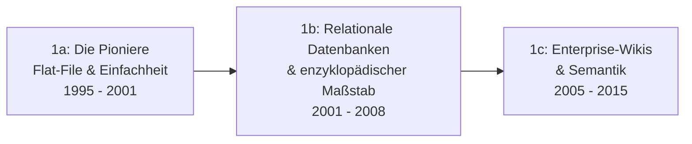

# Evolution und Architekturen digitaler Wiki-Engines

Wiki-Engines — kollaborative, versionierte Textsysteme mit manueller Verlinkung — bilden Generation 1 der [Evolution digitaler Wissenssysteme](evolution-digitaler-wissenssysteme.md). Diese eigenständige Zeitachse zoomt in genau diese Architekturlinie hinein: von den ersten Flat-File-Pionieren über relationale Enzyklopädie-Engines und Enterprise-Semantik bis zu Community-Skalierungsplattformen, vollständigen Node.js-/Rust-Rewrites und schließlich KI-Agenten, die direkt in bestehende Wiki-Engines hineinschreiben. Wo [PKM-Wissensgraphen & Block-Editoren](evolution-digitaler-pkm-wissensgraphen.md) die **persönliche** Notiz-Software nachzeichnet, geht es hier um **kollaborative, gemeinschaftlich gepflegte** Wiki-Software — die konkreten, in diesem Repository dokumentierten Installationen (MediaWiki, XWiki, Semantic MediaWiki, Wiki.js) ordnen sich in diese Zeitachse ein.

!!! note "Hinweis: Generationen überlappen sich"
    Die Zeiträume sind grobe Orientierung, keine scharfen Grenzen — MediaWiki (Generation 1b) wird bis heute produktiv weiterentwickelt, parallel zu KI-agentengestützter Wiki-Pflege (Generation 6). Entscheidend ist die **Architektur** (Speicherform, Skalierungsprinzip, Grad der KI-Integration), nicht allein das Erscheinungsjahr.

---

## Generation 1: Klassische Wiki-Engines — von Flat-File bis Enterprise-Semantik, 1995 – 2015

Die Gründergeneration eint drei Prinzipien: ein **zentraler Textbestand**, **Versionierung** jeder Änderung und **manuelle Verlinkung** über Wikilinks. Sie lässt sich in drei technologische Entwicklungsstufen unterteilen:

### 1a. Die Pioniere: Flat-File & radikale Einfachheit, 1995 – 2001

- **Architektur:** Perl-/CGI-Skripte, Speicherung als reine Textdateien im Dateisystem, keine Benutzerverwaltung.
- **Vertreter:** **WikiWikiWeb** (1995, Ward Cunningham — das namensgebende erste Wiki), **UseModWiki** (1999/2000, Perl) — letzteres war das ursprüngliche Wiki-Programm, mit dem Wikipedia im Januar 2001 startete, bevor eigene Nachfolgesoftware entstand.

### 1b. Relationale Datenbanken & enzyklopädischer Maßstab, 2001 – 2008

- **Architektur:** klassischer LAMP-Stack, granulare Rechte- und Versionsverwaltung, Kategoriensysteme.
- **Vertreter:** **MediaWiki** (2002, aus zwei aufeinanderfolgenden PHP-Neuentwicklungen für Wikipedia hervorgegangen, die UseModWiki ablösten — siehe [MediaWiki installieren](mediawiki/index.md) und [Evolution und Architekturen von MediaWiki](mediawiki/evolution-digitaler-mediawiki.md) für die eigene Versions-/Architektur-Geschichte), **DokuWiki** (2004, dateibasierte Ausnahme ohne Datenbank), **TikiWiki**, **TWiki** — frühe LAMP-basierte Engines mit breitem Feature-Umfang.

### 1c. Enterprise-Wikis & Semantik, 2005 – 2015

- **Architektur:** Java-/.NET-Stacks, WYSIWYG-Editoren, semantische Metadaten.
- **Vertreter:** **XWiki** (2006, siehe [XWiki installieren](xwiki/installieren.md) und [Evolution und Architekturen von XWiki](xwiki/evolution-digitaler-xwiki.md) für die eigene Versions-/Architektur-Geschichte), **Atlassian Confluence** (2004), **Semantic MediaWiki** (2005, siehe [Semantisches MediaWiki](semantische-mediawiki/installieren.md)), **Foswiki** (2008, TWiki-Fork).

---

## Generation 2: Community-Skalierungsplattformen — ein Engine, tausende unabhängige Wikis, 2004 – 2016

Statt einer einzelnen Installation pro Organisation entstehen **Hosting-Plattformen**, auf denen tausende unabhängige Communities dieselbe Engine-Basis nutzen — Skalierung des Wiki-Prinzips über die einzelne Installation hinaus.

**Architektur:** Multi-Tenancy auf gemeinsamer Infrastruktur, eigene Namensräume pro Community, Werbefinanzierung statt Lizenzgebühren als Betriebsmodell.

| System | Jahr | Prinzip |
|---|---|---|
| **Wikia** (später **Fandom**) | 2004 | MediaWiki-basierte Hosting-Plattform für Fan-Communities, 2016 in „Fandom" umbenannt. |
| **Wikidot** | 2006 | Eigenständige, nicht MediaWiki-basierte Wiki-Engine mit eigenem Hosting-Modell — u. a. Grundlage der SCP-Foundation-Community. |

---

## Generation 3: Docs-as-Code-Konvergenz — Git statt eigener Versionshistorie, ca. 2010 – 2018

Statt einer eigenen Datenbank-Versionierung übernehmen einige Wiki-Engines **Git direkt als Speicher- und Historienschicht** — eine direkte Schnittmenge mit [Generation 3 der Docs-as-Code-Zeitachse](evolution-digitaler-docs-as-code.md#generation-3-markdown-native-docs-as-code-frameworks-yaml-konfiguration-2014-2020).

**Architektur:** Git-Repository als Wahrheitsquelle statt Datenbank-Tabellen, Markdown statt engine-eigener Wikitext-Syntax.

| System | Jahr | Prinzip |
|---|---|---|
| **Gollum** | 2010 | Git-Backend-Wiki-Engine hinter der GitHub-Wiki-Funktion — jede Änderung ist ein Git-Commit. |
| **Wiki.js 1.x** | 2014 | Ursprüngliche Node.js/MongoDB-basierte Erstversion, optional mit Git-Sync — Vorläufer des vollständigen Rewrites in Generation 4. |

---

## Generation 4: Vollständige Rewrites auf modernen Web-Stacks, ab 2018

Statt inkrementeller Weiterentwicklung ersetzen mehrere Engines ihren kompletten technischen Unterbau — moderne SPA-Frontends und performantere Backend-Sprachen lösen die PHP-/frühe-Node.js-Basis der Vorgänger-Generationen ab.

**Architektur:** Single-Page-Application-Frontend statt serverseitig gerenderter Templates, relationale Datenbank statt dokumentenorientiertem Speicher, Rust statt interpretierter Sprache für performancekritische Parser.

| System | Jahr | Veränderung |
|---|---|---|
| **Wiki.js 2.0** | 2018 | Kompletter Rewrite: Node.js-Backend, **Vue.js**-SPA-Oberfläche, relationale Datenbank statt MongoDB — die in diesem Repository dokumentierte Version, siehe [Wiki.js native Linux-Installation](wikijs-linux-installation.md). |
| **Wikijump / ftml** | 2021 – 2022 | Rust-Rewrite der Wikidot-Engine für die SCP-Foundation-Community, siehe [Generation 2 der Rust-Wissenssysteme-Zeitachse](evolution-digitaler-rust-wissenssysteme.md#generation-2-rust-native-such-content-engines-als-produkt-2018-2022). |

---

## Generation 5: Semantische Anreicherung trifft RAG, ab ca. 2022

Bestehende Wiki-Engines aus Generation 1 werden nicht ersetzt, sondern um **semantische Suche und RAG** ergänzt — Vektordatenbanken und LLMs kommen als Zusatzschicht hinzu, statt eine neue Engine zu erfordern.

**Architektur:** bestehende Wiki-Datenbank bleibt Wahrheitsquelle, ein zusätzlicher Indexierungs-/Retrieval-Layer (vgl. [Generation 3/4 der Semantische-&-RAG-Zeitachse](evolution-digitaler-semantische-rag-wissenssysteme.md)) macht Inhalte per natürlicher Sprache statt nur per Volltextsuche auffindbar.

| Baustein | Rolle |
|---|---|
| **Semantic MediaWiki + LLM-Kombination** | Bestehende strukturierte Metadaten aus Generation 1c werden zusätzlich für RAG-Retrieval nutzbar gemacht. |
| **Klassische Wiki-Systeme mit LLM-Integration** | Konkrete Nachrüstungs-Patterns für MediaWiki, XWiki & Co., siehe [Klassische Wiki-Systeme mit LLM-Integration](klassische-wiki-systeme-llm-integration.md). |

---

## Generation 6: KI-Agenten pflegen bestehende Wiki-Engines direkt, ab 2023

Die aktuelle Generation lässt KI-Agenten nicht nur suchen, sondern **selbst Inhalte in eine bestehende Wiki-Engine schreiben** — mit Review-Pflicht vor Veröffentlichung, analog zu [Generation 4 der Multi-Agenten-Wissensökosysteme-Zeitachse](evolution-digitaler-multiagenten-wissensoekosysteme.md#generation-4-git-native-human-in-the-loop-wissenspflege-2024-2025).

**Architektur:** Agent mit API-/Bot-Zugriff auf eine bestehende Engine aus Generation 1–4, automatisierte Struktur- und Konsistenzprüfung vor der Übernahme, Mensch review-pflichtig statt vollautomatischem Publish.

| Baustein | Rolle |
|---|---|
| **Wiki.js KI-Agent** | Agentengestützte Pflege einer Wiki.js-2.x-Installation, siehe [Wiki.js-KI-Agent](wikijs-ki-agent.md). |
| **MediaWiki-KI-Agent** | Kombiniert das Pywikibot-Framework aus [Generation 1b der Multi-Agenten-Zeitachse](evolution-digitaler-multiagenten-wissensoekosysteme.md#1b-wikipedia-bots-pywikibot-okosystem-2005-2015) mit LLM-gestützter Inhaltserstellung, siehe [MediaWiki KI-Agent](mediawiki/mediawiki-ki-agent.md). |
| **Autonome Wiki-Pflege-Agenten (allgemein)** | Übergreifendes Funktionsprinzip: Agent schreibt in ein bestehendes Wiki, Mensch prüft vor Veröffentlichung, siehe [Native „LLM-first" Wiki-Tools & Agenten, Abschnitt 4](llm-first-wiki-tools-agenten.md#4-autonome-wiki-pflege-agenten-agent-schreibt-in-ein-bestehendes-wiki). |

!!! tip "Bezug zu diesem Repository"
    Dieses Repository ist selbst kein klassisches Wiki (Zensical baut statische Seiten statt einer Live-editierbaren Wiki-Engine), dokumentiert aber mehrere Generationen dieser Zeitachse im Detail: MediaWiki und Semantic MediaWiki (Generation 1), XWiki (Generation 1c) und Wiki.js (Generation 4/6). Die eigene Pflege folgt stattdessen dem [LLM-Wiki-Pattern (Karpathy-Muster)](llm-wiki-pattern-karpathy.md).

---

## Alternative Sortier- & Klassifikationskriterien für Wiki-Engines

Neben dem chronologischen/technologischen Generationenmodell lassen sich Wiki-Engines nach folgenden Dimensionen einordnen:

### 1. Speicherarchitektur

- **Flat-File** — reine Textdateien im Dateisystem (WikiWikiWeb, DokuWiki).
- **Relationale Datenbank** — MySQL/PostgreSQL als Wahrheitsquelle (MediaWiki, XWiki, Wiki.js 2.0).
- **Git-nativ** — jede Änderung ein Commit statt eines Datenbank-Eintrags (Gollum).

### 2. Betriebsmodell

- **Selbst gehostete Einzelinstallation** — eine Organisation, eine Engine-Instanz (klassisches MediaWiki/XWiki-Setup).
- **Multi-Tenant-Hosting-Plattform** — eine Infrastruktur, tausende unabhängige Communities (Wikia/Fandom, Wikidot).

### 3. Grad der KI-Integration

- **Keine KI** — reine manuelle Bearbeitung (Generation 1–4 in ihrer ursprünglichen Form).
- **KI als Suchschicht** — RAG/semantische Suche ergänzt, Engine selbst unverändert (Generation 5).
- **KI als Mitautor** — Agent schreibt aktiv neue Inhalte, Mensch reviewt (Generation 6).

### 4. Implementierungssprache/-Stack

- **PHP** — MediaWiki, DokuWiki, Semantic MediaWiki.
- **Java/.NET** — XWiki, Confluence, JSPWiki.
- **Node.js** — Wiki.js.
- **Rust** — ftml/Wikijump (Parser-Kern).

---

## Verwandte Themen

- [Beste Wiki-Engines 2026 (Top 20)](wiki-engines-2026-topliste.md) — aktuelle Top-20-Topliste, die diese Chronologie in eine Momentaufnahme 2026 übersetzt
- [Evolution und Architekturen digitaler Wissenssysteme](evolution-digitaler-wissenssysteme.md) — übergeordnetes Generationenmodell, Generation 1 dort entspricht diesem Artikel im Ganzen
- [Evolution und Architekturen von MediaWiki](mediawiki/evolution-digitaler-mediawiki.md) — vertiefende Produkt-Geschichte zu Generation 1b dieses Artikels
- [Evolution und Architekturen digitaler PKM-Wissensgraphen & Block-Editoren](evolution-digitaler-pkm-wissensgraphen.md) — persönliche statt kollaborative Notiz-Software als Schwester-Zeitachse
- [Evolution und Architekturen digitaler Docs-as-Code](evolution-digitaler-docs-as-code.md) — direkte Schnittmenge bei Git-basierten Wiki-Engines (Generation 3 dieses Artikels)
- [Evolution und Architekturen digitaler Semantischer & RAG-Wissenssysteme](evolution-digitaler-semantische-rag-wissenssysteme.md) — technische Grundlage von Generation 5 dieses Artikels
- [Evolution und Architekturen digitaler Multi-Agenten-Wissensökosysteme](evolution-digitaler-multiagenten-wissensoekosysteme.md) — Orchestrierungsprinzipien hinter Generation 6 dieses Artikels
- [Evolution und Architekturen digitaler Rust-Wissenssysteme](evolution-digitaler-rust-wissenssysteme.md) — Wikijump/ftml als Rust-Baustein dieser Zeitachse
- [Klassische Wiki-Systeme mit LLM-Integration](klassische-wiki-systeme-llm-integration.md) — praktische LLM-Nachrüstung konkreter Engines aus Generation 1
- [MediaWiki installieren](mediawiki/index.md), [XWiki installieren](xwiki/installieren.md), [Wiki.js native Linux-Installation](wikijs-linux-installation.md) — konkrete Installationsanleitungen zu Generation 1/4 dieser Zeitachse
- [LLM-Wiki-Pattern (Karpathy-Muster)](llm-wiki-pattern-karpathy.md) — Pflegeprinzip, das dieses Repository selbst statt einer klassischen Wiki-Engine nutzt
