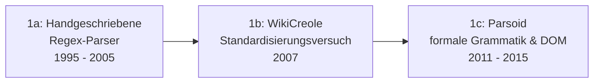

# Evolution und Architekturen digitaler Frameworks & Bibliotheken für Wissenssysteme

Hinter jedem Wiki, PKM-Tool oder Docs-as-Code-System aus [Evolution und Architekturen digitaler Wissenssysteme](evolution-digitaler-wissenssysteme.md) steckt eine eigene Schicht aus **Entwickler-Frameworks und -Bibliotheken**, mit denen genau diese Produkte gebaut werden — nicht die fertigen Systeme selbst, sondern die Bausteine darunter. Dieser Artikel verfolgt diese Bauteil-Schicht als eigenständige, sprachübergreifende Zeitachse: von handgeschriebenen Wikitext-Parsern über universelle Dokumentkonverter, Rich-Text-/Block-Editor-Toolkits und Graph-Query-Frameworks bis zu Retrieval-Bibliotheken speziell für Wissenssuche. Die bereits ausführlich behandelten Nachbarachsen — Semantic-Web/RDF/Vektordatenbanken und Docs-as-Code-Generatoren — verlinkt dieser Artikel gezielt, statt sie zu wiederholen: [Evolution und Architekturen digitaler Semantischer & RAG-Wissenssysteme](evolution-digitaler-semantische-rag-wissenssysteme.md) und [Evolution und Architekturen digitaler Docs-as-Code](evolution-digitaler-docs-as-code.md). Die Rust-spezifische Teilmenge dieser Bauteil-Schicht behandelt separat [Evolution und Architekturen digitaler Rust-Wissenssysteme](evolution-digitaler-rust-wissenssysteme.md).

!!! note "Hinweis: Generationen überlappen sich"
    Die Zeiträume sind grobe Orientierung, keine scharfen Grenzen — Pandoc (Generation 2) wird bis heute produktiv in modernen RAG-Pipelines (Generation 5) als Vorverarbeitungsschritt eingesetzt. Entscheidend ist die **Rolle im Gesamtsystem** (Parser, Konverter, Editor-Toolkit, Datenbank-Treiber, Retrieval-Bibliothek), nicht allein das Erscheinungsjahr.

---

## Generation 1: Wiki-Markup-Parser & Textumwandlungs-Engines, 1995 – 2015

Bevor Wiki-Engines als fertige Produkte zählen, brauchen sie eine Bibliothek, die Wiki-Syntax in HTML übersetzt — anfangs handgeschriebene Regex-Parser direkt im jeweiligen Wiki-Kern, später formalere, wiederverwendbare Grammatiken. Sie lässt sich in drei technologische Entwicklungsstufen unterteilen:

### 1a. Handgeschriebene Regex-Parser, 1995 – 2005

- **Architektur:** jede frühe Wiki-Engine bringt ihren eigenen, eng an die Codebasis gekoppelten Parser mit — meist eine Kette regulärer Ausdrücke statt einer formalen Grammatik, kaum als eigenständige Bibliothek wiederverwendbar.
- **Vertreter:** MediaWikis ursprünglicher Wikitext-Parser (seit 2002), DokuWikis zeilenbasierter Parser — bis heute im produktiven Einsatz, siehe [Generation 1b der Wissenssysteme-Zeitachse](evolution-digitaler-wissenssysteme.md#1b-relationale-datenbanken-enzyklopadischer-mastab-ca-2001-2008).

### 1b. WikiCreole — ein Standardisierungsversuch, 2007

- **Architektur:** **WikiCreole** definiert eine gemeinsame, engine-unabhängige Wiki-Markup-Grammatik, damit Inhalte zwischen verschiedenen Wiki-Engines portabel bleiben, statt an ein einzelnes Produkt gebunden zu sein.
- **Bedeutung:** setzt sich als Vollstandard nicht breit durch, prägt aber das Bewusstsein, dass Wiki-Markup als eigenständige, dokumentierte Grammatik statt als Implementierungsdetail behandelt werden sollte.

### 1c. Parsoid — formale Grammatik & DOM-Brücke, 2011 – 2015

- **Architektur:** **Parsoid** übersetzt Wikitext verlustfrei in beide Richtungen (Wikitext ↔ HTML-DOM) über eine formale PEG-Grammatik statt einer Regex-Kette — zunächst als eigenständiger **Node.js-Dienst** neben dem PHP-Kern, da der bestehende MediaWiki-Parser dafür nicht robust genug war. Details zur MediaWiki-eigenen Geschichte dieser Bibliothek bietet [Generation 3 der MediaWiki-Zeitachse](mediawiki/evolution-digitaler-mediawiki.md#generation-3-visualeditor-die-parsoid-brucke-2011-2015).
- **Bedeutung:** macht den Wikitext-Parser erstmals zu einer eigenständigen, testbaren Bibliothek statt eines Implementierungsdetails im Produkt — Voraussetzung für WYSIWYG-Editoren wie VisualEditor.

---

## Generation 2: Universelle Dokumentkonverter, 2001 – 2012

Statt eines Parsers pro Markup-Format entsteht eine Bibliotheksklasse, die zwischen **beliebig vielen** Formaten konvertiert — ein einziges internes Dokumentmodell (AST) als Drehscheibe zwischen Dutzenden Ein- und Ausgabeformaten.

**Architektur:** ein formatneutraler abstrakter Syntaxbaum (AST) im Zentrum, davor/dahinter austauschbare Reader/Writer-Module pro Format — Erweiterung um ein neues Format erfordert keinen neuen Parser für jede bestehende Zielsprache.

| System | Jahr | Rolle |
|---|---|---|
| **txt2tags** | 2001 | Früher Vorläufer: einfache Klartext-Syntax, die sich in mehrere Ausgabeformate (HTML, LaTeX, Wiki-Markup) übersetzen lässt. |
| **Pandoc** | 2006 | „Schweizer Taschenmesser" der Dokumentkonvertierung (John MacFarlane, Haskell) — Dutzende Formate über ein gemeinsames AST, bis heute die technische Grundlage von R Markdown/Quarto (siehe [Generation 4 der Notebook-Systeme-Zeitachse](evolution-digitaler-notebook-systeme.md#generation-4-r-markdown-okosystem-multi-sprachen-publishing-2012-2022)) und diverser Wiki-Migrations-Workflows in diesem Repository, siehe [Pandoc installieren & nutzen](../tools/pandoc.md) und [Pandoc-Export-Pipeline](../tools/pandoc-export-pipeline.md). |

---

## Generation 3: Rich-Text- & Block-Editor-Toolkits, 2012 – 2020

Moderne PKM- und Docs-Tools brauchen keinen reinen Wiki-Markup-Parser mehr, sondern einen im Browser laufenden, schema-getriebenen Editor mit strukturierten Inhaltsblöcken statt Klartext-Syntax — genau die Editor-Schicht hinter den Produkten aus [Generation 2/3 der Wissenssysteme-Zeitachse](evolution-digitaler-wissenssysteme.md#generation-2-workspace-kollaborations-docs-as-code-plattformen-ca-2015-2021).

**Architektur:** ein deklaratives Inhalts-Schema (welche Block- und Inline-Typen sind erlaubt) statt freier Textinterpretation, Plugin-Systeme für Erweiterungen (Tabellen, Erwähnungen, eingebettete Medien), zunehmend „headless" nutzbar (Editor-Logik ohne vorgegebene UI).

| Toolkit | Jahr | Besonderheit |
|---|---|---|
| **Quill.js** | 2012 | Früher, eigenständiger Rich-Text-Editor mit eigenem Delta-Datenformat für Änderungen. |
| **ProseMirror** | 2015 | Schema-getriebenes Editor-Toolkit (Marijn Haverbeke) — striktes Dokumentmodell, Grundlage vieler späterer Editoren statt selbst als fertiges Produkt gedacht. |
| **Slate.js** | 2016 | React-natives, vollständig anpassbares Rich-Text-Framework als Alternative zu ProseMirror. |
| **TipTap** | 2019 | Headless-Wrapper um ProseMirror mit fertigen Erweiterungen — die praktische Grundlage vieler Notion-artiger Block-Editor-Oberflächen in Docs-as-Code- und PKM-Produkten. |

---

## Generation 4: Graph-Query-Frameworks & Property-Graph-Treiber, 2009 – 2020

Neben den bereits in [Generation 1 der Semantischen-&-RAG-Zeitachse](evolution-digitaler-semantische-rag-wissenssysteme.md#generation-1-semantic-web-symbolische-wissensgraphen-1999-2012) behandelten RDF-/SPARQL-Triplestores etabliert sich eine zweite, pragmatischere Entwickler-Schicht: Property-Graph-Datenbanken mit eigener Abfragesprache und wiederverwendbaren, engine-übergreifenden Traversierungs-Frameworks statt formaler Ontologien.

**Architektur:** Knoten und Kanten mit beliebigen Attributen (statt reiner Tripel), imperative Graph-Traversierung (Schritt-für-Schritt-Pfadsuche) statt deklarativer SPARQL-Muster, offizielle Sprachtreiber statt REST-Wrapper.

| Baustein | Jahr | Rolle |
|---|---|---|
| **py2neo** | 2011 | Frühe Python-Bibliothek für Neo4j über dessen REST-API — Entwicklerzugriff, bevor es offizielle Treiber gab. |
| **Cypher** | ab 2011 | Neo4js eigene deklarative Graph-Abfragesprache — property-graph-spezifisch statt tripel-basiert wie SPARQL. |
| **Apache TinkerPop / Gremlin** | 2009/2015 | Engine-unabhängiges Graph-Traversierungs-Framework — dieselbe Gremlin-Abfrage läuft gegen Neo4j, JanusGraph oder Amazon Neptune, statt an einen einzelnen Anbieter gebunden zu sein. |
| **Neo4j Bolt-Protokoll & offizielle Treiber** | ab 2015 | Binäres Protokoll plus Treiber für Python, JavaScript, Java, .NET — löst die REST-basierten Community-Bibliotheken der Frühphase ab. |

---

## Generation 5: Retrieval-Bibliotheken speziell für Wissenssuche, 2019 – 2022

Parallel zu den generischen LLM-Orchestrierungs-Frameworks aus [Generation 4 der Semantischen-&-RAG-Zeitachse](evolution-digitaler-semantische-rag-wissenssysteme.md#generation-4-retrieval-augmented-generation-rag-mit-llms-2020-2023) entstehen Bibliotheken, die sich gezielt auf **Such- und Fragen-Antworten-Pipelines über einen Dokumentenbestand** konzentrieren statt auf allgemeine Agenten-Orchestrierung.

**Architektur:** modulare Pipeline-Bausteine speziell für Retrieval (Dokument-Store, Retriever, Reader/Generator) als eigene Abstraktion statt generischer Chain-/Agenten-Graphen, teils als vollständig eingebettete Bibliothek ohne externe Infrastruktur.

| Bibliothek | Jahr | Besonderheit |
|---|---|---|
| **Haystack** (deepset) | 2019 | Dedizierte Such- und Frage-Antwort-Pipeline-Bibliothek, entstand vor dem breiten LLM-Hype aus klassischem Information Retrieval — Fokus auf Wissenssuche statt allgemeiner Agenten. |
| **txtai** | 2020 | Eingebettete „All-in-one"-Bibliothek: Embedding-Erzeugung, Vektorindex und semantische Suche in einem einzigen Python-Paket ohne separaten Datenbank-Server. |
| **LlamaIndex** (als Daten-Framework) | 2022 | Ursprünglich „GPT Index" — spezialisiert auf das Verbinden eigener Datenbestände mit LLMs; die allgemeine RAG-Orchestrierungs-Rolle behandelt bereits [Generation 4 der Semantischen-&-RAG-Zeitachse](evolution-digitaler-semantische-rag-wissenssysteme.md#generation-4-retrieval-augmented-generation-rag-mit-llms-2020-2023). |

---

## Alternative Sortier- & Klassifikationskriterien für Wissenssystem-Frameworks

Neben dem chronologischen Generationenmodell lassen sich diese Bausteine nach folgenden Dimensionen einordnen:

### 1. Rolle im Gesamtsystem

- **Parser/Konverter** — übersetzt zwischen Textformaten (Parsoid, Pandoc, Generation 1–2).
- **Editor-Toolkit** — strukturierte Eingabe im Browser (ProseMirror, TipTap, Generation 3).
- **Datenbank-Treiber/Query-Framework** — Zugriff auf gespeichertes Wissen (Gremlin, Neo4j-Treiber, Generation 4).
- **Retrieval-Bibliothek** — findet und liefert relevante Ausschnitte für ein LLM (Haystack, txtai, Generation 5).

### 2. Konsummodell

- **Eingebettete Bibliothek** — direkt im eigenen Prozess verlinkt, keine separate Infrastruktur (Pandoc als CLI/Library, txtai, ProseMirror).
- **Eigenständiger Dienst** — läuft als separater Prozess mit eigener Schnittstelle (Parsoid ursprünglich als Node.js-Dienst).
- **Protokoll/Treiber gegen externe Datenbank** — Bibliothek selbst hält keine Daten, verbindet nur (py2neo, Bolt-Treiber, Gremlin gegen TinkerPop-kompatible Graph-DBs).

### 3. Formalisierungsgrad

- **Implementierungsdetail** — Parser eng an ein einzelnes Produkt gekoppelt, nicht als eigenständige Bibliothek gedacht (frühe Wiki-Parser, Generation 1a).
- **Eigenständige, wiederverwendbare Grammatik/Bibliothek** — formal spezifiziert, produktübergreifend nutzbar (WikiCreole, Parsoid, Pandocs AST, Gremlin).

---

## Verwandte Themen

- [Evolution und Architekturen digitaler Wissenssysteme](evolution-digitaler-wissenssysteme.md) — übergeordnetes, produktorientiertes Generationenmodell, das diese Bauteil-Schicht quer durchzieht
- [Evolution und Architekturen digitaler Semantischer & RAG-Wissenssysteme](evolution-digitaler-semantische-rag-wissenssysteme.md) — RDF/SPARQL-Triplestores (Generation 1) und generische RAG-Orchestrierung (Generation 4) als direkte Nachbarachsen zu Generation 4/5 dieses Artikels
- [Evolution und Architekturen digitaler Docs-as-Code](evolution-digitaler-docs-as-code.md) — Sphinx/MkDocs/Docusaurus als produktseitige Nutzer mancher hier genannten Parser-/Konverter-Bausteine
- [Evolution und Architekturen digitaler Rust-Wissenssysteme](evolution-digitaler-rust-wissenssysteme.md) — Rust-spezifische Teilmenge derselben Bauteil-Schicht (Tantivy, ftml, yrs, Candle)
- [Evolution und Architekturen von MediaWiki](mediawiki/evolution-digitaler-mediawiki.md) — vertiefende Produktgeschichte zu Parsoid (Generation 1c dieses Artikels)
- [Pandoc installieren & nutzen](../tools/pandoc.md) und [Pandoc-Export-Pipeline](../tools/pandoc-export-pipeline.md) — praktische Anleitung zu Generation 2 dieses Artikels
- [Evolution und Architekturen digitaler PKM-Wissensgraphen & Block-Editoren](evolution-digitaler-pkm-wissensgraphen.md) — Produkte, die auf den Editor-Toolkits aus Generation 3 dieses Artikels aufbauen
- [Wissensdatenbanken mit KI & semantischer Suche](wissensdatenbanken-ki-semantische-suche.md) — technische Mechanismen hinter Generation 5 dieses Artikels
- [Evolution und Architekturen digitaler Programmiersprachen für Wissenssysteme](evolution-digitaler-wissenssystem-programmiersprachen.md) — Nachbarachse auf Sprachebene statt Framework-/Bibliotheksebene
