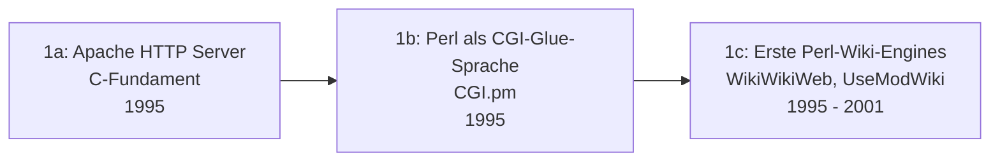

# Evolution und Architekturen digitaler Programmiersprachen für Wissenssysteme

Welche Programmiersprache eine Wiki-, PKM- oder Docs-Plattform trägt, ist selten Zufall — jede Generation von [Evolution digitaler Wissenssysteme](evolution-digitaler-wissenssysteme.md) griff zu der Sprache, deren technische Eigenschaften am besten zum jeweiligen Architekturproblem passten: Perls Textverarbeitungsstärke für zustandslose CGI-Skripte, PHPs eingebettete HTML-Verzahnung für Shared-Hosting-taugliche LAMP-Wikis, Javas Enterprise-Ökosystem für Rechte- und Integrationsanforderungen, Pythons Lesbarkeit für Docs-as-Code, JavaScript/TypeScript als isomorpher Vollstack für moderne PKM-Web-Apps und schließlich Rust für Speichersicherheit unter Performance-Last. Dieser Artikel ordnet diese **Sprachökosysteme** chronologisch — nicht einzelne Frameworks oder Bibliotheken, die bereits [Evolution und Architekturen digitaler Frameworks & Bibliotheken für Wissenssysteme](evolution-digitaler-wissenssystem-frameworks.md) behandelt, und nicht die Rust-Implementierungsachse im Detail, die eigenständig [Evolution und Architekturen digitaler Rust-Wissenssysteme](evolution-digitaler-rust-wissenssysteme.md) verfolgt. Er ist eine domänenspezifische Vertiefung von [Evolution und Architekturen digitaler Programmiersprachen](../../entwicklung/evolution-digitaler-programmiersprachen.md) mit Fokus auf Wiki-/PKM-/Docs-Werkzeuge statt allgemeiner Paradigmen-Geschichte.

!!! note "Hinweis: Sprachen koexistieren, statt sich sauber abzulösen"
    Die Zeiträume sind grobe Orientierung, keine scharfen Grenzen — PHP (Generation 2) treibt MediaWiki bis heute an, parallel zu Perl-Nachzüglern wie Foswiki (Generation 3) und modernen Rust-Kernen (Generation 6). Keine Generation verdrängt die vorherige vollständig; oft koexistieren mehrere Sprachgenerationen jahrzehntelang im selben Ökosystem, wie das Beispiel Foswiki (Perl, 2008 als Fork von TWiki) neben den Java-Systemen derselben Generation zeigt.

---

## Generation 1: Perl & C — CGI-Skriptsprachen der Pionierzeit, 1995 – 2001

Die Gründergeneration eint zwei komplementäre Rollen: **C** trägt den Webserver-Prozess selbst, **Perl** übernimmt die eigentliche Wiki-Logik als austauschbares CGI-Skript darüber. Sie lässt sich in drei technologische Entwicklungsstufen unterteilen:

### 1a. Apache HTTP Server — das C-Fundament, 1995

- **Architektur:** der **Apache HTTP Server** (1995, in C geschrieben) übernimmt die eigentliche HTTP-Kommunikation; jede Wiki-Anfrage startet über das Common Gateway Interface (CGI) einen eigenen Skript-Prozess.
- **Sprachwahl-Logik:** C liefert die für einen dauerhaft laufenden Server nötige Geschwindigkeit und geringe Ressourcenlast — direkte Systemnähe statt einer für den Serverprozess selbst zu langsamen Skriptsprache. Vertiefung: [C in der Praxis](../../entwicklung/system/c-praxis.md).

### 1b. Perl als CGI-Glue-Sprache, 1995

- **Architektur:** **Perl** (Larry Wall, erste stabile Version 1987, Perl 5 ab 1994) etabliert sich als bevorzugte Sprache für die CGI-Skripte selbst — **CGI.pm** (Lincoln Stein, 1995) wird zur De-facto-Standardbibliothek für Formularverarbeitung und HTTP-Header.
- **Sprachwahl-Logik:** Perls native Stärke in regulären Ausdrücken und Textverarbeitung passt exakt zum Kernproblem eines Wikis — Text parsen, umformatieren, wieder ausgeben. Seine „There's more than one way to do it"-Philosophie erlaubt schnelles Prototyping ohne die strukturellen Vorgaben späterer Sprachen.

### 1c. Erste Perl-Wiki-Engines, 1995 – 2001

- **Architektur:** konkrete Wiki-Implementierungen auf Perl/CGI-Basis, siehe [Generation 1a der Wissenssysteme-Zeitachse](evolution-digitaler-wissenssysteme.md#1a-die-pioniere-textdateien-einfachheit-1995-ca-2001).
- **Vertreter:** **WikiWikiWeb** (1995, Ward Cunningham, in Perl), **UseModWiki** (2000, Clifford Adams).

---

## Generation 2: PHP — die LAMP-Stack-Ära, 2001 – 2008

PHP löst Perl als dominante Wiki-Sprache ab, indem es ein zentrales Reibungsproblem der Vorgängergeneration löst: Statt Skript und HTML-Ausgabe strikt zu trennen, **bettet PHP sich direkt in HTML-Dateien ein** — Code und Markup leben im selben Quelltext.

**Architektur:** Shared-Nothing-Ausführungsmodell (jede Anfrage startet mit sauberem Speicherzustand, kein Prozess-übergreifender Zustand), enge native Integration mit MySQL, breite Verfügbarkeit auf günstigem Shared-Hosting ohne Root-Zugriff.

**Sprachwahl-Logik:** PHPs eingebettetes HTML-Modell senkt die Einstiegshürde gegenüber Perls striktem CGI-Skript-Modell drastisch, und die massenhafte Verfügbarkeit von PHP/MySQL-Shared-Hosting macht Wiki-Betrieb erstmals für Einzelpersonen und kleine Communities praktikabel, ohne einen eigenen Server zu verwalten.

| System | Jahr | Rolle |
|---|---|---|
| **MediaWiki** | 2002 | Das System hinter Wikipedia — siehe [Evolution und Architekturen von MediaWiki](mediawiki/evolution-digitaler-mediawiki.md) für die eigene, PHP-zentrierte Versionsgeschichte. |
| **DokuWiki** | 2004 | Dateibasiert statt datenbankgestützt, dennoch PHP-basiert — zeigt, dass PHPs Vorteil (eingebettetes HTML, einfaches Hosting) unabhängig von der Speicherarchitektur gilt. |
| **TikiWiki** | 2002 | PHP-basierte Wiki-Engine mit breitem Feature-Umfang bereits in dieser frühen Phase. |

---

## Generation 3: Java & Perl-Nachzügler — Enterprise-Wikis, 2002 – 2015

Enterprise-Anforderungen (LDAP/Active-Directory-Integration, Servlet-Container, langlebige, große Codebasen) verschieben die Sprachwahl zu **Java** — jedoch ohne Perl vollständig zu verdrängen, wie der parallele Perl-Strang dieser Generation zeigt.

**Architektur:** JVM-Bytecode statt interpretiertem Skript, statische Typisierung für große, langlebig gepflegte Codebasen, reife Enterprise-Bibliotheken (Hibernate-ORM, LDAP-Clients, Servlet-Spezifikation).

**Sprachwahl-Logik:** Javas „Write once, run anywhere"-Versprechen und sein Ökosystem an Enterprise-Middleware passen zu heterogenen Unternehmens-IT-Landschaften, die statische Typsicherheit bei mehrjähriger Wartung durch wechselnde Entwicklerteams schätzen — ein anderes Anforderungsprofil als das schnelle Prototyping der Generationen 1/2.

| System | Sprache | Jahr | Besonderheit |
|---|---|---|---|
| **XWiki** | Java | 2003 | Enterprise-orientiertes Java-Wiki mit strukturierten Datenfeldern, siehe [XWiki installieren](xwiki/installieren.md). |
| **Atlassian Confluence** | Java | 2004 | WYSIWYG-getriebenes Enterprise-Wiki, tief in die übrige Atlassian-Java-Suite integriert. |
| **Foswiki** | Perl | 2008 | Fork von **TWiki** (1998, ebenfalls Perl) — zeigt, dass Perl-Wikis parallel zur Java-Welle weiterleben, statt von ihr abgelöst zu werden. |

---

## Generation 4: Python & Ruby — Skriptsprachen-Vielfalt der Docs-as-Code-Ära, 2005 – 2020

Mit dem Aufkommen von Docs-as-Code (vgl. [Evolution und Architekturen digitaler Docs-as-Code](evolution-digitaler-docs-as-code.md)) verschiebt sich die Sprachwahl erneut — weg von Enterprise-Java, hin zu Skriptsprachen mit Fokus auf Lesbarkeit und schnelle Konfiguration statt Laufzeit-Performance.

**Architektur:** Build-Zeit-Generierung statt dauerhaft laufendem Server, YAML-/Konfigurationsdatei-getriebene Steuerung statt Code-lastiger Anpassung.

**Sprachwahl-Logik:** Python punktet mit Lesbarkeit und einem bereits vorhandenen wissenschaftlich-technischen Ökosystem — nicht zufällig entstand Sphinx ursprünglich für Pythons eigene Dokumentation. Ruby bringt seine „Convention over Configuration"-Philosophie (vgl. [Generation 1a der Batteries-Included-Zeitachse](../../entwicklung/webentwicklung/evolution-digitaler-batteries-included-frameworks.md#1a-ruby-on-rails-convention-over-configuration-2004)) in die Docs-Welt ein.

| System | Sprache | Jahr | Besonderheit |
|---|---|---|---|
| **Sphinx** | Python | 2008 | Ursprünglich für die Python-Dokumentation selbst entwickelt, siehe [Generation 2 der Docs-as-Code-Zeitachse](evolution-digitaler-docs-as-code.md#generation-2-sphinx-die-geburt-des-eigentlichen-docs-as-code-workflows-2008-2014). |
| **MkDocs** | Python | 2014 | YAML-konfigurierter Generator — auch die technische Basis dieses Repositories vor der Umstellung auf Zensical. |
| **Jekyll** | Ruby | 2008 | Nativ von GitHub Pages gehostet, senkt die Hosting-Hürde auf nahezu null. |

---

## Generation 5: JavaScript/TypeScript & Clojure — Vollstack- und funktionale Sprachen moderner PKM-Web-Apps, ab 2012

Moderne PKM-Werkzeuge (vgl. [Generation 2/3 der Wissenssysteme-Zeitachse](evolution-digitaler-wissenssysteme.md#generation-2-workspace-kollaborations-docs-as-code-plattformen-ca-2015-2021)) bevorzugen eine einzige Sprache über den gesamten Stack hinweg — sowie, als funktionale Nische mit klarem architektonischen Vorteil für Graph-Daten, Clojure/ClojureScript.

**Architektur:** dieselbe Sprache im Browser und auf dem Server (Node.js), Event-Loop-Concurrency statt Thread-per-Request, npm als geteiltes Paket-Ökosystem für Frontend und Backend.

**Sprachwahl-Logik:** JavaScript/TypeScript eliminiert den Kontextwechsel zwischen Frontend- und Backend-Sprache, den Generation 3 (Java-Server, separates JS-Frontend) noch erforderte — ein direkter Produktivitätsgewinn für kleine Teams, die ganze PKM-Produkte bauen. Clojures unveränderliche Datenstrukturen und eingebaute Datalog-Abfragen passen ungewöhnlich gut zum Graph-/Backlink-Datenmodell von Zettelkasten-artigen PKM-Tools.

| System | Sprache | Jahr | Besonderheit |
|---|---|---|---|
| **Wiki.js** | Node.js/JavaScript | 2016 | Git-basierte, moderne Wiki-Engine mit SPA-Frontend, siehe [Generation 2 der Wissenssysteme-Zeitachse](evolution-digitaler-wissenssysteme.md#generation-2-workspace-kollaborations-docs-as-code-plattformen-ca-2015-2021). |
| **Outline** | TypeScript | 2017 | Statische Typisierung über den gesamten Node.js/React-Stack hinweg — reduziert Laufzeitfehler in größeren Codebasen gegenüber reinem JavaScript. |
| **Logseq** | ClojureScript | 2020 | Nutzt **Datascript** (eine In-Browser-Datalog-Datenbank in Clojure) als Kern des integrierten Wissensgraphen — funktionale, unveränderliche Datenstrukturen passen direkt zum Backlink-Datenmodell, siehe [Generation 3 der Wissenssysteme-Zeitachse](evolution-digitaler-wissenssysteme.md#generation-3-bidirektionale-wissensgraphen-real-time-block-editoren-pkm). |

---

## Generation 6: Rust — Speichersicherheit unter Performance-Last, ab 2015

Die jüngste Generation bringt Speichersicherheit **ohne Garbage Collector** in performancekritische Bausteine von Wissenssystemen — Suche, Vektordatenbanken, CRDT-Synchronisation und zuletzt Build-Engines. Eine eigene, vollständige Generationen-Zeitachse für diese Sprachachse bietet [Evolution und Architekturen digitaler Rust-Wissenssysteme](evolution-digitaler-rust-wissenssysteme.md).

**Sprachwahl-Logik:** Rusts Ownership-Modell garantiert Speichersicherheit zur Kompilierzeit statt durch Laufzeit-Garbage-Collection — entscheidend für latenzkritische Systeme wie Vektorsuche oder Echtzeit-CRDT-Sync, wo GC-Pausen direkt spürbar wären. Rust läuft dabei meist unsichtbar hinter einer Python-, JavaScript- oder Web-Oberfläche, statt als eigenständig sichtbare Endnutzer-Sprache aufzutreten. Vertiefung zur Sprache selbst: [Rust in der Praxis](../../entwicklung/system/rust-praxis.md).

!!! tip "Bezug zu diesem Repository"
    Wissen Ahrensburg wird mit **Zensical** gebaut — einer Hybrid-Build-Engine aus Rust-Kern (Generation 6) und Python-Konfigurationsschicht (Erbe von Generation 4), siehe [Generation 6 der Rust-Wissenssysteme-Zeitachse](evolution-digitaler-rust-wissenssysteme.md#generation-6-rust-im-kern-ki-nativer-docs-as-code-plattformen-ab-2025).

---

## Alternative Sortier- & Klassifikationskriterien für Wissenssystem-Programmiersprachen

Neben dem chronologischen Generationenmodell lassen sich diese Sprachen nach folgenden Dimensionen einordnen:

### 1. Typsystem

- **Dynamisch typisiert** — Perl, PHP, Python, JavaScript (Generation 1, 2, 4, 5): schnelleres Prototyping, Typfehler erst zur Laufzeit sichtbar.
- **Statisch typisiert** — Java, TypeScript, Rust (Generation 3, 5, 6): Fehler bereits zur Kompilierzeit, besser geeignet für große, langlebige Codebasen.

### 2. Ausführungsmodell

- **Interpretiert, Shared-Nothing pro Anfrage** — Perl/CGI, PHP (Generation 1–2): kein Prozess-übergreifender Zustand, einfaches horizontales Skalieren.
- **Dauerhaft laufender Prozess/VM** — Java (Generation 3), Node.js (Generation 5): Zustand im Speicher zwischen Anfragen, höherer Durchsatz bei geringerer Kaltstartzeit.
- **Kompiliert zu nativem Code ohne Laufzeitumgebung** — Rust (Generation 6): keine VM-/Interpreter-Overhead, vorhersagbare Latenz.

### 3. Deployment-Modell

- **Shared-Hosting-tauglich** — PHP läuft auf praktisch jedem günstigen Webhosting-Paket ohne Root-Zugriff (Generation 2).
- **Application-Server/Container** — Java benötigt einen Servlet-Container oder Application-Server (Generation 3).
- **Einzelne Binärdatei** — Rust-Werkzeuge wie Zola oder Ripgrep benötigen keine Laufzeitabhängigkeiten, siehe [Generation 1c der Rust-Wissenssysteme-Zeitachse](evolution-digitaler-rust-wissenssysteme.md#1c-tantivy-zola-such-engine-und-static-site-generator-2017-2018).

### 4. Concurrency-Modell

- **Ein Prozess pro Anfrage** — klassisches CGI (Generation 1).
- **Thread-per-Request** — JVM-Application-Server (Generation 3).
- **Event-Loop/Single-Threaded async** — Node.js (Generation 5).
- **Ownership-basiert, datenrennfrei zur Kompilierzeit** — Rust mit Tokio-Async-Runtime (Generation 6).

---

## Verwandte Themen

- [Evolution und Architekturen digitaler Programmiersprachen](../../entwicklung/evolution-digitaler-programmiersprachen.md) — übergeordnetes, paradigmenorientiertes Generationenmodell, dessen Wissenssysteme-Perspektive dieser Artikel vertieft
- [Evolution und Architekturen digitaler Wissenssysteme](evolution-digitaler-wissenssysteme.md) — übergeordnetes, produktorientiertes Generationenmodell, dessen Sprachwahl je Generation dieser Artikel vertieft
- [Evolution und Architekturen digitaler Frameworks & Bibliotheken für Wissenssysteme](evolution-digitaler-wissenssystem-frameworks.md) — Nachbarachse auf Framework-/Bibliotheksebene statt Sprachebene
- [Evolution und Architekturen digitaler Rust-Wissenssysteme](evolution-digitaler-rust-wissenssysteme.md) — vertiefendes Generationenmodell speziell für Generation 6 dieses Artikels
- [Evolution und Architekturen digitaler Docs-as-Code](evolution-digitaler-docs-as-code.md) — Python-/Ruby-Systeme aus Generation 4 dieses Artikels im Produktkontext
- [Evolution und Architekturen von MediaWiki](mediawiki/evolution-digitaler-mediawiki.md) — vertiefende Produktgeschichte zu PHP als Sprache aus Generation 2 dieses Artikels
- [Evolution und Architekturen digitaler PKM-Wissensgraphen & Block-Editoren](evolution-digitaler-pkm-wissensgraphen.md) — Logseq und weitere Produkte aus Generation 5 dieses Artikels im Produktkontext
- [Evolution und Architekturen digitaler Batteries-Included-Web-Frameworks](../../entwicklung/webentwicklung/evolution-digitaler-batteries-included-frameworks.md) — Rubys „Convention over Configuration"-Philosophie aus Generation 4 dieses Artikels, dort sprachübergreifend vertieft
- [C in der Praxis](../../entwicklung/system/c-praxis.md) — Vertiefung zu Generation 1a dieses Artikels
- [Rust in der Praxis](../../entwicklung/system/rust-praxis.md) — Vertiefung zu Generation 6 dieses Artikels
- [Evolution und Architekturen digitaler Enterprise-Programmiersprachen](../../entwicklung/evolution-digitaler-enterprise-programmiersprachen.md) — analoges Sprachökosystem-Generationenmodell für allgemeine Unternehmenssoftware statt Wissenssysteme im Speziellen
- [Evolution und Architekturen digitaler Enterprise-Web-Frameworks](../../entwicklung/webentwicklung/evolution-digitaler-enterprise-webframeworks.md) — isomorphe Sprachkonsolidierung (Generation 5 dieses Artikels) als verwandtes Prinzip bei Blazor/Vaadin
