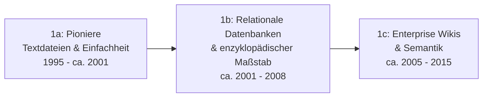

# Evolution und Architekturen digitaler Wissenssysteme

Digitale Wissenssysteme lassen sich nicht nur nach Produktnamen, sondern nach **technologischen Generationen** ordnen: von den ersten Flat-File-Wikis über relationale Enzyklopädie-Systeme und Docs-as-Code-Plattformen bis zu bidirektionalen Wissensgraphen, RAG-gestützten und schließlich autonomen Multi-Agenten-Ökosystemen. Dieses Kapitel gibt den historischen Überblick; die praktische LLM-Nachrüstung konkreter Systeme behandeln [Klassische Wiki-Systeme mit LLM-Integration](klassische-wiki-systeme-llm-integration.md) und [Klassische Wissensmanagement-, KB- & CMS-Systeme mit LLM-Integration](klassische-wissensmanagement-cms-llm-integration.md).

!!! note "Hinweis: Generationen überlappen sich"
    Die Zeiträume sind grobe Orientierung, keine scharfen Grenzen — MediaWiki (Generation 1b) wird z. B. bis heute produktiv weiterentwickelt, parallel zu Generation-5/6-Systemen. Entscheidend ist die **Architektur**, nicht allein das Erscheinungsjahr.

---

## Generation 1: Wiki-Systeme — zentrale Textdokumentation, Versionierung, manuelle Verlinkung

Die namensgebende erste Generation eint drei Prinzipien: ein **zentraler Textbestand**, **Versionierung** jeder Änderung (Edit-Historie) und **manuelle Verlinkung** einzelner Seiten untereinander (Wikilinks statt automatischer Graph-Bildung). Sie lässt sich in drei technologische Entwicklungsstufen unterteilen — eine tiefergehende Betrachtung dieser Architekturlinie bis zu KI-agentengestützter Wiki-Pflege in der Gegenwart bietet [Evolution und Architekturen digitaler Wiki-Engines](evolution-digitaler-wiki-engines.md):

### 1a. Die Pioniere (Textdateien & Einfachheit), 1995 – ca. 2001

- **Architektur:** Perl-/C-CGI-Skripte, speicherbasiert auf Flat-Files (reine Textdateien im Dateisystem).
- **Fokus:** Minimalismus, radikale Offenheit, einfache Syntax (CamelCase für Links), keine Nutzerverwaltung.
- **Vertreter:** WikiWikiWeb (Ward Cunningham), UseModWiki.

### 1b. Relationale Datenbanken & Enzyklopädischer Maßstab, ca. 2001 – 2008

- **Architektur:** Klassischer LAMP-Stack (PHP/Perl/Python mit MySQL/PostgreSQL).
- **Fokus:** Skalierbarkeit, granulare Rechte- und Versionsverwaltung, Kategoriensysteme, Diskussionsseiten, Vorlagen/Parser-Hooks.

| System | Speicher | Besonderheit |
|---|---|---|
| **MediaWiki** | PostgreSQL, MySQL, SQLite | Das System hinter Wikipedia; robust für riesige Enzyklopädien. Siehe [MediaWiki installieren](mediawiki/index.md). |
| **DokuWiki** | Dateibasiert | Ohne Datenbank, wartungsarm und schnell eingerichtet — dateibasierte Ausnahme dieser Ära. |
| **TikiWiki, TWiki** | MySQL/PostgreSQL | Frühe LAMP-basierte Wiki-Engines mit breitem Feature-Umfang. |

### 1c. Enterprise Wikis & Semantik, ca. 2005 – 2015

- **Architektur:** Java- (JVM) oder .NET-Stacks, strukturierte relationale Datenbanken, semantische Graphen.
- **Fokus:** WYSIWYG-Editoren, tiefgreifende Rechtekonzepte (LDAP/Active Directory), semantische Metadaten (Attribute, Relationen), Plugin-Ökosysteme für Unternehmensprozesse.

| System | Speicher | Besonderheit |
|---|---|---|
| **XWiki** | PostgreSQL, MySQL, H2 | Enterprise-orientiertes Java-Wiki mit strukturierten Datenfeldern. Siehe [XWiki installieren](xwiki/installieren.md). |
| **Atlassian Confluence** | relationale DB | WYSIWYG-getriebenes Enterprise-Wiki mit Rovo/Atlassian Intelligence. |
| **Semantic MediaWiki** | wie MediaWiki + Tripel | Semantik-Erweiterung von MediaWiki, siehe [Semantisches MediaWiki](semantische-mediawiki/installieren.md). |
| **Foswiki** | relationale DB / Plugins | Semantik- und plugin-getriebenes Enterprise-Wiki (TWiki-Fork). |

---

## Generation 2: Workspace-, Kollaborations- & Docs-as-Code-Plattformen (ca. 2015 – 2021)

Zwei Strömungen verschmelzen: die Organisation hierarchischer Dokumente mit Rich-Text bzw. Markdown, modularen Blöcken und Berechtigungsmanagement (Open-Source-Alternativen zu Confluence/Notion) — sowie Docs-as-Code-Tooling mit Trennung von Inhalt und Layout, Git-Versionierung und API-first-Ansatz. Eine eigene, tiefergehende Generationen-Zeitachse speziell für Docs-as-Code — von frühen Man-Pages über Sphinx bis zu agentisch gepflegten Docs — bietet [Evolution und Architekturen digitaler Docs-as-Code](evolution-digitaler-docs-as-code.md).

**Architektur:** Node.js, Go, Rust oder Python; Markdown-/Rich-Text-zentriert; oft Git-basiert; Single Page Applications (Vue/React-Frontends); moderne REST/GraphQL-Schnittstellen.

| System | Prinzip |
|---|---|
| **BookStack** | Organisation nach dem Buch-Schema (Bücherregale > Bücher > Kapitel > Seiten). |
| **Outline** | Minimalistischer, moderner Rich-Text-Editor mit Markdown-Unterstützung und Teamfokus. |
| **Wiki.js / Gollum** | Git-basierte, moderne Wiki-Engines mit Markdown-Fokus und SPA-Frontends. Siehe [Wiki.js native Linux-Installation](wikijs-linux-installation.md). |

---

## Generation 3: Bidirektionale Wissensgraphen & Real-time Block-Editoren (PKM)

*Zeitraum: ab ca. 2020.* Nicht-lineare Wissensnetze mit Backlinks, Tag-Taxonomien und Graph-Visualisierungen („Zettelkasten-Prinzip"), verschmolzen mit Echtzeit-Block-Editoren auf CRDT-Basis. Eine eigene, tiefergehende Generationen-Zeitachse speziell für diese Architekturlinie — von Hypertext-Vorläufern über Roam Research bis zu KI-nativen Canvas-Systemen — bietet [Evolution und Architekturen digitaler PKM-Wissensgraphen & Block-Editoren](evolution-digitaler-pkm-wissensgraphen.md).

**Architektur:** Lokale Markdown-Tresore (Local-First), CRDTs (Conflict-free Replicated Data Types) für Echtzeit-Kollaboration, Block-Datenmodelle (JSON-Blöcke statt Fließtext), Offline-First.

| System | Prinzip |
|---|---|
| **Logseq** | Dateibasiertes Outliner-System auf Markdown- und Org-Mode-Basis mit integriertem Wissensgraphen. |
| **Foam / Dendron** | VS-Code-Erweiterungen für hierarchisches Wissensmanagement direkt im Code-Editor. |
| **SilverBullet** | Webbasierter, erweiterbarer Markdown-Notizblock mit integrierter Abfragesprache. |
| **Notion / Obsidian** | Bidirektionale Verlinkung, interaktive Graphansichten, datenbankähnliche Tabellenansichten pro Seite. |
| **AppFlowy** | Lokale, datenschutzfreundliche Alternative zu Notion mit Tabellen, Boards und CRDT-Sync. |

Vertiefend zu dieser Generation: [Personal Knowledge Management (PKM) & Second Brain](pkm-second-brain-methoden.md).

---

## Generation 4: Semantische & RAG / KI-unterstützte Wissenssysteme

Wissensnetze mit maschinenlesbarer Semantik, Vektorspeichern und lokaler LLM-Integration (RAG). Eine eigene, tiefergehende Generationen-Zeitachse speziell für diese Architekturlinie — von Semantic-Web-Wissensgraphen über Vektordatenbanken bis zu GraphRAG — bietet [Evolution und Architekturen digitaler Semantischer & RAG-Wissenssysteme](evolution-digitaler-semantische-rag-wissenssysteme.md).

| System | Prinzip |
|---|---|
| **Apache Jena / Blazegraph** | Triplestores für RDF- und SPARQL-basierte Ontologien. |
| **AFFiNE** | All-in-One-Workspace mit integrierter KI-gestützter Wissensverknüpfung und Whiteboard. |
| **AnythingLLM / Dify** | Open-Source-Tools, die Dokumentenarchive über Vektordatenbanken für semantische Such- und Frage-Antwort-Workflows erschließen. Siehe [AnythingLLM](anythingllm-rag-plattform.md) und [Dify](dify-agenten-workflow-plattform.md). |

Vertiefend zu dieser Generation: [Wissensdatenbanken mit KI & semantischer Suche](wissensdatenbanken-ki-semantische-suche.md).

---

## Generation 5: Visuelle, Local-First & Autonome/Agentische Wissenssysteme

Zukunftsorientierte Wissensarchitekturen mit unendlichen Whiteboard-Canvases, end-to-end verschlüsselter CRDT-Kollaboration und aktiven KI-Agenten. Eine eigene, tiefergehende Generationen-Zeitachse speziell für diese drei Architektur-Stränge — von frühen Mindmaps über CRDT-Forschung und das Local-First-Manifest bis zu agentischen Gedächtnissystemen — bietet [Evolution und Architekturen digitaler Visueller, Local-First & Agentischer Wissenssysteme](evolution-digitaler-visuell-agentische-wissenssysteme.md).

| System | Prinzip |
|---|---|
| **Anytype / Logseq DB** | Local-First, Peer-to-Peer verknüpfte Datenobjekte mit CRDTs. |
| **Heptabase / Obsidian Canvas** | Räumliches & visuelles Wissensmanagement auf unendlichen Zeichenflächen (Infinite Canvas). |
| **MemGPT (Letta) / Agentic Memory Systems** | Kontinuierlich selbstaktualisierende Wissensspeicher für autonome KI-Agenten mit Langzeitgedächtnis. |

---

## Generation 6: Multimodale & Selbstorganisierende Multi-Agenten-Wissensökosysteme

Wissenssysteme, in denen autonome Agenten-Schwärme Inhalte nicht nur abrufen, sondern eigenständig recherchieren, verifizieren, verknüpfen und die Wissensbasis kontinuierlich pflegen – oft multimodal (Text, Sprache, Video) und werkzeugnutzend. Eine eigene, tiefergehende Generationen-Zeitachse speziell für die Orchestrierung dieser Agenten — von regelbasierten Einzel-Bots über koordinierte Multi-Agenten-Frameworks bis zu multimodalen Schwarm-Ökosystemen — bietet [Evolution und Architekturen digitaler Multi-Agenten-Wissensökosysteme](evolution-digitaler-multiagenten-wissensoekosysteme.md).

| System | Prinzip |
|---|---|
| **GraphRAG-Systeme** (Microsoft GraphRAG, LlamaIndex Property Graphs) | LLM-generierte Wissensgraphen aus unstrukturierten Textkorpora für kontextreiches Retrieval. |
| **Tana** | Supertag-basiertes PKM mit KI-gestützten, strukturierten Abfragen über verknüpfte Wissensobjekte. |
| **Autonome Recherche- & Dokumentations-Agenten** (Multi-Agenten-Frameworks auf Basis von Claude Code, OpenAI AgentKit) | Agenten-Teams, die Wissensbasen selbstständig recherchieren, aktualisieren und auf Konsistenz prüfen. |

!!! tip "Bezug zu diesem Repository"
    Dieses Repository selbst folgt keinem Multi-Agenten-Ansatz, nutzt aber bereits Agenten-gestützte Pflege einzelner Wiki-Installationen (siehe [KI strukturiert das Wiki autonom & Selfhosting-Migration](ki-autonome-wiki-strukturierung-selfhosting-migration.md)) sowie das [LLM-Wiki-Pattern (Karpathy-Muster)](llm-wiki-pattern-karpathy.md) für die eigene Doku-Pflege.

---

## Generatoren-Arten für Wissensportale (Static Site & Docs Generators)

Eine quer zu den Generationen liegende Kategorie: Generatoren, die aus Quelltexten (Markdown, ReStructuredText, Code) statische, schnelle Wissensportale kompilieren.

| Generator | Stack | Besonderheit |
|---|---|---|
| **MkDocs** (Material for MkDocs) | Python | Extrem populär für technische Dokumentation mit Markdown. |
| **Docusaurus** | React (Node.js) | Dokumentationsframework von Meta mit Versionierung und MDX-Unterstützung. |
| **Astro Starlight** | Astro (Node.js) | Performance-fokussiert, Barrierefreiheit und schnelle Ladezeiten. |
| **Sphinx** | Python | Starke Unterstützung für reStructuredText und API-Code-Analysen. |
| **Hugo** | Go | Extrem schneller Generator für große Dokumentationsmengen. |

!!! note "Zensical statt MkDocs in diesem Repository"
    Wissen Ahrensburg wird mit **Zensical** gebaut, dem Nachfolger von MkDocs + Material (liest `mkdocs.yml` nativ) — siehe `CLAUDE.md`. Die Static-Build/Read-Only-Publish-Logik dieser Generatoren-Kategorie gilt damit unmittelbar auch für dieses Repository. Zensicals Build-Engine kombiniert Rust und Python — Details dazu und zu weiteren Rust-Bausteinen in Wissenssystemen bietet [Evolution und Architekturen digitaler Rust-Wissenssysteme](evolution-digitaler-rust-wissenssysteme.md).

---

## Alternative Sortier- & Klassifikationskriterien für Wissenssysteme

Neben dem chronologischen/technologischen Generationenmodell lassen sich Wissenssysteme nach folgenden Dimensionen einordnen:

### 1. Speicherarchitektur

- **Dateibasiert / Git-native** — Flat Markdown/Org-Files in Ordnern, z. B. DokuWiki, Obsidian, Logseq.
- **Relationale / Graph-Datenbank** — SQL, Neo4j, Triplestores, z. B. MediaWiki, XWiki, Jena.
- **Vektor- & Hybrid-Speicher** — Embeddings + relational/file, z. B. AnythingLLM, Qdrant/Chroma-Backend.

### 2. Kollaborations- & Synchronisationsmodell

- **Local-First / P2P** — Daten liegen lokal; Sync via CRDTs/E2EE, z. B. Anytype, AppFlowy.
- **Server-Zentriert / Multi-User Cloud** — zentrale Datenbank & Rechtemanagement, z. B. BookStack, Confluence, Outline.
- **Static Build / Read-Only Publish** — lokal gepflegt, als statische Website publiziert, z. B. MkDocs, Docusaurus, Zensical.

### 3. Datenstruktur & Interaktionsmodell

- **Hierarchisch** — Baumstruktur: Ordner/Bücher/Seiten.
- **Netzartig / Graph** — Zettelkasten: Backlinks, Tags, Entitäten.
- **Räumlich / Canvas** — Whiteboard: visuelle Anordnung von Notizen und Verbindungen.
- **Relational / Datenbank-zentriert** — Tabellen, Eigenschaften, Views.

---

## Verwandte Themen

- [Dokumentenerstellung, Wikis & Notebooks](index.md) — Gesamtübersicht aller Dokumentations-Systeme
- [Evolution und Architekturen digitaler Wiki-Engines](evolution-digitaler-wiki-engines.md) — vertiefendes Generationenmodell speziell für Generation 1 dieses Artikels
- [Evolution und Architekturen digitaler Content-Management-Systeme](evolution-digitaler-cms.md) — analoges Generationenmodell für CMS
- [Evolution und Architekturen digitaler Docs-as-Code](evolution-digitaler-docs-as-code.md) — vertiefendes Generationenmodell speziell für Docs-as-Code-Werkzeuge, Nachfolger von Generation 2 dieses Artikels
- [Evolution und Architekturen digitaler PKM-Wissensgraphen & Block-Editoren](evolution-digitaler-pkm-wissensgraphen.md) — vertiefendes Generationenmodell speziell für Generation 3 dieses Artikels
- [Evolution und Architekturen digitaler Semantischer & RAG-Wissenssysteme](evolution-digitaler-semantische-rag-wissenssysteme.md) — vertiefendes Generationenmodell speziell für Generation 4 dieses Artikels
- [Evolution und Architekturen digitaler Visueller, Local-First & Agentischer Wissenssysteme](evolution-digitaler-visuell-agentische-wissenssysteme.md) — vertiefendes Generationenmodell speziell für Generation 5 dieses Artikels
- [Evolution und Architekturen digitaler Multi-Agenten-Wissensökosysteme](evolution-digitaler-multiagenten-wissensoekosysteme.md) — vertiefendes Generationenmodell speziell für Generation 6 dieses Artikels
- [Evolution und Architekturen digitaler Rust-Wissenssysteme](evolution-digitaler-rust-wissenssysteme.md) — quer zu allen sechs Generationen liegende Implementierungsachse (Rust-Kerne hinter Suche, Vektordatenbanken, CRDT-Sync und Build-Engines)
- [Evolution und Architekturen digitaler LMS](../e-learning/evolution-digitaler-lms.md) — analoges Generationenmodell für Lernmanagement-Systeme
- [Evolution und Architekturen digitaler Web-Frameworks](../../entwicklung/webentwicklung/evolution-digitaler-webframeworks.md) — analoges Generationenmodell für Web-Frameworks
- [Evolution und Architekturen digitaler KI-Anwendungen](../../künstliche-intelligenz/evolution-digitaler-ki-anwendungen.md) — analoges Generationenmodell für KI-Anwendungen
- [Klassische Wiki-Systeme mit LLM-Integration](klassische-wiki-systeme-llm-integration.md) — Generation 1 mit nachgerüsteter KI
- [Klassische Wissensmanagement-, KB- & CMS-Systeme mit LLM-Integration](klassische-wissensmanagement-cms-llm-integration.md) — Generation 2 mit nachgerüsteter KI
- [Native „LLM-first" Wiki-Tools & Agenten](llm-first-wiki-tools-agenten.md) — Gegenstück zu Generation 4–6: von Grund auf KI-native Werkzeuge
- [Personal Knowledge Management (PKM) & Second Brain](pkm-second-brain-methoden.md) — Vertiefung zu Generation 3
- [Wissensdatenbanken mit KI & semantischer Suche](wissensdatenbanken-ki-semantische-suche.md) — Vertiefung zu Generation 4
- [LLM-Wiki-Pattern (Karpathy-Muster)](llm-wiki-pattern-karpathy.md) — Architekturmuster für dieses Repository selbst
