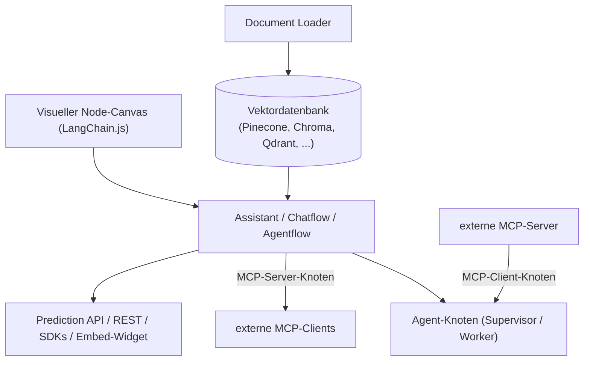

# Flowise: Visueller Flow-Builder für LangChain-Anwendungen

**Flowise** (FlowiseAI) ist ein Open-Source-Werkzeug zum visuellen Bauen von LLM-Anwendungen, KI-Agenten und RAG-Pipelines per Drag-and-Drop — auf Basis von **LangChain.js**. Der Ansatz ähnelt [Dify](dify-agenten-workflow-plattform.md): beide sind visuelle Builder statt reiner Chat-Oberflächen. Der zentrale Unterschied liegt im Fundament — Flowise legt den LangChain-Knoten-Graph offen (LLMs, Document Loader, Vector Stores, Memory-Module, Agents, Tools als einzeln verbundene Blöcke), während Dify eine eigene, stärker gekapselte Workflow-Engine mitbringt.

!!! note "Hinweis: Reines Apache-2.0 für die Community Edition"
    Anders als [Dify](dify-agenten-workflow-plattform.md) (Zusatzklauseln) oder [Open WebUI](open-webui-rag-agenten-plattform.md) (eigene Lizenz mit Branding-Pflicht) steht die **Flowise Community Edition** unter reinem **Apache-2.0** — freie Nutzung, Modifikation, Weiterverbreitung und kommerzieller Einsatz inklusive Patent-Grant, ohne Zusatzbedingungen. Enterprise-Funktionen wie **SSO** und **RBAC** sind dagegen an eine separate, kommerzielle Lizenz gebunden.

---

## Übersicht



---

## Drei Bausteine: Assistant, Chatflow, Agentflow

| Baustein | Einsatzzweck |
|---|---|
| **Assistant** | einsteigerfreundlichster Weg zu einem KI-Agenten: Anweisungen, Tool-Nutzung, RAG-Wissensbasis |
| **Chatflow** | Einzelagenten-Systeme und einfache LLM-Flows, inkl. fortgeschrittener RAG-Techniken (Graph RAG, Reranker, Retriever) |
| **Agentflow** | Obermenge von Chatflow & Assistant — Multi-Agent-Systeme und komplexe Workflow-Orchestrierung |

---

## Agentflow V2: Node-Typen

Agentflow V2 orchestriert Abläufe über spezialisierte Nodes statt über ein externes Framework — mit einem Ausführungs-Queue-System, das definierte Pfade exakt respektiert:

| Node | Funktion |
|---|---|
| **Agent** (Supervisor/Worker) | autonome Einheit mit Reasoning, Planning und Tool-Interaktion; im Supervisor-Worker-Muster delegiert ein übergeordneter Agent Aufgaben an spezialisierte Worker-Agents |
| **Condition** | deterministische Verzweigung über Operatoren wie `equals`, `contains`, `larger` |
| **Condition Agent** | KI-gesteuerte Verzweigung: das LLM ordnet Eingaben natürlichsprachlich definierten Szenarien zu |
| **Loop** | leitet die Ausführung explizit zu einem vorherigen Node zurück, mit konfigurierbarer maximaler Schleifenanzahl |
| **Human Input** | pausiert die Ausführung für eine Nutzerentscheidung, setzt danach fort — vergleichbar mit dem Human-Input-Knoten in [Dify](dify-agenten-workflow-plattform.md#workflow-engine-im-detail) |
| **Execute Flow** | ruft einen anderen Chatflow/Agentflow als Sub-Workflow auf — fördert modulares, wiederverwendbares Design |

---

## Installation

=== "Docker"
    ```bash
    git clone https://github.com/FlowiseAI/Flowise.git
    cd Flowise/docker
    cp .env.example .env
    docker compose up -d
    ```

=== "npm (lokale Entwicklung)"
    ```bash
    npm install -g flowise
    npx flowise start
    ```

!!! tip "Tipp: Produktivbetrieb mit Message Queue"
    Für Produktivlasten läuft Flowise typischerweise mit einer externen Datenbank plus **Message Queue und Worker-Prozessen** für horizontale Skalierung — die einfache Docker-/npm-Installation eignet sich vor allem für Entwicklung und kleinere Deployments.

---

## RAG & Vektordatenbanken

Flowise bindet **100+ Quellen, Tools, Vektordatenbanken und Speichersysteme** nativ an — darunter Pinecone, Chroma und Qdrant (siehe auch [PostgreSQL + pgvector](../daten/datenbanken/pgvector-anleitung.md) als selbst gehostete Alternative). Dokumente werden per Document-Loader-Node eingelesen, in einen Vector-Store-Node eingebettet und stehen anschließend jedem nachgelagerten Chatflow-/Agentflow-Knoten als Retrieval-Quelle zur Verfügung.

---

## MCP-Integration: Client- und Server-Knoten

Wie [Dify](dify-agenten-workflow-plattform.md#mcp-integration-bidirektional) unterstützt Flowise das Model Context Protocol **bidirektional** — als eigene Node-Typen direkt auf dem Canvas platzierbar:

| Node | Richtung | Funktion |
|---|---|---|
| **MCP-Client-Knoten** | eingehend | bindet einen externen MCP-Server als Werkzeug in einen Chatflow/Agentflow ein, inkl. Tool-Listing, SSE-Transport und Auth-Support |
| **MCP-Server-Knoten** | ausgehend | exponiert einen Flow selbst als MCP-Server für externe MCP-Clients (Claude, Cursor, …) |

---

## API & Einbettung

- **Prediction API**: zentraler REST-Endpunkt zum Senden von Nachrichten an einen Flow/Assistant und Empfangen der Antwort — inkl. Streaming, Conversation Memory und Datei-Verarbeitung
- **SDKs**: TypeScript und Python
- **Embed-Widget**: fertiges Chat-Widget zum Einbetten in eigene Webseiten, ohne eigenes Frontend zu bauen

---

## Einordnung gegenüber verwandten Tools

| Kriterium | Flowise | [Dify](dify-agenten-workflow-plattform.md) | [AnythingLLM](anythingllm-rag-plattform.md) | [Onyx](onyx-danswer-rag-plattform.md) |
|---|---|---|---|---|
| Lizenz (Community/Core) | reines Apache-2.0 | Apache-2.0 + Zusatzklauseln | MIT | MIT (Community Edition) |
| Fundament | LangChain.js-Knoten-Graph, offen einsehbar | eigene Workflow-Engine | eigenständige RAG-/Chat-App | eigenständige Such-/RAG-Plattform |
| MCP-Support | bidirektional (Client-/Server-Knoten) | bidirektional (Client und Server) | offiziell, nativ (Client) | offiziell (Client) |
| Enterprise-Gating | SSO/RBAC nur kommerziell | Multi-Tenant-SaaS nur kommerziell | keine Einschränkung (MIT) | RBAC/SSO/SCIM nur Enterprise Edition |
| Typischer Einsatz | Entwickler, die den LangChain-Graph direkt sehen/anpassen wollen | Mehrstufige Automatisierung mit Freigabe-Schritten | Einzelperson/kleines Team ohne Server-Infrastruktur | Unternehmen mit vielen Connectoren |

!!! tip "Tipp: Flowise vs. Dify"
    Beide lösen ein ähnliches Problem visuell — die Entscheidung ist oft Geschmackssache: **Flowise**, wenn der LangChain.js-Unterbau direkt sichtbar und erweiterbar sein soll (z. B. für Entwickler, die bereits mit LangChain arbeiten); **Dify**, wenn eine stärker gekapselte, produktreifere Oberfläche mit eigenem App-Typ-Konzept (Chatbot/Text-Generator/Agent/Workflow) bevorzugt wird.

---

## Verwandte Themen

- [Startseite](../../index.md) — zurück zur Dokumentations-Zentrale
- [Dokumentenerstellung, Wikis & Notebooks](index.md) — Gesamtübersicht aller Dokumentations-Systeme
- [Dify: Visuelle Agenten- & Workflow-Plattform](dify-agenten-workflow-plattform.md) — engster Vergleich, ebenfalls visueller Workflow-Builder
- [AnythingLLM: All-in-One Desktop- & Docker-RAG-Plattform](anythingllm-rag-plattform.md) — leichtgewichtigere Alternative ohne Flow-Builder
- [Beste MCP-Server (Top 20)](../../künstliche-intelligenz/coding/mcp-server-topliste.md) — Einordnung der MCP-Knoten von Flowise im Vergleich
- [PostgreSQL + pgvector](../daten/datenbanken/pgvector-anleitung.md) — selbst gehostete Vektordatenbank-Alternative zu Pinecone/Chroma/Qdrant
- [Multi-LLM- & Sprachmodell-Anbieter im Vergleich](../../künstliche-intelligenz/coding/llm-anbieter-vergleich.md) — Preise der von Flowise unterstützten Modell-Provider
