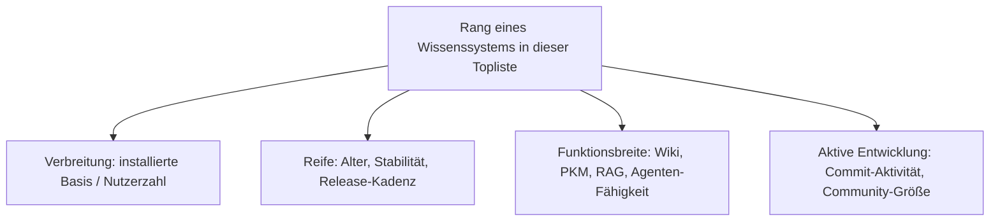
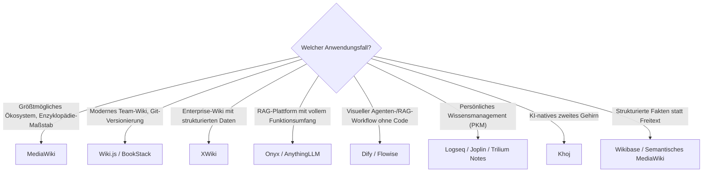

# Die führenden Open-Source-Wissenssysteme 2026 — Top-20-Topliste

Die [Evolution und Architekturen digitaler Wissenssysteme](evolution-digitaler-wissenssysteme.md) ordnet Wissenssysteme chronologisch nach Generationen, die [Top-20-Topliste mit MCP-Server](wissensmanagement-mcp-server-topliste.md) filtert eng nach Agenten-Anbindung. Diese Seite nimmt eine dritte, breitere Perspektive ein: Sie rankt die **20 Open-Source-Wissenssysteme mit der größten Verbreitung und Reife im Jahr 2026** — quer über Wiki, PKM/Notizen, RAG-Plattform und Agenten-Workflow-Werkzeug hinweg, unabhängig davon, ob ein MCP-Server vorhanden ist.

!!! note "Hinweis: Nur OSI-anerkannte Lizenzen"
    Wie in der [Gesamtübersicht](open-source-llm-agent-mcp-systeme.md) zählen hier nur Systeme unter einer OSI-anerkannten Open-Source-Lizenz (MIT, GPL, LGPL, AGPL, BSD). Source-available-Sonderfälle wie Outline (BSL) oder Open WebUI (eigene Lizenz mit Branding-Pflicht) stehen separat unten — konsistent mit der Handhabung in der [MCP-Topliste](wissensmanagement-mcp-server-topliste.md#lizenz-sonderfall).

---

## Bewertungskriterien

!!! warning "Achtung: Momentaufnahme, Stand August 2026"
    Verbreitungs- und Aktivitätswerte verändern sich in diesem Marktsegment schnell — insbesondere bei den jüngeren RAG-/Agenten-Plattformen (Rang 6–9, 14–16). Vor einer Entscheidung aktuelle GitHub-Stars, Release-Historie und Roadmap des jeweiligen Projekts prüfen.

---

## Top 20 im Überblick

| Rang | System | Kategorie | Lizenz | Seit | Besondere Stärke |
|---|---|---|---|---|---|
| 1 | **[MediaWiki](mediawiki/evolution-digitaler-mediawiki.md)** | Wiki | GPL-2.0 | 2002 | Größte installierte Basis aller Wiki-Systeme weltweit — trägt Wikipedia |
| 2 | **[Wiki.js](klassische-wiki-systeme-llm-integration.md)** | Wiki | AGPL-3.0 | 2016 | Git-basierte Versionierung, moderne SPA-Oberfläche, aktive Weiterentwicklung |
| 3 | **[XWiki](xwiki/installieren.md)** | Wiki | LGPL-2.1 | 2003 | Strukturierte Datenfelder, tiefe Enterprise-Integration (LDAP, SSO) |
| 4 | **DokuWiki** | Wiki | GPL-2.0 | 2004 | Dateibasiert ohne Datenbank, extrem einfaches Hosting & Backup |
| 5 | **BookStack** | Wiki/Doku | MIT | 2015 | Bücher/Kapitel/Seiten-Hierarchie, sehr niedrige Einstiegshürde |
| 6 | **[Onyx](onyx-danswer-rag-plattform.md)** (ehem. Danswer) | RAG/Wissensmanagement | MIT (Community Edition) | 2023 | 50+ Connectoren, übernimmt Zugriffsrechte aus Quellsystemen |
| 7 | **[AnythingLLM](anythingllm-rag-plattform.md)** | RAG/Wissensmanagement | MIT | 2023 | Vollständig lokal via Ollama betreibbar, sehr geringe Einstiegshürde |
| 8 | **[Dify](dify-agenten-workflow-plattform.md)** | Agenten-Workflow-Plattform | Apache-2.0 | 2023 | Visueller Workflow-Builder für RAG- und Agenten-Pipelines |
| 9 | **[Flowise](flowise-visueller-flow-builder.md)** | Agenten-Workflow-Plattform | Apache-2.0 | 2023 | No-Code-Flow-Builder direkt auf LangChain aufgesetzt |
| 10 | **Logseq** | PKM/Outliner | AGPL-3.0 | 2020 | Blockbasierter Wissensgraph mit Datalog-Abfragen (Datascript) |
| 11 | **Joplin** | PKM/Notizen | MIT | 2016 | Eingebaute REST-API, Ende-zu-Ende-Verschlüsselung, breite Plattformabdeckung |
| 12 | **Trilium Notes** | PKM/hierarchische Notizen | AGPL-3.0 | 2017 | Sehr mächtiges hierarchisches Notizmodell mit Skripting-Unterstützung |
| 13 | **AFFiNE** | Wissensmanagement/Whiteboard | MIT | 2022 | Kombiniert Dokumente, Whiteboards und Datenbanken in einem Tool |
| 14 | **[Khoj](khoj-ki-zweites-gehirn.md)** | PKM/KI-natives „zweites Gehirn" | AGPL-3.0 | 2021 | Von Grund auf für LLM-gestützte Wissenssuche konzipiert |
| 15 | **Docmost** | Wissensmanagement (Confluence-Alternative) | AGPL-3.0 | 2024 | Moderne, kollaborative Doku-Plattform, schnell wachsende Adoption |
| 16 | **SilverBullet** | PKM/Markdown-Wiki | MIT | 2022 | Plattform-Ansatz mit eingebautem Plug-System |
| 17 | **TiddlyWiki** | PKM/Non-lineares Wiki | BSD-3-Clause | 2004 | Einzeldatei-Wiki, extrem portabel, seit über 20 Jahren aktiv gepflegt |
| 18 | **Memos** | Leichtgewichtige Notizen | MIT | 2022 | Sehr schlankes Self-Hosting, minimalistischer Ansatz |
| 19 | **Wikibase** (Wikidata-Basis) | Strukturiertes Wissensmanagement | GPL-2.0 | 2012 | Grundlage von Wikidata — Referenzimplementierung für strukturierte Fakten |
| 20 | **Semantisches MediaWiki** | Wiki-Erweiterung (Semantik) | GPL-2.0+ | 2005 | Semantische Anreicherung von MediaWiki via Inline-Queries & SPARQL, siehe [Installation](semantische-mediawiki/installieren.md) |

---

## Highlights im Detail

### MediaWiki: die unangefochtene Nummer 1 nach Verbreitung
Kein anderes Open-Source-Wissenssystem trägt eine annähernd so große installierte Basis wie [MediaWiki](mediawiki/evolution-digitaler-mediawiki.md) — nicht nur Wikipedia, sondern zehntausende Unternehmens- und Community-Wikis weltweit. Reife und Ökosystem-Größe (Extensions, Skins, Bot-Framework) bleiben 2026 unerreicht, auch wenn modernere Systeme in einzelnen Funktionen (WYSIWYG, native LLM-Integration) vorbeiziehen.

### Dify & Flowise: die neue Kategorie „Agenten-Workflow-Plattform"
Weder klassisches Wiki noch reines RAG-Backend — Dify und Flowise etablieren 2026 eine eigenständige Kategorie: visuelle Werkzeuge, mit denen Teams RAG-Pipelines und Multi-Agenten-Workflows ohne Code zusammenklicken. Beide bauen auf etabliertem Unterbau auf (Flowise direkt auf LangChain), erreichen aber inzwischen eigenständige Verbreitung.

### PKM-Cluster (Rang 10–17): funktionale statt strukturelle Differenzierung
Anders als bei den Wiki-Systemen (Rang 1–5), die sich stark nach Zielgruppe (Enterprise vs. Community vs. Einzelperson) unterscheiden, differenzieren sich die PKM-Werkzeuge vor allem nach **Datenmodell**: Logseq und Trilium setzen auf Hierarchie/Blöcke, TiddlyWiki auf nicht-lineare Fragmente, AFFiNE auf Whiteboard-Flächen, Khoj auf semantische Suche als Kernfunktion statt nachträgliches Add-on.

---

## Lizenz-Sonderfälle: technisch stark, aber nicht OSI-Open-Source

!!! warning "Achtung: Quellcode einsehbar ≠ Open Source"
    Zwei Systeme mit hoher Verbreitung und starker LLM-/Agenten-Integration fallen streng genommen aus der obigen Liste heraus:

    - **Outline**: sehr ausgereiftes Team-Wiki mit eingebautem MCP-Server seit April 2026, aber **Business Source License (BSL)** — nicht OSI-anerkannt.
    - **[Open WebUI](open-webui-rag-agenten-plattform.md)**: exzellente native MCP-Unterstützung, aber eigene Lizenz mit Pflicht-Branding-Klausel für Forks seit 2025 — zählt lizenzrechtlich nicht mehr als klassisches Open Source.

    Details zu beiden siehe [Lizenz-Sonderfälle in der MCP-Topliste](wissensmanagement-mcp-server-topliste.md#lizenz-sonderfall).

---

## Entscheidungshilfe nach Anwendungsfall

---

## 🔗 Verwandte Themen

- [Startseite](../../index.md) — zurück zur Dokumentations-Zentrale
- [Evolution und Architekturen digitaler Wissenssysteme](evolution-digitaler-wissenssysteme.md) — chronologisches Generationenmodell, dessen aktuellen Stand diese Topliste zusammenfasst
- [Beste Programmiersprachen für moderne Wissenssysteme (Top 10)](programmiersprachen-wissenssysteme-topliste.md) — Sprachökosystem-Pendant zu dieser Topliste
- [Beste Open-Source-Wissenssysteme für den eigenen Selfhosting-Server (Top 20)](wissenssysteme-selfhosting-server-topliste.md) — dieselbe Systemklasse, gerankt nach Selfhosting-Tauglichkeit statt Verbreitung
- [Alternativen zu proprietären Wissensmanagement-Systemen (Top 15)](proprietaere-wissensmanagement-alternativen-2026-topliste.md) — dieselben Systeme, geordnet nach dem proprietären Original, das sie ablösen (Confluence, Notion, SharePoint, Guru …)
- [Open-Source-Wissenssysteme mit aktiver Weiterentwicklung & hoher Reife (Top 20)](aktive-reife-opensource-wissenssysteme-2026-topliste.md) — dieselbe Systemklasse, strenger gefiltert nach Entwicklungsaktivität und Produktionsreife statt reiner Verbreitung
- [Beste Wissensmanagement-Systeme (Open Source) mit MCP-Server (Top 20)](wissensmanagement-mcp-server-topliste.md) — enger gefasste Schwester-Topliste mit MCP-Support als Kernkriterium
- [Open-Source Wiki-, Wissensmanagement- & CMS-Systeme mit vollständiger LLM-, Agenten- & MCP-Unterstützung](open-source-llm-agent-mcp-systeme.md) — Gesamtübersicht inkl. CMS-Kategorie
- [Dify: Visuelle Agenten- & Workflow-Plattform](dify-agenten-workflow-plattform.md) — vertiefend zu Rang 8
- [Flowise: Visueller Flow-Builder für LangChain](flowise-visueller-flow-builder.md) — vertiefend zu Rang 9
- [Khoj: KI-„Zweites Gehirn" für persönliche Wissenssuche](khoj-ki-zweites-gehirn.md) — vertiefend zu Rang 14
- [Onyx (ehem. Danswer): RAG-Plattform](onyx-danswer-rag-plattform.md) — vertiefend zu Rang 6
- [AnythingLLM: All-in-One Desktop- & Docker-RAG-Plattform](anythingllm-rag-plattform.md) — vertiefend zu Rang 7
- [Personal Knowledge Management (PKM) & Second Brain](pkm-second-brain-methoden.md) — methodischer Hintergrund zum PKM-Cluster (Rang 10–17)
