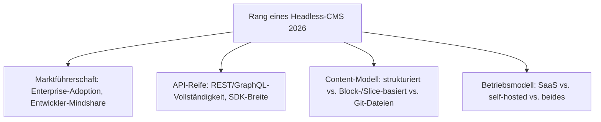
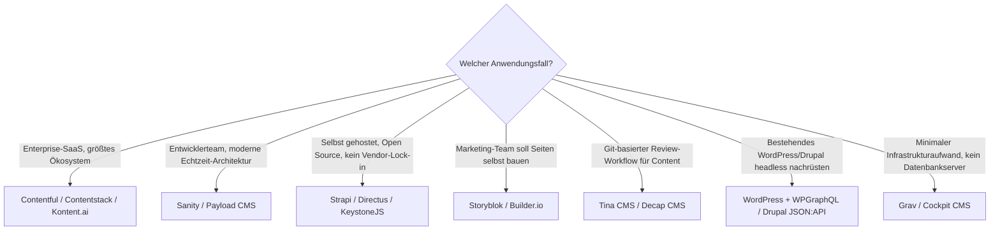

# Beste Headless-CMS 2026 — Top-20-Topliste

Die [Evolution und Architekturen digitaler Headless-CMS](evolution-digitaler-headless-cms.md) ordnet diese Kategorie chronologisch nach Architektur-Generation. Diese Seite übersetzt die Chronologie in eine **Momentaufnahme 2026**: die 20 Headless-CMS mit der größten Verbreitung, aktivsten Weiterentwicklung und breitesten Einsatzfähigkeit — unabhängig von MCP-/Agenten-Support.

!!! note "Hinweis: Abgrenzung zur bestehenden CMS-MCP-Topliste"
    Die [CMS-Topliste mit MCP-Server](cms-mcp-server-topliste.md) mischt klassische und headless CMS gleichberechtigt und filtert nach MCP-/Agenten-Reife als Kernkriterium. Diese Seite bleibt strikt auf die **Headless-Kategorie** beschränkt (deckungsgleich mit [Evolution digitaler Headless-CMS](evolution-digitaler-headless-cms.md)) und rankt nach allgemeiner Marktführerschaft, API-Reife und Ökosystemgröße — MCP-Support erscheint hier nur als eine von mehreren Spalten, nicht als Filterkriterium.

---

## Bewertungskriterien

!!! warning "Achtung: SaaS-Anbieter ohne Open-Source-Kern"
    Contentful, Sanity, Storyblok, Prismic, Contentstack, Kontent.ai, Hygraph und Builder.io sind reine SaaS-Produkte ohne veröffentlichten, selbst hostbaren Quellcode — anders als die Systeme, die sonst in diesem Repository nach OSI-Lizenzkriterien gefiltert werden (vgl. [CMS-MCP-Topliste](cms-mcp-server-topliste.md)). Sie erscheinen hier trotzdem, weil sie die Headless-Kategorie 2026 marktseitig dominieren. **Stand: August 2026.**

---

## Top 20 im Überblick

| Rang | System | Betriebsmodell | Content-Modell | Besondere Stärke |
|---|---|---|---|---|
| 1 | **Contentful** | SaaS | strukturierte Content-Types | Marktführer seit Generation 1, größtes Partner-/Integrations-Ökosystem |
| 2 | **Sanity** | SaaS (Studio self-hostbar) | Echtzeit-editierbares JSON-Dokument | Beliebtestes System unter Entwicklern für strukturierten, versionierbaren Content |
| 3 | **[Strapi](cms-mcp-server-topliste.md#top-20-im-uberblick)** | Self-hosted, Open Source | frei konfigurierbare Content-Types | Dominantes selbst gehostetes Headless-CMS, MIT-lizenziert |
| 4 | **Storyblok** | SaaS | Slice-/Block-basiert mit Live-Vorschau | Führendes „Visual Headless"-System für Marketing-Teams |
| 5 | **Payload CMS** | Self-hosted, Open Source | TypeScript-natives Schema | Stärkste Wachstumsdynamik seit 2024, sehr entwicklerfreundlich |
| 6 | **Builder.io** | SaaS | visueller Drag-&-Drop-Page-Builder auf API-Basis | Führende Lösung, wenn Marketing-Teams Seiten selbst zusammenbauen sollen |
| 7 | **Hygraph** (ehem. GraphCMS) | SaaS | GraphQL-natives Content-Federation-Modell | Kombiniert mehrere Content-Quellen über eine einzige GraphQL-API |
| 8 | **[Directus](cms-mcp-server-topliste.md#top-20-im-uberblick)** | Self-hosted, Open Source | „Daten-first" über bestehende SQL-Datenbank | Erzwingt kein eigenes Schema, sondern legt sich über vorhandene Datenbanken |
| 9 | **Contentstack** | SaaS (Enterprise) | strukturierte Content-Types | Führende Enterprise-Alternative zu Contentful mit starkem Governance-Fokus |
| 10 | **Kontent.ai** | SaaS (Enterprise) | strukturierte Content-Types mit Workflow-Engine | Ausgeprägtes Freigabe-/Workflow-System für regulierte Branchen |
| 11 | **Prismic** | SaaS | Slice-basiertes, wiederverwendbares Layout | Etablierter Pionier des Slice-Modells seit Generation 2 |
| 12 | **WordPress** (Headless via REST/WPGraphQL) | Self-hosted, Open Source | klassisches Post-/Custom-Field-Modell | Größte installierte Basis aller CMS weltweit, headless nachgerüstet |
| 13 | **Drupal** (Decoupled via JSON:API) | Self-hosted, Open Source | strukturierte Entities | Enterprise-Rechte-/Workflow-Tiefe, headless als optionale Betriebsart |
| 14 | **Tina CMS** | Self-hosted/Hybrid, Open Source | Markdown/MDX in Git-Repository | Git-Commits als Speicher, visueller Editor direkt neben der Live-Vorschau |
| 15 | **Decap CMS** (ehem. Netlify CMS) | Self-hosted, Open Source | Markdown in Git-Repository | Reines Frontend ohne eigenes Backend, minimaler Infrastrukturaufwand |
| 16 | **KeystoneJS** | Self-hosted, Open Source | GraphQL-natives Schema | Von Grund auf GraphQL-first, typsichere Anbindung an moderne Frontends |
| 17 | **ButterCMS** | SaaS | einfaches Blog-/Content-API-Modell | Sehr niedrige Einstiegshürde für Blog-/Marketing-Content ohne Enterprise-Komplexität |
| 18 | **Cockpit CMS** | Self-hosted, Open Source | flexibles Feld-basiertes Schema | Leichtgewichtige PHP-Alternative für kleinere Self-Hosting-Projekte |
| 19 | **Grav** | Self-hosted, Open Source | Flat-File ohne Datenbank | Kein Datenbank-Overhead, Content direkt als Dateien über API zugänglich |
| 20 | **Kirby** | Self-hosted (kostenpflichtige Kernlizenz) | Flat-File ohne Datenbank | Sehr flexibles PHP-Templating, aber lizenzrechtlicher Sonderfall (siehe unten) |

---

## Lizenz-Sonderfall

!!! warning "Achtung: Quellcode einsehbar ≠ Open Source"
    **Kirby** (Rang 20) und **Statamic** — Letzteres bereits als [Sonderfall in der CMS-MCP-Topliste](cms-mcp-server-topliste.md#lizenz-sonderfall) geführt — bieten beide einsehbaren Quellcode, verlangen aber eine kostenpflichtige Kernlizenz für den produktiven bzw. kommerziellen Einsatz. Wer strikt OSI-Open-Source benötigt, greift stattdessen zu Rang 3, 5, 8, 16, 18 oder 19 (Strapi, Payload CMS, Directus, KeystoneJS, Cockpit CMS, Grav).

---

## Highlights im Detail

### Rang 1–2: die etablierten Platzhirsche
Contentful und Sanity teilen sich seit Jahren die Spitze — Contentful durch das größte Partner-Ökosystem und Enterprise-Vertrauen, Sanity durch die technisch modernste Echtzeit-Architektur und starke Entwickler-Community. Beide bleiben reine SaaS-Produkte ohne selbst hostbaren Kern.

### Rang 3, 5: die beiden dominanten Open-Source-Alternativen
[Strapi](cms-mcp-server-topliste.md#top-20-im-uberblick) hält seine Marktführung im selbst gehosteten Segment seit 2015, wird aber von **Payload CMS** zunehmend herausgefordert — dessen TypeScript-natives Datenmodell und die durchgängige Typsicherheit vom Backend bis zum Frontend treffen 2026 den Nerv vieler neuer Projekte.

### Rang 6, 4: visuelles Headless für Marketing-Teams
Storyblok und Builder.io lösen dasselbe Grundproblem — Marketing-Teams sollen Seiten ohne Entwickler-Unterstützung bauen können —, mit leicht unterschiedlichem Fokus: Storyblok bleibt näher am klassischen Content-Modell mit Live-Vorschau, Builder.io geht weiter in Richtung vollständigem visuellen Page-Building auf API-Basis.

### Rang 14–15: Git als Speicherschicht bleibt eine stabile Nische
Tina CMS und Decap CMS zeigen, dass die 2015 entstandene Idee, Content direkt als Git-Commits zu speichern, auch 2026 relevant bleibt — besonders für Teams, die Versionierung und Review-Workflows aus der Softwareentwicklung direkt auf Content übertragen wollen.

---

## Entscheidungshilfe nach Anwendungsfall

!!! tip "Tipp: MCP-/Agenten-Reife separat prüfen"
    Wer einen Agenten an das gewählte System anbinden will, sollte zusätzlich die [CMS-MCP-Topliste](cms-mcp-server-topliste.md) konsultieren — Rang und MCP-Reife korrelieren in dieser Liste nicht zwangsläufig (Strapi und Directus führen z. B. beide Ranglisten an, während Contentful und Sanity hier vorne liegen, aber in der MCP-Topliste gar nicht erst auftauchen).

---

## 🔗 Verwandte Themen

- [Startseite](../../index.md) — zurück zur Dokumentations-Zentrale
- [Evolution und Architekturen digitaler Headless-CMS](evolution-digitaler-headless-cms.md) — chronologisches Generationenmodell, dessen aktuellen Stand diese Topliste zusammenfasst
- [Headless-CMS mit PostgreSQL-/Dateiformat-Speicherung (Top 9)](headless-cms-postgresql-dateiformat-2026-topliste.md) — dieselbe Kategorie, strenger gefiltert nach Lizenz, Speicherbackend und Entwicklungsaktivität
- [Produktionsreife Open-Source-Headless-CMS nach Generation (Top 3)](produktionsreife-headless-cms-generationen-2026-topliste.md) — dieselben Kriterien plus Content-Skala- und Reifegrad-Filter, sortiert nach Generation
- [Beste CMS-Systeme (Open Source) mit MCP-Server (Top 20)](cms-mcp-server-topliste.md) — Schwester-Topliste über klassische **und** headless CMS, gerankt nach MCP-Reife
- [Evolution und Architekturen digitaler Content-Management-Systeme](evolution-digitaler-cms.md) — übergeordnetes Generationenmodell
- [Evolution und Architekturen digitaler Composable-CMS](evolution-digitaler-composable-cms.md) — nachfolgende Architektur-Generation
- [Beste Composable-CMS & MACH-Systeme 2026 (Top 20)](composable-cms-2026-topliste.md) — breiter gefasste Schwester-Topliste über Content, Commerce, Suche und Orchestrierung hinweg
- [Beste Static-Site- & Docs-Generatoren 2026 (Top 20)](static-site-generatoren-2026-topliste.md) — typisches Frontend-Gegenstück zu Rang 14–15 und weiteren Git-/API-basierten Systemen dieser Liste
- [Klassische Wissensmanagement-, KB- & CMS-Systeme mit LLM-Integration](klassische-wissensmanagement-cms-llm-integration.md) — LLM-Integration unabhängig von Headless-Architektur
