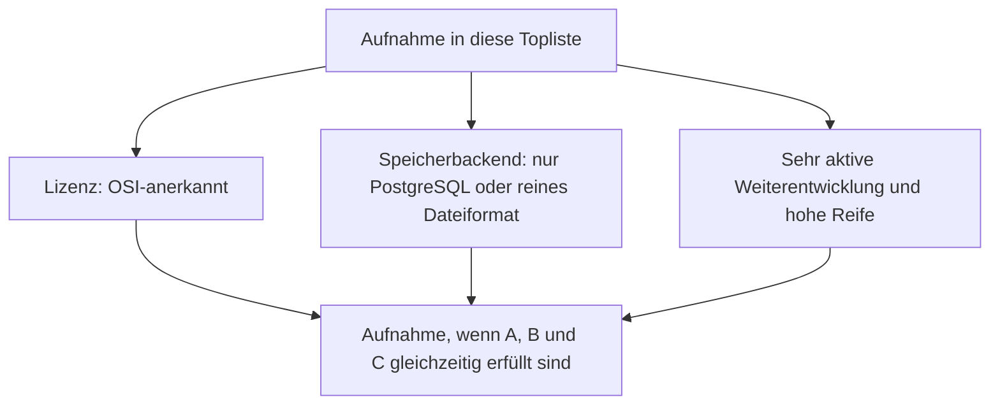
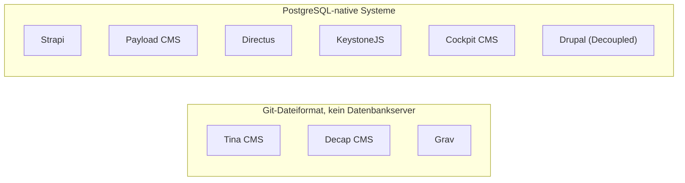
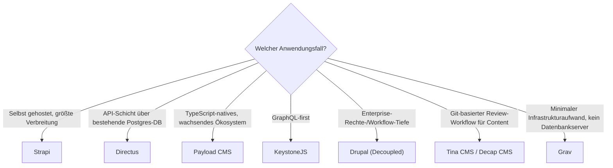

# Headless-CMS mit PostgreSQL- oder Dateiformat-Speicherung, aktiver Weiterentwicklung & hoher Reife — Top-9-Topliste

Die [Beste Headless-CMS 2026 (Top 20)](headless-cms-2026-topliste.md) rankt die gesamte Kategorie nach Marktführerschaft — inklusive zahlreicher proprietärer SaaS-Anbieter, die dort bewusst mitgeführt werden, weil sie den Markt dominieren. Diese Seite wendet auf genau dieselbe Kategorie die inzwischen etablierten strengeren Kriterien an: nur OSI-Open-Source, Content-Persistenz ausschließlich in PostgreSQL oder einem reinen Dateiformat, sehr aktive Weiterentwicklung, hohe Reife.

!!! note "Hinweis: Nur OSI-anerkannte Lizenzen"
    Wie in der [Gesamtübersicht](open-source-llm-agent-mcp-systeme.md) zählen hier ausschließlich Systeme unter einer OSI-anerkannten Open-Source-Lizenz. Das kostet dieser Liste alle acht reinen SaaS-Anbieter der Basis-Topliste (Contentful, Sanity, Storyblok, Builder.io, Hygraph, Contentstack, Kontent.ai, Prismic, ButterCMS) sowie Kirby, dessen Kernlizenz kostenpflichtig ist.

---

## Bewertungskriterien

!!! warning "Achtung: Momentaufnahme, Stand August 2026 — bewusst kürzer als 20"
    Von den 20 Systemen der [Basis-Topliste](headless-cms-2026-topliste.md) fallen elf heraus: acht reine SaaS-Anbieter (Lizenz), Kirby (Lizenz) sowie WordPress (Headless) und ButterCMS — Ersteres erbt die fehlende PostgreSQL-Unterstützung des WordPress-Kerns (siehe [Klassische-CMS-Speicherbackend-Topliste](klassische-cms-postgresql-dateiformat-2026-topliste.md)), Letzteres ist ein reiner SaaS-Dienst.

---

## Top 9 im Überblick

| Rang | System | Speicherbackend | Lizenz | Aktivität/Reife |
|---|---|---|---|---|
| 1 | **[Strapi](cms-mcp-server-topliste.md#top-20-im-uberblick)** | PostgreSQL, MySQL/MariaDB oder SQLite offiziell wählbar | MIT | Dominantes selbst gehostetes Headless-CMS, sehr aktiv |
| 2 | **[Directus](cms-mcp-server-topliste.md#top-20-im-uberblick)** | PostgreSQL direkt — legt sich über eine bestehende Datenbank statt eigenes Schema zu erzwingen | GPL-3.0 | Erzwingt kein eigenes Schema, sehr aktiv |
| 3 | **Payload CMS** | PostgreSQL oder SQLite über offizielle Adapter | MIT | Stärkste Wachstumsdynamik seit 2024 |
| 4 | **KeystoneJS** | PostgreSQL oder SQLite über Prisma | MIT | GraphQL-first, typsicher, aktiv |
| 5 | **Drupal** (Decoupled via JSON:API) | PostgreSQL, MySQL/MariaDB oder SQLite offiziell wählbar | GPL-2.0-or-later | Enterprise-Rechte-/Workflow-Tiefe, sehr aktiv |
| 6 | **Tina CMS** | Reines Dateiformat (Markdown/MDX im Git-Repository) | Apache-2.0/MIT | Git-Commits als Speicher, aktiv |
| 7 | **Decap CMS** (ehem. Netlify CMS) | Reines Dateiformat (Markdown im Git-Repository) | MIT | Reines Frontend ohne eigenes Backend, aktiv |
| 8 | **Grav** | Reines Dateiformat, kein Datenbankserver | MIT | Kein Datenbank-Overhead, aktiv |
| 9 | **Cockpit CMS** | SQLite als Standard, auch PostgreSQL/MySQL möglich | MIT | Leichtgewichtige Alternative für kleinere Projekte |

---

## Highlights im Detail

### Directus: das reinste „Postgres statt eigenes Schema"-Prinzip dieser Serie
Wo die meisten Systeme dieser Liste PostgreSQL als eine von mehreren wählbaren Optionen anbieten, dreht Directus das Verhältnis um — es legt sich als API-Schicht über eine **bereits vorhandene** relationale Datenbank, statt ein eigenes Schema zu erzwingen. Kein anderes System dieser Serie macht PostgreSQL so konsequent zur alleinigen Wahrheitsquelle.

### Tina CMS & Decap CMS: Git als vollständiger Ersatz für jede Datenbank
Beide Systeme bestätigen ein Muster, das in dieser Dokumentation bereits mehrfach auftaucht (GitLab Wiki, Gitea Wiki, Forgejo Wiki in der [Wiki-Engines-Speicherbackend-Topliste](wiki-engines-postgresql-dateiformat-2026-topliste.md)): Content-Versionierung über Git-Commits macht einen separaten Datenbankdienst für ein CMS vollständig überflüssig.

---

## Entscheidungshilfe nach Anwendungsfall

---

## 🔗 Verwandte Themen

- [Startseite](../../index.md) — zurück zur Dokumentations-Zentrale
- [Beste Headless-CMS 2026 (Top 20)](headless-cms-2026-topliste.md) — Basis-Topliste ohne Lizenz-/Speicherbackend-/Aktivitätsfilter
- [Klassische CMS mit PostgreSQL-/Dateiformat-Speicherung (Top 7)](klassische-cms-postgresql-dateiformat-2026-topliste.md) — Schwester-Topliste, Drupal in beiden Listen vertreten
- [Open-Source-Wissenssysteme mit PostgreSQL- oder Dateiformat-Speicherung (Top 22)](postgresql-dateiformat-wissenssysteme-2026-topliste.md) — dieselben Speicherkriterien für die Wissenssysteme-Klasse
- [Beste CMS-Systeme (Open Source) mit MCP-Server (Top 20)](cms-mcp-server-topliste.md) — Gegenstück nach MCP-/Agenten-Reife statt Speicherbackend
- [Wiki-Engines mit PostgreSQL- oder Dateiformat-Speicherung (Top 15)](wiki-engines-postgresql-dateiformat-2026-topliste.md) — dasselbe Git-Dateiformat-Prinzip bei GitLab/Gitea/Forgejo Wiki
