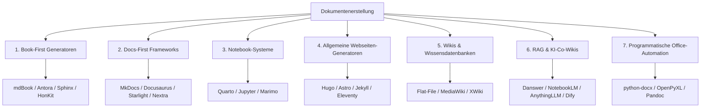

# Dokumentenerstellung, Wikis & Notebooks

Diese Kategorie bietet eine strukturierte Übersicht über Systeme zur Dokumentenerstellung, kollaborative Wikis, interaktive Notebooks sowie Werkzeuge zur programmatischen Generierung von Dokumenten und zur Anbindung von KI-Agenten (RAG).

---

## 1. Die "Book-First" Generatoren (Markdown/AsciiDoc)

Tools, die speziell für das Erstellen strukturierter Bücher, Handbücher und langlebiger Dokumentationen optimiert sind. Sie nutzen meist Git als Versionskontrolle.

* **mdBook** (Rust): Ein extrem schneller, in Rust geschriebener Generator. Erzeugt schlanke, durchsuchbare HTML-Bücher aus Markdown-Dateien. Ideal für technische Handbücher.
* **Antora** (JavaScript): Ein professioneller Generator für Multi-Repository-Dokumentationen. Basiert auf **AsciiDoc** statt Markdown, was erweiterte Features für Cross-Referenzen und modulare Strukturierung bietet.
* **HonKit** (TypeScript): Ein moderner, aktiv gepflegter Fork von GitBook (Legacy CLI), um Bücher aus Markdown-Dateien zu generieren.
* **Sphinx** (Python): Der traditionelle Standard für technische Großprojekte. Nutzt standardmäßig reStructuredText (reST) oder Markdown (via MyST) und glänzt bei komplexen Querverweisen und automatischer API-Generierung.

---

## 2. "Docs-First" Frameworks (Fokus: Moderne Web-Dokumentation, Komponenten, API-Docs)

* **MkDocs** (Python): Ein statischer Site-Generator, der einfach über YAML konfiguriert wird. Mit dem **Material for MkDocs** Theme (wie in diesem Projekt genutzt) gehört es zu den optisch ansprechendsten und funktionalsten Lösungen.
* **Docusaurus** (React/TypeScript): Ein von Meta entwickeltes Dokumentations-Framework. Ermöglicht die nahtlose Integration von React-Komponenten in Markdown (MDX), ideal für komplexe Web-Dokumentationen.
* **Starlight** (Astro/TypeScript): Ein modernes, auf Astro basierendes Dokumentations-Framework. Bietet hervorragende Performance (Zero-JS-Standard), integrierte Suche, Internationalisierung und ein modernes UI.
* **Nextra** (React/Next.js): Ein sehr populäres Dokumentations-Framework von Vercel, das die Stärken von Next.js und MDX kombiniert.
## 3. Interaktive & "Executable" Notebook-Systeme

Systeme, die ausführbaren Code, Visualisierungen und erklärenden Text in einem interaktiven Dokument vereinen.

* **Quarto** (CLI): Das moderne Nachfolgesystem von R Markdown. Unterstützt Python, R, Julia und Observable JS. Ermöglicht das Rendern von Notebooks in hochqualitative PDFs, HTML-Seiten, wissenschaftliche Arbeiten und Präsentationen.
* **JupyterLab / Jupyter Book**: Der Industriestandard für Data Science. JupyterLab bietet eine vollständige Entwicklungsumgebung im Browser, während Jupyter Book eine Sammlung von Notebooks als schönes Online-Buch veröffentlicht.
* **Livebook** (Elixir): Ein kollaboratives, interaktives Notebook-System für Elixir mit integrierter Echtzeit-Zusammenarbeit und Unterstützung für Machine-Learning-Pipelines.
* **Marimo** (Python): Ein moderner, reaktiver Ersatz für klassische Jupyter-Notebooks. Zellen verhalten sich wie Excel-Zellen (Änderungen triggern abhängige Zellen automatisch). Speichert als saubere .py-Dateien – extrem Git-freundlich.
### Eigene Notebook-UIs bauen (Core Web Components)
* **JupyterLab Components**: Wiederverwendbare Webkomponenten direkt aus dem JupyterLab-Ökosystem, um eigene Web-UIs mit Notebook-Support zu erstellen.
* **nteract**: Ein Set aus React-Komponenten und SDKs für den Bau individueller Notebook-Anwendungen.
* Starboard (JavaScript): Ein leichtgewichtiges, komplett im Browser (in-browser) laufendes Notebook-System. Lässt sich ohne Backend-Infrastruktur als Web-Komponente einbetten (nutzt WebAssembly für die Code-Ausführung).
### In-Browser Execution (Ausführung ohne Server-Backend)
* **JupyterLite**: Ein JupyterLab-Derivat, das vollständig im Browser läuft (via WebAssembly / Pyodide). Es benötigt keinen Jupyter-Server im Hintergrund.
* **Marimo** (Python): Ein reaktives Notebook für Python. Im Gegensatz zu Jupyter führt Marimo Code-Zellen bei Änderungen automatisch aus (ähnlich wie eine Excel-Tabelle), verhindert veraltete Zustände und läuft via Pyodide auch komplett serverlos im Browser.
* **Observable**: Ein reaktives Notebook-System für JavaScript, optimiert für Datenvisualisierung (D3.js) und interaktives Prototyping.

### Jupyter-Protokoll & Kernel-Management (Das Backend)
* **JupyterHub / Kernel Gateway**: Zentralisierte Server-Infrastrukturen zur Bereitstellung von Notebook-Umgebungen für Teams und zum programmatischen Ausführen von Code über APIs.
* **Voila**: Konvertiert Jupyter Notebooks in eigenständige, interaktive Webanwendungen und Dashboards, indem der darunterliegende Code vor dem Endnutzer verborgen wird.

### Full-Stack Programmatic Notebook Engines
* **Papermill**: Erlaubt die Parametrisierung und automatisierte Ausführung von Jupyter Notebooks über die Kommandozeile oder APIs.
* **Nbconvert**: Das Standard-Utility-Tool zur Konvertierung von Notebooks (`.ipynb`) in HTML, PDF, Markdown oder ausführbare Skripte.

---

## 4. Generatoren für allgemeine Webseiten & Blogs ("Eher Webseiten")

Tools zur schnellen Erstellung von klassischen, inhaltsfokussierten Webseiten, Blogs, Portfolios oder Landingpages ohne den primären Fokus auf Dokumentationen oder Notizsysteme.

* **Hugo** (Go): Einer der schnellsten statischen Website-Generatoren der Welt. Basiert auf Go und eignet sich hervorragend für inhaltsreiche Webseiten, Blogs und Landingpages.
* **Astro** (TypeScript/JavaScript): Ein modernes Web-Framework für inhaltsfokussierte Webseiten. Liefert standardmäßig 0 % JavaScript (Zero-JS-by-default) an den Client und bietet flexible Integrationen für React, Vue, Svelte und Markdown.
* **Jekyll** (Ruby): Der bewährte Klassiker für statische Webseiten und einfache Blogs, der nativ von GitHub Pages unterstützt wird.
* **Eleventy (11ty)** (JavaScript): Ein extrem flexibler und performanter Node.js-basierter Generator, der ohne schweres clientseitiges JavaScript auskommt und verschiedenste Template-Engines (Nunjucks, Liquid, etc.) unterstützt.
* **Gatsby** (React/GraphQL): Ein mächtiges React-basiertes Framework für statische und dynamische Websites mit integriertem GraphQL-Daten-Layer zum Zusammenführen verschiedenster Datenquellen.

---

## 5. Lokale Dokumentations-Wikis & Wissensdatenbanken

### Klassische & Datenbank-gestützte Wikis (Relationales Backend)
* **BookStack**: Ein modernes, einfach zu bedienendes Wiki mit einer hierarchischen Struktur (Bücher, Kapitel, Seiten), das auf PHP/Laravel basiert und eine MySQL/MariaDB-Datenbank erfordert.
* **Wiki.js**: Ein mächtiges, modernes Wiki auf Node.js-Basis. Bietet Git-Sync, Markdown-Editoren und flexible Suchmaschinen wie **FlexSearch** sowie ein relationales Datenbank-Backend.
* **MediaWiki**: Das PHP-Schwergewicht hinter Wikipedia. Perfekt für riesige Enzyklopädien und stark strukturierte Wikitext-Inhalte. (Siehe [Installationsanleitung](mediawiki/index.md), [Backup](mediawiki/backup.md) und [Wiederherstellung](mediawiki/wiederherstellen.md)).
* **Semantic MediaWiki**: Eine Erweiterung für MediaWiki, die es ermöglicht, Wiki-Seiten mit strukturierten Daten (Semantik) zu versehen und diese abzufragen. (Siehe [Installationsanleitung](semantische-mediawiki/installieren.md), [Kurzform](semantische-mediawiki/kurzform.md) und [Erweiterungen](semantische-mediawiki/wichtige-erweiterungen.md)).
* **XWiki**: Ein Enterprise-Wiki auf Java-Basis, das strukturierte Daten, eigene Applikationen innerhalb von Wiki-Seiten und tiefgreifende Rechteverwaltung unterstützt. (Siehe [Installationsanleitung](xwiki/installieren.md)).

### Flat-File-Wikis (Dateibasiert, ohne Datenbank)
* **DokuWiki**: Ein bewährtes, PHP-basiertes Wiki, das alle Seiten als einfache Textdateien speichert. Extrem wartungsfreundlich und ohne Datenbank-Overhead.

### Local-First & Personal Knowledge Management (PKM)
* **Obsidian**: Eine hochgradig anpassbare Local-First-Notiz-App, die auf einem lokalen Ordner von Markdown-Dateien basiert und Verknüpfungen (Backlinks) visualisieren kann.
* **Logseq**: Eine datenschutzfreundliche Outliner-Wissensdatenbank (Local-First) mit PDF-Annotationen und Flashcards, basierend auf Markdown- oder Org-Mode-Dateien.

### Static-Site-Generatoren für lokale Notizen
* **Quartz (v4)** (TypeScript): Ein statischer Generator, der Obsidian-Tresore (Markdown-Dateien mit Wiki-Links) direkt in eine schnelle, interaktive Website übersetzt.

### Headless Editoren & Echtzeit-Kollaboration (Editor-Frameworks)
* **Tiptap / Tiptap Collab**: Eine headless WYSIWYG-Editor-Bibliothek für moderne Web-UIs, die kollaboratives Schreiben in Echtzeit (wie in Google Docs oder Notion) ermöglicht.

---

## 6. RAG- & KI-Zentrierte Wissensdatenbanken (RAG-Co-Wikis)

Systeme und Pipelines, die Wikis und Dokumente für Large Language Models (LLMs) aufbereiten oder als intelligente Co-Wikis mit RAG-Anbindung fungieren.

### KI- & LLM-Wiki-Konzepte (LLM-Wikis & Co-Wikis)
* **LLM-Wiki (Large Language Model Wiki)**: Ein Konzept zur Wissensstrukturierung, bei dem KI-Modelle Dokumente und Notizen autonom einlesen, zusammenfassen, kategorisieren und untereinander verlinken. Es entsteht ein sich selbst organisierendes, wachsendes Wissensnetzwerk.
* **Co-Wiki (Collaborative AI Wiki)**: Plattformen, auf denen menschliche Autoren und autonome KI-Agenten (z. B. via Google Antigravity SDK) Hand in Hand arbeiten. Agenten können Lücken in der Dokumentation füllen, Links korrigieren, Begrifflichkeiten vereinheitlichen oder direkt auf Fragen antworten, während der Mensch die didaktische und fachliche Kontrolle behält.

#### Funktionsweise & Technische Prinzipien
Die technische Umsetzung von LLM- und Co-Wikis basiert auf der Kombination moderner KI-Architekturen, RAG-Pipelines (Retrieval-Augmented Generation) und agentischen Workflows:

1. **RAG-Pipelines (Die Datenbasis)**
   - **Ingestion & Semantic Chunking**: Sobald Dokumente erstellt oder geändert werden (z. B. getriggert über Git-Webhooks), spaltet ein Service den Text in sinnvolle, inhaltlich zusammenhängende Abschnitte (Chunks).
   - **Vektorisierung**: Ein Embedding-Modell übersetzt diese Chunks in hochdimensionale Vektoren und speichert sie in einer Vektordatenbank (z. B. LanceDB, Qdrant oder Chroma).
   - **Semantische Suche (Retrieval)**: Stellt ein Benutzer eine Frage, ermittelt das System über die Vektordatenbank die relevantesten Textabschnitte und stellt sie dem LLM als Kontext zur Verfügung.

2. **Graph-basierte Wissensnetze (Die Struktur)**
   - Ein LLM analysiert neue Texte und vergleicht sie mit dem bestehenden Wissensgraph. Es generiert automatisch **Backlinks** (Querverweise) und fügt semantische Tags in den Metadaten (Front Matter) der Markdown-Dateien ein. So entsteht ein dynamisches, sich selbst verlinkendes Wiki.

3. **Agentische Workflows & Tool Use (Die Interaktion)**
   - **Model Context Protocol (MCP)**: KI-Agenten greifen nicht auf rohen Text zu, sondern nutzen standardisierte MCP-Schnittstellen (wie `search_wiki` oder `read_document`), was die API-Interaktion deterministischer und effizienter macht.
   - **Git-Kollaboration (Human-in-the-Loop)**: Agenten arbeiten meist in isolierten Branches. Wenn sie Fehler korrigieren oder Lücken füllen, erstellen sie einen Pull Request (PR). Ein menschlicher Reviewer validiert die Änderung vor dem Merge in die Live-Dokumentation.
   - **Proaktive Qualitätskontrolle**: Agenten scannen die Dokumentation kontinuierlich auf veraltete Links, logische Widersprüche oder sprachliche Inkonsistenzen und schlagen Korrekturen vor.

### RAG- & KI-gestützte Dokumenten- & Wiki-Tools
* **Anytype** (Local-First): Ein verschlüsseltes, objektbasiertes Wiki (Notion-Alternative), das auf dem IPFS-Netzwerk basiert.
* **Affine.pro**: Ein kollaborativer Workspace, der klassischen Text-Editor (Notion-Style) und unendliches Whiteboard (Miro-Style) in einem Open-Source-Tool vereint.
* **Outline**: Ein wunderschönes, schnelles Open-Source-Wiki für Teams mit nativer Markdown-Unterstützung und exzellenter API.
* **Danswer**: Ein Open-Source-RAG-System, das sich mit all deinen Datenquellen (Slack, Google Drive, Wikis) verbindet und direkte Antworten auf Nutzerfragen liefert.
* **NotebookLM** (Google): Ein webbasierter, persönlicher KI-Kollaborations-Workspace. Erlaubt den Upload verschiedenster Dokumentenquellen (PDFs, Google Docs, Links) und generiert automatische Zusammenfassungen, strukturierte Studienführer und Audio-Podcasts.
* **AnythingLLM**: Eine All-in-One-Desktop- und Docker-Anwendung, die lokale Dokumente in private, isolierte Chat-Kontexte übersetzt. Unterstützt lokale LLMs (via Ollama) und integrierte Vektordatenbanken.
* **Khoj**: Ein Open-Source-KI-Assistent, der lokale Dokumente (PDF, Markdown, Org-mode) indiziert und offline-first durchsuchbar und abfragbar macht.
* **Open WebUI**: Ein Web-Frontend für LLMs mit integriertem RAG-System. Ermöglicht das Hochladen, Verwalten und Abfragen von Dokumenten direkt im Chat.
* **PrivateGPT**: Ein Open-Source-Projekt zur rein lokalen, datenschutzkonformen Dokumentenabfrage und -verwaltung mittels lokaler Sprachmodelle.

### Orchestrierung & RAG-Pipelines
* **Dify.ai / Flowise**: Visuelle Editoren zum Erstellen von LLM-Anwendungen, RAG-Pipelines und KI-Agenten, die direkt auf Dokumenten-Repositorys zugreifen.
* **LangChain / LangGraph / LlamaIndex**: Frameworks zur datenbezogenen Orchestrierung, dem Laden, Splitten, Einbetten (Embedding) und Abfragen von Dokumenten-Wikis.
* **ChromaDB / LanceDB** (Embedded): Leichtgewichtige, eingebettete Vektordatenbanken für lokale Setups ohne Server-Infrastruktur.
* **Qdrant / Milvus** (Production): Skalierbare Enterprise-Vektordatenbanken für Millionen von Dokumenten-Vektoren mit komplexer Metadaten-Filterung.
* **Model Context Protocol (MCP)**: Ein Standard von Anthropic. Anstatt einer KI rohen Text zu geben, baut man einen MCP-Server vor sein Wiki, über den Agenten standardisierte Tools (`search_wiki`, `get_article`, `list_categories`) nutzen können.

---

## 7. Office Suites & Programmatische Dokumentenerstellung

Werkzeuge zur automatisierten Generierung und Bearbeitung von Office-Dokumenten (Word, Excel, PowerPoint) direkt aus Code heraus.

### Office-Suiten (Das Frontend)
* **LibreOffice / ONLYOFFICE / WPS Office**: Standard-Office-Suiten. ONLYOFFICE eignet sich durch seine HTML5-Canvas-Rendering-Engine hervorragend zur Integration in eigene Webanwendungen.

### Programmatische Generierung (Code-Bibliotheken)
* **LibreOffice UNO**: Die API von LibreOffice, um Dokumente im Hintergrund (headless) zu manipulieren oder in andere Formate (z. B. DOCX/PPTX zu PDF) zu konvertieren.
* **python-docx** (Python): Ermöglicht das automatisierte Erstellen und Modifizieren von Microsoft Word (`.docx`) Dateien.
* **Apache POI** (Java): Die mächtigste Bibliothek zur Java-basierten Manipulation aller Microsoft Office-Formate.
* **OpenPyXL** (Python) / **libxlsxwriter** (C/C++): Bibliotheken zum Schreiben und Lesen von Excel-Tabellen (`.xlsx`) inklusive Diagrammen und Formatierungen.
* **Calamine** (Rust): Ein extrem schneller Excel-Reader in reinem Rust.
* **python-pptx** (Python): Zum programmatischen Erstellen von PowerPoint-Präsentationen.
* **DuckX** (C++): Eine leichtgewichtige C++-Bibliothek zum Lesen und Schreiben von DOCX-Dateien.
* **Pandoc** (Haskell): Das "Schweizer Taschenmesser" der Dokumentenkonvertierung. Konvertiert fast jedes Format (Markdown, HTML, DOCX, LaTeX, MediaWiki, ePub) per Kommandozeile in ein anderes.

---

## 8. 🤖 KI-Agenten-Tauglichkeit & RAG-Integration

Für autonome Entwickler-Agenten (wie Claude Code, Antigravity CLI) und RAG-Systeme eignen sich die dokumentenbasierten Pipelines unterschiedlich gut:

1. **Markdown & Git (z. B. MkDocs, mdBook, Quartz)** – **Hervorragend geeignet:**
   Da alle Seiten als reine Textdateien im Git-Repository liegen, können KI-Agenten Inhalte direkt bearbeiten, neue Seiten erstellen, Links anpassen und Commits erstellen. Zudem ist Markdown extrem token-effizient für LLMs.
2. **MCP-Server vor Wikis (z. B. Wiki.js, Outline)** – **Sehr gut geeignet:**
   Erlaubt es Agenten, gezielte Suchen über standardisierte APIs auszuführen, anstatt das gesamte Dokumentationsarchiv in den Prompt laden zu müssen.
3. **Pandoc-Pipelines** – **Sehr gut geeignet:**
   KI-Agenten können Pandoc nutzen, um formatierte Berichte aus Markdown-Dateien zu kompilieren (z. B. Markdown -> PDF) oder Eingabedokumente (z. B. Word-Dateien) vor dem Einlesen in Markdown zu übersetzen.
4. **Notebooks (z. B. Papermill, Jupyter-Kernel)** – **Sehr gut geeignet:**
   Agenten können Datenanalyse-Skripte direkt in Notebook-Zellen schreiben und ausführen, um Daten zu bereinigen und interaktive Visualisierungen zu generieren.
5. **Relational- & NoSQL-Wikis (z. B. MediaWiki)** – **Bedingt geeignet:**
   Änderungen erfordern oft Datenbank-Queries oder die Nutzung komplexer Web-APIs, was für Agenten fehleranfälliger und unübersichtlicher ist als direkte Datei-Interaktionen.