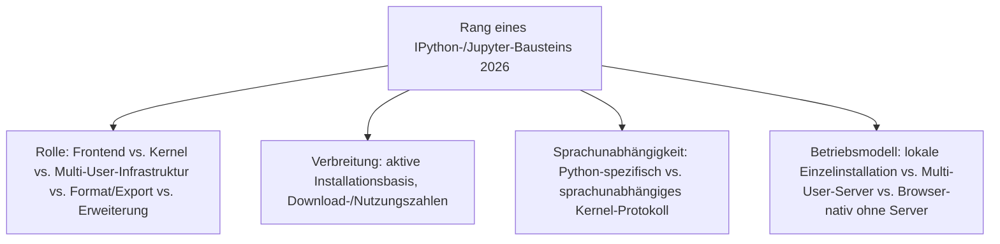
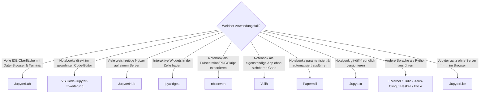

# Beste IPython- & Jupyter-Systeme 2026 — Top-20-Topliste

Die [Evolution und Architekturen digitaler IPython- & Jupyter-Systeme](evolution-digitaler-ipython-jupyter.md) ordnet diese Kategorie chronologisch nach Architektur-Generation — von der reinen IPython-Shell über inline Plotting und die Jupyter-Abspaltung bis zur Kernel-Ökosystem-Explosion und Multi-User-Deployments. Diese Seite übersetzt die Chronologie in eine **Momentaufnahme 2026**: 20 Frontends, Kernel, Multi-User-Infrastruktur und Erweiterungen, mit denen das IPython-/Jupyter-Ökosystem heute tatsächlich betrieben wird.

!!! note "Hinweis: Abgrenzung zu Cloud- und reaktiven Notebooks"
    Diese Liste bleibt strikt auf die **klassische Kernel-Frontend-Architektur aus [Generation 2 der übergeordneten Notebook-Zeitachse](evolution-digitaler-notebook-systeme.md#generation-2-ipython-notebook-die-geburt-von-jupyter-2011-2014)** beschränkt — gehostete Cloud-Plattformen wie Colab oder Kaggle Kernels behandelt [Beste Notebook-Systeme 2026](notebook-systeme-2026-topliste.md), reaktive Notebooks ohne Kernel-Frontend-Trennung die [Evolution digitaler reaktiver Notebooks](evolution-digitaler-reaktive-notebooks.md).

---

## Bewertungskriterien

!!! warning "Achtung: Frontend, Kernel und Erweiterung stehen nebeneinander"
    Diese Liste rankt nach **Bedeutung im Gesamtökosystem**, nicht nach direkter Vergleichbarkeit — JupyterLab (Frontend) und ipykernel (Kernel) konkurrieren nicht miteinander, sondern werden in praktisch jeder Standardinstallation gemeinsam genutzt. Die Kategorie-Spalte macht die jeweilige Rolle explizit. **Stand: August 2026.**

---

## Top 20 im Überblick

| Rang | System | Kategorie | Rolle im Ökosystem | Besondere Stärke |
|---|---|---|---|---|
| 1 | **JupyterLab** | Frontend | Standard-IDE-artige Oberfläche | Nachfolger des klassischen Notebooks, heutiges Standard-Frontend mit Datei-Browser, Terminal und Erweiterungssystem |
| 2 | **VS Code Jupyter-Erweiterung** (Microsoft) | Frontend | Notebook-Editor innerhalb von VS Code | Meistgenutztes Jupyter-Frontend außerhalb des Browsers, direkt in die verbreitetste Entwicklungsumgebung integriert |
| 3 | **Jupyter Notebook 7** | Frontend | Klassische Notebook-Oberfläche, neu auf JupyterLab-Komponenten aufgebaut | Vertraute Einzeldokument-Ansicht für Nutzer, die keine volle IDE-Oberfläche wollen |
| 4 | **ipykernel** | Kernel | Referenz-Python-Kernel | Der tatsächlich ausgeführte Kernel hinter praktisch jedem Python-Jupyter-Notebook, kapselt IPython für das Kernel-Protokoll |
| 5 | **IPython** | Kernel-Unterbau | Interaktive Shell & Kernel-Fundament | Bis heute produktiver Unterbau von ipykernel, siehe [Generation 1 der IPython-/Jupyter-Zeitachse](evolution-digitaler-ipython-jupyter.md#generation-1-ipython-vor-dem-notebook-2001-2011) |
| 6 | **JupyterHub** | Multi-User-Infrastruktur | Authentifizierung & Server-Orchestrierung | Standardlösung für Hochschul- und Forschungscomputing-Deployments mit vielen gleichzeitigen Nutzern |
| 7 | **ipywidgets** | Erweiterung | Interaktive UI-Widgets in der Zelle | Grundlage praktisch jeder interaktiven Dashboard-/Explorations-Notebook-Zelle |
| 8 | **nbconvert** | Format/Export | Export-Pipeline | Übersetzt `.ipynb` in HTML, PDF, Markdown, Reveal.js-Präsentationen oder ausführbare Skripte |
| 9 | **nbformat** | Format | `.ipynb`-JSON-Schema & Validierung | Referenzimplementierung des Notebook-Dateiformats, auf der praktisch jedes andere Werkzeug dieser Liste aufbaut |
| 10 | **Voilà** | Erweiterung | Notebook → eigenständige Web-App | Verwandelt ein Notebook in ein Dashboard ohne sichtbaren Code, ohne den Kernel-Frontend-Ansatz zu verlassen |
| 11 | **Papermill** | Erweiterung | Parametrisierte Notebook-Ausführung | Standardwerkzeug für Notebook-basierte Batch-/Pipeline-Jobs, u. a. in Airflow-/Kubeflow-Workflows |
| 12 | **Jupytext** | Format/Erweiterung | `.ipynb`-Pairing mit Klartext-Formaten | Macht Notebooks git-diff-freundlich durch parallele `.py`-/`.md`-Repräsentation |
| 13 | **nbdime** | Erweiterung | Diff & Merge für Notebooks | Löst das Problem, dass rohe `.ipynb`-JSON-Diffs in Git kaum lesbar sind |
| 14 | **jupyterlab-git** | Erweiterung | Versionskontrolle direkt in JupyterLab | Git-Operationen ohne Kontextwechsel zum Terminal |
| 15 | **IRkernel** | Kernel | R-Kernel | Meistgenutzter Nicht-Python-Kernel, parallel zur eigenständigen [R-Markdown-/Quarto-Linie](evolution-digitaler-rmarkdown-quarto.md) |
| 16 | **IJulia** | Kernel | Julia-Kernel | Einer der drei namensgebenden Kernel bei der Jupyter-Abspaltung 2014 |
| 17 | **Xeus-Cling** | Kernel | C++-Kernel | Basiert auf dem Cling-C++-Interpreter, prominentes Beispiel für Kernel jenseits dynamischer Sprachen |
| 18 | **IHaskell** | Kernel | Haskell-Kernel | Zeigt die Reichweite des offenen Kernel-Protokolls bis in rein funktionale Sprachen |
| 19 | **Evcxr** | Kernel | Rust-Kernel | Rust-Vertreter im Kernel-Ökosystem, siehe [Beste Rust-Bausteine für Notebooks 2026, Rang 5](rust-notebooks-2026-topliste.md) |
| 20 | **JupyterLite** | Frontend | Browser-native Jupyter-Distribution ohne Server | Läuft vollständig im Browser über Pyodide/WASM, keine Backend-Infrastruktur nötig — offizielles Jupyter-Gegenstück zu Marimos Browser-Modus |

---

## Highlights im Detail

### Rang 1–3: Frontend-Vielfalt trotz eines gemeinsamen Kernel-Protokolls
JupyterLab, VS Code Jupyter-Erweiterung und Jupyter Notebook 7 konkurrieren nicht um den Kernel selbst, sondern um die Oberfläche — alle drei sprechen dasselbe Kernel-Protokoll aus [Generation 4 der IPython-/Jupyter-Zeitachse](evolution-digitaler-ipython-jupyter.md#generation-4-project-jupyter-die-abspaltung-2014) und lassen sich beliebig austauschen, ohne dass ein Notebook selbst migriert werden müsste.

### Rang 4–5: der unsichtbare Python-Unterbau
ipykernel und IPython bilden zusammen den tatsächlich ausgeführten Python-Kernel — für die meisten Nutzer nicht getrennt sichtbar, aber architektonisch zwei unterschiedliche Schichten: IPython als interaktive Shell-Logik, ipykernel als die Kernel-Protokoll-Verpackung darüber.

### Rang 15–19: das sprachunabhängige Kernel-Ökosystem
IRkernel, IJulia, Xeus-Cling, IHaskell und Evcxr zeigen die praktische Konsequenz des offenen Kernel-Protokolls — dasselbe JupyterLab-Frontend führt ohne Änderung R-, Julia-, C++-, Haskell- oder Rust-Code aus, siehe [Generation 5 der IPython-/Jupyter-Zeitachse](evolution-digitaler-ipython-jupyter.md#generation-5-kernel-okosystem-explosion-2014-2017).

---

## Entscheidungshilfe nach Anwendungsfall

!!! tip "Tipp: Cloud- und Rust-Perspektive separat prüfen"
    Wer primär gehostete Cloud-Notebooks statt lokaler Installation sucht, findet die passenderen Kandidaten in [Beste Notebook-Systeme 2026](notebook-systeme-2026-topliste.md); wer speziell die Rust-Bausteine hinter Polars, Ruff & Co. sucht, in [Beste Rust-Bausteine für Notebooks 2026](rust-notebooks-2026-topliste.md).

---

## 🔗 Verwandte Themen

- [Startseite](../../index.md) — zurück zur Dokumentations-Zentrale
- [Evolution und Architekturen digitaler IPython- & Jupyter-Systeme](evolution-digitaler-ipython-jupyter.md) — chronologisches Generationenmodell, dessen aktuellen Stand diese Topliste zusammenfasst
- [IPython- & Jupyter-Systeme mit PostgreSQL-/Dateiformat-Speicherung (Top 20)](ipython-jupyter-postgresql-dateiformat-2026-topliste.md) — dieselbe Kategorie, geprüft nach Lizenz, Speicherbackend und Entwicklungsaktivität
- [Evolution und Architekturen digitaler Notebook-Systeme](evolution-digitaler-notebook-systeme.md) — übergeordnetes Generationenmodell
- [Beste Notebook-Systeme 2026 (Top 20)](notebook-systeme-2026-topliste.md) — Gesamtmarkt-Topliste inklusive Cloud-Plattformen
- [Beste Rust-Bausteine für Notebooks 2026 (Top 10)](rust-notebooks-2026-topliste.md) — Evcxr dort als eigener Rust-Kernel-Baustein vertieft
- [Evolution und Architekturen digitaler Notebook-Vorläufer](evolution-digitaler-notebook-vorlaeufer.md) — vorausgehende Generation
- [Evolution und Architekturen digitaler Cloud-Notebooks](evolution-digitaler-cloud-notebooks.md) — nachfolgende Generation
- [Evolution und Architekturen digitaler R-Markdown- & Quarto-Publishing-Systeme](evolution-digitaler-rmarkdown-quarto.md) — Schwester-Zeitachse für die R-Ökosystem-Linie
