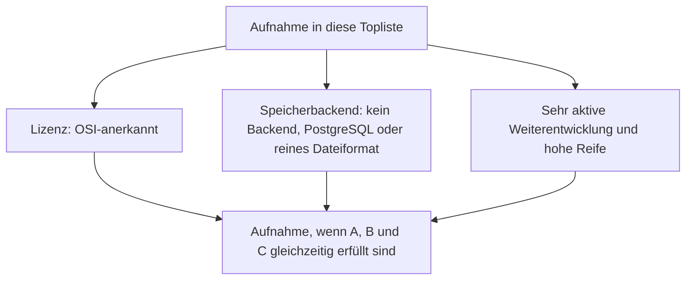
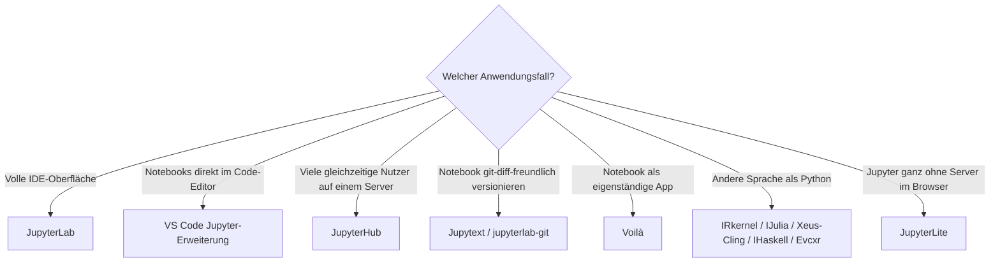

# IPython- & Jupyter-Systeme mit PostgreSQL- oder Dateiformat-Speicherung, aktiver Weiterentwicklung & hoher Reife — Top-20-Topliste

Die [Beste IPython- & Jupyter-Systeme 2026 (Top 20)](ipython-jupyter-2026-topliste.md) rankt Frontends, Kernel, Multi-User-Infrastruktur und Erweiterungen des Jupyter-Ökosystems nach Verbreitung. Diese Seite wendet die inzwischen etablierten strengeren Kriterien an — nur OSI-Open-Source, Persistenz ausschließlich in PostgreSQL oder einem reinen Dateiformat, sehr aktive Weiterentwicklung, hohe Reife.

!!! note "Hinweis: Diese Liste verliert praktisch keinen einzigen Baustein — und das ist die eigentliche Erkenntnis"
    Anders als bei den meisten Speicherbackend-Toplisten dieser Reihe fällt hier so gut wie nichts heraus: Das gesamte IPython-/Jupyter-Kernökosystem steht seit seiner Gründung unter der BSD-3-Clause-Lizenz der Jupyter-/NumFOCUS-Governance, und das Notebook-Dateiformat `.ipynb` ist von Grund auf ein reines JSON-Dateiformat ohne jeden Datenbankdienst. Ähnlich wie bei den [Programmiersprachen für Wissenssysteme](programmiersprachen-wissenssysteme-aktive-reife-topliste.md) liegt der Wert dieser Seite im expliziten Beleg der Kriterien, nicht im Aussortieren.

---

## Bewertungskriterien

!!! warning "Achtung: Momentaufnahme, Stand August 2026"
    Bei den kleineren Sprach-Kernel-Projekten (Rang 17–19: Xeus-Cling, IHaskell, Evcxr) ist die Aktivität stärker abhängig von einzelnen Maintainern als beim Jupyter-Kernprojekt selbst — vor produktivem Einsatz die aktuelle Release-Historie direkt im Repository prüfen.

---

## Top 20 im Überblick

| Rang | System | Kategorie | Lizenz | Speicherbackend |
|---|---|---|---|---|
| 1 | **JupyterLab** | Frontend | BSD-3-Clause | Dateiformat (`.ipynb`) |
| 2 | **VS Code Jupyter-Erweiterung** (Microsoft) | Frontend | MIT | Dateiformat (`.ipynb`) |
| 3 | **Jupyter Notebook 7** | Frontend | BSD-3-Clause | Dateiformat (`.ipynb`) |
| 4 | **ipykernel** | Kernel | BSD-3-Clause | Kein Backend |
| 5 | **IPython** | Kernel-Unterbau | BSD-3-Clause | Kein Backend |
| 6 | **JupyterHub** | Multi-User-Infrastruktur | BSD-3-Clause | SQLite (Standard) oder PostgreSQL/MySQL |
| 7 | **ipywidgets** | Erweiterung | BSD-3-Clause | Kein Backend |
| 8 | **nbconvert** | Format/Export | BSD-3-Clause | Kein Backend, arbeitet auf Dateien |
| 9 | **nbformat** | Format | BSD-3-Clause | Definiert das Dateiformat selbst |
| 10 | **Voilà** | Erweiterung | BSD-3-Clause | Kein Backend |
| 11 | **Papermill** (Netflix) | Erweiterung | BSD-3-Clause | Kein Backend, arbeitet auf Dateien |
| 12 | **Jupytext** | Format/Erweiterung | MIT | Dateiformat (Klartext-Pairing) |
| 13 | **nbdime** | Erweiterung | BSD-3-Clause | Kein Backend |
| 14 | **jupyterlab-git** | Erweiterung | BSD-3-Clause | Dateiformat (Git) |
| 15 | **IRkernel** | Kernel | MIT | Kein Backend |
| 16 | **IJulia** | Kernel | MIT | Kein Backend |
| 17 | **Xeus-Cling** | Kernel | BSD-3-Clause | Kein Backend |
| 18 | **IHaskell** | Kernel | MIT | Kein Backend |
| 19 | **Evcxr** | Kernel | MIT | Kein Backend |
| 20 | **JupyterLite** | Frontend | BSD-3-Clause | Browser-nativ, kein Server nötig |

---

## Highlights im Detail

### JupyterHub: das einzige System dieser Liste mit echter Datenbankwahl
Während die meisten Bausteine dieser Liste gar keine eigene Datenhaltung besitzen, ist JupyterHub der einzige Eintrag mit echtem Speicherbackend — standardmäßig SQLite, für Multi-Server-Deployments auch PostgreSQL oder MySQL konfigurierbar. Konsistent mit dem Prinzip „PostgreSQL oder Dateiformat, kein Pflicht-Zweitsystem" aus dieser gesamten Topliste-Reihe.

### `.ipynb` als reinstes Beispiel für „Dateiformat als Speicherprinzip"
nbformat definiert das Notebook-Dateiformat selbst, nbconvert, Jupytext, nbdime und jupyterlab-git verarbeiten es ausschließlich als Datei — kein Baustein dieser gesamten Kernel-/Frontend-Ebene verlangt jemals eine Datenbank für den eigentlichen Notebook-Inhalt.

---

## Entscheidungshilfe nach Anwendungsfall

---

## 🔗 Verwandte Themen

- [Startseite](../../index.md) — zurück zur Dokumentations-Zentrale
- [Beste IPython- & Jupyter-Systeme 2026 (Top 20)](ipython-jupyter-2026-topliste.md) — Basis-Topliste ohne Lizenz-/Speicherbackend-Filter
- [Programmiersprachen für Wissenssysteme: Lizenz, Aktivität & Reife (Top 10)](programmiersprachen-wissenssysteme-aktive-reife-topliste.md) — vergleichbarer Fall, bei dem ebenfalls praktisch nichts herausfällt
- [Reaktive Notebooks mit PostgreSQL-/Dateiformat-Speicherung](reaktive-notebooks-postgresql-dateiformat-2026-topliste.md) — Schwester-Topliste zum Hidden-State-Nachfolgeökosystem
- [R-Markdown- & Quarto-Werkzeuge mit PostgreSQL-/Dateiformat-Speicherung](rmarkdown-quarto-postgresql-dateiformat-2026-topliste.md) — konvergierende Publishing-Linie
- [Rust-Bausteine für Notebooks mit PostgreSQL-/Dateiformat-Speicherung (Top 10)](rust-notebooks-postgresql-dateiformat-2026-topliste.md) — Bauteil-Ebene, zu der diese Produktebene unsichtbar beiträgt
- [Open-Source-Wissenssysteme mit PostgreSQL- oder Dateiformat-Speicherung (Top 20)](postgresql-dateiformat-wissenssysteme-2026-topliste.md) — dieselben Speicherkriterien für die breitere Wissenssysteme-Klasse
