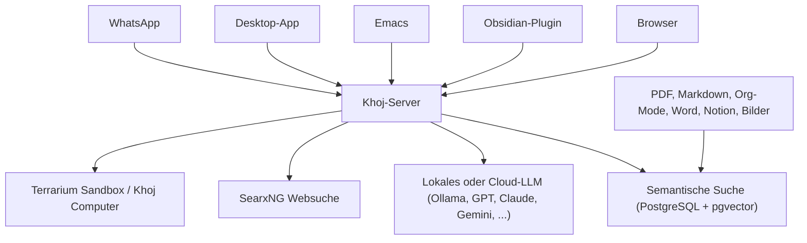

# Khoj: KI-„Zweites Gehirn" für persönliche Wissenssuche

**Khoj** ist ein Open-Source-KI-Assistent, der von Grund auf für **persönliche** Wissenssuche konzipiert ist — nicht nachträglich um RAG erweitert. Anders als [AnythingLLM](anythingllm-rag-plattform.md) oder [Onyx](onyx-danswer-rag-plattform.md), die primär als Web-Chat-Oberfläche gedacht sind, erreicht man Khoj über eine ungewöhnlich breite Palette von Zugriffswegen — inklusive **Obsidian-Plugin, Emacs, Desktop-App und WhatsApp**.

!!! warning "Achtung: AGPL-3.0 — striktere Copyleft-Lizenz als bei den meisten hier dokumentierten Tools"
    Khoj steht unter **AGPL-3.0** (Affero GPL), nicht MIT oder Apache-2.0 wie [AnythingLLM](anythingllm-rag-plattform.md) oder [Flowise](flowise-visueller-flow-builder.md). Die AGPL erweitert die GPL um eine **Netzwerk-Klausel**: Wer Khoj modifiziert und der Öffentlichkeit als Netzwerkdienst anbietet (nicht nur als verteilte Kopie), muss den Quellcode der Änderungen ebenfalls offenlegen — auch ohne dass Software physisch weitergegeben wird. Für reines Self-Hosting im eigenen, nicht-öffentlichen Betrieb ist das in der Praxis meist unkritisch, aber vor einem gehosteten Angebot für Dritte das Lizenzdokument genau prüfen.

---

## Übersicht



---

## Architektur

Khoj ist als **containerisierte Microservice-Architektur** aufgebaut — Such-, Sandbox- und Automatisierungsdienste kommunizieren über HTTP, gebündelt in einem Docker-Image:

| Baustein | Funktion |
|---|---|
| **Backend** | Python 3.10+, Django + FastAPI |
| **Semantische Suche** | PostgreSQL mit **pgvector** (siehe auch [PostgreSQL + pgvector](../daten/datenbanken/pgvector-anleitung.md) als eigenständige Anleitung in diesem Repository) |
| **Frontend** | React/Next.js, Bun, Radix UI |
| **Websuche** | SearxNG-Integration für Internet-Antworten neben den eigenen Dokumenten |
| **Sandbox** | Terrarium (Code-Ausführung), „Khoj Computer" für lokale Automatisierungen |

---

## Installation

```bash
git clone https://github.com/khoj-ai/khoj.git
cd khoj
docker compose up -d
```

Docker Compose orchestriert dabei Khoj-Server, SearxNG und die Sandbox-/Automatisierungsdienste gemeinsam.

!!! tip "Tipp: Lokales LLM per OpenAI-kompatiblem Endpunkt"
    Jeder OpenAI-API-kompatible lokale Modell-Server (Ollama, llama-cpp-server, vLLM — siehe [vLLM High-Throughput Serving](../../künstliche-intelligenz/coding/vllm-high-throughput-serving.md)) lässt sich einfach über die API-URL einbinden (z. B. `http://localhost:11434/v1/` für Ollama) — Khoj läuft damit vollständig offline, ohne dass Dokumente oder Anfragen das eigene Gerät verlassen.

---

## Zugriffswege

| Zugang | Besonderheit |
|---|---|
| **Browser** | Web-Oberfläche |
| **Obsidian-Plugin** | direkte Anbindung an den eigenen Obsidian-Vault, siehe Einordnung in [Klassische Wiki-Systeme mit LLM-Integration](klassische-wiki-systeme-llm-integration.md#obsidian-community-plugin-okosystem) |
| **Emacs** | native Emacs-Integration (Khoj-Ursprung liegt im Emacs-/Org-Mode-Umfeld) |
| **Desktop-App** | eigenständige Anwendung ohne Browser |
| **Phone** | mobiler Zugriff |
| **WhatsApp** | Chat direkt über einen bestehenden WhatsApp-Kontakt — ungewöhnlich niedrigschwellig gegenüber allen anderen hier dokumentierten Tools |

---

## Kernfunktionen

- **Chat mit beliebigem LLM**: lokal (Ollama, llama.cpp, vLLM) oder Cloud (GPT, Claude, Gemini, DeepSeek, …)
- **Dokumenttypen**: PDF, Markdown, Org-Mode, Word, Notion-Exporte, Bilder
- **Semantische Suche**: findet relevante Dokumente auch ohne exakte Stichwortübereinstimmung
- **Benutzerdefinierte Agenten**: eigenes Wissen, eigene Persona, eigenes Chat-Modell und eigene Tools pro Agent — ähnlich dem Konzept aus [Custom Chat-Assistenten im Anbieter-Vergleich](../../künstliche-intelligenz/coding/custom-chat-assistenten-anbieter-vergleich.md)
- **Geplante Automatisierungen**: wiederkehrende Recherche-Aufgaben automatisch ausführen lassen
- **Deep-Research-Modus**: Nachrichten mit `/research` starten einen experimentellen, mehrstufigen Recherche-Modus statt einer einzelnen Antwort

---

## MCP-Anbindung: noch kein offizieller Standard

!!! note "Hinweis: Community-MCP-Server vorhanden, aber kein etablierter Standard"
    Im Gegensatz zu [AnythingLLM](anythingllm-rag-plattform.md#mcp-anbindung), [Dify](dify-agenten-workflow-plattform.md#mcp-integration-bidirektional) oder [Flowise](flowise-visueller-flow-builder.md#mcp-integration-client-und-server-knoten), die MCP jeweils offiziell und nativ unterstützen, existieren für Khoj (Stand August 2026) primär **Community-MCP-Server-Implementierungen**, keine offizielle, vom Kernprojekt gepflegte MCP-Integration. Vor produktivem Einsatz die aktuelle Projekt-Dokumentation prüfen — dieser Bereich entwickelt sich branchenweit sehr schnell.

---

## Einordnung gegenüber verwandten Tools

| Kriterium | Khoj | [AnythingLLM](anythingllm-rag-plattform.md) | [Onyx](onyx-danswer-rag-plattform.md) |
|---|---|---|---|
| Lizenz | AGPL-3.0 (Netzwerk-Copyleft) | MIT | MIT (Community Edition) |
| Kernfokus | Persönliches „zweites Gehirn", extrem breite Zugriffswege | Lokale/private Dokumenten-Chats, Desktop-first | Enterprise-Suche über viele Datenquellen |
| Zugriffswege | Browser, Obsidian, Emacs, Desktop, Phone, WhatsApp | Desktop-App, Docker-Web-UI | Web-Chat-UI |
| MCP-Support | Community-Server, kein offizieller Standard | offiziell, nativ | offiziell (`onyx-mcp-server`) |
| Zielgruppe | Einzelpersonen mit stark persönlichem, plattformübergreifendem Workflow | Einzelperson/kleines Team | Unternehmen mit vielen Connectoren |

!!! tip "Tipp: Khoj vs. AnythingLLM"
    Beide zielen auf Einzelpersonen statt Enterprise-Teams. **Khoj** punktet mit ungewöhnlich vielen Zugriffswegen (insbesondere WhatsApp und Obsidian) und ist historisch aus dem Emacs-/Org-Mode-Umfeld gewachsen. **AnythingLLM** punktet mit breiterer Vektordatenbank-/LLM-Provider-Auswahl und einer permissiveren MIT-Lizenz ohne Netzwerk-Copyleft.

---

## Verwandte Themen

- [Startseite](../../index.md) — zurück zur Dokumentations-Zentrale
- [Dokumentenerstellung, Wikis & Notebooks](index.md) — Gesamtübersicht aller Dokumentations-Systeme
- [Personal Knowledge Management (PKM) & Second Brain](pkm-second-brain-methoden.md) — methodische Einordnung (Zettelkasten, PARA, CODE) hinter Khoj
- [AnythingLLM: All-in-One Desktop- & Docker-RAG-Plattform](anythingllm-rag-plattform.md) — nächstverwandtes Tool für den persönlichen Einsatz
- [Klassische Wiki-Systeme mit LLM-Integration](klassische-wiki-systeme-llm-integration.md#obsidian-community-plugin-okosystem) — Einordnung des Khoj-Obsidian-Plugins neben Copilot/Smart Connections
- [PostgreSQL + pgvector](../daten/datenbanken/pgvector-anleitung.md) — Grundlage der semantischen Suche in Khoj
- [Lokales RAG & LLM-Serving](../../künstliche-intelligenz/coding/lokales-rag-ollama.md) — Grundlagen zum lokalen Modellbetrieb via Ollama
