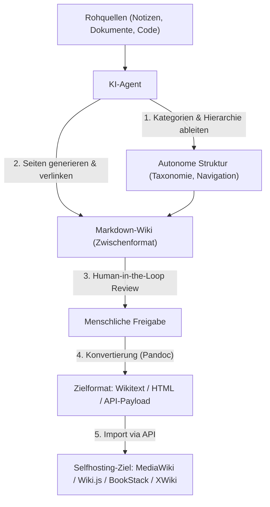

# KI strukturiert das Wiki autonom — und die Übertragung ins Selfhosting

Das [LLM-Wiki-Pattern (Karpathy-Muster)](llm-wiki-pattern-karpathy.md) beschreibt, wie ein KI-Agent Rohquellen in ein persistentes Markdown-Wiki kompiliert. Diese Seite geht einen Schritt weiter und beantwortet die Anschlussfrage: Wie strukturiert die KI dieses Wiki dabei **eigenständig** (Kategorien, Hierarchie, Querverweise — nicht nur einzelne Seiteninhalte), welche Software das heute schon kann, und wie kommt das Ergebnis anschließend in ein **selbst gehostetes** Wiki-System wie MediaWiki, Wiki.js, BookStack oder XWiki.

---

## Übersicht



!!! note "Hinweis: Zwei getrennte Fähigkeiten"
    „Autonom strukturieren" und „ins Selfhosting übertragen" sind zwei unabhängige Schritte mit unterschiedlicher Reife: Die **Strukturierung** übernimmt heute zuverlässig ein LLM-Agent. Die **Übertragung** in ein Ziel-Wiki ist dagegen für jedes System ein eigenes, meist selbst geschriebenes Migrationsskript — es gibt kein universelles „Ein-Klick-Import"-Werkzeug.

---

## Konzept: Autonome Strukturierung vs. reine Content-Generierung

Reine Content-Generierung (klassisches RAG oder einfache Zusammenfassung) erzeugt Text zu einer Frage. **Autonome Strukturierung** geht weiter — der Agent trifft eigenständig Entscheidungen über die **Informationsarchitektur** selbst:

1. **Kategorisierung**: Welche Themen gehören zusammen, welche Oberkategorie bekommen sie?
2. **Hierarchie**: Wie tief soll die Verschachtelung sein (flache Liste vs. mehrstufige Kapitelstruktur)?
3. **Verlinkung**: Welche Seiten referenzieren sich gegenseitig, wo entstehen Backlinks?
4. **Konsistenzpflege**: Wird eine bereits existierende Kategorie wiederverwendet oder eine neue angelegt — und bleibt die Namensgebung dabei einheitlich?

Das ist strukturell dieselbe Aufgabe, die in diesem Repository die `nav:`-Pflege in `mkdocs.yml` übernimmt — nur dass dort ein Mensch (bzw. der `doc-checker`-Subagent als Lint-Schicht) kuratiert, statt dass ein Agent die Struktur von Grund auf selbst entwirft.

---

## Software, die das bereits kann

=== "Autonome Struktur von Grund auf (Zero-Effort)"
    | Tool | Strukturierungsprinzip |
    |---|---|
    | **[OpenWiki (Personal-Modus)](openwiki-repo-dokumentation-agent.md)** | Agent liest angebundene Quellen (Notion, Gmail, Git, Websuche) und baut `~/.openwiki/wiki/` inkl. Kategorien selbstständig auf |
    | **Tana / Mem.ai** (siehe [KI-native PKM-Tools](llm-first-wiki-tools-agenten.md#1-ki-native-pkm-tools-personliches-wissensmanagement)) | KI generiert Schemata/Supertags und Kategorien aus Fließtext, ganz ohne manuelle Ordnerstruktur |
    | **Eigener Agent (Claude Code, Antigravity CLI)** | Mit einer Instruktionsdatei nach dem [Karpathy-Muster](llm-wiki-pattern-karpathy.md) (`raw/`, `wiki/`, Schema) lässt sich derselbe Effekt in jedem Repository nachbauen |

=== "Struktur innerhalb vorgegebener Workspaces"
    | Tool | Strukturierungsprinzip |
    |---|---|
    | **[AnythingLLM](anythingllm-rag-plattform.md)** | Strukturiert Inhalte pro Workspace, die Workspace-Grenzen selbst legt der Mensch fest |
    | **[Onyx](onyx-danswer-rag-plattform.md)** | Organisiert primär über Connector-Herkunft (Slack, Drive, Wikis), keine eigenständige Neu-Kategorisierung quer über Quellen hinweg |

!!! warning "Achtung: Kein Tool strukturiert direkt in MediaWiki/Wiki.js/BookStack/XWiki hinein"
    Alle genannten Werkzeuge legen die Struktur zunächst in ihrem **eigenen** Format an (Markdown-Ordner, PKM-Datenbank, Workspace) — nicht direkt im Ziel-Wiki-System. Der Transfer dorthin ist ein separater, expliziter Schritt (siehe unten).

---

## Übertragung ins Selfhosting

### Warum das kein Automatismus ist

Jedes Selfhosting-Wiki-System hat ein eigenes Content-Format (MediaWiki-Wikitext, XWiki-Syntax, HTML) und eine eigene API. Ein vom Agenten erzeugtes Markdown-Wiki muss daher **konvertiert** und **programmatisch importiert** werden — dieses Repository dokumentiert für jedes der vier gängigen Systeme bereits den passenden Baustein:

| Zielsystem | Konvertierung | Import-Mechanismus (bereits dokumentiert in diesem Repo) |
|---|---|---|
| **[MediaWiki](mediawiki/index.md)** | `pandoc -f markdown -t mediawiki` (siehe [Pandoc-Grundlagen](../tools/pandoc.md)) | [MediaWiki Python Bot](mediawiki/mediawiki-python-bot.md) (`mwclient`, `page.save()`) |
| **[Wiki.js](klassische-wiki-systeme-llm-integration.md#wikijs-bookstack-mcp-statt-native-ki)** | Markdown wird nativ unterstützt — meist keine Konvertierung nötig | GraphQL-API (Mutation `pages.create`), siehe [MCP-Ansatz für Wiki.js](klassische-wiki-systeme-llm-integration.md#wikijs-bookstack-mcp-statt-native-ki) |
| **BookStack** | Markdown wird nativ unterstützt | REST-API (`POST /api/pages`) |
| **[XWiki](xwiki/installieren.md)** | `pandoc -f markdown -t xwiki` (Syntax `xwiki/2.1`) | [XWiki REST API & Python](xwiki/xwiki-rest-api.md) (`PUT .../pages/{page_title}`) |

```bash
# Beispiel: Markdown-Wiki-Seite für MediaWiki-Import vorbereiten
pandoc -f markdown -t mediawiki -o seite.wiki wiki/konzept-seite.md
```

### Empfohlener Ablauf

1. **Strukturierung & Generierung** — Agent baut das Markdown-Wiki wie im [Karpathy-Muster](llm-wiki-pattern-karpathy.md) beschrieben auf (`raw/` → `wiki/`).
2. **Human-in-the-Loop-Review** — vor jeder Übertragung ins Live-System prüft ein Mensch Struktur und Inhalte, analog zum [PR-Workflow für autonome Wiki-Pflege-Agenten](llm-first-wiki-tools-agenten.md#4-autonome-wiki-pflege-agenten-agent-schreibt-in-ein-bestehendes-wiki) in diesem Repository.
3. **Konvertierung** — passendes Pandoc-Zielformat je System (siehe Tabelle oben); bei Wiki.js/BookStack meist entbehrlich.
4. **Import via API** — Skript aus der jeweiligen Praxis-Guide-Seite dieses Repos als Ausgangspunkt nutzen und um eine Schleife über alle generierten Wiki-Dateien erweitern.
5. **Rechte nachziehen** — die vom Agenten erzeugte Struktur kennt keine ACLs; Kategorien-/Namensraum-Rechte im Zielsystem müssen nach dem Import manuell oder per Skript passend zur neuen Struktur gesetzt werden.

!!! tip "Tipp: Laufende Synchronisierung statt Einmal-Import"
    Für einen dauerhaften Betrieb lohnt sich Schritt 3–4 als wiederholbares Skript (analog zu OpenWikis `openwiki --update`) statt eines einmaligen Exports — so bleibt das Ziel-Wiki bei neuen Agenten-Durchläufen konsistent aktualisierbar, ohne bei jedem Mal von Hand zu migrieren.

---

## Grenzen dieses Ansatzes

!!! warning "Achtung: Strukturentscheidungen der KI sind nicht neutral"
    Ein Agent, der Kategorien und Hierarchie autonom festlegt, trifft implizit redaktionelle Entscheidungen (was ist Hauptthema, was Unterpunkt). Ohne Review nach Schritt 2 driftet die Struktur bei wiederholten Läufen leicht auseinander — derselbe Grund, aus dem dieses Repository Nav-Änderungen über `check_orphaned_files.py` und den `doc-checker`-Subagenten absichert, statt sie ungeprüft zu übernehmen.

---

## Verwandte Themen

- [Startseite](../../index.md) — zurück zur Dokumentations-Zentrale
- [LLM-Wiki-Pattern (Karpathy-Muster)](llm-wiki-pattern-karpathy.md) — das zugrunde liegende Kompilierungs-Konzept
- [OpenWiki: Repo-Dokumentations-Agent (LangChain)](openwiki-repo-dokumentation-agent.md) — konkrete Software für die autonome Strukturierung
- [Native „LLM-first" Wiki-Tools & Agenten](llm-first-wiki-tools-agenten.md) — weitere PKM- und Team-Wiki-Tools mit Selbstorganisation
- [Klassische Wiki-Systeme mit LLM-Integration](klassische-wiki-systeme-llm-integration.md) — Integrationswege für MediaWiki, Wiki.js, BookStack, XWiki
- [MediaWiki Python Bot](mediawiki/mediawiki-python-bot.md) und [XWiki REST API & Python](xwiki/xwiki-rest-api.md) — konkrete Import-Skripte als Ausgangsbasis
- [Pandoc: Grundlagen](../tools/pandoc.md) — Markdown-zu-Wikitext-Konvertierung
