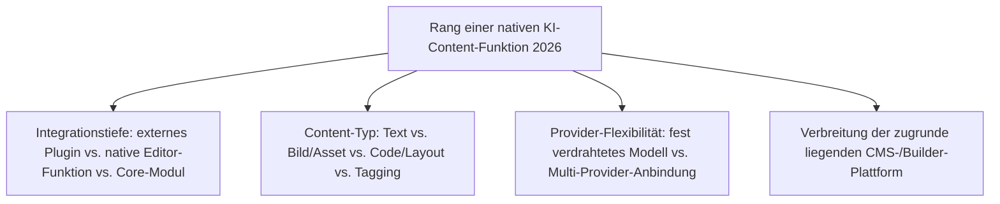
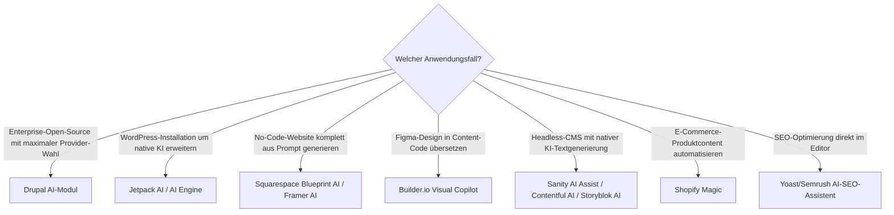

# Beste KI-Content-Erstellung in CMS-Editoren 2026 — Top-20-Topliste

Die [Evolution und Architekturen digitaler KI-Content-Erstellung](evolution-digitaler-ki-content-erstellung.md) ordnet diese Kategorie chronologisch nach Integrationstiefe — vom externen Grammatik-Plugin bis zum vollintegrierten KI-Modul. Diese Seite übersetzt die Chronologie in eine **Momentaufnahme 2026**: 20 native KI-Funktionen **innerhalb** eines CMS- oder Website-Builder-Editors — Text-, Bild- und Code-Generierung direkt am Ort der Content-Erstellung statt in einem separaten Tool.

!!! note "Hinweis: Editor-Feature statt Marketing-Plattform oder Agenten-Workflow"
    Diese Seite grenzt sich bewusst von zwei benachbarten Toplisten ab: [Beste agentische Content-Ökosysteme 2026](agentische-content-oekosysteme-2026-topliste.md) rankt eigenständige Marketing-Plattformen mit mehrstufigen Agenten-Workflows, [Beste Headless-/Klassische/Composable-CMS 2026](headless-cms-2026-topliste.md) ranken das CMS als Ganzes. Hier zählt ausschließlich die **native, in den Editor eingebaute KI-Funktion** — reaktiv oder proaktiv, aber ohne eigenständigen mehrstufigen Agenten-Workflow.

---

## Bewertungskriterien

!!! warning "Achtung: Funktionsumfang ändert sich in diesem Marktsegment schnell"
    Native KI-Editor-Funktionen werden bei fast allen CMS-Anbietern derzeit im Monatstakt ausgebaut — die Rangfolge unten ist eine **Momentaufnahme (Stand: August 2026)**. Rang 11–20 unterscheiden sich in ihrem Funktionsumfang teils erheblich von Monat zu Monat, vor Entscheidung die aktuelle Produktdokumentation prüfen.

---

## Top 20 im Überblick

| Rang | System | Basis-Plattform | Content-Typ | Besondere Stärke |
|---|---|---|---|---|
| 1 | **Drupal AI-Modul** | [Drupal](drupal/evolution-digitaler-drupal.md) | Text, Bild, Tagging, Alt-Text | Vollständigstes Core-Modul, über Symfony AI an 48+ Modell-Provider anbindbar |
| 2 | **WordPress + Jetpack AI** | WordPress | Text, Übersetzung, Grammatik | Größte installierte Basis für native KI-Content-Generierung überhaupt |
| 3 | **AI Engine** (WordPress-Plugin) | WordPress | Text, Bild, Chatbot | Meistgenutzte Alternative zu Jetpack AI im WordPress-Plugin-Ökosystem |
| 4 | **Webflow AI** | Webflow | Text, Layout | KI-Layout- und Textvorschläge direkt im visuellen No-Code-Builder |
| 5 | **Wix AI** (AI Text Creator + Image Generator) | Wix | Text, Bild | Durchgängige native KI über den gesamten No-Code-Erstellungsprozess |
| 6 | **Squarespace Blueprint AI** | Squarespace | Text, Layout, Struktur | Generiert eine vollständige Site-Struktur aus einer kurzen Beschreibung |
| 7 | **Builder.io Visual Copilot** | Builder.io | Code/Layout | Übersetzt Figma-Designs automatisiert in produktionsreife Content-Komponenten |
| 8 | **Framer AI** | Framer | Code/Layout, Text | Prompt-zu-Website-Generierung inklusive responsivem Layout-Code |
| 9 | **Vercel v0** | Framework-übergreifend | Code/Layout | Führende eigenständige Prompt-zu-UI-Code-Generierung, oft in CMS-Workflows eingebunden |
| 10 | **Adobe Firefly in AEM** | Adobe Experience Manager | Bild/Asset | Generative Bilderstellung direkt im Enterprise-WCM-Redaktionsworkflow |
| 11 | **[Sanity](headless-cms-2026-topliste.md) AI Assist** | Sanity | Text, Struktur | Native KI-Generierung direkt im strukturierten Content-Studio |
| 12 | **[Contentful](headless-cms-2026-topliste.md) AI Content Generation** | Contentful | Text | KI-Aktionen direkt auf Content-Type-Feldern statt externem Copy-Paste |
| 13 | **[Storyblok](headless-cms-2026-topliste.md) AI** | Storyblok | Text, Bild | Native KI-Funktionen im visuellen Editor mit Live-Vorschau kombiniert |
| 14 | **HubSpot Content Hub** (native KI-Assistent) | HubSpot | Text, SEO | Reaktive Textgenerierung direkt im Marketing-CMS-Editor |
| 15 | **Shopify Magic** | Shopify | Text, Bild | Native KI für Produktbeschreibungen und -bilder direkt im Shop-Backend |
| 16 | **Notion AI** | Notion | Text, Struktur | KI-Schreibassistent direkt im Block-Editor eines PKM-/Content-Tools |
| 17 | **TYPO3-KI-Erweiterungen** | TYPO3 | Text, Tagging | Community-getriebenes KI-Ökosystem im deutschsprachigen Enterprise-CMS |
| 18 | **Ghost-KI-Erweiterungen** (Koenig-Editor) | Ghost | Text | Wachsendes Community-Plugin-Ökosystem um den nativen Block-Editor |
| 19 | **Canva Magic Media / Magic Write** | Canva | Bild, Text | Breiteste Verankerung in redaktionellen Design-Workflows außerhalb klassischer CMS |
| 20 | **Yoast/Semrush AI-SEO-Assistent** (WordPress) | WordPress | Tagging, SEO-Text | Native KI-Optimierungsvorschläge direkt im SEO-Meta-Bereich des Editors |

---

## Highlights im Detail

### Rang 1: das einzige Core-Modul mit echter Multi-Provider-Anbindung
Das Drupal-AI-Modul unterscheidet sich strukturell von fast allen anderen Kandidaten dieser Liste — statt eines fest verdrahteten Modells bindet es über Symfony AI mehr als 48 Modell-Provider an, sodass Redaktionsteams Anbieter (und damit Kosten, Datenresidenz) frei wählen können, ohne die Editor-Integration selbst zu wechseln.

### Rang 7–9: Design-zu-Code als eigenständige, wachsende Teilkategorie
Builder.io Visual Copilot, Framer AI und Vercel v0 lösen alle dasselbe Grundproblem — die Brücke zwischen Design-Werkzeug und produktionsreifem Content-Code —, mit unterschiedlichem Startpunkt: Builder.io von einem bestehenden Figma-Design aus, Framer und v0 direkt aus einer Textbeschreibung heraus.

### Rang 11–13: die drei führenden Headless-CMS ziehen bei nativer KI gleich
Sanity, Contentful und Storyblok — bereits in der [Headless-CMS-Topliste](headless-cms-2026-topliste.md) unter den Top 4 — haben 2026 alle native KI-Generierungsfunktionen direkt im Content-Studio nachgezogen, statt Redakteure auf externe Tools zu verweisen.

### Rang 16, 19: die Kategorie reicht über klassische CMS hinaus
Notion AI und Canva Magic Media zeigen, dass native KI-Content-Erstellung 2026 kein CMS-exklusives Phänomen mehr ist — beide Tools werden in vielen Redaktionsworkflows faktisch als vorgelagerter Content-Erstellungsschritt genutzt, auch wenn sie selbst kein klassisches Web-CMS sind.

---

## Entscheidungshilfe nach Anwendungsfall

!!! tip "Tipp: Agentische Weiterentwicklung im Blick behalten"
    Mehrere Systeme dieser Liste (insbesondere Rang 1, 4, 12–13) bauen ihre reaktiven Editor-Funktionen aktuell in Richtung mehrstufiger Agenten-Workflows aus — der nächste Reifegrad ist in der [Topliste der agentischen Content-Ökosysteme](agentische-content-oekosysteme-2026-topliste.md) dokumentiert.

---

## 🔗 Verwandte Themen

- [Startseite](../../index.md) — zurück zur Dokumentations-Zentrale
- [Evolution und Architekturen digitaler KI-Content-Erstellung](evolution-digitaler-ki-content-erstellung.md) — chronologisches Generationenmodell, dessen aktuellen Stand diese Topliste zusammenfasst
- [Produktionsreife KI-Content-Erstellung in CMS nach Generation (kein Treffer)](produktionsreife-ki-content-erstellung-generationen-2026-topliste.md) — dieselbe Kategorie durch das konservative Fünf-Filter-Sieb; der einzige quelloffene Kern-Baustein (Drupal AI-Modul) ist von 2024, unter fünf Jahre
- [Beste agentische Content-Ökosysteme 2026 (Top 20)](agentische-content-oekosysteme-2026-topliste.md) — nachfolgende Generation mit mehrstufigen Agenten-Workflows statt Einzel-Editor-Funktionen
- [Beste Headless-CMS 2026 (Top 20)](headless-cms-2026-topliste.md) — vertiefend zu Rang 11–13 (Sanity, Contentful, Storyblok)
- [Beste klassische CMS 2026 (Top 20)](klassische-cms-2026-topliste.md) — vertiefend zu Rang 2–6, 14–15
- [Klassische Wissensmanagement-, KB- & CMS-Systeme mit LLM-Integration](klassische-wissensmanagement-cms-llm-integration.md) — Vertiefung zu konkreten LLM-Integrationen
- [Evolution und Architekturen von Drupal](drupal/evolution-digitaler-drupal.md) — vertiefend zu Rang 1
