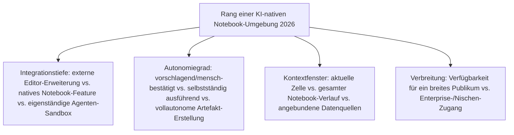
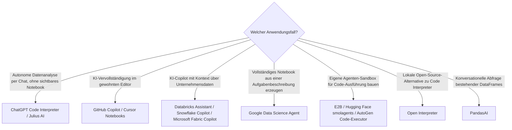

# Beste KI-native Notebook-Umgebungen 2026 — Top-20-Topliste

Die [Evolution und Architekturen digitaler KI-nativer Notebook-Umgebungen](evolution-digitaler-ki-native-notebooks.md) beschreibt die jüngste, noch unreife Notebook-Generation — von KI-Vervollständigung in der Zelle über autonome Code-Ausführungs-Agenten und allgemeine agentische Sandboxes bis zu Cloud-Datenanalyse-Copiloten, Mehrzellen-Analyseplanung und vollautonomer Notebook-Erstellung. Diese Seite übersetzt die Chronologie in eine **Momentaufnahme 2026**: 20 real am Markt verfügbare Produkte und Frameworks, die mindestens einen agentischen Baustein dieser Zeitachse umsetzen.

!!! warning "Achtung: Reifegrad variiert stark zwischen den Rängen dieser Liste"
    Wie bei den agentischen Generationen der CMS-, LMS- und Wissenssysteme-Zeitachsen existieren für die spätesten Generationen dieser Kategorie noch wenige vollständig ausgereifte, breit dokumentierte Referenzsysteme — Rang 5 (Google Data Science Agent) und Rang 20 (Marimo AI) stehen für gerade erst entstehende Produktkategorien, nicht für etablierte Standards. **Stand: August 2026.**

---

## Bewertungskriterien

---

## Top 20 im Überblick

| Rang | System | Anbieter | Generation | Besondere Stärke |
|---|---|---|---|---|
| 1 | **ChatGPT Code Interpreter** (Advanced Data Analysis) | OpenAI | 2 (Autonome Code-Ausführungs-Agenten) | Führt selbstständig Python-Code in isolierter Sandbox aus, interpretiert die Ausgabe und passt den nächsten Schritt an — Referenzimplementierung autonomer Code-Ausführung |
| 2 | **GitHub Copilot** (Notebook-Erweiterung) | Microsoft | 1a (Von Autovervollständigung zu KI-generiertem Code) | Breiteste Verbreitung unter den KI-Coding-Assistenten in Notebook-Umgebungen |
| 3 | **Google Colab Gemini-Integration** | Google | 4 (KI-gestützte Datenanalyse-Copiloten) | Kontext über den gesamten Notebook-Verlauf statt nur die aktuelle Zelle, kostenlos im meistgenutzten Cloud-Notebook integriert |
| 4 | **Databricks Assistant** | Databricks | 4 (KI-gestützte Datenanalyse-Copiloten) | KI-Copilot mit Kontext über Notebook-Historie und angebundene Unternehmensdatenquellen |
| 5 | **Google Data Science Agent** (Colab) | Google | 6 (Ergänzung 2026 — erstes Beispiel der Ausblick-Generation) | Erstellt ein komplettes, lauffähiges Analyse-Notebook aus einer natürlichsprachigen Aufgabenbeschreibung |
| 6 | **Jupyter AI** | Project Jupyter | 1b (Von Autovervollständigung zu KI-generiertem Code) | Offizielles Jupyter-Sub-Projekt mit `%%ai`-Magic-Commands und Chat-Interface direkt in JupyterLab |
| 7 | **Julius AI** | Julius | 5 (Ergänzung 2026) | Eigenständiger KI-Datenanalyse-Chat, zerlegt eine Aufgabe in mehrere aufeinander aufbauende Analyseschritte |
| 8 | **Hex Magic** (Hex AI) | Hex | 5 (Ergänzung 2026) | Generiert mehrere zusammenhängende SQL-/Python-Zellen als kohärenten Analyseablauf direkt im Hex-Notebook |
| 9 | **Cursor Notebooks** | Anysphere | 1 (Ergänzung 2026) | KI-native Code-Editor mit nativer Notebook-Unterstützung, Fortsetzung derselben Architekturlinie wie Cursors allgemeine Editor-KI |
| 10 | **Deepnote AI** | Deepnote | 1 (Ergänzung 2026) | KI-Assistent direkt im kollaborativen Cloud-Notebook, Code-Generierung mit Kontext über mehrere gleichzeitig arbeitende Nutzer |
| 11 | **E2B** | E2B | 3 (Ergänzung 2026) | Meistgenutzte Sandbox-als-Service-Infrastruktur für Agenten-Code-Ausführung, Fundament hinter zahlreichen Drittanbieter-Agentenprodukten |
| 12 | **Open Interpreter** | Open Interpreter | 2 (Ergänzung 2026) | Meistgenutzte Open-Source-Alternative zu ChatGPTs Code Interpreter, lokal statt in einer proprietären Cloud-Sandbox ausführbar |
| 13 | **Snowflake Copilot** (in Notebooks) | Snowflake | 4 (Ergänzung 2026) | KI-Assistent mit Kontext über Snowflake-eigene Datenquellen direkt in Snowflake Notebooks |
| 14 | **Microsoft Fabric Copilot** (Notebooks) | Microsoft | 4 (Ergänzung 2026) | Analoge Integration innerhalb der Microsoft-Fabric-/Azure-Synapse-Notebook-Umgebung |
| 15 | **Google Colab AI** | Google | 1c (Google Colab AI — native Cloud-Integration) | Ursprüngliche native Cloud-Code-Generierung in Colab, Ausgangspunkt vor der tieferen Gemini-Integration |
| 16 | **Claude Analysis Tool** | Anthropic | 2 (Ergänzung 2026) | Führt JavaScript-Code in einer Browser-Sandbox direkt im Chat aus, Anthropics Gegenstück zum Code-Interpreter-Prinzip |
| 17 | **Hugging Face smolagents** (CodeAgent) | Hugging Face | 3 (Ergänzung 2026) | Nutzt Code-Ausführung statt strukturierter Tool-Calls als primären Agenten-Aktionsraum, einflussreiches Open-Source-Referenzframework |
| 18 | **AutoGen Code-Executor** | Microsoft | 3 (Ergänzung 2026) | Isolierte Code-Ausführungskomponente innerhalb von Microsofts Multi-Agenten-Framework |
| 19 | **PandasAI** | PandasAI | 1 (Ergänzung 2026) | Conversational-KI-Schicht direkt über bestehenden Pandas-DataFrames, nutzbar innerhalb jeder klassischen Notebook-Zelle |
| 20 | **Marimo AI** | Marimo | Ergänzung 2026 | KI-generierte Zellen direkt im reaktiven Marimo-Notebook, Konvergenzpunkt zwischen [reaktiven Notebooks](reaktive-notebooks-2026-topliste.md) und dieser Generation |

---

## Highlights im Detail

### Rang 1–2, 6, 15: die vier historisch benannten Gründer-Systeme
ChatGPT Code Interpreter, GitHub Copilot, Jupyter AI und Google Colab AI sind die einzigen vier Systeme dieser Liste, die bereits in der historischen Chronologie selbst namentlich als Generation 1–2 auftauchen, siehe [Generation 1 der KI-nativen-Notebooks-Zeitachse](evolution-digitaler-ki-native-notebooks.md#generation-1-von-autovervollstandigung-zu-ki-generiertem-code-in-der-zelle-2021-2023).

### Rang 5: der erste konkrete Vertreter der Ausblick-Generation
Die Chronologie selbst beschreibt [Generation 6](evolution-digitaler-ki-native-notebooks.md#generation-6-vollautonome-notebook-erstellung-aus-aufgabenbeschreibung-ab-20242025) noch als reinen Ausblick ohne Referenzsystem — Googles Data Science Agent in Colab ist 2026 das erste real verfügbare Produkt, das diese Generation konkret ausfüllt.

### Rang 11, 17–18: die generische Sandbox-Infrastruktur aus Generation 3 wird konkret
E2B, Hugging Face smolagents und AutoGen Code-Executor zeigen, wie aus dem in der Chronologie nur abstrakt benannten Baustein „Code-Execution-Tools in Agenten-Frameworks" ([Generation 3](evolution-digitaler-ki-native-notebooks.md#generation-3-notebook-artige-agenten-sandboxes-als-allgemeines-agenten-werkzeug-ab-2023)) drei konkurrierende, real genutzte Produkte geworden sind — eine dedizierte Sandbox-Infrastruktur (E2B) und zwei Agenten-Framework-Komponenten (Hugging Face, Microsoft).

### Rang 7–8: Mehrzellen-Analyseplanung als eigenständiges Produktversprechen
Julius AI und Hex Magic setzen [Generation 5](evolution-digitaler-ki-native-notebooks.md#generation-5-multi-zellen-planung-statt-einzelzellen-vervollstandigung-ab-2024) direkt als Kernfunktion um, statt sie als Nebenfeature einer bestehenden Notebook-Plattform anzubieten.

---

## Entscheidungshilfe nach Anwendungsfall

!!! tip "Tipp: Rust- und Cloud-Perspektive separat prüfen"
    Die lokale ML-Inferenz-Infrastruktur hinter mehreren dieser Copiloten behandelt [Beste Rust-Bausteine für Notebooks 2026](rust-notebooks-2026-topliste.md); die zugrunde liegenden Cloud-Plattformen, in die viele dieser Assistenten eingebettet sind, [Beste Cloud-Notebook-Plattformen 2026](cloud-notebooks-2026-topliste.md).

---

## 🔗 Verwandte Themen

- [Startseite](../../index.md) — zurück zur Dokumentations-Zentrale
- [Evolution und Architekturen digitaler KI-nativer Notebook-Umgebungen](evolution-digitaler-ki-native-notebooks.md) — chronologisches Generationenmodell, dessen aktuellen Stand diese Topliste zusammenfasst
- [Beste Notebook-Systeme 2026 (Top 20)](notebook-systeme-2026-topliste.md) — Gesamtmarkt-Topliste über alle sechs Notebook-Generationen hinweg
- [Beste Cloud-Notebook-Plattformen 2026 (Top 20)](cloud-notebooks-2026-topliste.md) — technische Grundlage für Rang 3–5, 13–14 dieser Liste
- [Beste reaktive Notebooks 2026 (Top 10)](reaktive-notebooks-2026-topliste.md) — vorausgehende Generation, konvergiert bei Rang 20 (Marimo AI) mit dieser Kategorie
- [Evolution und Architekturen digitaler Autonomer KI-Agenten](../../künstliche-intelligenz/evolution-digitaler-autonome-ki-agenten.md) — allgemeine Agenten-Zeitachse hinter Rang 11, 17–18
- [LLM-Wiki-Pattern (Karpathy-Muster)](llm-wiki-pattern-karpathy.md) — verwandtes Prinzip, das dieses Repository selbst nutzt
