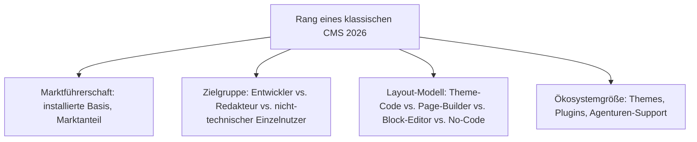
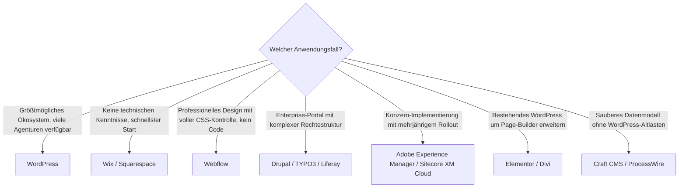

# Beste klassische CMS 2026 — Top-20-Topliste

Die [Evolution und Architekturen digitaler klassischer CMS](evolution-digitaler-klassische-cms.md) ordnet diese Kategorie chronologisch nach Architektur-Generation. Diese Seite übersetzt die Chronologie in eine **Momentaufnahme 2026**: die 20 klassischen, monolithischen Content-Management-Systeme mit der größten Verbreitung, aktivsten Weiterentwicklung und breitesten Einsatzfähigkeit — unabhängig von MCP-/Agenten-Support.

!!! note "Hinweis: Abgrenzung zur bestehenden CMS-MCP-Topliste"
    Die [CMS-Topliste mit MCP-Server](cms-mcp-server-topliste.md) mischt klassische und headless CMS gleichberechtigt und filtert nach MCP-/Agenten-Reife als Kernkriterium. Diese Seite bleibt strikt auf die **klassische, monolithische Kategorie** beschränkt (deckungsgleich mit [Evolution digitaler klassischer CMS](evolution-digitaler-klassische-cms.md)) und rankt nach allgemeiner Marktführerschaft, Ökosystemgröße und Zugänglichkeit — MCP-Support erscheint hier gar nicht als Kriterium.

---

## Bewertungskriterien

!!! warning "Achtung: Marktführerschaft ≠ beste technische Architektur"
    WordPress führt diese Liste klar wegen installierter Basis und Ökosystemgröße an, nicht weil seine Kernarchitektur 2026 als technisch modernste gilt — reine Headless-/Composable-Architekturen (siehe [Headless-CMS-Topliste](headless-cms-2026-topliste.md) und [Composable-CMS-Topliste](composable-cms-2026-topliste.md)) übertreffen klassische Systeme in API-Reife und Skalierbarkeit. **Stand: August 2026.**

---

## Top 20 im Überblick

| Rang | System | Zielgruppe | Layout-Modell | Besondere Stärke |
|---|---|---|---|---|
| 1 | **[WordPress](klassische-wissensmanagement-cms-llm-integration.md)** (Core) | Redakteur-zentriert | Block-Editor (Gutenberg) + Theme-Code | Größte installierte Basis aller CMS weltweit, riesigstes Plugin-/Theme-Ökosystem |
| 2 | **Wix** | nicht-technischer Einzelnutzer | No-Code Drag-and-Drop | Größte SaaS-Website-Builder-Nutzerbasis, umfangreicher App-Marktplatz |
| 3 | **Squarespace** | nicht-technischer Einzelnutzer | No-Code, design-fokussiert | Führend bei ästhetisch kuratierten Templates ohne Konfigurationsaufwand |
| 4 | **Webflow** | Redakteur/Designer-Brücke | Visueller Editor mit vollem CSS-Zugriff | Einzige No-Code-Lösung dieser Liste mit professioneller HTML/CSS-Kontrolle |
| 5 | **Joomla** | Redakteur-zentriert | Theme-Code + Erweiterungen | Drittgrößtes CMS-Ökosystem weltweit, sehr granulares Rechtemodell |
| 6 | **[Drupal](drupal/evolution-digitaler-drupal.md)** (klassischer Modus) | Entwickler-zentriert | Theme-Code (Twig) | Ausgeprägteste Enterprise-Rechte-/Workflow-Tiefe unter den Open-Source-Systemen |
| 7 | **TYPO3** | Entwickler-zentriert | Theme-Code (Fluid) | Starke Verbreitung im deutschsprachigen Enterprise-Raum, granulares Rechtemodell |
| 8 | **Adobe Experience Manager** | Entwickler-zentriert (Enterprise) | Komponentenbasiertes Theme-System | Tiefste Integration in die übrige Adobe-Experience-Cloud-Suite |
| 9 | **Sitecore XM Cloud** | Entwickler-zentriert (Enterprise) | Komponentenbasiertes Theme-System | Cloud-natives Enterprise-WCM mit Composable-Anlehnung |
| 10 | **Liferay Portal** | Entwickler-zentriert (Enterprise) | Portlet-basiertes Layout | Führend bei Intranet-/Portal-Szenarien mit komplexer Rechtestruktur |
| 11 | **Alfresco** | Entwickler-zentriert (Enterprise) | Dokumentenzentriertes Content-Modell | Stärkster Fokus auf Dokumentenmanagement/Records-Management unter Enterprise-WCM |
| 12 | **Elementor** (WordPress-Page-Builder) | Redakteur-zentriert | Visueller Page-Builder als Plugin | Meistgenutzter WordPress-Page-Builder, riesige Community-Template-Bibliothek |
| 13 | **Divi** (WordPress-Page-Builder) | Redakteur-zentriert | Visueller Page-Builder mit Live-Vorschau | Echtzeit-Frontend-Bearbeitung direkt im Seitenkontext |
| 14 | **WooCommerce** (WordPress-Erweiterung) | Redakteur-zentriert | erbt WordPress-Layout-Modell | Größte Open-Source-E-Commerce-Erweiterung, profitiert vom WordPress-Ökosystem |
| 15 | **Craft CMS** | Entwickler-zentriert | Flexibles Feld-/Template-Modell | Sehr sauberes, entwicklerfreundliches Datenmodell ohne WordPress-Altlasten |
| 16 | **October CMS** (Laravel-basiert) | Entwickler-zentriert | Komponentenbasiertes Theme-System | Modernes PHP-Framework (Laravel) als Fundament statt Eigenbau-Kern |
| 17 | **Umbraco** | Entwickler-zentriert (.NET) | Theme-Code (Razor) | Führende Wahl für bestehende .NET-/Enterprise-Landschaften |
| 18 | **Concrete CMS** | Redakteur-zentriert | Inline-Editing direkt auf der Seite | Bearbeitung direkt im Seitenkontext statt separatem Admin-Bereich |
| 19 | **ProcessWire** | Entwickler-zentriert | Sehr flexibles Feld-/API-Modell | Größte Datenmodell-Flexibilität unter den kleineren Open-Source-Systemen |
| 20 | **Contao** | Redakteur-zentriert | Theme-Code + Modul-System | Stärkste DSGVO-/Barrierefreiheits-Ausrichtung, relevant für EU-Compliance-Projekte |

---

## Highlights im Detail

### Rang 1: WordPress bleibt uneinholbar bei Marktanteil
Kein anderes System dieser Liste kommt auch nur annähernd an WordPress' installierte Basis heran — das Plugin-Ökosystem (inklusive Rang 12–14 dieser Liste, die alle direkt auf WordPress aufsetzen) macht den Kern selbst zur Plattform für weitere eigenständige Produkte.

### Rang 2–4: No-Code-Builder differenzieren sich über Ästhetik vs. Kontrolle
Wix, Squarespace und Webflow lösen dasselbe Grundproblem — Websites ohne Code-Kenntnisse —, aber mit klar unterschiedlichem Kompromiss: Wix maximiert Marktreichweite und App-Vielfalt, Squarespace kuratiertes Design, Webflow professionelle CSS-Kontrolle auf Kosten der Einstiegshürde.

### Rang 8–11: Enterprise-WCM bleibt eine eigene Liga
Adobe Experience Manager, Sitecore, Liferay und Alfresco konkurrieren kaum direkt mit WordPress oder den No-Code-Buildern — ihre Zielgruppe sind Konzerne mit mehrjährigen Implementierungsprojekten, nicht Einzelpersonen oder kleine Teams.

### Rang 12–14: das WordPress-Ökosystem als eigene Wertschöpfungsebene
Elementor, Divi und WooCommerce zeigen, dass WordPress' Erfolg 2026 nicht nur dem Kern selbst zuzuschreiben ist — ein eigenständiges Ökosystem aus Drittanbieter-Produkten baut direkt auf dem WordPress-Fundament auf und wird oft unabhängig vom Kern bewertet und gekauft.

---

## Entscheidungshilfe nach Anwendungsfall

!!! tip "Tipp: Headless-/Composable-Alternative separat prüfen"
    Wer primär API-first arbeiten will, findet in der [Headless-CMS-Topliste 2026](headless-cms-2026-topliste.md) und der [Composable-CMS-Topliste 2026](composable-cms-2026-topliste.md) die passenderen Kandidaten — mehrere Systeme aus dieser Liste (WordPress, Drupal) decken über eine optionale REST-/JSON-API zusätzlich Headless-Szenarien ab, siehe [Generation 6 der klassischen CMS-Zeitachse](evolution-digitaler-klassische-cms.md#generation-6-hybrid-ruckkehr-klassisches-cms-mit-optionaler-headless-api-ab-2016).

---

## 🔗 Verwandte Themen

- [Startseite](../../index.md) — zurück zur Dokumentations-Zentrale
- [Evolution und Architekturen digitaler klassischer CMS](evolution-digitaler-klassische-cms.md) — chronologisches Generationenmodell, dessen aktuellen Stand diese Topliste zusammenfasst
- [Klassische CMS mit PostgreSQL-/Dateiformat-Speicherung (Top 7)](klassische-cms-postgresql-dateiformat-2026-topliste.md) — dieselbe Kategorie, strenger gefiltert nach Lizenz, Speicherbackend und Entwicklungsaktivität
- [Beste Headless-CMS 2026 (Top 20)](headless-cms-2026-topliste.md) — nachfolgende Architektur-Generation, API-first statt monolithisch
- [Beste Composable-CMS & MACH-Systeme 2026 (Top 20)](composable-cms-2026-topliste.md) — Rang 8–9 dieser Liste im Composable-Kontext, siehe dortige Migrationsperspektive
- [Beste CMS-Systeme (Open Source) mit MCP-Server (Top 20)](cms-mcp-server-topliste.md) — Gegenstück nach MCP-/Agenten-Reife statt Marktführerschaft
- [Evolution und Architekturen von Drupal](drupal/evolution-digitaler-drupal.md) — vertiefende Produkt-Geschichte zu Rang 6
- [Klassische Wissensmanagement-, KB- & CMS-Systeme mit LLM-Integration](klassische-wissensmanagement-cms-llm-integration.md) — LLM-Integration konkreter Systeme aus dieser Liste
