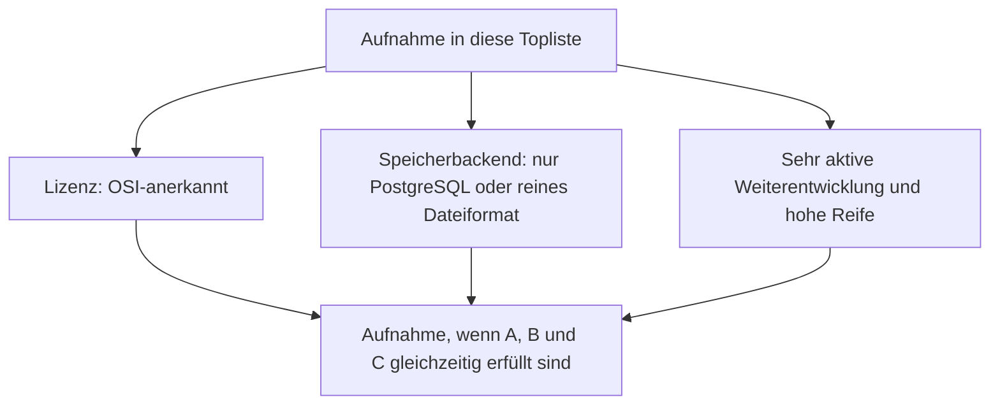
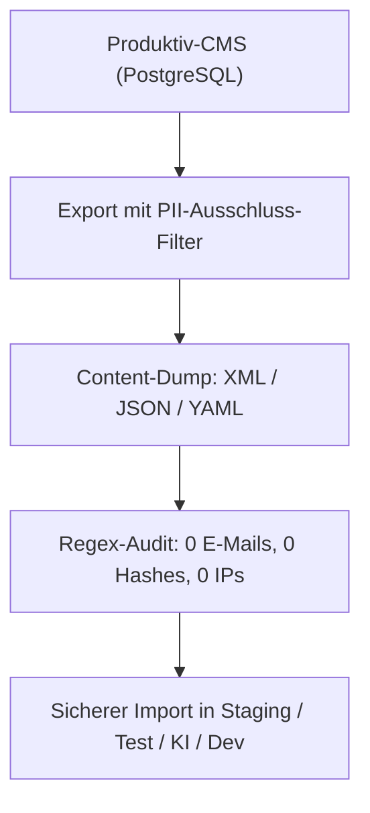
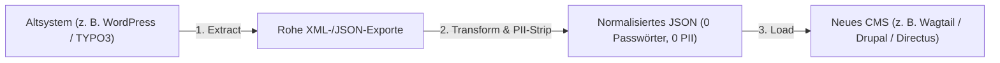
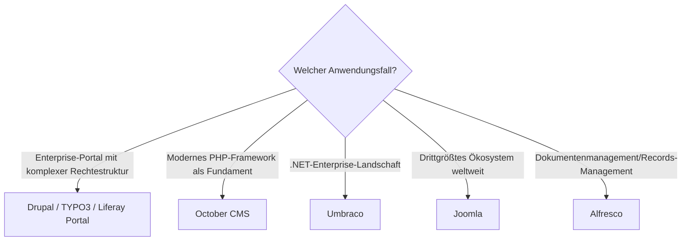

# Klassische CMS mit PostgreSQL- oder Dateiformat-Speicherung, aktiver Weiterentwicklung & hoher Reife — Top-7-Topliste

Die [Beste klassische CMS 2026 (Top 20)](klassische-cms-2026-topliste.md) rankt die gesamte Kategorie nach Marktführerschaft, unabhängig von Lizenz und Speicherarchitektur. Diese Seite wendet auf genau dieselbe Kategorie die inzwischen etablierten strengeren Kriterien an: nur OSI-Open-Source, Content-Persistenz ausschließlich in PostgreSQL oder einem reinen Dateiformat, sehr aktive Weiterentwicklung, hohe Reife.

!!! note "Hinweis: Nur OSI-anerkannte Lizenzen"
    Wie in der [Gesamtübersicht](open-source-llm-agent-mcp-systeme.md) zählen hier ausschließlich Systeme unter einer OSI-anerkannten Open-Source-Lizenz. Das kostet dieser Liste alle proprietären SaaS-Anbieter der Basis-Topliste (Wix, Squarespace, Webflow, Adobe Experience Manager, Sitecore XM Cloud) sowie Craft CMS, dessen Kernlizenz einen kostenpflichtigen Erwerb für den produktiven Einsatz verlangt.

!!! tip "Tipp: Warum diese Liste besonders kurz ist"
    WordPress — der unangefochtene Rang 1 der Basis-Topliste — fällt hier ausgerechnet wegen des Speicherkriteriums heraus: Der WordPress-Kern unterstützt offiziell nur MySQL/MariaDB, kein PostgreSQL. Damit fallen auch die drei direkt auf WordPress aufbauenden Systeme der Basis-Topliste (Elementor, Divi, WooCommerce) automatisch mit heraus.

---

## Bewertungskriterien



!!! warning "Achtung: Momentaufnahme, Stand August 2026 — bewusst kürzer als 20"
    Von den 20 Systemen der [Basis-Topliste](klassische-cms-2026-topliste.md) fallen 13 heraus: fünf proprietäre SaaS-/Enterprise-Anbieter (Wix, Squarespace, Webflow, Adobe Experience Manager, Sitecore XM Cloud), Craft CMS (Lizenz), WordPress selbst wegen fehlendem PostgreSQL-Support sowie die drei WordPress-Erweiterungen Elementor, Divi und WooCommerce, die dieselbe Einschränkung erben, dazu Concrete CMS, ProcessWire und Contao (kein offizieller PostgreSQL-Support).

---

## Top 7 im Überblick

| Rang | System | Lizenz | Speicherbackend | Aktivität/Reife |
|---|---|---|---|---|
| 1 | **[Drupal](drupal/evolution-digitaler-drupal.md)** | GPL-2.0-or-later | PostgreSQL, MySQL/MariaDB oder SQLite offiziell wählbar | Ausgeprägteste Enterprise-Tiefe, sehr aktiv seit 2001 |
| 2 | **TYPO3** | GPL-2.0-or-later | PostgreSQL offiziell unterstützt (seit Version 9) | Starke Verbreitung im deutschsprachigen Enterprise-Raum |
| 3 | **October CMS** | MIT (Laravel-Fundament) | PostgreSQL, MySQL oder SQLite über Laravel/Eloquent | Modernes PHP-Framework als Unterbau, aktiv |
| 4 | **Umbraco** | MIT | PostgreSQL offiziell unterstützt seit Version 13 (2024) | Führende .NET-Wahl, aktiv seit der jüngsten Postgres-Öffnung |
| 5 | **Joomla** | GPL-2.0-or-later | PostgreSQL wählbar (MySQL/MariaDB in der Praxis üblicher) | Drittgrößtes CMS-Ökosystem weltweit, aktiv |
| 6 | **Liferay Portal** (Community Edition) | LGPL-2.1 | PostgreSQL offiziell unterstützt | Führend bei Intranet-/Portal-Szenarien, aktiv |
| 7 | **Alfresco** (Community Edition) | LGPL-3.0 | PostgreSQL als empfohlenes Backend | Stärkster Dokumentenmanagement-Fokus, aktiv |

---

## Highlights im Detail

### WordPress fällt ausgerechnet am Speicherkriterium
Kein anderes System dieser Serie demonstriert so deutlich, dass Marktführerschaft und die Kriterien dieser Topliste unabhängig voneinander sind: WordPress dominiert die Basis-Topliste uneinholbar, scheitert hier aber an einer einzigen technischen Randbedingung — dem fehlenden offiziellen PostgreSQL-Support. Wer WordPress-Kompatibilität mit PostgreSQL-Speicherung kombinieren will, findet in Drupal (Rang 1) die architektonisch nächstliegende Alternative mit vergleichbarer Enterprise-Tiefe.

### Drei Enterprise-Systeme mit offiziellem Multi-DB-Support
Drupal, TYPO3 und October CMS zeigen, dass PostgreSQL-Unterstützung 2026 kein Nischenmerkmal ist, sondern bei den technisch anspruchsvollsten Systemen dieser Kategorie zum Standard gehört — alle drei unterstützen PostgreSQL als gleichwertige Alternative zu MySQL, nicht als nachträglich angeflanschten Sonderfall.

---

## 🛡️ PII-Ausschluss-Garantie bei CMS-Software & Backup-Topliste

Was bedeutet die **„PII-Ausschluss-Garantie" (Personally Identifiable Information Exclusion Guarantee)** im CMS-Umfeld, und welche CMS-Software kann Backups für Entwicklungs-, Staging- oder KI-Umgebungen erstellen, die **garantiert frei von personenbezogenen Daten** sind?

### Warum Standard-Backups ein DSGVO-/Compliance-Risiko sind:
- **Gefahr von SQL-Dumps (`pg_dump` / `mysqldump`):** Ein vollständiger Datenbank-Dump enthält alle geschützten Nutzerdaten: Passwörter (Bcrypt/Argon2-Hashes), E-Mail-Adressen von Autoren und Abonnenten, IP-Adressen aus Logs, Session-Tokens und Formulardaten.
- **Gesetzliche Vorgabe (DSGVO Art. 25 & 32):** Entwickler- und Test-Systeme (oder Übergaben an KI-Agenten wie Claude Code) dürfen **niemals unanonymisierte Echtdaten** aus dem Produktivbetrieb enthalten.
- **Die PII-Ausschluss-Garantie:** Das CMS bietet integrierte, standardisierte Export-Tools, die redaktionelle Inhalte (Seiten, Medien-Metadaten, Taxonomien, Vorlagen) sichern, während **Benutzerkonten, Rollenzuweisungen und Authentifizierungsdaten technisch ausgeschlossen** werden.



---

### Topliste: CMS-Software nach PII-Ausschluss-Reifegrad

| Rang | CMS-Software | PII-Ausschluss-Methode | Export-Format | Datenbank-Neutralität | Enterprise-Reifegrad |
|---|---|---|---|---|---|
| 🥇 1 | **Wagtail** (Django) | `manage.py dumpdata --exclude auth.user --exclude sessions` | `content.json` / `content.yaml` | ⭐⭐⭐⭐⭐ (PostgreSQL ↔ MySQL ↔ SQLite) | ⭐⭐⭐⭐⭐ (20+ Jahre Django-Standard) |
| 🥈 2 | **Drupal** | Content Sync / Default Content (`drush content-export`) | `.yml` / `.json` | ⭐⭐⭐⭐⭐ (Entity-API importiert überall) | ⭐⭐⭐⭐⭐ (Industrieweit bewährt) |
| 🥉 3 | **TYPO3** | T3D-Export (`.t3d` / `.xml`) ohne `be_users`/`fe_users` | T3D-XML / Data Structure | ⭐⭐⭐⭐⭐ (Über Doctrine DBAL) | ⭐⭐⭐⭐⭐ (25+ Jahre Enterprise-Praxis) |
| 4 | **Payload CMS** | Script-basierter Export ohne Auth-Collections | JSON-Collections | ⭐⭐⭐⭐⭐ (Drizzle / PostgreSQL) | ⭐⭐⭐⭐ (Modern & typsicher) |
| 5 | **Directus** | Schema-Snapshot + selektiver Tabellen-Dump | YAML (Schema) + JSON (Content) | ⭐⭐⭐⭐⭐ (Database-Agnostic) | ⭐⭐⭐⭐ (Database-First) |
| 6 | **October CMS** | Laravel Model-Export ohne `backend_users` | JSON / YAML (Eloquent) | ⭐⭐⭐⭐⭐ (Über Eloquent ORM) | ⭐⭐⭐⭐ (Laravel-Ökosystem) |
| 7 | **WordPress** | ⚠️ Standard-Export (`wp-export`) enthält oft User-Metadaten | WXR / XML | ⭐⭐⭐ (MySQL-zentriert) | ⭐⭐⭐ (Erfordert manuelle Filterung) |

---

### Die 3 Best-Practice-Methoden zur PII-freien Sicherung

#### 1. Modell-Ausschluss über ORM-Serialisierung (**Wagtail / Django**)
Wagtail trennt Content-Modelle und Authentifizierungs-Modelle auf Framework-Ebene. Ein PII-freier Dump schließt administrative Tabellen explizit aus:
```bash
python manage.py dumpdata \
  --natural-foreign --natural-primary \
  --exclude auth.user \
  --exclude auth.permission \
  --exclude sessions \
  --exclude wagtailcore.pagerevision \
  --indent 2 > clean_cms_content.json
```

#### 2. Strukturierter Seitenbaum-Export (**TYPO3 T3D-XML**)
TYPO3 ermöglicht das selektive Exportieren ganzer mehrsprachiger Seitenbäume inklusive aller Inhaltselemente und Verknüpfungen in eine portable `.t3d`- oder `.xml`-Datei. Backend-Benutzer (`be_users`) und sensible Log-Tabellen werden konstruktionsbedingt nicht mitexportiert.

#### 3. Entkoppelte Entity-Synchronisation (**Drupal Content Sync**)
Drupal trennt System-Konfiguration (`config_sync`) und redaktionelle Inhalte (`content_sync`). Über strukturierte YAML-Dateien werden Inhaltstypen, Menüs und Taxonomien versionskontrolliert exportiert — ohne Berührungspunkt mit der internen Benutzer- und Session-Tabelle.

---

### 💻 Terminal-Praxis: PII-freie CMS-Backups per CLI erstellen & wiederherstellen

So werden **100 % PII-freie Content-Backups** für die führenden CMS direkt auf der Linux-Konsole erstellt und eingespielt:


#### 1. Wagtail (Django CLI) — Der sauberste JSON-Dump
```bash
# EXPORT: Sichert Seiten, Snippets und Bilder-Metadaten ohne Passwörter/Sessions
python manage.py dumpdata \
  --natural-foreign --natural-primary \
  --exclude auth.user \
  --exclude auth.permission \
  --exclude contenttypes \
  --exclude sessions \
  --exclude admin.logentry \
  --exclude wagtailcore.pagerevision \
  --indent 2 > wagtail_clean_content.json

# RESTORE: In frischer Test-Datenbank einspielen
python manage.py migrate
python manage.py loaddata wagtail_clean_content.json
```

#### 2. Drupal (Drush CLI) — Entity-basierter YAML-Export
```bash
# EXPORT: Exportiert redaktionelle Nodes, Menüs und Taxonomien ohne User-Entitäten
drush content-sync:export \
  --entity-types=node,taxonomy_term,menu_link_content,media \
  --destination=/backups/drupal-clean/

# RESTORE: Importiert alle YAML-Entities in die Staging-Instanz
drush content-sync:import --source=/backups/drupal-clean/
```

#### 3. TYPO3 (TYPO3 Console) — T3D-Seitenbaum-Export
```bash
# EXPORT: Exportiert Seitenbaum ab Root-PID 1 (inkl. 10 Ebenen) als T3D-XML
./vendor/bin/typo3 impexp:export \
  --pid=1 \
  --depth=10 \
  --file=/backups/typo3_clean_tree.t3d

# RESTORE: Importiert den Seitenbaum auf der Ziel-Instanz
./vendor/bin/typo3 impexp:import \
  --file=/backups/typo3_clean_tree.t3d \
  --pid=0
```

#### 4. WordPress (WP-CLI) — Bereinigter XML-Export
```bash
# EXPORT: Exportiert ausschließlich öffentliche Posts, Pages und Custom Post Types
wp export \
  --post_type=post,page \
  --dir=/backups/ \
  --filename_format=wordpress_clean_content.xml

# RESTORE: Importiert XML-Datenbestand ohne Benutzerkonten neu anzulegen
wp import /backups/wordpress_clean_content.xml --authors=mapping.csv
```

---

### Automatisierte PII-Audit-Checkliste vor Staging-Imports

Bevor ein CMS-Content-Backup in Entwicklungs-, Staging- oder KI-Umgebungen geladen wird:

- [x] **E-Mail-Scan:** Keine Kunden- oder Autoren-E-Mail-Adressen im Dump (`grep -E -i "\b[A-Za-z0-9._%+-]+@[A-Za-z0-9.-]+\.[A-Z|a-z]{2,7}\b" backup.json`).
- [x] **Hash-Scan:** Keine Bcrypt/Argon2-Passwort-Hashes im Dump (`grep -E "^\$2[ayb]\$.{56}" backup.json`).
- [x] **IP-Adress-Bereinigung:** Keine IPv4- oder IPv6-Adressen aus Zugriffs- und Audit-Logs enthalten.
- [x] **Session- & Cookie-Prüfung:** Keine aktiven Session-Schlüssel oder API-Tokens im Export.

---

## 🔄 PII-Ausschluss-Garantie bei der CMS-zu-CMS Cross-Migration

Wie gelingt die **Migration von redaktionellen Großinhalten zwischen unterschiedlichen CMS-Systemen** (z. B. von WordPress zu Wagtail, von TYPO3 zu Drupal oder von Drupal zu Directus/Payload), ohne dass veraltete Passwörter, inaktive Mitarbeiter-Accounts, E-Mail-Adressen oder Sicherheits-Altlasten in das neue System geschleppt werden?

### Das Risiko klassischer „All-in-One"-Datenbankmigrationen:
- **Altlasten-Transfer:** Direkte SQL-Migrationen kopieren alte Benutzerkonten mit schwachen Hash-Verfahren (z. B. MD5/SHA1 aus Altsystemen), verwaiste E-Mail-Adressen ehemaliger Mitarbeiter und personenbezogene Daten in Kommentaren oder Web-Formularen mit.
- **Ziel:** Eine **reine Content-to-Content ETL-Pipeline (Extract, Transform, Load)**, die nur semantische Inhalte (Titel, Body-Text, Medien, Taxonomien, Slugs) migriert und Autorenbeziehungen auf **generische Systemrollen** normalisiert.



---

### Cross-CMS Migrationsmatrix mit PII-Ausschluss

| Quell-CMS | Ziel-CMS | Empfohlener Migrationsweg | PII-Schutz-Mechanismus | Automatisierungsgrad mit Claude Code |
|---|---|---|---|---|
| **WordPress** | **Wagtail** (Django) | WP REST-API / XML → Python ETL-Script | Autoren werden auf generischen Admin gemappt, Passwörter ignoriert | ⭐⭐⭐⭐⭐ (Vollständig scriptbar) |
| **TYPO3** | **Drupal** | T3D-XML / DBAL → Drupal `migrate_plus` | Selektive Migration von `tt_content` & `pages` ohne `be_users` | ⭐⭐⭐⭐⭐ (YAML-Migration-Pipelines) |
| **Drupal** | **Payload CMS** | Drupal JSON:API → Node.js Batch-Script | Nur Node-Entitäten werden in Drizzle/PostgreSQL geschrieben | ⭐⭐⭐⭐⭐ (TypeScript SDK) |
| **Joomla** | **Directus** | SQL-Views (nur Content-Tabellen) → Directus CLI | System-Tabellen (`jos_users`) werden komplett umgangen | ⭐⭐⭐⭐ (Directus REST-API) |
| **WordPress** | **Drupal** | `wordpress_migrate` Modul mit Filter | XML-Import mit Autoren-Mapping auf Standard-Rolle | ⭐⭐⭐⭐ (Drush CLI) |

---

### 🛠️ Praxis-Beispiel: PII-bereinigte Migration von WordPress zu Wagtail (Python)

Dieses Python-Migrationsskript demonstriert, wie Inhalte aus der WordPress REST-API extrahiert, von E-Mails/Telefonnummern bereinigt und PII-frei in Wagtail importiert werden:

```python
import re
import requests

# 1. EXTRACT: Artikel aus WordPress REST-API abrufen (ohne Benutzer-Endpunkte)
wp_url = "https://altes-cms.example.com/wp-json/wp/v2/posts?per_page=100"
posts = requests.get(wp_url).json()

# 2. TRANSFORM & PII-STRIPPING: E-Mails und Telefonnummern aus dem Text filtern
EMAIL_REGEX = r'\b[A-Za-z0-9._%+-]+@[A-Za-z0-9.-]+\.[A-Z|a-z]{2,7}\b'

clean_articles = []
for post in posts:
    clean_body = re.sub(EMAIL_REGEX, "[anonymisiert@example.com]", post["content"]["rendered"])
    
    clean_articles.append({
        "title": post["title"]["rendered"],
        "slug": post["slug"],
        "body": clean_body,
        "date": post["date"],
        "author": "Redaktionsteam",  # Generischer Autor statt echter Mitarbeiter-Account
        "status": "published"
    })

# 3. LOAD: In Wagtail / PostgreSQL via Django Management Command importieren
# python manage.py import_clean_articles clean_articles.json
```

---

### Sicherheitsregeln für die CMS-Cross-Migration

1. **Kein Import von Passwort-Hashes:** Passwörter aus Altsystemen niemals übernehmen. Nach der Migration erhalten neue Redakteure Einladungslinks mit MFA-/Passkey-Registrierung.
2. **Medien-Scan auf Metadaten (EXIF-Stripping):** Bilder beim Import durch Werkzeuge wie `exiftool` oder `Pillow` jagen, um GPS-Standortdaten und Kamera-Seriennummern der Autoren zu entfernen.
3. **Link- und Weiterleitungs-Integrität:** Slugs beibehalten oder 301-Redirects via Nginx/Reverse-Proxy definieren, um SEO-Verluste zu verhindern.
4. **Sanitization von Legacy-Shortcodes:** WordPress- oder TypoScript-Shortcodes vor dem Import in saubere HTML5- oder Markdown-Blöcke transformieren.

---

## Entscheidungshilfe nach Anwendungsfall



---

## 🔗 Verwandte Themen

- [Startseite](../../index.md) — zurück zur Dokumentations-Zentrale
- [Beste klassische CMS 2026 (Top 20)](klassische-cms-2026-topliste.md) — Basis-Topliste ohne Lizenz-/Speicherbackend-/Aktivitätsfilter
- [Produktionsreife klassische Open-Source-CMS nach Generation (Top 3)](produktionsreife-klassische-cms-generationen-2026-topliste.md) — noch strenger: zusätzlich fünf Jahre Produktion, große Betreiberbasis und sehr große Betriebs-Skala; von diesen 7 bleiben Drupal, TYPO3 und Liferay Portal CE
- [Beste Headless-CMS mit PostgreSQL-/Dateiformat-Speicherung (Top 9)](headless-cms-postgresql-dateiformat-2026-topliste.md) — Schwester-Topliste für die Headless-Kategorie
- [Open-Source-Wissenssysteme mit PostgreSQL- oder Dateiformat-Speicherung (Top 22)](postgresql-dateiformat-wissenssysteme-2026-topliste.md) — dieselben Speicherkriterien für die Wissenssysteme-Klasse
- [Klassische Wissensmanagement-, KB- & CMS-Systeme mit LLM-Integration](klassische-wissensmanagement-cms-llm-integration.md) — LLM-Integration konkreter Systeme aus dieser Liste
