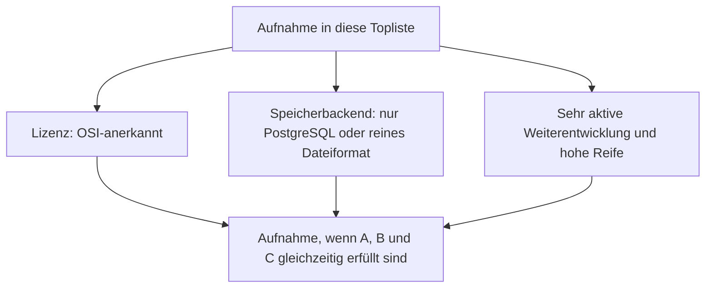
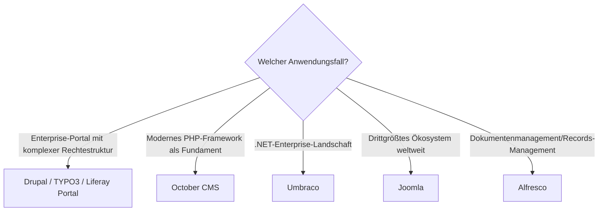

# Klassische CMS mit PostgreSQL- oder Dateiformat-Speicherung, aktiver Weiterentwicklung & hoher Reife — Top-7-Topliste

Die [Beste klassische CMS 2026 (Top 20)](klassische-cms-2026-topliste.md) rankt die gesamte Kategorie nach Marktführerschaft, unabhängig von Lizenz und Speicherarchitektur. Diese Seite wendet auf genau dieselbe Kategorie die inzwischen etablierten strengeren Kriterien an: nur OSI-Open-Source, Content-Persistenz ausschließlich in PostgreSQL oder einem reinen Dateiformat, sehr aktive Weiterentwicklung, hohe Reife.

!!! note "Hinweis: Nur OSI-anerkannte Lizenzen"
    Wie in der [Gesamtübersicht](open-source-llm-agent-mcp-systeme.md) zählen hier ausschließlich Systeme unter einer OSI-anerkannten Open-Source-Lizenz. Das kostet dieser Liste alle proprietären SaaS-Anbieter der Basis-Topliste (Wix, Squarespace, Webflow, Adobe Experience Manager, Sitecore XM Cloud) sowie Craft CMS, dessen Kernlizenz einen kostenpflichtigen Erwerb für den produktiven Einsatz verlangt.

!!! tip "Tipp: Warum diese Liste besonders kurz ist"
    WordPress — der unangefochtene Rang 1 der Basis-Topliste — fällt hier ausgerechnet wegen des Speicherkriteriums heraus: Der WordPress-Kern unterstützt offiziell nur MySQL/MariaDB, kein PostgreSQL. Damit fallen auch die drei direkt auf WordPress aufbauenden Systeme der Basis-Topliste (Elementor, Divi, WooCommerce) automatisch mit heraus.

---

## Bewertungskriterien

!!! warning "Achtung: Momentaufnahme, Stand August 2026 — bewusst kürzer als 20"
    Von den 20 Systemen der [Basis-Topliste](klassische-cms-2026-topliste.md) fallen 13 heraus: fünf proprietäre SaaS-/Enterprise-Anbieter (Wix, Squarespace, Webflow, Adobe Experience Manager, Sitecore XM Cloud), Craft CMS (Lizenz), WordPress selbst wegen fehlendem PostgreSQL-Support sowie die drei WordPress-Erweiterungen Elementor, Divi und WooCommerce, die dieselbe Einschränkung erben, dazu Concrete CMS, ProcessWire und Contao (kein offizieller PostgreSQL-Support).

---

## Top 7 im Überblick

| Rang | System | Lizenz | Speicherbackend | Aktivität/Reife |
|---|---|---|---|---|
| 1 | **[Drupal](drupal/evolution-digitaler-drupal.md)** | GPL-2.0-or-later | PostgreSQL, MySQL/MariaDB oder SQLite offiziell wählbar | Ausgeprägteste Enterprise-Tiefe, sehr aktiv seit 2001 |
| 2 | **TYPO3** | GPL-2.0-or-later | PostgreSQL offiziell unterstützt (seit Version 9) | Starke Verbreitung im deutschsprachigen Enterprise-Raum |
| 3 | **October CMS** | MIT (Laravel-Fundament) | PostgreSQL, MySQL oder SQLite über Laravel/Eloquent | Modernes PHP-Framework als Unterbau, aktiv |
| 4 | **Umbraco** | MIT | PostgreSQL offiziell unterstützt seit Version 13 (2024) | Führende .NET-Wahl, aktiv seit der jüngsten Postgres-Öffnung |
| 5 | **Joomla** | GPL-2.0-or-later | PostgreSQL wählbar (MySQL/MariaDB in der Praxis üblicher) | Drittgrößtes CMS-Ökosystem weltweit, aktiv |
| 6 | **Liferay Portal** (Community Edition) | LGPL-2.1 | PostgreSQL offiziell unterstützt | Führend bei Intranet-/Portal-Szenarien, aktiv |
| 7 | **Alfresco** (Community Edition) | LGPL-3.0 | PostgreSQL als empfohlenes Backend | Stärkster Dokumentenmanagement-Fokus, aktiv |

---

## Highlights im Detail

### WordPress fällt ausgerechnet am Speicherkriterium
Kein anderes System dieser Serie demonstriert so deutlich, dass Marktführerschaft und die Kriterien dieser Topliste unabhängig voneinander sind: WordPress dominiert die Basis-Topliste uneinholbar, scheitert hier aber an einer einzigen technischen Randbedingung — dem fehlenden offiziellen PostgreSQL-Support. Wer WordPress-Kompatibilität mit PostgreSQL-Speicherung kombinieren will, findet in Drupal (Rang 1) die architektonisch nächstliegende Alternative mit vergleichbarer Enterprise-Tiefe.

### Drei Enterprise-Systeme mit offiziellem Multi-DB-Support
Drupal, TYPO3 und October CMS zeigen, dass PostgreSQL-Unterstützung 2026 kein Nischenmerkmal ist, sondern bei den technisch anspruchsvollsten Systemen dieser Kategorie zum Standard gehört — alle drei unterstützen PostgreSQL als gleichwertige Alternative zu MySQL, nicht als nachträglich angeflanschten Sonderfall.

---

## Entscheidungshilfe nach Anwendungsfall

---

## 🔗 Verwandte Themen

- [Startseite](../../index.md) — zurück zur Dokumentations-Zentrale
- [Beste klassische CMS 2026 (Top 20)](klassische-cms-2026-topliste.md) — Basis-Topliste ohne Lizenz-/Speicherbackend-/Aktivitätsfilter
- [Beste Headless-CMS mit PostgreSQL-/Dateiformat-Speicherung (Top 9)](headless-cms-postgresql-dateiformat-2026-topliste.md) — Schwester-Topliste für die Headless-Kategorie
- [Open-Source-Wissenssysteme mit PostgreSQL- oder Dateiformat-Speicherung (Top 20)](postgresql-dateiformat-wissenssysteme-2026-topliste.md) — dieselben Speicherkriterien für die Wissenssysteme-Klasse
- [Klassische Wissensmanagement-, KB- & CMS-Systeme mit LLM-Integration](klassische-wissensmanagement-cms-llm-integration.md) — LLM-Integration konkreter Systeme aus dieser Liste
