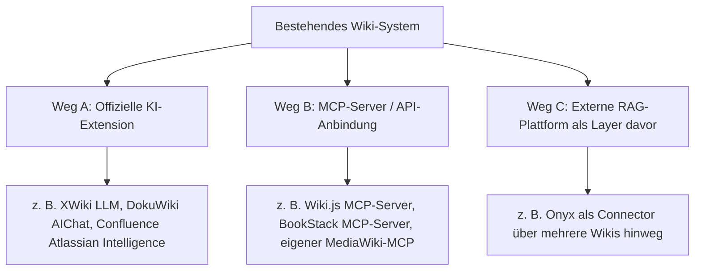

# Klassische Wiki- & Knowledge-Base-Systeme mit LLM-Integration

Das Kapitel [Native „LLM-first" Wiki-Tools & Agenten](llm-first-wiki-tools-agenten.md) behandelt Werkzeuge, die von Grund auf um ein Sprachmodell herum gebaut sind. Die meisten produktiv eingesetzten Wikis sind jedoch **etablierte, klassische Systeme** — MediaWiki, XWiki, Confluence, DokuWiki, Wiki.js, BookStack, Obsidian — die es bereits vor dem LLM-Boom gab. Dieses Kapitel ordnet ein, **wie** sich KI-Funktionen in genau diese bestehenden Systeme nachrüsten lassen, ohne die Plattform selbst zu wechseln.

!!! warning "Achtung: Funktionsumfang ändert sich laufend"
    KI-Erweiterungen für bestehende Wiki-Systeme entwickeln sich aktuell sehr schnell. Die Angaben hier sind eine **Momentaufnahme (Stand: Juli 2026)** — vor einer Entscheidung die aktuelle Extension-/Plugin-Seite des jeweiligen Systems prüfen.

---

## Übersicht: Drei Integrationswege

!!! tip "Tipp: Welchen Weg wählen?"
    - **Weg A (offizielle Extension)** bevorzugen, wenn eine ausgereifte, vom Projekt selbst gepflegte Erweiterung existiert — sie respektiert in der Regel die bestehende Rechteverwaltung (ACL) automatisch.
    - **Weg B (MCP-Server)** wählen, wenn ein Entwickler-Agent (Claude Code, Claude Desktop, Antigravity CLI) gezielt mit dem Wiki interagieren soll — Lesen, Schreiben, Strukturieren — statt nur Fragen zu beantworten.
    - **Weg C (externe RAG-Plattform)** wählen, wenn mehrere Datenquellen (nicht nur ein Wiki) gemeinsam durchsuchbar sein sollen, siehe [Onyx (ehem. Danswer)](onyx-danswer-rag-plattform.md).

---

## Vergleichstabelle

| System | Integrationsweg | Kernfunktion | Beachtet bestehende Rechte (ACL)? | Modell-Wahl |
|---|---|---|---|---|
| **[MediaWiki](mediawiki/index.md)** | Weg B (Eigenbau) | Kein offizielles KI-Plugin; Skript-Bot oder selbst gebauter MCP-Server auf `mwclient`-Basis | ja, über Bot-Konto + Rechtegruppe (manuell konfiguriert) | frei wählbar (eigener API-Aufruf) |
| **[XWiki](xwiki/installieren.md)** | Weg A (offiziell) | **LLM-Extension** (`xwiki-contrib/ai-llm`, Projekt „WAISE"): RAG-Chatbot direkt im Wiki, indexiert Seiten/Dokumente | ja, nativ in die XWiki-Rechteverwaltung integriert | On-Premise-LLM möglich (Datenhoheit) |
| **Confluence** | Weg A (offiziell) | **Atlassian Intelligence** + „Rovo"-KI-Teammate: Zusammenfassungen, Seitenentwürfe, „Remix" (Text → Diagramme/Präsentationen) | ja, an Confluence-Berechtigungen gekoppelt | fest von Atlassian vorgegeben (kein Custom-Modell) |
| **DokuWiki** | Weg A (offiziell) | **AIChat**- und **AI-Agent**-Plugin (CosmoCode): Chat über Wiki-Inhalte, KI-Agent kann Seiten lesen/suchen/bearbeiten | ja, respektiert vollständig DokuWikis ACL-System | OpenAI, Anthropic, Gemini, lokal via Ollama |
| **Wiki.js** | Weg B | Kein natives KI-Feature; **MCP-Server** bindet die GraphQL-API an (Suchen, Lesen, Erstellen, Bearbeiten, Verschieben von Seiten) | abhängig vom API-Token-Scope des MCP-Servers | frei wählbar (MCP-Client-seitig, z. B. Claude) |
| **BookStack** | Weg B / Weg C | Kein natives KI-Feature; **MCP-Server** für Agent-Zugriff oder externe RAG-Anbindung (z. B. via Onyx-Connector) | abhängig von der gewählten Integration | frei wählbar |
| **Obsidian** | Weg B (Community-Plugins) | **Copilot**-Plugin (Chat mit dem Vault), **Smart Connections** (lokale Embeddings, kontextloses Auffinden verwandter Notizen), **Text Generator** (promptgesteuerte Textbausteine) | entfällt (Single-User, lokale Dateien) | Cloud-Modelle oder vollständig lokal via Ollama |

---

## Details je System

### XWiki: offizielle LLM-Extension (WAISE)
Die von XWiki selbst entwickelte **LLM-Extension** integriert einen RAG-basierten Chatbot direkt in die Wiki-Oberfläche. Administratoren legen fest, wer Anfragen stellen darf, welches Modell verwendet wird und wie der Chatbot sich verhält — inklusive **On-Premise-Betrieb** für Organisationen mit Datenschutzanforderungen. Da dieses Repository bereits eine [XWiki-Installationsanleitung](xwiki/installieren.md) führt, ist die LLM-Extension der naheliegendste Erweiterungsschritt für ein bestehendes XWiki-Setup.

### DokuWiki: AIChat & AI-Agent-Plugin
Das von **CosmoCode** gepflegte `dokuwiki-plugin-aichat` bindet ein LLM als Chatbot ein, der Fragen anhand der Wiki-Inhalte beantwortet. Die erweiterte **AI-Agent**-Funktion geht darüber hinaus: Der Agent kann eigenständig Seiten durchsuchen, lesen und — mit entsprechender Berechtigung — bearbeiten. Wichtig: Beide Plugins **respektieren vollständig DokuWikis ACL-System** — die KI sieht und bearbeitet nur, wozu der jeweilige Nutzer ohnehin berechtigt ist.

### Confluence: Atlassian Intelligence & Rovo
Atlassian hat KI-Funktionen direkt in die Cloud-Produkte integriert: **Atlassian Intelligence** übernimmt Zusammenfassungen und Seitenentwürfe, das KI-„Teammate" **Rovo** durchsucht und verknüpft Unternehmensdaten über mehrere Atlassian-Produkte hinweg, und die **Remix**-Funktion wandelt Textseiten in Diagramme oder Präsentationsentwürfe um. Diese Funktionen sind an **Confluence Cloud Premium/Enterprise** gebunden und nur mit von Atlassian vorgegebenen Modellen nutzbar — anders als bei den selbstgehosteten Systemen oben besteht keine freie Modell-Wahl.

### Wiki.js & BookStack: MCP statt native KI
Weder Wiki.js noch BookStack bringen ein eingebautes KI-Feature mit. Beide lassen sich jedoch über einen **MCP-Server** an KI-Agenten anbinden: Bei Wiki.js läuft dieser über die GraphQL-API und erlaubt vollständige CRUD-Operationen auf Seiten, bei BookStack über die REST-API. Der Agent (z. B. Claude Code oder Claude Desktop) erhält damit gezielte Werkzeuge (`search`, `get_page`, `create_page`, …) statt eines vorgefertigten Chat-Widgets — vergleichbar mit dem [MCP-Ansatz für MediaWiki](mediawiki/mediawiki-ki-agent.md#2-mcp-server-mediawiki-als-werkzeug-fur-allgemeine-agenten) in diesem Repository. Für reine Wissensabfrage über mehrere Systeme hinweg (nicht nur Bearbeitung) eignet sich alternativ eine externe RAG-Plattform wie [Onyx](onyx-danswer-rag-plattform.md) als vorgeschalteter Layer.

### Obsidian: Community-Plugin-Ökosystem
Da Obsidian ein **lokales, dateibasiertes** Single-User-System ist, entfällt die Frage der Rechteverwaltung — dafür rückt die Wahl zwischen mehreren konkurrierenden Community-Plugins in den Fokus: **Copilot** bündelt Chat-mit-dem-Vault, semantische Suche und Inline-Generierung in einem Plugin; **Smart Connections** erzeugt lokale Vektor-Embeddings und zeigt automatisch verwandte Notizen an, ganz ohne aktive Anfrage; **Text Generator** eignet sich für promptgesteuerte, vorlagenbasierte Textbausteine. In der Praxis kombinieren viele Nutzer Smart Connections (passives Auffinden) mit Copilot oder Text Generator (aktives Chatten/Generieren). Alle drei laufen wahlweise vollständig lokal über Ollama, sodass keine Notiz das eigene Gerät verlassen muss.

---

## Verwandte Themen

- [Startseite](../../index.md) — zurück zur Dokumentations-Zentrale
- [Native „LLM-first" Wiki-Tools & Agenten](llm-first-wiki-tools-agenten.md) — Gegenstück: von Grund auf KI-native Werkzeuge statt nachgerüsteter Integration
- [MediaWiki KI-Agent](mediawiki/mediawiki-ki-agent.md) — ausführlicher Praxis-Guide für den Eigenbau-Weg bei MediaWiki
- [Onyx (ehem. Danswer): RAG-Plattform](onyx-danswer-rag-plattform.md) — Weg C: ein RAG-Layer über mehrere Wikis/Datenquellen hinweg
- [OpenWiki: Repo-Dokumentations-Agent (LangChain)](openwiki-repo-dokumentation-agent.md) — verwandtes Referenz-statt-Volltext-Prinzip für Code-Repos
- [Dokumentenerstellung, Wikis & Notebooks](index.md) — Gesamtübersicht aller Dokumentations-Systeme
