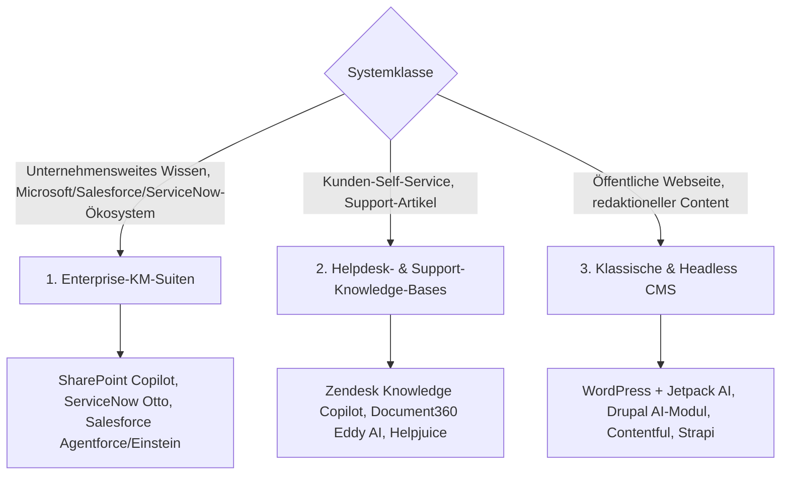

# Klassische Wissensmanagement-, Knowledge-Base- & CMS-Systeme mit LLM-Integration

Das Kapitel [Klassische Wiki-Systeme mit LLM-Integration](klassische-wiki-systeme-llm-integration.md) behandelt reine Wiki-Plattformen (MediaWiki, XWiki, Confluence, DokuWiki, Wiki.js, BookStack, Obsidian). Wissensarbeit findet in Unternehmen jedoch mindestens genauso häufig in drei angrenzenden Systemklassen statt: **Enterprise-Wissensmanagement-Suiten** (SharePoint, ServiceNow, Salesforce), **Helpdesk-/Support-Knowledge-Bases** (Zendesk, Document360, Helpjuice) und klassischen **Content-Management-Systemen** (WordPress, Drupal, Contentful, Strapi). Dieses Kapitel ordnet ein, wie diese etablierten Systeme ihre KI-Funktionen 2026 benennen und wie tief die jeweilige Integration reicht.

!!! warning "Achtung: Funktionsumfang & Namen ändern sich laufend"
    Gerade bei den großen Enterprise-Suiten benennt der Hersteller die KI-Funktionen teils mehrfach pro Jahr um (siehe SharePoint unten). Die Angaben hier sind eine **Momentaufnahme (Stand: Juli 2026)** — vor einer Entscheidung die aktuelle Produktseite prüfen.

---

## Übersicht

---

## Vergleichstabelle

| System | Kategorie | KI-Produktname (2026) | Integrationstiefe | Modell frei wählbar? |
|---|---|---|---|---|
| **Microsoft SharePoint / M365** | Enterprise-KM | **Copilot in SharePoint** (vormals „Knowledge Agent", davor „AI in SharePoint") | Grounding-Quelle für M365 Copilot, automatische Content-Anreicherung, Ausschluss sensibler Sites konfigurierbar | nein, an Microsoft 365 Copilot gebunden |
| **ServiceNow** | Enterprise-KM | **Otto** (Zusammenführung von Now Assist, Moveworks, AI Experience) | konversationelle Suche, autonome Workflow-Orchestrierung über Abteilungen hinweg | nein, ServiceNow-eigene Plattform |
| **Salesforce** | Enterprise-KM | **Agentforce** (autonome Agenten) + **Einstein** (prädiktive Vorhersagen) | Agentforce liest CRM-Daten über Data Cloud, handelt über Flows/APIs, eskaliert an Menschen | nein, Salesforce-eigene Modelle |
| **Zendesk** | Helpdesk/KB | **Zendesk Copilot** + **Knowledge Copilot** (2026 neu) | Copilot unterstützt Agenten live, Knowledge Copilot pflegt Artikel eigenständig anhand von Ticket-Insights | nein, Zendesk-eigenes Add-on ($50/Agent/Monat) |
| **Document360** | Helpdesk/KB | **Eddy AI** | KI-Schreibassistent, KI-Suche, Artikel-Strukturierung | nein, produktinterne KI |
| **Helpjuice** | Helpdesk/KB | KI-Suche (kein eigener Assistenten-Name) | primär KI-gestützte Volltextsuche über Artikel | nein |
| **WordPress** | CMS | **Jetpack AI** (+ Drittanbieter: Rank Math AI, Elementor AI) | Content-Generierung, Übersetzung, Grammatikkorrektur direkt im Gutenberg-Editor | teilweise (Jetpack AI selbst fest verdrahtet, Drittanbieter-Plugins oft frei wählbar) |
| **Drupal** | CMS | **AI-Modul** (Core, Symfony-AI-basiert) | Content-Erstellung, semantische Suche, automatischer Alt-Text, Hintergrund-Agenten | ja, 48+ Provider (OpenAI, Anthropic, Gemini, Mistral, Ollama) |
| **Contentful** | Headless CMS | KI-orchestrierter „Composable Stack Hub" | KI als zentrale Steuerungsebene über den gesamten Content-Stack | eingeschränkt, herstellerseitig orchestriert |
| **Strapi** | Headless CMS | Plugin-basierte KI-Integration (kein fester Produktname) | KI-generierte dynamische Seiten per API-Trigger, KI-Übersetzungs-Hooks | ja, Entwickler binden beliebige APIs selbst an |

---

## Details je Systemklasse

### 1. Enterprise-Wissensmanagement-Suiten

**SharePoint / Microsoft 365** hat seine KI-Strategie seit Mitte 2025 bereits zweimal umbenannt — von „Knowledge Agent for SharePoint" über „AI in SharePoint" zu **„Copilot in SharePoint"** (Stand Mai/Juni 2026). Der Kerngedanke bleibt: SharePoint wird zur zentralen **Grounding-Quelle** für Microsoft 365 Copilot, indem Inhalte automatisch angereichert, kategorisiert und für KI-Antworten „AI-ready" gemacht werden. Wichtig für Governance: einzelne, sensible Sites lassen sich gezielt von der Copilot-Indexierung ausschließen.

**ServiceNow** hat seine bisherigen KI-Bausteine (Now Assist, Moveworks, AI Experience) 2026 zu **Otto** zusammengeführt — einer einheitlichen KI, die konversationelle Suche, Multimodalität und autonome Workflow-Orchestrierung über Abteilungsgrenzen hinweg vereint. Voraussetzung für gute Otto-Antworten ist laut ServiceNow selbst eine **bereinigte Knowledge Base** — schlechte Artikel führen direkt zu schlechten KI-Antworten.

**Salesforce** trennt bewusst zwischen **Einstein** (prädiktive, nicht-generative Vorhersagen wie Lead-Scoring oder Next-Best-Action, trainiert auf historischen CRM-Daten) und **Agentforce** (autonome, generative Agenten, die über die Data Cloud auf Echtzeitdaten zugreifen und eigenständig mehrstufige Prozesse ausführen). Wo Einstein etwas markiert, handelt Agentforce.

!!! note "Hinweis: Enterprise-KM-Suiten sind Closed-Ecosystem-Lösungen"
    Anders als bei den selbstgehosteten Systemen aus [Klassische Wiki-Systeme mit LLM-Integration](klassische-wiki-systeme-llm-integration.md) (z. B. XWiki, DokuWiki) ist bei SharePoint, ServiceNow und Salesforce das Sprachmodell **fest an das jeweilige Ökosystem gebunden** — es gibt keine freie Provider-Wahl wie bei [Onyx](onyx-danswer-rag-plattform.md) oder den selbstgehosteten Wiki-Extensions.

### 2. Helpdesk- & Support-Knowledge-Bases

**Zendesk** hat 2026 mit dem **Knowledge Copilot** eine eigenständige Erweiterung des bestehenden Admin-Copilots eingeführt: Er wertet Support-Konversationen aus, erkennt Lücken und veraltete Artikel und schlägt daraus automatisch neue Entwürfe vor — ein Pflege-Workflow, der konzeptionell dem [Human-in-the-Loop-Prinzip](llm-first-wiki-tools-agenten.md#4-autonome-wiki-pflege-agenten-agent-schreibt-in-ein-bestehendes-wiki) aus den LLM-first-Wiki-Agenten ähnelt, hier aber produktseitig fertig ausgeliefert wird.

**Document360** setzt auf den KI-Assistenten **Eddy AI** für Schreibunterstützung, Struktur-Vorschläge und KI-gestützte Suche. **Helpjuice** fokussiert sich dagegen primär auf KI-gestützte Volltextsuche über bestehende Artikel, ohne einen vergleichbar aktiven Schreib-Assistenten.

### 3. Klassische & Headless CMS

**WordPress** bindet KI-Funktionen überwiegend über Plugins ein — **Jetpack AI** (offizielles Automattic-Plugin) bringt Textgenerierung, Übersetzung und Grammatikkorrektur direkt in den Gutenberg-Block-Editor, ergänzt durch Drittanbieter wie Rank Math AI (SEO) oder Elementor AI (Page-Builder).

**Drupal** verfolgt einen deutlich offeneren Architektur-Ansatz: Das offizielle **AI-Modul** (Kern-Contrib-Modul mit über 13.900 aktiven Installationen, Stand April 2026) baut auf der Vendor-Abstraktionsschicht **Symfony AI** auf und bindet über 48 Provider an — von OpenAI und Anthropic bis zu selbstgehosteten Ollama-Modellen. Die Roadmap 2026 sieht u. a. automatische Seitengenerierung, Hintergrund-Agenten und semantische Suche vor.

**Contentful** positioniert sich als KI-orchestrierter „Composable Stack Hub", der als zentrale Steuerungsebene über den gesamten Content-Stack fungiert — mit vergleichsweise geschlossener, herstellerseitig gesteuerter KI-Schicht. **Strapi** verfolgt als Open-Source-Headless-CMS den entgegengesetzten Weg: Statt fertiger KI-Produkte stellt Strapi eine erweiterbare Plugin-Architektur bereit, mit der Entwickler eigene KI-Integrationen bauen — z. B. API-getriggerte, KI-generierte Seiten oder KI-Übersetzungs-Hooks.

---

## Auswahlkriterium nach Anwendungsfall

!!! tip "Tipp: Passende Systemklasse je nach Ausgangslage"
    - **Bereits im Microsoft-365-/Salesforce-/ServiceNow-Ökosystem** → die jeweils integrierte KI (Copilot in SharePoint, Agentforce, Otto) nutzen, statt eine zusätzliche Plattform danebenzustellen.
    - **Kunden-Self-Service-Portal mit hohem Ticketvolumen** → Zendesk Knowledge Copilot oder Document360 Eddy AI, da beide gezielt auf Support-Content-Pflege ausgelegt sind.
    - **Öffentliche Webseite/Blog mit Redaktionsteam** → WordPress + Jetpack AI für den schnellen Einstieg, Drupal AI-Modul, wenn freie Provider-Wahl und tiefere Governance-Anforderungen (siehe Roadmap-Fokus „Advanced Governance") wichtig sind.
    - **Produktkatalog/Multi-Channel-Content über mehrere Frontends** → Headless CMS (Contentful für Enterprise-Governance, Strapi für volle Entwickler-Kontrolle über die KI-Anbindung).
    - **Datenhoheit/On-Premise-Pflicht** → keines der hier genannten Cloud-nativen Enterprise-Systeme, sondern die selbstgehosteten Wege aus [Klassische Wiki-Systeme mit LLM-Integration](klassische-wiki-systeme-llm-integration.md) oder [Onyx](onyx-danswer-rag-plattform.md).

---

## Verwandte Themen

- [Startseite](../../index.md) — zurück zur Dokumentations-Zentrale
- [Klassische Wiki-Systeme mit LLM-Integration](klassische-wiki-systeme-llm-integration.md) — das Pendant für reine Wiki-Plattformen
- [Native „LLM-first" Wiki-Tools & Agenten](llm-first-wiki-tools-agenten.md) — Gegenstück: von Grund auf KI-native Werkzeuge
- [Onyx (ehem. Danswer): RAG-Plattform](onyx-danswer-rag-plattform.md) — selbstgehostete Alternative, die mehrere der hier genannten Systeme als Datenquelle anbinden kann
- [Custom Chat-Assistenten im Anbieter-Vergleich](../../künstliche-intelligenz/coding/custom-chat-assistenten-anbieter-vergleich.md) — Gems, GPTs & Projects als verwandtes Konzept auf Modell-Anbieterseite
- [Multi-LLM- & Sprachmodell-Anbieter im Vergleich](../../künstliche-intelligenz/coding/llm-anbieter-vergleich.md) — Preise der Modelle hinter den frei wählbaren Integrationen (z. B. Drupal AI-Modul)
