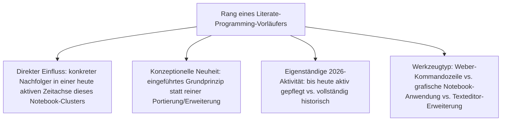
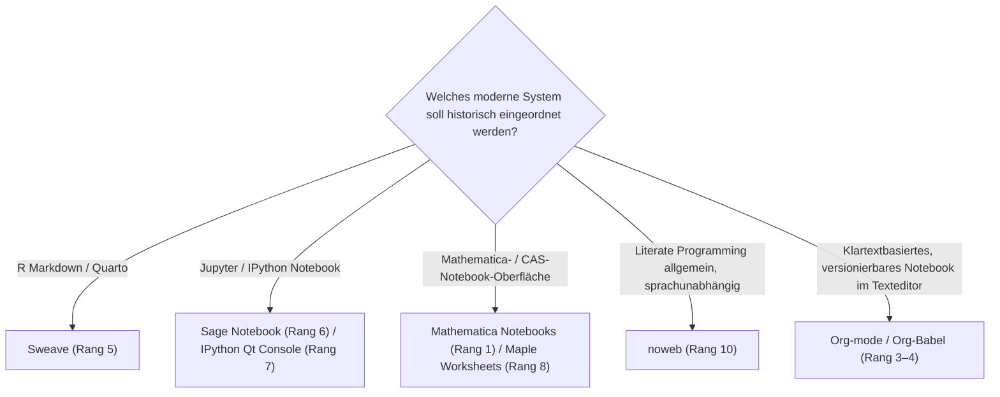

# Einflussreichste Literate-Programming-Vorläufer — Top-10-Topliste

Die [Evolution und Architekturen digitaler Notebook-Vorläufer](evolution-digitaler-notebook-vorlaeufer.md) ordnet diese Kategorie chronologisch nach Architektur-Generation — von Donald Knuths ursprünglichem Literate-Programming-Konzept über sprachunabhängige Weiterentwicklungen, Computer-Algebra-System-Notebooks, Sweave und Emacs Org-mode/Babel bis zum Sage Notebook unmittelbar vor der eigentlichen Jupyter-Ära. Diese Seite übersetzt die Chronologie in eine **nach historischem Einfluss gerankte Top-10-Liste** — anders als bei den übrigen Notebook-Toplisten dieses Clusters ist der Maßstab hier nicht Marktanteil 2026, sondern die Frage, wie stark ein System die spätere Notebook-Architektur tatsächlich geprägt hat.

!!! note "Hinweis: Rankingmaßstab weicht von den übrigen Notebook-Toplisten ab"
    Die meisten Systeme dieser Liste sind historisch, teils vollständig abgelöst (WEB, CWEB, IPython Qt Console) oder nur noch in Nischen aktiv (noweb, Sage Notebook) — ein Ranking nach aktueller Nutzerzahl wäre daher wenig aussagekräftig. Stattdessen rankt diese Seite nach **direktem architektonischem Einfluss auf spätere, noch heute genutzte Systeme**. Org-mode/Babel bilden die einzige Ausnahme mit echter eigenständiger 2026-Marktpräsenz jenseits reiner Nachwirkung.

---

## Bewertungskriterien

---

## Top 10 im Überblick

| Rang | System | Generation | Jahr | Historische Bedeutung |
|---|---|---|---|---|
| 1 | **Mathematica Notebooks** | 2 (Computer-Algebra-System-Notebooks) | 1988 | Prägt den Begriff „Notebook" für die gesamte spätere Systemkategorie, bis heute kommerziell aktiv weiterentwickelt |
| 2 | **WEB** (Knuths Literate Programming) | 1a (Knuths Literate Programming, WEB & CWEB) | 1984 | Konzeptionelle Wurzel jedes späteren Notebook-Systems — Code und Erklärung erstmals im selben Dokument statt getrennter Dateien |
| 3 | **Org-mode** | 4 (Emacs Org-mode & Babel) | 2003 | Einziges System dieser Liste mit echter eigenständiger 2026-Marktpräsenz, bis heute aktiv innerhalb der Emacs-Community weiterentwickelt |
| 4 | **Org-Babel** | 4 (Emacs Org-mode & Babel) | 2009 | Erweitert Org-mode um ausführbare Multi-Sprachen-Codeblöcke als reine Klartextdatei, dadurch von Beginn an git-diff-freundlich |
| 5 | **Sweave** | 3 (Sweave — Literate Programming trifft Statistik) | 2002 | Direkter, namentlich in der Chronologie belegter Vorläufer von R Markdown — die konzeptionell einflussreichste Brücke zur modernen R-Markdown-/Quarto-Linie |
| 6 | **Sage Notebook** | 5 (Sage Notebook — browserbasiert vor Jupyter) | 2005–2006 | Erstes browserbasiertes Notebook-Interface Jahre vor IPython, direkter architektonischer Vorläufer des späteren Jupyter-Notebook-Interfaces |
| 7 | **IPython Qt Console** | 6 (Der Übergang zu IPython) | 2010 | Unmittelbarer technischer Zwischenschritt zwischen reiner Terminal-Shell und dem vollen Browser-Notebook |
| 8 | **Maple Worksheets** | 2 (Computer-Algebra-System-Notebooks) | 1982 | Früheste interaktive Arbeitsblatt-Oberfläche dieser gesamten Liste, sechs Jahre vor Mathematica Notebooks |
| 9 | **CWEB** | 1b (Knuths Literate Programming, WEB & CWEB) | 1987 | Portiert das WEB-Prinzip von Pascal auf die deutlich verbreitetere Sprache C, erweiterte damit erheblich die praktische Reichweite |
| 10 | **noweb** | 1c (Knuths Literate Programming, WEB & CWEB) | 1989 | Verallgemeinert Literate Programming auf beliebige Sprachen statt fester Sprachbindung, bis heute in Literate-Haskell- und ähnlichen Nischen-Setups im Einsatz |

---

## Highlights im Detail

### Rang 1–2: zwei unabhängige Ursprungsgeschichten
Mathematica Notebooks und Knuths WEB stehen für zwei getrennte Wurzeln derselben Grundidee — WEB als reines Text-/Kommandozeilenwerkzeug für Code-Dokumentation, Mathematica Notebooks als erste grafische Notebook-Anwendung mit Eingabe-/Ausgabezellen. Beide Linien laufen erst in [Generation 2 der übergeordneten Notebook-Zeitachse](evolution-digitaler-notebook-systeme.md) zusammen.

### Rang 3–4: die einzige bis heute aktiv genutzte Linie dieser Liste
Org-mode und Org-Babel unterscheiden sich fundamental von den übrigen acht Einträgen: Sie sind keine historischen Wegbereiter im Ruhestand, sondern ein bis 2026 aktiv weiterentwickeltes, produktiv genutztes System innerhalb der Emacs-Community — parallel zum längst dominanten Jupyter-Ökosystem, siehe [Generation 4](evolution-digitaler-notebook-vorlaeufer.md#generation-4-emacs-org-mode-babel-literate-programming-im-texteditor-2003-2009).

### Rang 5–6: die klarsten dokumentierten Brücken zu heutigen Toplisten
Sweave und Sage Notebook sind die beiden Systeme dieser Liste mit dem direktesten Pfad in eine der übrigen Notebook-Toplisten dieses Clusters — Sweave zu [Beste R-Markdown- & Quarto-Werkzeuge 2026](rmarkdown-quarto-2026-topliste.md), Sage Notebook architektonisch zu [Beste IPython- & Jupyter-Systeme 2026](ipython-jupyter-2026-topliste.md), siehe [Generation 3 und 5](evolution-digitaler-notebook-vorlaeufer.md#generation-3-sweave-literate-programming-trifft-statistik-2002).

---

## Wegweiser: von Vorläufer zu heutigem Nachfolgesystem

!!! tip "Tipp: die tatsächlich heute genutzten Nachfolger"
    Für den produktiven Einsatz 2026 sind die Nachfolgesysteme relevant, nicht die hier gerankten Vorläufer selbst — siehe [Beste R-Markdown- & Quarto-Werkzeuge 2026](rmarkdown-quarto-2026-topliste.md) und [Beste IPython- & Jupyter-Systeme 2026](ipython-jupyter-2026-topliste.md). Einzige Ausnahme mit eigenständiger 2026-Relevanz: Org-mode/Babel (Rang 3–4).

---

## 🔗 Verwandte Themen

- [Startseite](../../index.md) — zurück zur Dokumentations-Zentrale
- [Evolution und Architekturen digitaler Notebook-Vorläufer](evolution-digitaler-notebook-vorlaeufer.md) — chronologisches Generationenmodell, dessen historischen Einfluss diese Topliste zusammenfasst
- [Produktionsreife Notebook-Vorläufer nach Generation (Top 1)](produktionsreife-notebook-vorlaeufer-generationen-2026-topliste.md) — dieselben zehn Systeme durch das konservative Fünf-Filter-Sieb; nur Org-mode/Babel besteht, WEB/CWEB/noweb scheitern an der aktiven Betreiberbasis
- [Beste Notebook-Systeme 2026 (Top 20)](notebook-systeme-2026-topliste.md) — Gesamtmarkt-Topliste der tatsächlich aktiven Nachfolgesysteme
- [Beste IPython- & Jupyter-Systeme 2026 (Top 20)](ipython-jupyter-2026-topliste.md) — direkte Fortsetzung von Rang 6–7 dieser Liste
- [Beste R-Markdown- & Quarto-Werkzeuge 2026 (Top 15)](rmarkdown-quarto-2026-topliste.md) — direkte Fortsetzung von Rang 5 dieser Liste
- [Evolution und Architekturen digitaler R-Markdown- & Quarto-Publishing-Systeme](evolution-digitaler-rmarkdown-quarto.md) — vertiefende Chronologie zu Rang 5
