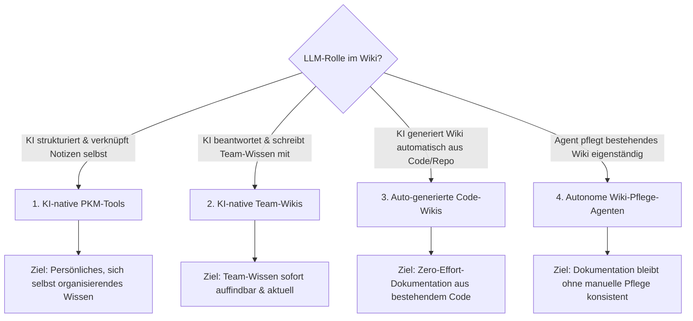
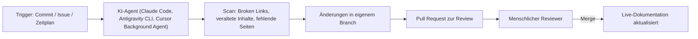

# Native „LLM-first" Wiki-Tools & Agenten

Die [Übersicht zu Dokumentenerstellung, Wikis & Notebooks](index.md) unterscheidet in Abschnitt 6 bereits zwischen klassischen Wikis mit nachträglich angeflanschtem RAG und echten **RAG- & KI-Zentrierten Wissensdatenbanken**. Dieses Kapitel vertieft genau diesen zweiten Zweig: Werkzeuge, die von Grund auf **„LLM-first"** konzipiert sind — das Sprachmodell ist nicht optionales Zusatzfeature, sondern integraler Bestandteil der Datenstruktur, der Bedienung oder der Content-Pflege — sowie **Agenten**, die ein Wiki eigenständig warten, statt nur Fragen dazu zu beantworten.

!!! warning "Achtung: Funktionsumfang ändert sich laufend"
    KI-native Wiki- und PKM-Tools erweitern ihre Agenten-Funktionen aktuell im Wochentakt. Die Angaben hier sind eine **Momentaufnahme (Stand: Juli 2026)** — vor einer Entscheidung die aktuelle Produktseite des jeweiligen Anbieters prüfen.

---

## Übersicht

!!! note "Hinweis: Abgrenzung zu RAG-Co-Wikis"
    „LLM-first" bedeutet hier mehr als reines Retrieval-Augmented Generation (siehe [Funktionsweise & Technische Prinzipien](index.md#funktionsweise-technische-prinzipien) in der Übersicht). Ein RAG-Co-Wiki beantwortet Fragen zu vorhandenem Text. Ein LLM-first-Tool nutzt das Sprachmodell zusätzlich aktiv, um die **Struktur selbst** zu erzeugen — Verlinkungen, Kategorien, Zusammenfassungen oder ganze Seiten entstehen automatisch, nicht nur Antworten darauf.

---

## 1. KI-native PKM-Tools (Persönliches Wissensmanagement)

Diese Tools sind von Anfang an um ein Sprachmodell herum gebaut, statt es nachträglich zu integrieren — Notizen werden nicht nur gespeichert, sondern von der KI aktiv strukturiert.

| Tool | Kernprinzip | Agentic Feature | Hosting |
|---|---|---|---|
| **Tana** | Objektbasierte Notizen mit „Supertags" (typisierte Knoten) | KI generiert Supertag-Schemata und befüllt Felder automatisch aus Fließtext | Cloud (proprietär) |
| **Reflect Notes** | Vernetzte Notizen mit täglichen Journalen | Eingebauter GPT-Chat direkt über der eigenen Notizbasis, automatische Backlink-Vorschläge | Cloud (proprietär) |
| **Mem.ai** | „Self-organizing workspace" | KI kategorisiert, verlinkt und fasst Notizen ohne manuelle Ordnerstruktur automatisch zusammen | Cloud (proprietär) |
| **Capacities** | Objektbasiertes PKM (Notizen als typisierte „Objekte") | KI-gestützte Objekterkennung und Zusammenfassungen über Objektgrenzen hinweg | Cloud (proprietär) |
| **Heptabase** | Visuelles Whiteboard-PKM mit Karten | KI-Kartenzusammenfassung und automatische Themen-Cluster | Cloud (proprietär) |
| **RemNote** | Notizen mit eingebautem Spaced-Repetition-Lernsystem | KI generiert automatisch Lernkarten (Flashcards) aus Notiztext | Cloud + Desktop |

!!! tip "Tipp: Abgrenzung zu Obsidian/Logseq"
    [Obsidian und Logseq](index.md#local-first-personal-knowledge-management-pkm) sind Local-First-Notiz-Apps, bei denen KI-Funktionen über Community-Plugins (z. B. Smart Connections, Copilot-Plugin) nachgerüstet werden. Die hier gelisteten Tools bringen die KI-Struktur dagegen nativ aus der Anbieter-Cloud mit — Vorteil: weniger Konfigurationsaufwand, Nachteil: keine reine Dateiablage, Daten liegen primär beim Anbieter.

---

## 2. KI-native Team-Wikis & Knowledge Bases

Für Team-Dokumentation gebaute Werkzeuge, bei denen die KI nicht nur sucht, sondern aktiv am Wissen mitschreibt oder Lücken meldet.

| Tool | Kernprinzip | Agentic Feature | Zielgruppe |
|---|---|---|---|
| **Notion AI** | Team-Workspace mit Seiten/Datenbanken | Schreibt, übersetzt und fasst Seiteninhalte zusammen, beantwortet Fragen über den gesamten Workspace | KMU bis Enterprise |
| **Glean** | Enterprise-Suche über alle verbundenen Unternehmens-Tools | KI-Agent verknüpft Wissen aus Slack, Wikis, Tickets, Code-Repos zu einer Antwort | Enterprise |
| **Guru** | Karten-basierte „Verified Knowledge"-Wissensbasis | KI markiert veraltete Karten automatisch und schlägt Verifizierungen vor | Team/Enterprise |
| **Slite AI** | Team-Wiki mit KI-Assistent | KI-Zusammenfassungen, automatische Struktur-Vorschläge für neue Dokumente | KMU |
| **Coda AI** | Dokumente mit eingebauten Tabellen/Automationen | KI-Pack generiert Inhalte direkt in Tabellen/Automationen | KMU bis Enterprise |

---

## 3. Auto-generierte Code-Wikis (Agent erzeugt das Wiki selbst)

Diese Werkzeuge lesen ein bestehendes Code-Repository und generieren daraus **automatisch** eine navigierbare Wiki-Struktur — ganz ohne manuell geschriebene Dokumentation als Ausgangspunkt.

| Tool | Funktionsweise | Besonderheit |
|---|---|---|
| **DeepWiki** (Cognition/Devin) | Analysiert ein GitHub-Repository und generiert automatisch eine strukturierte Wiki-Seite mit Architektur-Diagrammen, Erklärungen und Quellcode-Verweisen | kostenlos für öffentliche Repos, laufend aktualisiert bei neuen Commits |
| **[OpenWiki](openwiki-repo-dokumentation-agent.md)** (LangChain) | Open-Source-CLI-Agent (MIT), generiert eine Repo-Wiki und trägt Referenzen in `AGENTS.md`/`CLAUDE.md` ein, statt die Doku vollständig in den Prompt zu laden | selbst gehostet, frei wählbarer Modell-Provider, CI-Update via GitHub/GitLab/Bitbucket |
| **Sourcegraph Cody** | Code-Intelligence-Agent mit Kontext über das gesamte Repo, beantwortet Architekturfragen direkt aus dem Code | primär Such-/Chat-fokussiert, kein eigenständiges Wiki-Artefakt |
| **Mintlify** | Docs-Plattform mit KI-Assistent, der aus Code-Kommentaren und Docstrings Dokumentationsentwürfe generiert | „AI-first" Docs-Hosting, ähnlich MkDocs/Docusaurus aber mit KI-Autorenfunktion |
| **GitHub Copilot Workspace** | Agent liest ein Issue/Repo und schlägt passende Doku- bzw. Code-Änderungen als PR vor | eng an GitHub-Workflows gekoppelt |

!!! note "Hinweis: Guter Fit für dieses Repository"
    Da dieses Repository bereits vollständig auf Markdown + Git ([Zensical](../../künstliche-intelligenz/coding/llm-anbieter-vergleich.md)) basiert, wäre ein Tool wie **DeepWiki** primär als ergänzende, automatisch generierte Referenzansicht des Repos interessant — nicht als Ersatz für die kuratierte, didaktisch aufbereitete Doku unter `docs/`.

---

## 4. Autonome Wiki-Pflege-Agenten (Agent schreibt in ein bestehendes Wiki)

Der am wenigsten standardisierte, aber am schnellsten wachsende Bereich: Agenten, die ein **bereits existierendes** Wiki/Doku-Repo eigenständig pflegen — Lücken füllen, veraltete Links korrigieren, Inkonsistenzen melden — statt es einmalig zu generieren.

- **Claude Code / Antigravity CLI Subagenten** — projektspezifische Subagenten (wie der `doc-checker`-Subagent in diesem Repository), die vor Commits Build, Navigation, Links und Diagramm-Syntax prüfen und bei Bedarf direkt Korrekturen vorschlagen.
- **Cursor Background Agents** — laufen asynchron im Hintergrund eines Repos und können auf Zeitplan oder Trigger eigenständig Doku-PRs erstellen.
- **GitHub Actions + LLM-Bots** — CI-Workflows, die bei jedem Merge z. B. mit der Anthropic- oder OpenAI-API prüfen, ob READMEs/Docs noch zum geänderten Code passen, und automatisch ein Issue oder einen PR-Kommentar erzeugen.

!!! tip "Tipp: Human-in-the-Loop bleibt Pflicht"
    Wie in der Übersicht unter [Git-Kollaboration (Human-in-the-Loop)](index.md#funktionsweise-technische-prinzipien) beschrieben, sollten autonome Wiki-Agenten **immer** über Pull Requests statt Direct-Commits arbeiten — gerade bei didaktischem oder rechtlich relevantem Content ist eine menschliche Freigabe vor dem Merge Pflicht, nicht optional.

---

## Auswahlkriterium nach Anwendungsfall

!!! tip "Tipp: Welcher Ansatz für welches Szenario?"
    - **Persönliches, wachsendes Wissen ohne Ordnerdisziplin** → Tana, Mem.ai oder Reflect Notes.
    - **Team-Wiki, das sich selbst aktuell hält** → Glean oder Guru (Verified-Knowledge-Ansatz).
    - **Schnelle Referenzdoku zu einem bestehenden Code-Repo ohne Schreibaufwand** → DeepWiki.
    - **Bereits gepflegtes Git-Doku-Repo (wie dieses hier) soll konsistent bleiben** → autonome Agenten/Subagenten mit PR-Workflow statt eines separaten KI-Wiki-Produkts.

---

## Verwandte Themen

- [Startseite](../../index.md) — zurück zur Dokumentations-Zentrale
- [Dokumentenerstellung, Wikis & Notebooks](index.md) — Gesamtübersicht inkl. RAG-Co-Wiki-Grundlagen
- [Custom Chat-Assistenten im Anbieter-Vergleich](../../künstliche-intelligenz/coding/custom-chat-assistenten-anbieter-vergleich.md) — Gems, GPTs & Projects als verwandtes Konzept auf Anbieterseite
- [Multi-LLM- & Sprachmodell-Anbieter im Vergleich](../../künstliche-intelligenz/coding/llm-anbieter-vergleich.md) — Preise & API-Zugriffswege der zugrunde liegenden Modelle
