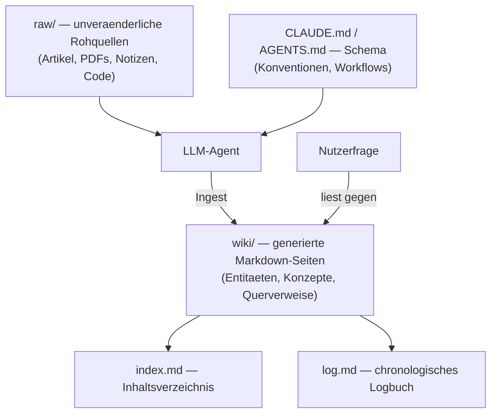

# LLM-Wiki-Pattern (Karpathy-Muster)

Das **LLM-Wiki-Pattern** ist ein von Andrej Karpathy (Mitgründer OpenAI, ehem. AI-Direktor bei Tesla) im April 2026 als GitHub-Gist veröffentlichtes Architekturmuster: Statt bei jeder Anfrage Rohdokumente per RAG (Retrieval-Augmented Generation) neu zu durchsuchen, lässt man ein LLM einmalig eine **persistente, strukturierte Wiki** aus den Quellen aufbauen — und fragt danach nur noch gegen dieses kompilierte Wissen ab. Diese Seite erklärt das Muster selbst; die konkrete Open-Source-Umsetzung davon ist [OpenWiki (LangChain)](openwiki-repo-dokumentation-agent.md).

!!! note "Hinweis: Primärquelle"
    Das Pattern ist als Prosa-Text (Prompt/Idee zum Einfügen in einen Agenten) veröffentlicht, nicht als fertiges Produkt: [gist.github.com/karpathy/442a6bf555914893e9891c11519de94f](https://gist.github.com/karpathy/442a6bf555914893e9891c11519de94f).

---

## Kernidee: Kompilieren statt Retrieval

Karpathys Analogie stammt aus der Softwareentwicklung: Ein Compiler übersetzt Quellcode einmalig in ein optimiertes Binary — man führt nicht bei jedem Programmstart den Quellcode erneut aus, sondern kompiliert einmal und nutzt danach das Artefakt.

Auf Wissensarbeit übertragen: **RAG** durchsucht bei *jeder* Anfrage erneut die Rohquellen und muss Zusammenhänge jedes Mal neu rekonstruieren. Das **LLM-Wiki-Pattern** dreht die Reihenfolge um — „compile deine Quellen zuerst":

1. Ein LLM liest die Rohquellen einmalig (oder inkrementell bei neuen Quellen).
2. Es synthetisiert die Inhalte in strukturierte, untereinander verlinkte Wiki-Seiten.
3. Alle folgenden Anfragen laufen gegen dieses **kompilierte Artefakt** — nicht mehr gegen die Rohquellen.

!!! tip "Tipp: Kein Ersatz für RAG, sondern eine Vorstufe"
    Das Pattern schließt klassisches RAG nicht aus — es reduziert nur, was zur Anfragezeit neu erschlossen werden muss. Für sehr große, sich schnell ändernde Quellenmengen bleibt eine Kombination aus beidem sinnvoll (siehe [RAG- & KI-Zentrierte Wissensdatenbanken](index.md#6-rag-ki-zentrierte-wissensdatenbanken-rag-co-wikis)).

---

## Architektur: Drei Schichten

| Schicht | Ordner/Datei | Rolle |
|---|---|---|
| **Rohquellen** | `raw/` | Unveränderliche Datenbasis (Artikel, PDFs, Notizen). Der Agent liest sie, modifiziert sie aber nie. |
| **Das Wiki** | `wiki/` | LLM-generierte Markdown-Dateien mit Querverweisen — je eine strukturierte, Wikipedia-artige Seite pro Konzept/Entität, verlinkt über `[[wiki-links]]`. |
| **Schema** | `CLAUDE.md` / `AGENTS.md` | Dokumentiert Struktur und Konventionen des Wikis und definiert die Workflows für Ingestion, Abfragen und Wartung — die Instruktionsdatei, die der Agent bei jedem Lauf befolgt. |

---

## Kernoperationen

=== "Ingest"
    Neue Quelle wird zu `raw/` hinzugefügt. Der Agent liest sie, ordnet die Erkenntnisse ein, erstellt neue Wiki-Seiten oder aktualisiert bestehende — typischerweise werden pro Ingest-Lauf 10–15 Seiten berührt (neue Querverweise, aktualisierte Zusammenfassungen).

=== "Query"
    Eine Frage wird gegen das Wiki gestellt (nicht gegen die Rohquellen). Der Agent sucht die relevanten Wiki-Seiten und synthetisiert eine Antwort mit Zitaten/Links auf die jeweiligen Seiten.

=== "Lint"
    Periodische Gesundheitsprüfung: Widersprüche zwischen Seiten, verwaiste Seiten (keine eingehenden Links), fehlende Querverweise. Entspricht im Prinzip dem, was `check_orphaned_files.py` in diesem Repository für die Nav-Struktur übernimmt (siehe [Verwandte Themen](#verwandte-themen)).

---

## Indexierung & Logbuch

- **`index.md`** — Inhaltsverzeichnis mit Links, Einzeilern und Metadaten pro Kategorie. Entspricht funktional den `index.md`-Übersichtsseiten in diesem Repository (z. B. [Dokumentenerstellung, Wikis & Notebooks](index.md)).
- **`log.md`** — chronologisches, append-only Logbuch mit konsistenten Präfixen, damit es maschinell parsebar bleibt (welche Quelle wann welche Seiten verändert hat).

---

## Warum das Muster funktioniert

Karpathys zentrale These: *„Die mühsame Arbeit bei Wissensbasen ist nicht das Lesen oder Denken — es ist die Buchhaltung."* Menschen geben Wikis typischerweise auf, weil der Pflegeaufwand (Querverweise aktuell halten, Redundanzen vermeiden, Struktur konsistent halten) schneller wächst als der Nutzen. Ein LLM-Agent:

- vergisst keine Querverweise und aktualisiert sie zuverlässig bei jeder Änderung,
- bearbeitet mehrere betroffene Seiten in einem einzigen Durchlauf,
- ermüdet nicht an der reinen „Buchhaltungsarbeit", die Menschen von der Wiki-Pflege abhält.

Die Rollenteilung bleibt dabei klar: **der Mensch kuratiert Quellen und stellt Fragen — der Agent übernimmt Synthese und Pflege.**

---

## Konkrete Implementierung: OpenWiki (LangChain)

Das bekannteste Open-Source-Werkzeug, das dieses Pattern konkret umsetzt, ist **[OpenWiki](openwiki-repo-dokumentation-agent.md)** von LangChain — ursprünglich für Code-Repositories gebaut (`raw/` = Codebase, `wiki/` = generierte Repo-Dokumentation), inzwischen auch im „Personal-Modus" für persönliche Wissensbasen mit externen Connectoren (Notion, Gmail, Git-Repos, Websuche) nutzbar.

| Karpathy-Muster (allgemein) | OpenWiki-Umsetzung |
|---|---|
| `raw/` — Rohquellen | Codebase (Code-Modus) bzw. angebundene Connectoren (Personal-Modus) |
| `wiki/` — generiertes Wiki | `openwiki/*.md` bzw. `~/.openwiki/wiki/` |
| Schema-Instruktionsdatei | `INSTRUCTIONS.md`, plus Referenzen in `AGENTS.md`/`CLAUDE.md` |
| Ingest | `openwiki --init` / `openwiki code --update` |
| Query | interaktive CLI (`openwiki "Prompt"`) |
| Lint | Diff-Analyse bei `--update` prüft betroffene Seiten |

Details zu Installation, CLI-Befehlen und CI-Integration siehe die eigene Seite [OpenWiki: Repo-Dokumentations-Agent (LangChain)](openwiki-repo-dokumentation-agent.md).

!!! warning "Achtung: Muster ≠ Produkt"
    Das Karpathy-Muster selbst ist keine Software, sondern eine Idee/ein Prompt-Template. Wer es ohne OpenWiki oder ein vergleichbares Werkzeug nachbauen will, benötigt einen eigenen Agenten (z. B. Claude Code, Antigravity CLI) mit einer Instruktionsdatei, die die drei Schichten (`raw/`, `wiki/`, Schema) sowie Ingest/Query/Lint als Workflows definiert.

---

## Bezug zu diesem Repository

Dieses Repository setzt bereits Teile des Musters ein, ohne es explizit so zu benennen:

- **Schema-Schicht**: `CLAUDE.md` übernimmt die Rolle der Instruktionsdatei — sie dokumentiert Struktur (`docs/<bereich>/`), Konventionen und Workflows.
- **Lint-Operation**: `.gemini/scripts/check_orphaned_files.py` prüft auf verwaiste Seiten, der `doc-checker`-Subagent erweitert das um Build-, Link- und Mermaid-Prüfung.
- **Fehlender Teil**: Es gibt hier bewusst keine automatische Ingest-Operation, die eigenständig neue Wiki-Seiten aus Rohquellen generiert — Inhalte werden weiterhin kuratiert von Hand angelegt (siehe `zensical-docs`-Skill, Abschnitt „Neue Seite anlegen"). Das entspricht dem Human-in-the-Loop-Prinzip, das auch für [autonome Wiki-Pflege-Agenten](llm-first-wiki-tools-agenten.md#4-autonome-wiki-pflege-agenten-agent-schreibt-in-ein-bestehendes-wiki) in diesem Repo gilt.

---

## Verwandte Themen

- [Startseite](../../index.md) — zurück zur Dokumentations-Zentrale
- [KI strukturiert das Wiki autonom & Selfhosting-Migration](ki-autonome-wiki-strukturierung-selfhosting-migration.md) — Anschlussfrage: wie die autonome Strukturierung konkret abläuft und wie das Ergebnis in ein Selfhosting-System übertragen wird
- [OpenWiki: Repo-Dokumentations-Agent (LangChain)](openwiki-repo-dokumentation-agent.md) — konkrete Tool-Umsetzung des Musters
- [Native „LLM-first" Wiki-Tools & Agenten](llm-first-wiki-tools-agenten.md) — Einordnung von OpenWiki & Co. in die Gesamtlandschaft
- [Dokumentenerstellung, Wikis & Notebooks](index.md) — Gesamtübersicht aller Dokumentations-Systeme
