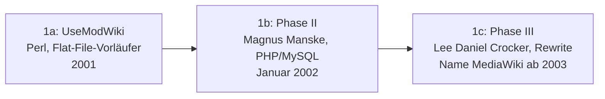

# Evolution und Architekturen von MediaWiki

MediaWiki lässt sich — analog zu den Generationenmodellen für [Wiki-Engines im Allgemeinen](../evolution-digitaler-wiki-engines.md) und andere Systemklassen dieses Repositories — nach **technologischen Generationen** ordnen: von der Ablösung des ursprünglichen Perl-basierten UseModWiki über das jahrelange Wachstum des Erweiterungs-Ökosystems, den Bruch zu einer WYSIWYG-Editieroberfläche, die Verzahnung mit dem strukturierten Schwesterprojekt Wikidata, die spätere Konsolidierung der Parser-Architektur bis zur heutigen LLM-Ära mit agentengestützter Pflege. Die praktische Installation behandelt [MediaWiki installieren](index.md), die aktuelle KI-Integration [MediaWiki KI-Agent](mediawiki-ki-agent.md) sowie [Klassische Wiki-Systeme mit LLM-Integration](../klassische-wiki-systeme-llm-integration.md).

!!! note "Hinweis: Generationen überlappen sich"
    Die Zeiträume sind grobe Orientierung, keine scharfen Grenzen — die klassische Action-API aus der Frühzeit läuft bis heute produktiv neben der neueren REST-API aus Generation 5. Entscheidend ist die **Architektur** (Codebasis, Editier-Interface, Datenmodell), nicht allein das Versionsjahr.

---

## Generation 1: Von UseModWiki zur eigenständigen PHP-Software, 2001 – 2003

Die Gründergeneration eint drei Ereignisse innerhalb von zwei Jahren: die Ablösung eines fremden Perl-Werkzeugs durch eine erste eigene PHP-Implementierung, deren grundlegende Neuentwicklung wegen Skalierungsproblemen und schließlich die formale Namensgebung als eigenständiges Softwareprojekt. Sie lässt sich in drei technologische Entwicklungsstufen unterteilen:

### 1a. UseModWiki — Perl-basierter Flat-File-Vorläufer, 2001

- **Architektur:** Perl-Skript, Seiten als einzelne Textdateien im Dateisystem statt Datenbank — dieselbe Flat-File-Architektur wie andere frühe Wiki-Engines aus [Generation 1a der Wiki-Engines-Zeitachse](../evolution-digitaler-wiki-engines.md).
- **Bedeutung:** die Software, mit der Wikipedia im Januar 2001 startet — kein von der Wikimedia-Community selbst entwickeltes Werkzeug.

### 1b. Phase II — Magnus Manskes PHP/MySQL-Neuentwicklung, Januar 2002

- **Architektur:** vollständige Neuentwicklung in PHP mit MySQL als Datenbank statt Flat-Files — löst UseModWikis Skalierungsgrenzen bei wachsendem Artikelbestand.
- **Bedeutung:** intern als „Phase II"-Software bezeichnet, von Wikipedia-Mitgründer Larry Sanger bei Magnus Manske in Auftrag gegeben.

### 1c. Phase III — Lee Daniel Crockers Performance-Rewrite & Namensgebung, ab 2002/2003

- **Architektur:** Lee Daniel Crocker schreibt die Phase-II-Software grundlegend neu, um Performance-Probleme unter Wikipedias wachsender Last zu beheben.
- **Bedeutung:** dieser Code-Stand erhält 2003 den Namen **MediaWiki** — kurz nach Gründung der **Wikimedia Foundation** (Juni 2003) als Trägerorganisation.

---

## Generation 2: Erweiterungs-Ökosystem & Multi-Wiki-Familie, 2003 – 2011

Statt weiterer grundlegender Rewrites wächst MediaWiki jetzt vor allem in die Breite — ein eigenes Extension-System entsteht, und dieselbe Codebasis trägt gleichzeitig eine ganze Familie unabhängiger Wikimedia-Projekte, das Muster, das später als eigenständige Architekturlinie in [Generation 2 der Wiki-Engines-Zeitachse](../evolution-digitaler-wiki-engines.md#generation-2-community-skalierungsplattformen-ein-engine-tausende-unabhangige-wikis-2004-2016) beschrieben wird.

**Architektur:** Hook-basiertes Extension-System für Drittanbieter-Erweiterungen statt Core-Modifikationen, Vorlagen-/Template-System für wiederverwendbare Inhaltsbausteine, Squid-Caching-Schicht zur Bewältigung von Wikipedias Lesezugriffen.

| Meilenstein | Jahr | Bedeutung |
|---|---|---|
| **Vorlagen-/Template-System** | ab 2002 | Wiederverwendbare Inhaltsbausteine (Infoboxen, Navigationsleisten) direkt im Wikitext, ohne Extension-Code. |
| **Semantic MediaWiki** | 2005 | Zeigt die Reife des Extension-Systems — fügt maschinenlesbare Semantik hinzu, ohne den MediaWiki-Core zu verändern, siehe [Semantisches MediaWiki installieren](../semantische-mediawiki/installieren.md). |
| **Multi-Wiki-Familie** (Wiktionary, Wikibooks, Wikiquote, Commons u. a.) | ab 2003/2004 | Dieselbe Codebasis betreibt Dutzende unabhängige Wikimedia-Schwesterprojekte parallel zu Wikipedia. |

---

## Generation 3: VisualEditor & die Parsoid-Brücke, 2011 – 2015

Nach einem Jahrzehnt reiner Wikitext-Bearbeitung bricht diese Generation mit der bis dahin einzigen Editiermethode — auf Kosten einer neuen, architektonisch getrennten Laufzeitkomponente.

**Architektur:** **VisualEditor** liefert eine WYSIWYG-Bearbeitungsoberfläche im Browser; die dafür nötige verlustfreie Hin- und Rückübersetzung zwischen Wikitext und HTML übernimmt **Parsoid** — bewusst als **separater Node.js-Dienst** statt im PHP-Core implementiert, da der bestehende PHP-Wikitext-Parser für diesen Zweck nicht robust genug war.

| Meilenstein | Jahr | Bedeutung |
|---|---|---|
| **VisualEditor-Projektstart** | 2011 | Wikimedia beginnt die Entwicklung einer WYSIWYG-Alternative zur reinen Wikitext-Bearbeitung. |
| **Parsoid (Node.js)** | 2011/2012 | Eigenständiger Dienst außerhalb des PHP-Cores, bidirektionale Wikitext-HTML-Konvertierung als Fundament für VisualEditor. |
| **Rollout auf Wikipedia** | 2013 | Kontrovers aufgenommene Einführung — der bis dahin größte Bruch mit der reinen Wikitext-Tradition der Plattform. |

!!! warning "Architektonischer Kompromiss"
    Der Node.js-Dienst löst das unmittelbare Problem, führt aber eine zweite Laufzeitumgebung neben dem PHP-Core ein — ein Kompromiss, den Generation 5 dieser Zeitachse später wieder auflöst.

---

## Generation 4: Wikidata & strukturierte Daten, 2012 – 2015

Parallel zur VisualEditor-Entwicklung entsteht ein zweites, strukturell tiefgreifendes Schwesterprojekt — und die Software-Entwicklung selbst modernisiert ihr Abhängigkeitsmanagement.

**Architektur:** die **Wikibase**-Extension bringt ein vollständiges Datenmodell für strukturierte Fakten (Items, Properties, Statements) direkt auf MediaWiki-Basis, referenzierbar aus jedem Wikimedia-Wiki; **Composer** löst manuelle Extension-Verwaltung als Standard-Abhängigkeitsmanager ab.

| Meilenstein | Jahr | Bedeutung |
|---|---|---|
| **Wikidata** | Oktober 2012 | Zentrales, strukturiertes Faktendepot für alle Wikimedia-Projekte, entwickelt von Wikimedia Deutschland auf Basis der Wikibase-Extension. |
| **ORES** (Objective Revision Evaluation Service) | 2015 | Machine-Learning-Dienst zur automatischen Bewertung der Bearbeitungsqualität (Vandalismus-Erkennung) — ein früher KI-Baustein, Jahre vor der heutigen LLM-Integration. |
| **Composer als Standard** | ab 2015 | Löst manuelle Extension-Verwaltung ab, MediaWiki-Core und -Erweiterungen folgen ab jetzt PHP-Standard-Paketmanagement. |

---

## Generation 5: Parser-Konsolidierung & Core-REST-API, ab 2019

Diese Generation löst den architektonischen Kompromiss aus Generation 3 auf und modernisiert gleichzeitig den API-Zugriff für externe Anwendungen.

**Architektur:** **Parsoid** wird von Node.js nach **PHP portiert** und direkt in den MediaWiki-Core integriert — aus zwei getrennten Laufzeitumgebungen wird wieder eine einzige; parallel entsteht eine neue, cachefreundlichere **Core-REST-API** neben der jahrzehntealten Action-API.

| Meilenstein | Jahr | Bedeutung |
|---|---|---|
| **Parsoid/PHP** | ab 2019 | Portierung von Node.js zurück in den PHP-Core — beendet die seit Generation 3 bestehende Zwei-Laufzeiten-Architektur. |
| **Core-REST-API** | 2020 | Neue, ressourcenorientierte API neben der klassischen Action-API — moderner cachebar, aber (noch) nicht deren vollständiger Funktionsumfang. |

---

## Generation 6: LLM-Ära — agentengestützte Pflege & strukturierte Sprachfunktionen, ab 2020

Die aktuelle Generation bringt zwei parallele Entwicklungen: ein Sprachmodell-unabhängiges Projekt für sprachübergreifende, funktionale Inhaltserzeugung sowie die praktische Anbindung heutiger LLMs an bestehende MediaWiki-Installationen über das jahrzehntealte Bot-Ökosystem.

| Baustein | Jahr | Rolle |
|---|---|---|
| **Abstract Wikipedia / Wikifunctions** | angekündigt 2020, Wiki live 2023 | Sprachunabhängige, funktionale Inhaltsdarstellung als strukturierte Alternative zu klassischem Freitext — kein LLM im engeren Sinn, aber dieselbe Grundidee „Inhalt einmal erfassen, in vielen Sprachen ausgeben". |
| **MediaWiki-KI-Agent** | dieses Repository | Kombiniert das **Pywikibot**-Framework aus [Generation 1b der Multi-Agenten-Zeitachse](../evolution-digitaler-multiagenten-wissensoekosysteme.md#1b-wikipedia-bots-pywikibot-okosystem-2005-2015) mit LLM-gestützter Inhaltserstellung, siehe [MediaWiki KI-Agent](mediawiki-ki-agent.md). |

!!! tip "Bezug zu diesem Repository"
    Die in diesem Repository dokumentierte [MediaWiki-Installation](index.md) sowie die [lokale Entwicklungsrechner-Variante](entwicklungsrechner-localhost.md) setzen auf modernen MediaWiki-Versionen auf — technisch bereits in Generation 5/6 dieser Zeitachse. Konkrete LLM-Integrationsmuster jenseits des eigenen Agenten behandelt [Klassische Wiki-Systeme mit LLM-Integration](../klassische-wiki-systeme-llm-integration.md).

---

## Alternative Sortier- & Klassifikationskriterien für MediaWiki

Neben dem chronologischen/technologischen Generationenmodell lassen sich MediaWiki-Entwicklungsstufen nach folgenden Dimensionen einordnen:

### 1. Editier-Interface

- **Reine Wikitext-Bearbeitung** — Quelltext-Editor ohne WYSIWYG-Alternative (Generation 1–2).
- **Hybrid Wikitext/WYSIWYG** — VisualEditor optional neben dem klassischen Quelltext-Editor (ab Generation 3).

### 2. API-Zugriff

- **Action-API** — die ursprüngliche, seit der Frühzeit gewachsene API (`api.php`), weiterhin der funktional vollständigste Zugriffspunkt.
- **Core-REST-API** — neuere, ressourcenorientierte API mit besserer Cachebarkeit (Generation 5).

### 3. Datenmodell

- **Unstrukturierter Wikitext** — Freitext mit Vorlagen, kein maschinenlesbares Datenmodell im Core (Generation 1–2, außer via Semantic-MediaWiki-Extension).
- **Strukturierte Fakten (Wikibase/Wikidata)** — Items, Properties und Statements als eigenes, abfragbares Datenmodell (Generation 4).
- **Funktionale Inhaltsdarstellung (Wikifunctions)** — Inhalt als aufrufbare, sprachunabhängige Funktion statt Freitext (Generation 6).

### 4. Laufzeitarchitektur

- **Monolithischer PHP-Core** — eine einzige Laufzeitumgebung (Generation 1–2, wiederhergestellt in Generation 5).
- **PHP-Core plus separater Node.js-Dienst** — Parsoid als eigenständige Laufzeitumgebung neben PHP (Generation 3–4, aufgelöst in Generation 5).

---

## Verwandte Themen

- [MediaWiki installieren](index.md) — Installationsanleitung
- [MediaWiki auf dem Entwicklungsrechner: localhost mit Nginx und PostgreSQL](entwicklungsrechner-localhost.md) — lokale Variante ohne eigene Domain
- [Semantisches MediaWiki installieren](../semantische-mediawiki/installieren.md) — die in Generation 2 genannte Extension als eigenständige Installation
- [MediaWiki KI-Agent](mediawiki-ki-agent.md) — Pywikibot + LLM-gestützte Inhaltserstellung, vertieft Generation 6 dieses Artikels
- [MediaWiki Backup-Skripte](mediawiki-backup-skripte.md) — Betriebspraxis für bestehende Installationen
- [Klassische Wiki-Systeme mit LLM-Integration](../klassische-wiki-systeme-llm-integration.md) — LLM-Integrationsmuster jenseits des eigenen Agenten
- [Evolution und Architekturen digitaler Wiki-Engines](../evolution-digitaler-wiki-engines.md) — übergeordnetes Generationenmodell, in dem MediaWiki Generation 1b bildet
- [Evolution und Architekturen digitaler Wissenssysteme](../evolution-digitaler-wissenssysteme.md) — übergeordnetes Generationenmodell für Wissenssysteme im Allgemeinen
- [Evolution und Architekturen von Drupal](../drupal/evolution-digitaler-drupal.md) — analoger Produkt-Spezialartikel für Drupal
- [Evolution und Architekturen digitaler Multi-Agenten-Wissensökosysteme](../evolution-digitaler-multiagenten-wissensoekosysteme.md) — Pywikibot-Ökosystem als Generation 1b dieser Zeitachse
- [Dokumentationsübersicht](../index.md)
