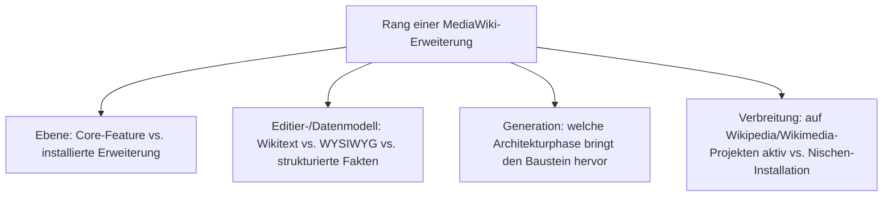
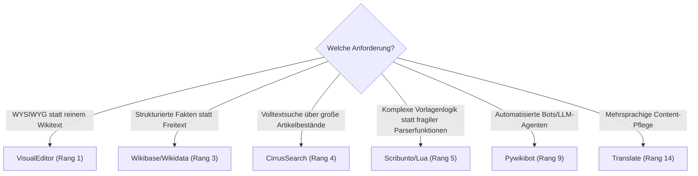

# Beste MediaWiki-Erweiterungen 2026 — Top-15-Topliste

Die [Evolution und Architekturen von MediaWiki](evolution-digitaler-mediawiki.md) ordnet die Produktgeschichte chronologisch nach sechs Generationen — von der Ablösung des Perl-basierten UseModWiki über das Erweiterungs-Ökosystem, den VisualEditor-Bruch und Wikidata bis zur Parser-Konsolidierung und der heutigen LLM-Ära. Da MediaWiki selbst kein Kategorie-Vergleich, sondern ein Einzelprodukt ist, übersetzt diese Seite die Chronologie stattdessen in eine **nach 2026-Relevanz gerankte Top-15-Liste konkreter Erweiterungen und Core-Features**, mit denen dieses eine Produkt tatsächlich betrieben wird.

!!! note "Hinweis: Core-Feature und Erweiterung gemeinsam gerankt"
    Diese Liste mischt bewusst inzwischen in den Core integrierte Bausteine (Parsoid, Core-REST-API) mit weiterhin als Erweiterung installierten Komponenten (VisualEditor, CirrusSearch, Scribunto) — weil beide Ebenen gemeinsam bestimmen, wie eine produktive MediaWiki-Installation 2026 tatsächlich aussieht.

---

## Bewertungskriterien

---

## Top 15 im Überblick

| Rang | Baustein | Ebene | Generation | Bedeutung |
|---|---|---|---|---|
| 1 | **VisualEditor** | Erweiterung | 3 (VisualEditor & die Parsoid-Brücke) | WYSIWYG-Bearbeitungsoberfläche, größter Bruch mit der reinen Wikitext-Tradition |
| 2 | **Parsoid** (heute PHP-Core) | Core-Feature | 5 (Parser-Konsolidierung & Core-REST-API) | Bidirektionale Wikitext-HTML-Konvertierung, seit 2019 aus Node.js zurück in den PHP-Core portiert |
| 3 | **Wikibase / Wikidata** | Erweiterung | 4 (Wikidata & strukturierte Daten) | Vollständiges Datenmodell für strukturierte Fakten (Items, Properties, Statements) |
| 4 | **CirrusSearch** | Erweiterung | 2 (Erweiterungs-Ökosystem & Multi-Wiki-Familie) | Elasticsearch-basierte Volltextsuche, Grundlage für Wikipedias Such-Infrastruktur |
| 5 | **Scribunto** (Lua-Skripting) | Erweiterung | 2 (Erweiterungs-Ökosystem & Multi-Wiki-Familie) | Lua-basierte Vorlagenlogik für komplexe Infoboxen statt fragiler reiner Wikitext-Parserfunktionen |
| 6 | **Core-REST-API** | Core-Feature | 5 (Parser-Konsolidierung & Core-REST-API) | Neuere, cachefreundlichere API neben der jahrzehntealten Action-API |
| 7 | **Semantic MediaWiki** | Erweiterung | 2 (Erweiterungs-Ökosystem & Multi-Wiki-Familie) | Fügt maschinenlesbare Semantik hinzu, ohne den Core zu verändern |
| 8 | **ORES** | Erweiterung/Dienst | 4 (Wikidata & strukturierte Daten) | Machine-Learning-Dienst zur automatischen Bewertungsqualität-/Vandalismus-Erkennung |
| 9 | **Pywikibot** | Framework | 2 (Erweiterungs-Ökosystem & Multi-Wiki-Familie) | Bot-Framework, heute Basis LLM-gestützter Agenten wie dem MediaWiki-KI-Agenten dieses Repositories |
| 10 | **Cite** | Erweiterung | 2 (Erweiterungs-Ökosystem & Multi-Wiki-Familie) | Fußnoten-/Referenzierungssystem, auf praktisch jedem Wikipedia-Artikel im Einsatz |
| 11 | **ParserFunctions** | Erweiterung | 2 (Erweiterungs-Ökosystem & Multi-Wiki-Familie) | Bedingungslogik direkt im Wikitext, Grundlage komplexer Vorlagen vor Scribunto |
| 12 | **Echo** | Erweiterung | 3 (VisualEditor & die Parsoid-Brücke) | Benachrichtigungssystem für Erwähnungen, Diskussionsbeiträge und Bearbeitungen |
| 13 | **OAuth** | Erweiterung | 4 (Wikidata & strukturierte Daten) | Standardisierte API-Authentifizierung für Drittanwendungen und Bots |
| 14 | **Translate** | Erweiterung | 2 (Erweiterungs-Ökosystem & Multi-Wiki-Familie) | Mehrsprachige Content-Pflege mit Übersetzungs-Workflow, breit bei Wikimedia-Projekten im Einsatz |
| 15 | **Abstract Wikipedia / Wikifunctions** | Erweiterung/Projekt | 6 (LLM-Ära) | Sprachunabhängige, funktionale Inhaltsdarstellung als strukturierte Alternative zu Freitext |

---

## Highlights im Detail

### Rang 1–2: der WYSIWYG-Bruch und seine spätere Konsolidierung
VisualEditor und Parsoid gehören zusammen — Parsoid lief zunächst als eigenständiger Node.js-Dienst neben dem PHP-Core, wurde aber 2019 zurück nach PHP portiert und beendete damit die Zwei-Laufzeiten-Architektur aus Generation 3, siehe [Generation 3 und 5](evolution-digitaler-mediawiki.md#generation-5-parser-konsolidierung-core-rest-api-ab-2019).

### Rang 4–5, 9–11: das Erweiterungs-Ökosystem trägt Wikipedia im Betrieb
CirrusSearch, Scribunto, Pywikibot, Cite und ParserFunctions sind keine Randfunktionen, sondern laufen 2026 auf praktisch jedem großen Wikimedia-Projekt produktiv — das Hook-basierte Extension-System aus Generation 2 bleibt bis heute das tragende Architekturprinzip, siehe [Generation 2](evolution-digitaler-mediawiki.md#generation-2-erweiterungs-okosystem-multi-wiki-familie-2003-2011).

### Rang 3, 15: strukturierte Daten als roter Faden zweier Generationen
Wikibase/Wikidata (Generation 4) und Abstract Wikipedia/Wikifunctions (Generation 6) verfolgen dieselbe Grundidee über zwei Generationen hinweg — Inhalt einmal strukturiert erfassen, statt ihn für jede Sprache getrennt als Freitext zu pflegen, siehe [Generation 6](evolution-digitaler-mediawiki.md#generation-6-llm-ara-agentengestutzte-pflege-strukturierte-sprachfunktionen-ab-2020).

---

## Wegweiser: von Anforderung zu passender Erweiterung

!!! tip "Tipp: die Produkt-Chronologie separat prüfen"
    Diese Liste übersetzt alle sechs Generationen der Quell-Chronologie in eine gemeinsame 2026-Momentaufnahme — für die vollständige Versionsgeschichte siehe [Evolution und Architekturen von MediaWiki](evolution-digitaler-mediawiki.md).

---

## 🔗 Verwandte Themen

- [Evolution und Architekturen von MediaWiki](evolution-digitaler-mediawiki.md) — chronologisches Generationenmodell, dessen aktuellen Stand diese Topliste zusammenfasst
- [MediaWiki installieren](index.md) — Installationsanleitung
- [MediaWiki KI-Agent](mediawiki-ki-agent.md) — Pywikibot + LLM-gestützte Inhaltserstellung, vertieft Rang 9
- [Evolution und Architekturen digitaler Wiki-Engines](../evolution-digitaler-wiki-engines.md) — übergeordnetes Generationenmodell, in dem MediaWiki Generation 1b bildet
- [Klassische Wiki-Systeme mit LLM-Integration](../klassische-wiki-systeme-llm-integration.md) — LLM-Integrationsmuster jenseits des eigenen Agenten
- [Dokumentationsübersicht](../index.md)
