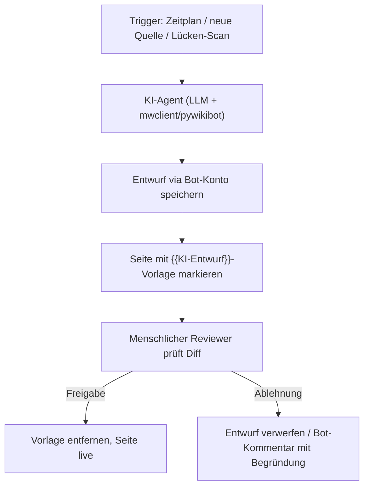
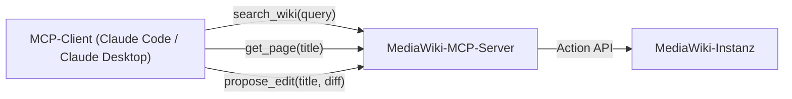

# MediaWiki KI-Agent: Automatisierte Pflege mit LLMs

Der [Python Bot](mediawiki-python-bot.md) aus dem vorherigen Kapitel automatisiert das reine Lesen und Schreiben von Seiten über `mwclient`. Dieses Kapitel baut darauf auf und ergänzt eine **KI-Schicht**: Ein Sprachmodell generiert, prüft und aktualisiert Wiki-Inhalte selbstständig — nach dem gleichen **Human-in-the-Loop-Prinzip**, das bereits in der [Dokumentations-Übersicht](../index.md#funktionsweise-technische-prinzipien) für Co-Wikis beschrieben ist: Der Agent schreibt einen Entwurf, ein Mensch prüft und gibt frei.

!!! warning "Achtung: Kein automatischer Direct-Write auf Produktivseiten"
    Ein KI-Agent sollte niemals direkt und ohne Review auf produktive MediaWiki-Seiten schreiben — Sprachmodelle halluzinieren gelegentlich Fakten. Die Muster auf dieser Seite markieren KI-generierte Änderungen konsequent als **Entwurf** (Bot-Konto + Review-Vorlage) statt sie live zu schalten.

---

## Übersicht



Zwei praxistaugliche Integrationswege haben sich etabliert: ein **Skript-Bot**, der LLM-Aufrufe direkt in einen `mwclient`-Workflow einbettet, und ein **MCP-Server**, der die MediaWiki-API als Werkzeuge für einen allgemeinen Agenten (z. B. Claude Code, Antigravity CLI) bereitstellt.

---

## 1. Skript-Bot mit eingebettetem LLM-Aufruf

Erweitert den Bot aus [MediaWiki Python Bot-Automatisierung](mediawiki-python-bot.md) um einen LLM-Aufruf, der fehlende Abschnitte einer Seite automatisch entwirft:

```bash
pip install mwclient anthropic
```

```python
import mwclient
import anthropic

# 1. Verbindung zu MediaWiki aufbauen (dediziertes Bot-Konto!)
site = mwclient.Site('wiki.deine-domain.de', path='/')
site.login('KI-Bot', 'BotPassword123')

# 2. Anthropic-Client für die Entwurfserstellung
client = anthropic.Anthropic()  # nutzt ANTHROPIC_API_KEY aus der Umgebung

page_name = 'Entwicklung/Python_Pipelines'
page = site.pages[page_name]

bestehender_text = page.text() if page.exists else ""

# 3. LLM generiert einen Ergänzungs-Entwurf auf Basis des bestehenden Inhalts
response = client.messages.create(
    model="claude-sonnet-5",
    max_tokens=1500,
    messages=[{
        "role": "user",
        "content": (
            "Ergänze folgenden MediaWiki-Artikel um einen Abschnitt "
            "'Fehlerbehandlung', im gleichen Wikitext-Stil. "
            "Antworte NUR mit dem neuen Abschnitt in Wikitext-Syntax.\n\n"
            f"{bestehender_text}"
        )
    }]
)
neuer_abschnitt = response.content[0].text

# 4. Entwurf mit Review-Markierung speichern statt direkt live zu schalten
entwurf = f"{bestehender_text}\n\n{{{{KI-Entwurf|Bot=KI-Bot}}}}\n{neuer_abschnitt}"
page.save(entwurf, summary='KI-Entwurf: Abschnitt "Fehlerbehandlung" ergänzt (Review ausstehend)')
print(f"✅ Entwurf für '{page_name}' gespeichert — wartet auf menschliche Freigabe.")
```

!!! tip "Tipp: Review-Vorlage `{{KI-Entwurf}}`"
    Lege in MediaWiki eine einfache Vorlagenseite `Vorlage:KI-Entwurf` an, die eine auffällige Hinweisbox rendert (z. B. „⚠️ Dieser Abschnitt wurde von einem KI-Bot vorgeschlagen und noch nicht geprüft"). So bleibt für jeden Leser sofort sichtbar, welche Inhalte noch keine menschliche Freigabe durchlaufen haben — analog zu Entwurfs-Markierungen in Git-basierten Systemen (offener Pull Request statt Merge).

---

## 2. MCP-Server: MediaWiki als Werkzeug für allgemeine Agenten

Statt eines fest verdrahteten Skript-Bots lässt sich MediaWiki auch als **Model-Context-Protocol-Server** bereitstellen — dann kann jeder MCP-fähige Agent (Claude Code, Claude Desktop, Antigravity CLI) gezielt auf das Wiki zugreifen, ohne dass der komplette Wiki-Inhalt in den Prompt geladen werden muss (gleiches Prinzip wie bei [OpenWiki](../openwiki-repo-dokumentation-agent.md)).



Typische, sinnvoll begrenzte Tool-Definitionen für einen solchen MCP-Server:

| Tool | Funktion | Schreibzugriff? |
|---|---|---|
| `search_wiki(query)` | Volltextsuche über die MediaWiki-Suche-API | nein |
| `get_page(title)` | Wikitext einer Seite abrufen | nein |
| `list_categories(title)` | Kategorien/Verlinkungen einer Seite abrufen | nein |
| `propose_edit(title, diff, summary)` | Legt einen Entwurf mit `{{KI-Entwurf}}`-Markierung an, **kein** Live-Publish | ja, aber nur als Entwurf |

!!! note "Hinweis: Kein fertiger Standard-MCP-Server für MediaWiki"
    Anders als bei manchen anderen Systemen gibt es (Stand Juli 2026) keinen einzelnen, breit etablierten offiziellen MediaWiki-MCP-Server — in der Praxis wird meist ein schlanker eigener Server auf Basis von `mwclient`/`pywikibot` und einem MCP-SDK (Python oder TypeScript) gebaut, der nur die oben gelisteten, bewusst eingeschränkten Tools freigibt.

---

## Governance & Sicherheitsleitplanken

| Maßnahme | Zweck |
|---|---|
| **Dediziertes Bot-Konto** mit eigener Nutzergruppe | Klare Abgrenzung KI-generierter von menschlichen Edits im Versionsverlauf |
| **Pflicht-Edit-Summary** (`summary=` bei jedem `page.save()`) | Nachvollziehbarkeit, welche Änderung vom Bot stammt und warum |
| **`{{KI-Entwurf}}`-Vorlage statt Direct-Write** | Human-in-the-Loop — kein KI-Inhalt geht ohne Freigabe live |
| **Rate-Limits im Bot-Skript** | Verhindert Überlastung der Wiki-API bei Batch-Läufen |
| **Sperrliste für sensible Seiten** (z. B. Impressum, rechtliche Seiten) | KI-Agent darf bestimmte Namensräume/Seiten grundsätzlich nicht anfassen |
| **Erst gegen Testinstanz laufen lassen** | Neue Prompt-Versionen vor Produktiveinsatz gegen eine Wiki-Kopie validieren |

---

## Verwandte Themen

- [MediaWiki Installieren](index.md) — Basis-Setup
- [MediaWiki Python Bot-Automatisierung](mediawiki-python-bot.md) — Grundlagen der `mwclient`-Anbindung ohne KI-Schicht
- [Semantisches MediaWiki](../semantische-mediawiki/installieren.md) — strukturierte Daten, die ein KI-Agent gezielt abfragen kann
- [Native „LLM-first" Wiki-Tools & Agenten](../llm-first-wiki-tools-agenten.md) — Einordnung in die breitere Werkzeuglandschaft
- [OpenWiki: Repo-Dokumentations-Agent (LangChain)](../openwiki-repo-dokumentation-agent.md) — vergleichbares MCP-/Referenz-Prinzip für Code-Repos
- [Onyx (ehem. Danswer)](../onyx-danswer-rag-plattform.md) — Enterprise-Suche über ein bestehendes MediaWiki als eine von vielen Datenquellen
