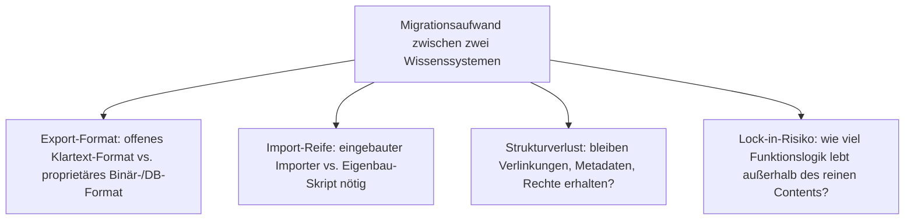
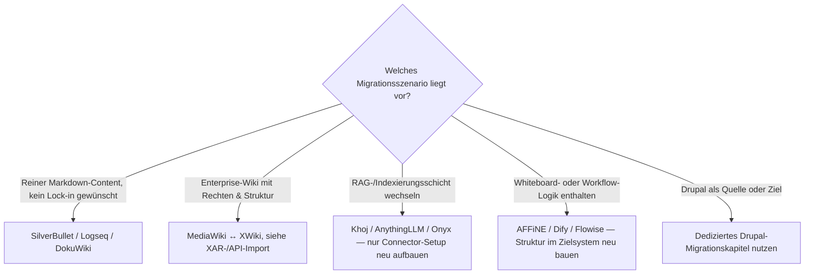

# Migrationswege zwischen Wissenssystemen — Top-20-Topliste

Die [Backup-Strategien-Topliste](backup-strategien-wissenssysteme-topliste.md) und die [Selfhosting-Topliste](wissenssysteme-selfhosting-server-topliste.md) übernehmen dieselbe Rangfolge und vertiefen jeweils einen Aspekt desselben Systemsatzes. Dieses Kapitel setzt die Reihe fort — mit Fokus auf die Frage, die vor jedem Systemwechsel steht: **Wie schwer komme ich mit meinen Inhalten wieder heraus, und wie leicht komme ich mit fremden Inhalten hinein?**

!!! note "Hinweis: Export-Reife ≠ Import-Reife"
    Ein System kann hervorragend exportieren (z. B. Logseq: reines Markdown im Dateisystem), aber kaum fremde Formate importieren — und umgekehrt. Beide Richtungen werden hier getrennt bewertet, weil sie bei einer konkreten Migration selten symmetrisch sind.

---

## Bewertungskriterien

!!! warning "Achtung: Whiteboard-, Workflow- und Vektor-Daten sind selten migrierbar"
    Reiner Text-/Markdown-Content lässt sich fast immer verlustarm migrieren. Nicht-textuelle Strukturen — Whiteboard-Layouts (AFFiNE), Agenten-Workflow-Logik (Dify, Flowise) oder Vektor-Indizes (Khoj, AnythingLLM, Onyx) — sind system-spezifisch und müssen im Zielsystem meist neu aufgebaut statt migriert werden.

---

## Top 20 im Überblick

| Rang | System | Export-Reife | Import-Reife (von anderen Systemen) | Migrationsaufwand | Empfohlener Pfad |
|---|---|---|---|---|---|
| 1 | **Memos** | Markdown/API-Export, keine proprietäre Bindung | kein dedizierter Importer, API-Skript nötig | gering | Direkter API-Export/-Import zwischen Memos-Instanzen oder in jedes Markdown-basierte System |
| 2 | **DokuWiki** | native Klartext-Wiki-Syntax im Dateisystem | Pandoc-Konvertierung, Community-Skripte für MediaWiki-Import | gering | Pandoc als Konverter-Drehscheibe für Wiki-Syntax-Varianten |
| 3 | **TiddlyWiki** | eingebauter JSON-/HTML-Export | eingebaute Importer für Markdown, HTML, JSON | gering | Import-Funktion direkt in der Anwendungs-UI, kein externes Tooling nötig |
| 4 | **SilverBullet** | reines Markdown-Verzeichnis, kein Lock-in | Ordner direkt einlesbar, keine Konvertierung nötig | sehr gering | Space-Verzeichnis kopieren — funktioniert bidirektional mit jedem Markdown-Tool |
| 5 | **Wiki.js** | Git-Sync-Modul exportiert als Markdown | eingebaute Importer (u. a. für Confluence, teilweise MediaWiki) | gering–mittel | Git-Sync als kontinuierlicher Export-Kanal statt Einmal-Migration |
| 6 | **[MediaWiki](mediawiki/wiederherstellen.md)** | XML-Dump-Standard, breit unterstützt | API-basierte Importer (`pywikibot`), siehe [MediaWiki-Dump wiederherstellen](mediawiki/wiederherstellen.md) | mittel | Wikitext-Markup-Konvertierung ist der eigentliche Aufwand, nicht der Datentransport |
| 7 | **BookStack** | Export je Seite (HTML/PDF/Markdown), kein Bulk-Export im Kern | über REST-API scriptbar | mittel | Migrations-Skript gegen die REST-API statt manuellem Seiten-Export |
| 8 | **Joplin Server** | robuster JEX-/Markdown-Export eingebaut | Importer für Evernote, OneNote, generisches Markdown | gering | JEX-Format als verlustarme Zwischenablage zwischen PKM-Tools |
| 9 | **Trilium Notes** | ZIP-Export (Markdown/HTML) eingebaut | Importer für Evernote, Markdown, Confluence | gering–mittel | Eingebaute Import-Funktion deckt die häufigsten Quellsysteme bereits ab |
| 10 | **Docmost** | teils nur DB-Dump, kein reifer Bulk-Content-Export | Confluence-Importer vorhanden | mittel–hoch | Junges Ökosystem — vor Migration die aktuelle Export-Roadmap des Projekts prüfen |
| 11 | **Khoj** | kein eigenständiger Content — indiziert externe Notizquellen | entfällt (Indexierungsschicht statt Speicher) | gering | Rohquellen bleiben migrierbar, nur der Vektor-Index muss im Zielsystem neu aufgebaut werden |
| 12 | **AnythingLLM** | Rohdokumente re-exportierbar, Vektor-Index nicht portabel | Dokumente direkt einlesbar, Re-Indizierung erforderlich | gering (Content) / mittel (Index) | Dokumente migrieren, Embedding-Index im Zielsystem neu generieren lassen |
| 13 | **[XWiki](xwiki/installieren.md)** | XAR-Format, gut dokumentiert | eingebauter XAR-Importer, zusätzlich Confluence-Importer | mittel | XAR als natives Austauschformat zwischen XWiki-Instanzen bevorzugen |
| 14 | **AFFiNE** | Markdown-Export für Dokumente, Whiteboards kaum exportierbar | Markdown-Import für Dokumente | hoch (bei Whiteboard-Nutzung) | Nur den Dokumenten-Anteil migrieren, Whiteboards im Zielsystem neu aufbauen |
| 15 | **Wikibase** | strukturierter JSON-/RDF-Dump über API | Bulk-Import via QuickStatements oder Bot-Konten | mittel–hoch | Schema-Mapping (Properties/Items) ist der eigentliche Aufwand, nicht der Datentransport |
| 16 | **Semantisches MediaWiki** | wie Rang 6, zusätzlich Property-Definitionen exportieren | wie Rang 6, plus Schema-Import vor dem Content-Import | mittel | Property-/Schema-Migration **vor** dem Content-Import einplanen, nicht danach |
| 17 | **Logseq** | reines Markdown/EDN im Dateisystem, kein Lock-in | Markdown-Ordner direkt nutzbar (z. B. aus Obsidian) | sehr gering | Verzeichnis kopieren — funktioniert nahezu verlustfrei mit jedem blockbasierten Markdown-Tool |
| 18 | **[Dify](dify-agenten-workflow-plattform.md)** | Workflow-DSL (YAML) exportierbar, Wissensbasis separat | DSL-Import zwischen Dify-Instanzen, kaum in Fremdsysteme | mittel (Content) / hoch (Workflow-Logik) | Wissensbasis-Dokumente migrieren, Workflow-Logik im Zielsystem neu bauen statt konvertieren |
| 19 | **[Flowise](flowise-visueller-flow-builder.md)** | Chatflow-Export als JSON eingebaut | JSON-Import in andere Flowise-Instanz | gering (innerhalb Flowise) / hoch (in Fremdsysteme) | Flow-JSON nur zwischen Flowise-Instanzen wirklich portabel |
| 20 | **[Onyx](onyx-danswer-rag-plattform.md)** (ehem. Danswer) | kein eigenständiger Content — Connectoren indizieren Quellsysteme | Connector-Konfiguration über API neu anlegbar | gering (Content) / mittel (Connector-Setup) | Quellsysteme bleiben unverändert — nur die Connector-Konfiguration wird im Zielsystem neu aufgesetzt |

---

## Häufige konkrete Migrationspfade

| Von | Nach | Typischer Anlass | Aufwand-Treiber |
|---|---|---|---|
| MediaWiki | Wiki.js | modernere Oberfläche, Git-Versionierung gewünscht | Wikitext-Markup → Markdown-Konvertierung |
| Confluence | BookStack / XWiki / Docmost | Lizenzkosten, Open-Source-Wunsch | Seitenrechte-/Space-Struktur-Mapping |
| Evernote | Joplin / Trilium Notes | proprietäre Notiz-App verlassen | Notizbuch-Hierarchie und Anhänge |
| Notion | AFFiNE / Logseq | proprietäre PKM-App verlassen, Selfhosting gewünscht | Datenbank-/Relations-Strukturen (nicht 1:1 übertragbar) |
| Obsidian | Logseq / SilverBullet | Wunsch nach eingebautem Server/Web-Client | i. d. R. gering, da beide auf lokalen Markdown-Dateien basieren |
| Drupal ↔ mkdocs/Zensical | siehe [Drupal-Migrationskapitel](drupal/migration-wikisysteme.md) und [Export nach mkdocs](drupal/export-nach-mkdocs.md) | Redakteursoberfläche vs. Docs-as-Code | dediziert dokumentiert, siehe verlinkte Kapitel |

---

## Highlights im Detail

### Rang 4 & 17: Migration ohne Konvertierungsschritt
SilverBullet und Logseq speichern Inhalte als reines Markdown im Dateisystem — eine Migration ist hier oft nur ein Verzeichnis-Kopiervorgang, kein Konvertierungsprojekt. Das macht beide Systeme zu einem risikoarmen Einstiegspunkt, wenn Lock-in-Vermeidung das wichtigste Kriterium ist.

### Rang 11, 12, 20: Migration betrifft selten den „Content" selbst
Khoj, AnythingLLM und Onyx sind Indexierungs-/RAG-Schichten über bereits woanders liegenden Inhalten — die eigentliche Migration betrifft meist nur die Connector-Konfiguration und den Vektor-Index, nicht die zugrunde liegenden Dokumente. Das senkt den Migrationsaufwand strukturell gegenüber Systemen, die Content selbst besitzen.

### Rang 14, 18, 19: der „Struktur ist nicht Text"-Cluster
AFFiNE-Whiteboards, Dify-Workflows und Flowise-Chatflows kodieren Logik oder Layout, die sich nicht in Markdown abbilden lässt. Bei diesen drei Systemen ist eine Migration realistisch ein **Neuaufbau der Struktur im Zielsystem**, kein Datentransport — Planungsaufwand entsprechend einkalkulieren.

---

## Entscheidungshilfe nach Migrationsszenario

!!! tip "Tipp: Migration in zwei Phasen statt Big-Bang"
    Bei den Systemen mit „mittel–hoch" oder „hoch" bewertetem Aufwand (Rang 10, 14, 15, 18) hat sich ein zweiphasiger Ansatz bewährt: zuerst reinen Text-Content migrieren und im Zielsystem verifizieren, danach Struktur-/Schema-/Workflow-Elemente separat nachziehen. Für eine KI-gestützte Variante dieses Ansatzes siehe [KI strukturiert das Wiki autonom & Selfhosting-Migration](ki-autonome-wiki-strukturierung-selfhosting-migration.md).

---

## 🔗 Verwandte Themen

- [Startseite](../../index.md) — zurück zur Dokumentations-Zentrale
- [Beste Open-Source-Wissenssysteme für den eigenen Selfhosting-Server (Top 20)](wissenssysteme-selfhosting-server-topliste.md) — Ausgangs-Topliste, deren Rangfolge diese Seite für die Migrationsperspektive übernimmt
- [Backup-Strategien für Wissenssysteme (Top 20)](backup-strategien-wissenssysteme-topliste.md) — Schwester-Topliste, dieselbe Rangfolge nach Backup statt Migration vertieft
- [KI strukturiert das Wiki autonom & Selfhosting-Migration](ki-autonome-wiki-strukturierung-selfhosting-migration.md) — vertiefend zu KI-gestützter Migration
- [Migration nach Drupal: MediaWiki, XWiki, Wiki.js und mkdocs/Zensical importieren](drupal/migration-wikisysteme.md) — vertiefend zu Drupal als Zielsystem
- [Drupal-Inhalte nach mkdocs/Zensical exportieren](drupal/export-nach-mkdocs.md) — vertiefend zu Drupal als Quellsystem
- [KI-gestützter Export: Drupal → mkdocs/Zensical, XWiki, MediaWiki und Wiki.js](drupal/ki-export-multi-ziel.md) — Multi-Ziel-Migration mit LLM-Aufbereitung
- [MediaWiki-Dump wiederherstellen](mediawiki/wiederherstellen.md) — vertiefend zu Rang 6
- [Dify: Visuelle Agenten- & Workflow-Plattform](dify-agenten-workflow-plattform.md) — vertiefend zu Rang 18
- [Flowise: Visueller Flow-Builder für LangChain](flowise-visueller-flow-builder.md) — vertiefend zu Rang 19
