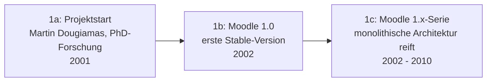

# Evolution und Architekturen von Moodle

Moodle bildet Generation 1b der [Evolution digitaler klassischer LMS](../../e-learning/evolution-digitaler-klassische-lms.md#1b-vernetzte-web-lms-scorm-ara-1990-2005), die ihrerseits Generation 1 der übergeordneten [Evolution digitaler Lernmanagement-Systeme](../../e-learning/evolution-digitaler-lms.md) bildet. Diese eigenständige Zeitachse zoomt — analog zu den Produkt-Spezialartikeln [Evolution und Architekturen von MediaWiki](../mediawiki/evolution-digitaler-mediawiki.md) und [Evolution und Architekturen von Drupal](../drupal/evolution-digitaler-drupal.md) — in genau Moodles eigene Architekturlinie hinein: von der sozial-konstruktivistischen Gründungsidee über die Architektur-Neuschreibung in Version 2.0, das Plugin- und Mobile-Ökosystem, die UI-Modernisierung bis zur aktuellen KI-Subsystem- und Versionsschema-Generation. Die praktische Installation behandelt [Moodle installieren: Git, PostgreSQL und Nginx](installieren.md).

!!! note "Hinweis: Generationen überlappen sich"
    Die Zeiträume sind grobe Orientierung, keine scharfen Grenzen — die 1.x-Architektur lief noch Jahre parallel zu ersten 2.x-Installationen, und ältere Plugin-APIs bleiben aus Rückwärtskompatibilitätsgründen bis heute nutzbar. Entscheidend ist die **Architektur** (Datei-/Plugin-System, Kern-API, Integrationsfähigkeit), nicht allein das Versionsjahr.

!!! warning "Achtung: schnelle Release-Kadenz"
    Moodle veröffentlicht mehrmals jährlich neue Versionen mit eigenem Support-Zeitraum — aktuelle Versionsnummern und Support-Ende-Daten immer gegen [moodledev.io/general/releases](https://moodledev.io/general/releases) prüfen, bevor diese Zeitachse als Entscheidungsgrundlage dient.

---

## Generation 1: Von der Pädagogik-These zur ersten Stable-Serie, 2001 – 2010

Die Gründergeneration eint drei Prinzipien: **sozial-konstruktivistische Pädagogik** als explizite Design-Leitlinie (statt reiner Content-Auslieferung), eine **monolithische PHP-Architektur** mit zentraler Kurs-/Nutzerdatenbank und **community-getriebene Open-Source-Entwicklung** von Anfang an. Sie lässt sich in drei technologische Entwicklungsstufen unterteilen:

### 1a. Projektstart — sozial-konstruktivistische Grundidee, 2001

- **Hintergrund:** Martin Dougiamas entwickelt Moodle im Rahmen seiner PhD-Forschung an der Curtin University — Leitidee: Lernende konstruieren Wissen aktiv durch Interaktion (Foren, gemeinsame Aktivitäten) statt passiven Konsum aufbereiteter Inhalte.
- **Bedeutung:** dieser pädagogische Grundsatz prägt bis heute den Aktivitäten-zentrierten Kursaufbau (Forum, Wiki, Aufgabe als gleichrangige Bausteine neben reinem Kursmaterial), statt reiner Content-Paketierung wie bei frühen CBT-Systemen.

### 1b. Moodle 1.0 — erste Stable-Version, 2002

- **Architektur:** PHP mit MySQL (später PostgreSQL) als Datenbank, Kurs als zentraler Container mit Wochen-/Themenformat, feste Menge an Kernaktivitäten (Forum, Quiz, Aufgabe, Wiki, Chat).
- **Bedeutung:** Grundstein des bis heute dominierenden Open-Source-LMS im Bildungssektor, siehe auch [Generation 1b der klassischen LMS-Zeitachse](../../e-learning/evolution-digitaler-klassische-lms.md#1b-vernetzte-web-lms-scorm-ara-1990-2005).

### 1c. Moodle 1.x-Serie — monolithische Architektur reift, 2002 – 2010

- **Architektur:** kontinuierliche Erweiterung der 1.x-Codebasis um zusätzliche Aktivitätstypen und SCORM-Unterstützung, aber weiterhin ohne formalisierte Plugin-Typen-Architektur oder externe Web-Services-Schnittstelle.
- **Grenzen:** Datei-Uploads verstreut über einzelne Aktivitäten statt zentraler Verwaltung, kein einheitliches API-Konzept für Drittanbieter-Integrationen — beides löst erst Generation 2.

---

## Generation 2: Moodle 2.0 — Architektur-Neuschreibung, 2010

Die einschneidendste Zäsur der Moodle-Geschichte: statt inkrementeller Erweiterung der 1.x-Codebasis ein grundlegender Umbau der internen Architektur, ohne den Namen oder das pädagogische Grundprinzip zu wechseln.

**Architektur:** neue, zentrale **File-API** ersetzt verstreute Datei-Uploads, formalisierte **Plugin-Typen-Architektur** (Aktivitäts-, Block-, Theme-, Authentifizierungs-, Einschreibungs-Plugins mit definierten Schnittstellen) statt Core-Modifikationen, neue **Web-Services-API** für externe Anwendungen — technisches Fundament für die spätere Mobile App und LTI-Integration.

| Meilenstein | Jahr | Bedeutung |
|---|---|---|
| **File-API** | 2010 | Zentrale, konsistente Dateiverwaltung statt aktivitätsspezifischer Upload-Logik. |
| **Plugin-Typen-Architektur** | 2010 | Definierte Erweiterungspunkte (Aktivität, Block, Theme, Auth, Enrol) statt Core-Patches — Grundlage des heutigen Plugin-Verzeichnisses. |
| **Web-Services-API** | 2010 | Externe Anwendungen greifen über definierte Funktionen statt direktem Datenbankzugriff auf Moodle zu. |

---

## Generation 3: Plugin- & Mobile-Ökosystem, 2010 – 2017

Die in Generation 2 gelegten API-Fundamente tragen jetzt ein wachsendes Ökosystem aus Drittanbieter-Plugins und einer offiziellen mobilen Anwendung.

| Baustein | Jahr | Rolle |
|---|---|---|
| **Moodle-Plugin-Verzeichnis** | wachsend ab 2010 | Community-gepflegte Erweiterungen für Aktivitätstypen, Integrationen und Reporting auf Basis der Plugin-Typen-Architektur. |
| **LTI-Unterstützung** (Learning Tools Interoperability) | ab 2011 | Moodle als LTI-Tool-Consumer und -Provider — bindet externe Lernwerkzeuge standardisiert ein, siehe [Evolution und Architekturen digitaler interoperabler LMS](../../e-learning/evolution-digitaler-interoperable-lms.md). |
| **Moodle Mobile App** | 2014 | Native App auf Basis der Web-Services-API aus Generation 2 — Offline-Zugriff auf Kursmaterialien. |

---

## Generation 4: Boost-Theme & UI-Modernisierung, ab 2017

Nach Jahren derselben grundlegenden Oberfläche bringt diese Generation eine vollständig neue, auf einem modernen CSS-Framework basierende Standardoberfläche.

**Architektur:** **Boost** löst das jahrzehntealte „Clean"-Theme als Standard-Theme ab — Bootstrap-basiertes Layout, responsives Design, vereinfachte Navigation über eine seitliche Drawer-Leiste statt verschachtelter Block-Regionen.

---

## Generation 5: UX-Neugestaltung Moodle 4.0, 2022

Die umfassendste Überarbeitung der Nutzeroberfläche seit Generation 2 — diesmal ohne Bruch der zugrunde liegenden Architektur, sondern als gezielte UX-Modernisierung.

| Baustein | Bedeutung |
|---|---|
| **Neuer Kurs-Index** | Persistente Seitenleiste mit Kursabschnitts-Navigation statt reinem Scrollen durch eine lange Kursseite. |
| **Activity-Information-Leiste** | Zeigt Fälligkeitsdatum, Abschlussstatus und Bewertung direkt an jeder Aktivität, statt separater Berichtsansichten. |
| **Überarbeitete Teilnehmerseite** | Konsolidierte Verwaltung von Rollen, Gruppen und Einschreibungen in einer Ansicht. |

---

## Generation 6: KI-Subsystem, Kommunikationsintegration & Versionsschema-Neustart, ab 2023

Die aktuelle Generation bringt drei parallele Entwicklungen: ein Kommunikations-Subsystem für Kurs-Chats, ein eigenes KI-Anbindungssystem und eine grundlegende Umstellung der Versionsnummerierung.

| Baustein | Jahr | Rolle |
|---|---|---|
| **Communication-Subsystem** | ab 2023 | Bindet externe Kommunikationsdienste (z. B. Matrix-basierte Kurs-Chats) direkt in Kurse ein, statt ausschließlich auf das klassische Forum-Modul zu setzen. |
| **AI-Subsystem** (AI-Provider-/AI-Placement-Plugins) | ab 2024 | Definierter Erweiterungspunkt für LLM-Anbindung (z. B. Fragen- oder Zusammenfassungs-Generierung) direkt im Core, statt proprietärer Drittanbieter-Insellösungen. |
| **Versionsschema-Neustart auf 5.x** | ab 2025 | Nummerierung springt von der 4.x-Serie direkt auf 5.0 — aktueller Stable-Zweig zum Zeitpunkt der [Moodle-Installationsanleitung](installieren.md) dieses Repositories ist `MOODLE_500_STABLE`. |

!!! tip "Bezug zu diesem Repository"
    Die in [Moodle installieren: Git, PostgreSQL und Nginx](installieren.md) dokumentierte Installation folgt einem Git-Checkout des jeweils aktuellen Stable-Zweigs dieser Generation — technisch bereits in Generation 6 dieser Zeitachse.

---

## Alternative Sortier- & Klassifikationskriterien für Moodle

### 1. Erweiterungsmechanismus

- **Core-Patch** — direkte Änderung am Kernquelltext, vor Generation 2 mangels formalisierter Plugin-Architektur üblich.
- **Plugin-Typen-API** — definierte Erweiterungspunkte (Aktivität, Block, Theme, Auth, Enrol, AI-Provider) seit Generation 2/6.

### 2. Integrationsmodell

- **Isolierte Installation** — Moodle ohne externe Werkzeuganbindung (Generation 1).
- **LTI-Tool-Consumer/-Provider** — standardisierte Anbindung externer Lernwerkzeuge (Generation 3).
- **Web-Services-Client** — externe Anwendungen (Mobile App, Drittanbieter-Integrationen) über definierte API-Funktionen (Generation 2/3).

### 3. Oberflächen-Generation

- **Clean-Theme-Ära** — klassische, blockbasierte Oberfläche (Generation 1–3).
- **Boost-Ära** — Bootstrap-basiertes, responsives Standard-Theme (ab Generation 4).

---

## Verwandte Themen

- [Moodle installieren: Git, PostgreSQL und Nginx](installieren.md) — Installationsanleitung
- [Evolution und Architekturen digitaler klassischer LMS](../../e-learning/evolution-digitaler-klassische-lms.md) — übergeordnetes Generationenmodell, Generation 1b dort entspricht diesem Artikel im Ganzen
- [Evolution und Architekturen digitaler Lernmanagement-Systeme](../../e-learning/evolution-digitaler-lms.md) — Gesamt-Generationenmodell für LMS im Allgemeinen
- [Evolution und Architekturen digitaler interoperabler LMS](../../e-learning/evolution-digitaler-interoperable-lms.md) — Vertiefung zu Moodles LTI-Integration aus Generation 3
- [Evolution und Architekturen von MediaWiki](../mediawiki/evolution-digitaler-mediawiki.md) — analoger Produkt-Spezialartikel für MediaWiki
- [Evolution und Architekturen von Drupal](../drupal/evolution-digitaler-drupal.md) — analoger Produkt-Spezialartikel für Drupal
- [E-Learning-Autorentools & Interaktive Lernumgebungen](../../e-learning/index.md) — Gesamtübersicht Autorentools, LMS und KI-Agenten im E-Learning
- [Dokumentationsübersicht](../index.md)
