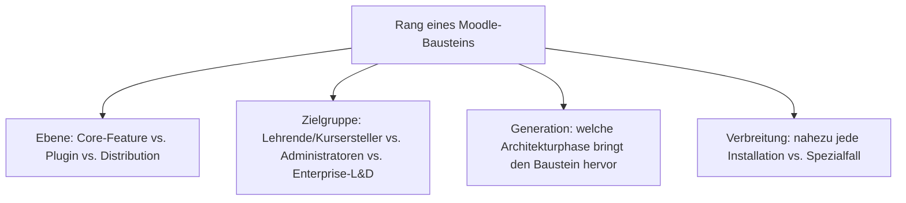
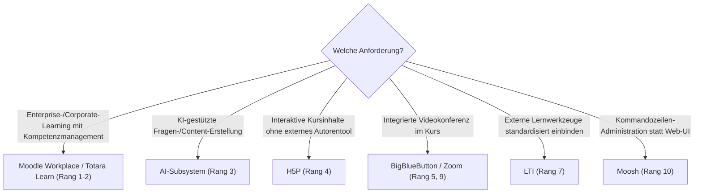

# Beste Moodle-Plugins & -Distributionen 2026 — Top-15-Topliste

Die [Evolution und Architekturen von Moodle](evolution-digitaler-moodle.md) ordnet die Produktgeschichte chronologisch nach sechs Generationen — von der sozial-konstruktivistischen Gründungsidee über die Architektur-Neuschreibung in Version 2.0 bis zum aktuellen KI-Subsystem und Versionsschema-Neustart auf 5.x. Da Moodle selbst kein Kategorie-Vergleich, sondern ein Einzelprodukt ist, übersetzt diese Seite die Chronologie stattdessen in eine **nach 2026-Relevanz gerankte Top-15-Liste konkreter Plugins, Core-Features, Themes und Distributionen**, mit denen dieses eine Produkt tatsächlich betrieben wird.

!!! note "Hinweis: Core-Feature, Plugin und Distribution gemeinsam gerankt"
    Diese Liste mischt bewusst drei Ebenen — heute im Core enthaltene Features (LTI, AI-Subsystem, Communication-Subsystem), weiterhin unverzichtbare Community-Plugins (H5P, BigBlueButton, Boost Union) und vorkonfigurierte Enterprise-Distributionen (Moodle Workplace, Totara Learn) — weil alle drei gemeinsam bestimmen, wie eine Moodle-Installation 2026 tatsächlich aufgebaut wird.

---

## Bewertungskriterien

---

## Top 15 im Überblick

| Rang | Baustein | Ebene | Generation | Bedeutung |
|---|---|---|---|---|
| 1 | **Moodle Workplace** | Distribution | 6 (KI-Subsystem, Kommunikation & Versionsschema-Neustart) | Von Moodle HQ selbst gepflegte Enterprise-Distribution für Corporate-Learning und Kompetenzmanagement |
| 2 | **Totara Learn** | Distribution | 1c (Enterprise-LMS & Talent-Suiten, übergeordnete LMS-Zeitachse) | Eigenständiger Enterprise-Fork mit tiefer Talent-Management-Integration, ursprünglich aus Moodle hervorgegangen |
| 3 | **AI-Subsystem** (AI-Provider-/AI-Placement-Plugins) | Core-Feature | 6 (KI-Subsystem, Kommunikation & Versionsschema-Neustart) | Definierter Erweiterungspunkt für LLM-Anbindung (Fragen-/Zusammenfassungs-Generierung) direkt im Core |
| 4 | **H5P** | Plugin | 3 (Plugin- & Mobile-Ökosystem) | Interaktive Inhaltserstellung (Quiz, Präsentationen, interaktives Video) direkt im Kurs statt externem Autorentool |
| 5 | **BigBlueButton** | Plugin (Aktivität) | 3 (Plugin- & Mobile-Ökosystem) | Integrierte Videokonferenz-Aktivität ohne Wechsel zu einer externen Konferenzplattform |
| 6 | **Boost Union** | Theme | 4 (Boost-Theme & UI-Modernisierung) | Community-Weiterentwicklung des Boost-Themes mit deutlich mehr Konfigurationsoptionen ohne eigenes Theming |
| 7 | **LTI** (mod_lti, Consumer & Provider) | Core-Feature | 3 (Plugin- & Mobile-Ökosystem) | Standardisierte Einbindung externer Lernwerkzeuge, siehe [Evolution und Architekturen digitaler interoperabler LMS](../../e-learning/evolution-digitaler-interoperable-lms.md) |
| 8 | **Communication-Subsystem** (u. a. Matrix-Integration) | Core-Feature | 6 (KI-Subsystem, Kommunikation & Versionsschema-Neustart) | Bindet externe Kurs-Chats direkt ein, statt ausschließlich auf das klassische Forum-Modul zu setzen |
| 9 | **Zoom** | Plugin (Aktivität) | 3 (Plugin- & Mobile-Ökosystem) | Meeting-Integration als Alternative zu BigBlueButton für Institutionen mit bestehender Zoom-Lizenz |
| 10 | **Moosh** (Moodle Shell) | Admin-Werkzeug | 2 (Moodle 2.0 — Architektur-Neuschreibung) | Kommandozeilen-Administration (Kurserstellung, Nutzerverwaltung) statt repetitiver Klicks im Web-UI |
| 11 | **STACK** | Plugin (Fragetyp) | 3 (Plugin- & Mobile-Ökosystem) | Algorithmisch generierte, mathematisch auswertbare Fragen — Standard für MINT-Fächer |
| 12 | **Collapsed Topics** | Plugin (Kursformat) | 3 (Plugin- & Mobile-Ökosystem) | Ein-/ausklappbare Kursabschnitte als beliebte Alternative zur Standard-Kursdarstellung |
| 13 | **Attendance** (mod_attendance) | Plugin (Aktivität) | 3 (Plugin- & Mobile-Ökosystem) | Digitale Anwesenheitserfassung für Präsenz- und Blended-Learning-Formate |
| 14 | **Custom Certificate** | Plugin (Aktivität) | 3 (Plugin- & Mobile-Ökosystem) | Automatisierte, individuell gestaltbare Teilnahmezertifikate bei Kursabschluss |
| 15 | **Adaptable** | Theme | 4 (Boost-Theme & UI-Modernisierung) | Populäre Boost-Alternative mit stärker konfigurierbarer Startseiten- und Blockregion-Gestaltung |

---

## Highlights im Detail

### Rang 1–3: die aktuelle KI- und Enterprise-Generation
Moodle Workplace, Totara Learn und das AI-Subsystem zeigen gemeinsam, wie sich Moodle von der reinen Hochschul-/K-12-Installation hin zu Enterprise-Kompetenzmanagement und LLM-gestützter Content-Erstellung erweitert, siehe [Generation 6](evolution-digitaler-moodle.md#generation-6-ki-subsystem-kommunikationsintegration-versionsschema-neustart-ab-2023).

### Rang 4–5, 9, 11–14: das Plugin-Ökosystem aus Generation 3
H5P, BigBlueButton, Zoom, STACK, Collapsed Topics, Attendance und Custom Certificate zeigen die Breite des seit Moodle 2.0 formalisierten Plugin-Systems — von interaktiven Inhalten über Videokonferenzen bis zu fachspezifischen Fragetypen, siehe [Generation 3](evolution-digitaler-moodle.md#generation-3-plugin-mobile-okosystem-2010-2017).

### Rang 7: LTI als Brücke zum breiteren LMS-Markt
`mod_lti` bindet Moodle standardisiert an externe Lernwerkzeuge an, statt jede Integration proprietär nachzubauen — vertieft in der eigenständigen [interoperablen LMS-Zeitachse](../../e-learning/evolution-digitaler-interoperable-lms.md).

### Rang 10: Administration jenseits der Web-Oberfläche
Moosh zeigt, dass produktive Moodle-Administration bei größeren Installationen fast immer über die Kommandozeile statt ausschließlich über das Admin-Web-UI läuft — direkt im Anschluss an die [CLI-Installation dieses Repositories](installieren.md) nutzbar.

---

## Wegweiser: von Anforderung zu passendem Baustein

!!! tip "Tipp: die Produkt-Chronologie separat prüfen"
    Diese Liste übersetzt alle sechs Generationen der Quell-Chronologie in eine gemeinsame 2026-Momentaufnahme — für die vollständige Versionsgeschichte siehe [Evolution und Architekturen von Moodle](evolution-digitaler-moodle.md).

---

## Verwandte Themen

- [Evolution und Architekturen von Moodle](evolution-digitaler-moodle.md) — chronologisches Generationenmodell, dessen aktuellen Stand diese Topliste zusammenfasst
- [Moodle installieren: Git, PostgreSQL und Nginx](installieren.md) — Installationsanleitung für den aktuellen Stable-Zweig
- [Evolution und Architekturen digitaler klassischer LMS](../../e-learning/evolution-digitaler-klassische-lms.md) — übergeordnetes Generationenmodell, in dem Moodle Generation 1b bildet
- [Evolution und Architekturen digitaler interoperabler LMS](../../e-learning/evolution-digitaler-interoperable-lms.md) — Vertiefung zu Rang 7 (LTI)
- [Beste klassische LMS 2026 (Top 15)](../../e-learning/klassische-lms-2026-topliste.md) — Moodle im Vergleich zu Blackboard, WebCT & Co.
- [Dokumentationsübersicht](../index.md)
