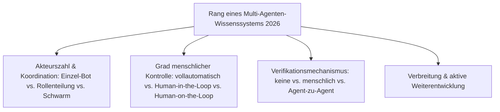
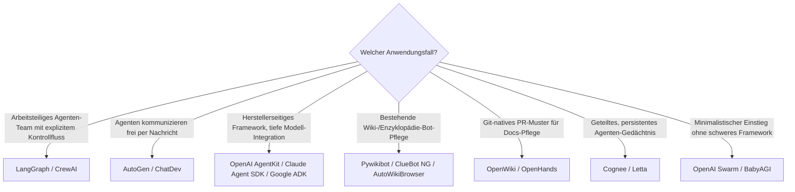

# Beste Multi-Agenten-Wissensökosysteme 2026 — Top-20-Topliste

Die [Evolution und Architekturen digitaler Multi-Agenten-Wissensökosysteme](evolution-digitaler-multiagenten-wissensoekosysteme.md) ordnet diese Kategorie chronologisch nach der **Architektur der Koordination** — vom einzelnen deterministischen Bot bis zu selbstorganisierenden, multimodalen Agenten-Schwärmen. Diese Seite übersetzt die Chronologie in eine **Momentaufnahme 2026**: die 20 Frameworks und konkreten Systeme, mit denen mehrere Agenten heute koordiniert an einer gemeinsamen Wissensbasis arbeiten.

!!! note "Hinweis: Orchestrierung statt Einzel-Coding-Agent"
    Die zahlreichen KI-Agenten-Toplisten unter [KI-Coding](../../künstliche-intelligenz/coding/index.md) (z. B. [Beste Self-Hosting-KI-Agenten](../../künstliche-intelligenz/coding/selbsthosting-ki-agenten-topliste.md), [Beste KI-Agent-CLIs](../../künstliche-intelligenz/coding/ki-agent-cli-topliste.md)) ranken einzelne Coding-Assistenten für Entwickler. Diese Seite bleibt bei der engeren Definition der Evolution-Chronologie: Frameworks und Systeme, in denen **mehrere Agenten koordiniert** an einer **gemeinsamen Wissensbasis** arbeiten — nicht ein einzelner Assistent für eine einzelne Person.

---

## Bewertungskriterien

!!! warning "Achtung: Schwarm-Verifikation ist noch jung"
    Rang 17 und 19 (Cognee, Letta) sowie die multimodalen Orchestrierungsmuster aus Generation 6 haben deutlich kürzere Produktionsreife-Historie als die etablierten Multi-Agenten-Frameworks (Rang 1–9) — vor produktivem Einsatz die aktuelle Stabilität prüfen. **Stand: August 2026.**

---

## Top 20 im Überblick

| Rang | System | Generation | Rolle/Prinzip | Besondere Stärke |
|---|---|---|---|---|
| 1 | **[LangGraph](../../künstliche-intelligenz/coding/agentic-workflows-langgraph.md)** | 3 (Koordinierte Multi-Agenten-Frameworks) | Zustandsgraph-basierte Orchestrierung | Dominantes Framework für arbeitsteilige Agenten mit explizitem Kontrollfluss |
| 2 | **CrewAI** | 3 (Koordinierte Multi-Agenten-Frameworks) | Rollenbasierte „Crews" | Klarste Rollentrennung (Researcher/Writer/Reviewer) als Grundmuster |
| 3 | **[AutoGen](../../künstliche-intelligenz/coding/autogen-multiagent-framework.md)** (Microsoft, inkl. Magentic-One) | 3 (Koordinierte Multi-Agenten-Frameworks) | Konversationsbasierte Koordination | Agenten kommunizieren per Nachrichtenaustausch statt starrem Graphen |
| 4 | **MetaGPT** | 3 (Koordinierte Multi-Agenten-Frameworks) | Simulierte Software-Firma als Agenten-Team | Strukturierte, dokumentenzentrierte Zwischenergebnisse zwischen den Rollen |
| 5 | **Camel-AI** | 3 (Koordinierte Multi-Agenten-Frameworks) | Rollenspiel-basierte Agenten-Kommunikation | Früher akademischer Referenzrahmen für autonome Agent-zu-Agent-Dialoge |
| 6 | **OpenAI AgentKit** | 6 (Multimodale Multi-Agenten-Ökosysteme) | Herstellerseitiges Orchestrierungs-Toolkit | Tiefste native Anbindung an OpenAI-Modelle über alle Modalitäten hinweg |
| 7 | **Claude Agent SDK** | 6 (Multimodale Multi-Agenten-Ökosysteme) | Herstellerseitiges Agenten-Framework | Grundlage für Claude Code als Orchestrator git-nativer Wissenspflege-Agenten |
| 8 | **Google Agent Development Kit (ADK)** | 3 (Koordinierte Multi-Agenten-Frameworks) | Herstellerseitiges Multi-Agenten-Framework | Tiefe Integration in Googles Gemini-/Vertex-AI-Ökosystem |
| 9 | **Semantic Kernel Agents** | 3 (Koordinierte Multi-Agenten-Frameworks) | Orchestrierungsschicht in Microsofts Semantic Kernel | Stärkster Enterprise-/.NET-Fokus unter den Multi-Agenten-Frameworks |
| 10 | **[Pywikibot](mediawiki/mediawiki-python-bot.md)** | 1 (Regelbasierte Einzel-Bots) | Standardisierter MediaWiki-API-Bot-Zugriff | Fundament praktisch aller Wikipedia-Bot-Ökosysteme seit 2005 |
| 11 | **ClueBot NG** | 1 (Regelbasierte Einzel-Bots) | ML-Klassifikator für Vandalismus-Erkennung | Vollautomatischer Revert ohne generatives Sprachverständnis, seit 2010 produktiv |
| 12 | **AutoWikiBrowser (AWB)** | 1 (Regelbasierte Einzel-Bots) | Halbautomatisiertes Massenbearbeitungs-Tool | Etablierter Standard für Mensch-gesteuerte Bot-Massenbearbeitungen |
| 13 | **AutoGPT** | 2 (Der autonome Einzel-Agent) | Autonomer Einzel-Agent nach ReAct-Muster | Erster breit bekannter autonomer Agent, zeigte früh die Grenzen fehlender Rollenteilung |
| 14 | **BabyAGI** | 2 (Der autonome Einzel-Agent) | Task-getriebene Autonomie-Schleife | Minimalistische Referenzimplementierung des Plan-Ausführen-Reflektieren-Zyklus |
| 15 | **[OpenWiki](openwiki-repo-dokumentation-agent.md)** (LangChain) | 4 (Git-native Human-in-the-Loop-Wissenspflege) | Repo-Dokumentations-Agent | Konkretes Beispiel des Agent-Branch-→-PR-→-Review-Musters dieses Repositories |
| 16 | **OpenHands** (ehem. OpenDevin) | 4 (Git-native Human-in-the-Loop-Wissenspflege) | Autonomer PR-generierender Coding-/Docs-Agent | Offenste, community-getriebenste Alternative zu proprietären autonomen PR-Agenten |
| 17 | **Cognee** | 5 (Selbstorganisierende Wissensgraphen & Schwarm-Verifikation) | Gemeinsam gepflegter Agenten-Wissensgraph | Baut den geteilten Graphen aus Generation 5 direkt als wiederverwendbares Framework |
| 18 | **ChatDev** | 3 (Koordinierte Multi-Agenten-Frameworks) | Chat-simulierte Software-Firma | Vollständiger Entwicklungszyklus (Design/Code/Test) als Agenten-Dialog |
| 19 | **[Letta](pkm-wissensgraphen-2026-topliste.md)** (ehem. MemGPT) | 5/6 (Schwarm-Verifikation/Multimodal) | Persistenter, geteilter Agenten-Speicher | Gedächtnis-Backbone für mehrere Agenten mit gemeinsamem Kontext statt isolierter Einzelsitzungen |
| 20 | **OpenAI Swarm** | 3 (Koordinierte Multi-Agenten-Frameworks) | Leichtgewichtige Orchestrierungs-Primitive | Minimalistischer Gegenentwurf zu den schwergewichtigeren Frameworks aus Rang 1–4 |

---

## Highlights im Detail

### Rang 1–5, 20: die Multi-Agenten-Frameworks differenzieren sich über das Koordinationsmuster
LangGraph, CrewAI, AutoGen, MetaGPT, Camel-AI und OpenAI Swarm lösen alle dasselbe Grundproblem — mehrere spezialisierte Agenten sinnvoll koordinieren —, aber mit unterschiedlichem Architekturkompromiss: LangGraph über explizite Zustandsgraphen, AutoGen über freien Nachrichtenaustausch, CrewAI über feste Rollen-Hierarchien und OpenAI Swarm bewusst minimalistisch als Gegenentwurf zu den schwergewichtigeren Alternativen.

### Rang 10–12: das Wikipedia-Bot-Ökosystem bleibt die Referenz für Generation 1
Pywikibot, ClueBot NG und AutoWikiBrowser zeigen, dass regelbasierte Einzel-Bots 2026 keineswegs verschwunden sind — sie laufen produktiv **neben** den LLM-Multi-Agenten-Teams aus Rang 1–9, für genau die risikoarmen, gut abgrenzbaren Aufgaben, für die sie ursprünglich entstanden.

### Rang 15–16: das Repository selbst nutzt genau dieses Muster
[OpenWiki](openwiki-repo-dokumentation-agent.md) und OpenHands demonstrieren [Generation 4 dieser Zeitachse](evolution-digitaler-multiagenten-wissensoekosysteme.md#generation-4-git-native-human-in-the-loop-wissenspflege-2024-2025) in der Praxis — Agent-Branch, automatisierte Prüfung, Pull Request, menschlicher Review vor dem Merge — dasselbe Muster, nach dem dieses Repository selbst gepflegt wird.

### Rang 17, 19: geteiltes Gedächtnis als Voraussetzung für Generation 5/6
Cognee und Letta lösen ein Problem, das reine Orchestrierungs-Frameworks (Rang 1–9) offenlassen: Wie behalten mehrere Agenten über Sitzungen hinweg denselben Kontext? Beide bauen einen persistenten, gemeinsam nutzbaren Wissens-/Gedächtnisspeicher, auf den mehrere Agenten gleichzeitig zugreifen — die technische Voraussetzung für die Schwarm-Verifikation aus Generation 5.

---

## Entscheidungshilfe nach Anwendungsfall

!!! tip "Tipp: Generation vor Framework wählen"
    Die passende Wahl hängt stärker vom benötigten **Koordinationsmuster** (siehe [Alternative Klassifikationskriterien der Evolution-Chronologie](evolution-digitaler-multiagenten-wissensoekosysteme.md#1-akteurszahl-koordination)) ab als vom Framework-Namen — mehrere Kandidaten dieser Liste lösen strukturell dasselbe Problem mit unterschiedlicher Syntax.

---

## 🔗 Verwandte Themen

- [Startseite](../../index.md) — zurück zur Dokumentations-Zentrale
- [Evolution und Architekturen digitaler Multi-Agenten-Wissensökosysteme](evolution-digitaler-multiagenten-wissensoekosysteme.md) — chronologisches Generationenmodell, dessen aktuellen Stand diese Topliste zusammenfasst
- [Multi-Agenten-Wissensökosysteme mit PostgreSQL-/Dateiformat-Speicherung (Top 14)](multiagenten-wissensoekosysteme-postgresql-dateiformat-2026-topliste.md) — dieselbe Kategorie, strenger gefiltert nach Lizenz, Speicherbackend und Entwicklungsaktivität
- [Beste semantische & RAG-Wissenssysteme 2026 (Top 20)](semantische-rag-wissenssysteme-2026-topliste.md) — GraphRAG-Bausteine als technische Grundlage von Rang 17, 19 dieser Liste
- [Beste PKM-Wissensgraphen & Block-Editoren 2026 (Top 20)](pkm-wissensgraphen-2026-topliste.md) — Letta dort als persönliches statt Multi-Agenten-Gedächtnis
- [OpenWiki: Repo-Dokumentations-Agent (LangChain)](openwiki-repo-dokumentation-agent.md) — vertiefend zu Rang 15
- [Agentic Workflows (LangGraph)](../../künstliche-intelligenz/coding/agentic-workflows-langgraph.md) — vertiefend zu Rang 1
- [AutoGen Multi-Agent Framework](../../künstliche-intelligenz/coding/autogen-multiagent-framework.md) — vertiefend zu Rang 3
- [MediaWiki Python Bot Automatisierung](mediawiki/mediawiki-python-bot.md) — vertiefend zu Rang 10
- [LLM-Wiki-Pattern (Karpathy-Muster)](llm-wiki-pattern-karpathy.md) — das konkrete Muster, das dieses Repository selbst nutzt (Generation 4)
- [Beste Wissensmanagement-Systeme (Open Source) mit MCP-Server (Top 20)](wissensmanagement-mcp-server-topliste.md) — MCP als gemeinsame Werkzeugschicht aus Generation 5
