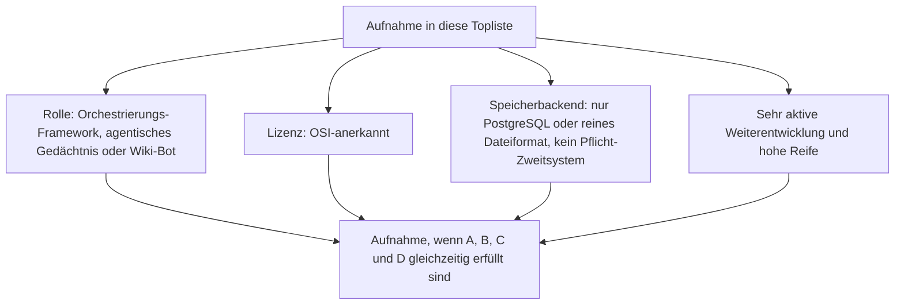
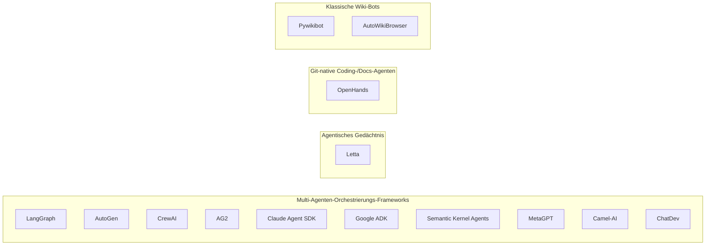
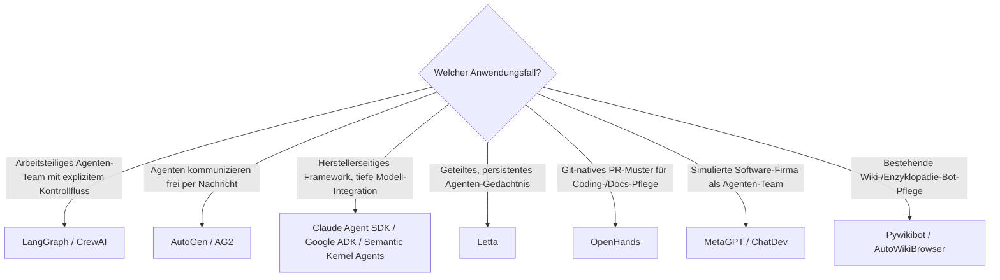

# Multi-Agenten-Wissensökosysteme mit PostgreSQL- oder Dateiformat-Speicherung, aktiver Weiterentwicklung & hoher Reife — Top-14-Topliste

Die [Beste Multi-Agenten-Wissensökosysteme 2026 (Top 20)](multiagenten-wissensoekosysteme-2026-topliste.md) rankt Frameworks und Systeme, in denen mehrere Agenten koordiniert an einer gemeinsamen Wissensbasis arbeiten, unabhängig von Lizenz und Speicherarchitektur. Diese Seite wendet auf genau dieselbe Kategorie die inzwischen etablierten strengeren Kriterien an: nur OSI-Open-Source, Zustands-/Gedächtnis-Persistenz ausschließlich in PostgreSQL oder einem reinen Dateiformat, sehr aktive Weiterentwicklung, hohe Reife.

!!! note "Hinweis: Nur OSI-anerkannte Lizenzen"
    Wie in der [Gesamtübersicht](open-source-llm-agent-mcp-systeme.md) zählen hier ausschließlich Systeme unter einer OSI-anerkannten Open-Source-Lizenz (MIT, GPL, LGPL, AGPL, Apache-2.0). Das kostet dieser Liste OpenAI AgentKit — ein rein herstellerseitiges, nicht offen lizenziertes Toolkit.

!!! tip "Tipp: Orchestrierungs-Frameworks zählen als Datei-/Postgres-kompatibel, wenn sie kein Pflicht-Backend erzwingen"
    Wie schon bei den RAG-Frameworks in den [Speicherbackend-Toplisten](semantische-rag-wissenssysteme-postgresql-dateiformat-2026-topliste.md) besitzen die meisten Multi-Agenten-Orchestrierungs-Frameworks kein eigenes festes Speicherbackend — Session- und Zwischenzustand landet typisch in lokalen Dateien (JSON, JSONL, SQLite) oder wird optional an PostgreSQL angebunden, ohne dass ein Pflicht-Zweitsystem erzwungen wird.

---

## Bewertungskriterien

!!! warning "Achtung: Momentaufnahme, Stand August 2026 — bewusst kürzer als 20"
    Von den 20 Systemen der [Basis-Topliste](multiagenten-wissensoekosysteme-2026-topliste.md) fallen sechs heraus: OpenAI AgentKit (Lizenz), ClueBot NG (Weiterentwicklung praktisch eingestellt), AutoGPT und BabyAGI (Entwicklungstempo seit dem Hype 2023 deutlich abgeklungen), OpenWiki (Referenzbeispiel dieses Repositorys statt breit adoptiertes Produkt) und OpenAI Swarm (2025 durch ein Nachfolgeprodukt abgelöst). Cognee bleibt außen vor, weil die Basis-Topliste selbst kürzere Produktionsreife-Historie attestiert. Ergänzt um AG2 (Community-Fork von AutoGen, in der Basis-Topliste nicht separat gelistet) reicht es dennoch nur zu 14 statt 20 Rängen.

---

## Top 14 im Überblick

| Rang | System | Lizenz | Speicherbackend | Aktivität/Reife |
|---|---|---|---|---|
| 1 | **[LangGraph](../../künstliche-intelligenz/coding/agentic-workflows-langgraph.md)** | MIT | Checkpointing via SQLite oder PostgreSQL | Dominantes Framework für arbeitsteilige Agenten, extrem aktiv |
| 2 | **[AutoGen](../../künstliche-intelligenz/coding/autogen-multiagent-framework.md)** (Microsoft, inkl. Magentic-One) | MIT | Kein Pflicht-Backend — Session-State optional als Datei/SQLite | Sehr aktiv, konversationsbasierte Koordination |
| 3 | **CrewAI** | MIT | Kein Pflicht-Backend — lokale Datei-/SQLite-Speicherung für Memory-Feature | Klarste Rollentrennung, sehr aktiv |
| 4 | **AG2** (Community-Fork von AutoGen) | Apache-2.0 | Kein Pflicht-Backend (identisches Erbe wie AutoGen) | Seit dem Fork 2024 eigenständig sehr aktiv weiterentwickelt |
| 5 | **Claude Agent SDK** | MIT | Kein Pflicht-Backend — Session-State lokal als Datei (JSONL) | Grundlage für Claude Code, sehr aktiv |
| 6 | **Google Agent Development Kit (ADK)** | Apache-2.0 | Kein Pflicht-Backend | Tiefe Gemini-/Vertex-AI-Integration, aktiv |
| 7 | **Semantic Kernel Agents** | MIT | Kein Pflicht-Backend, optional PostgreSQL für Vector-Memory | Stärkster Enterprise-/.NET-Fokus, aktiv |
| 8 | **Letta** (ehem. MemGPT) | Apache-2.0 | PostgreSQL (Produktion) oder SQLite (lokal) | Produktisierte MemGPT-Referenzarchitektur, sehr aktiv |
| 9 | **OpenHands** (ehem. OpenDevin) | MIT | Lokale Datei-/SQLite-Session-Persistenz | Offenste PR-generierende Coding-/Docs-Agenten-Alternative, sehr aktiv |
| 10 | **MetaGPT** | MIT | Dateibasierte Zwischenergebnisse (Dokumente im Projektordner) | Simulierte Software-Firma, aktiv |
| 11 | **Camel-AI** | Apache-2.0 | Kein Pflicht-Backend | Früher akademischer Referenzrahmen, weiterhin gepflegt |
| 12 | **ChatDev** | Apache-2.0 | Kein Pflicht-Backend | Ruhiger als beim Hype 2023, aber weiterhin gepflegt |
| 13 | **[Pywikibot](mediawiki/mediawiki-python-bot.md)** | MIT | Lokale Konfigurations-/Cache-Dateien | Fundament der Wikipedia-Bot-Ökosysteme seit 2005, ununterbrochen aktiv |
| 14 | **AutoWikiBrowser** (AWB) | GPL | Lokale XML-/Einstellungsdateien | Ruhige, aber kontinuierliche Pflege durch die Wikipedia-Editoren-Community |

---

## Highlights im Detail

### AutoGen vs. AG2: ein Framework-Fork als Aktivitäts-Fallstudie
Rang 2 und 4 demonstrieren dasselbe Muster wie TriliumNext Notes in den PKM-Toplisten dieser Dokumentation: Nach Governance-Differenzen zwischen Microsoft und den ursprünglichen AutoGen-Machern entstand 2024 mit AG2 ein eigenständiger Community-Fork desselben Codebasis-Erbes — beide Zweige bleiben seither unabhängig voneinander sehr aktiv, mit leicht unterschiedlicher Roadmap.

### Claude Agent SDK & Google ADK: Hersteller-SDKs ohne Pflicht-Backend
Rang 5 und 6 zeigen, dass auch herstellerseitige Agenten-Frameworks der großen KI-Anbieter dem „kein Pflicht-Backend"-Prinzip folgen können — beide lassen Session- und Zustandsdaten standardmäßig lokal als Datei liegen, ganz ohne eigenen verpflichtenden Cloud-Dienst. Der Claude Agent SDK ist dabei kein abstraktes Beispiel: Er ist die Grundlage von Claude Code, dem Werkzeug, mit dem dieses Repository selbst gepflegt wird — siehe [LLM-Wiki-Pattern (Karpathy-Muster)](llm-wiki-pattern-karpathy.md).

### Pywikibot & AutoWikiBrowser: die ältesten Systeme dieser gesamten Serie
Pywikibot (seit 2005) und AutoWikiBrowser stehen für ein völlig anderes Aktivitätsprofil als die LLM-nativen Frameworks der oberen Ränge — keine wöchentlichen Releases, aber eine seit über zwei Jahrzehnten ununterbrochene, von der Wikipedia-Editoren-Community getragene Pflege. Ihre Aufnahme zeigt, dass „sehr aktive Weiterentwicklung" nicht zwingend hohe Release-Frequenz bedeutet, sondern nachweisliche Kontinuität ohne Wartungslücke.

---

## Was bewusst nicht in dieser Liste steht

!!! warning "Achtung: Ausschluss trotz Reife oder historischer Bedeutung"
    - **Lizenzausschluss**: OpenAI AgentKit — rein herstellerseitiges, nicht offen lizenziertes Toolkit.
    - **Weiterentwicklung praktisch eingestellt**: ClueBot NG — läuft produktiv weiter, aber ohne nennenswerte aktive Codepflege.
    - **Entwicklungstempo seit dem Hype 2023 deutlich abgeklungen**: AutoGPT und BabyAGI — historisch prägend für Generation 2 der [Evolution-Chronologie](evolution-digitaler-multiagenten-wissensoekosysteme.md), aber 2026 nicht mehr die aktivsten Kandidaten ihrer Kategorie.
    - **Referenzbeispiel statt breit adoptiertes Produkt**: OpenWiki — demonstriert das Git-native Agent-Muster dieses Repositorys, ist aber kein eigenständig breit genutztes Framework.
    - **Kürzere Produktionsreife-Historie laut Basis-Topliste selbst**: Cognee — die Basis-Topliste warnt bereits explizit vor der jungen Produktionshistorie dieses Systems.
    - **2025 durch Nachfolgeprodukt abgelöst**: OpenAI Swarm — als experimentelles Lernprojekt positioniert und inzwischen durch ein herstellerseitiges Nachfolge-Toolkit ersetzt.

---

## Entscheidungshilfe nach Anwendungsfall

---

## 🔗 Verwandte Themen

- [Startseite](../../index.md) — zurück zur Dokumentations-Zentrale
- [Beste Multi-Agenten-Wissensökosysteme 2026 (Top 20)](multiagenten-wissensoekosysteme-2026-topliste.md) — Basis-Topliste ohne Lizenz-/Speicherbackend-/Aktivitätsfilter
- [Evolution und Architekturen digitaler Multi-Agenten-Wissensökosysteme](evolution-digitaler-multiagenten-wissensoekosysteme.md) — chronologisches Generationenmodell als Hintergrund
- [Open-Source-Wissenssysteme mit PostgreSQL- oder Dateiformat-Speicherung (Top 20)](postgresql-dateiformat-wissenssysteme-2026-topliste.md) — dieselben Speicherkriterien für die breitere Wissenssysteme-Klasse
- [Semantische & RAG-Wissenssysteme mit PostgreSQL-/Dateiformat-Speicherung (Top 15)](semantische-rag-wissenssysteme-postgresql-dateiformat-2026-topliste.md) — dieselbe Framework-Behandlung (kein Pflicht-Backend), analoges Ranking für RAG-Bausteine
- [Visuelle, Local-First & agentische Wissenssysteme mit PostgreSQL-/Dateiformat-Speicherung (Top 15)](visuell-agentische-wissenssysteme-postgresql-dateiformat-2026-topliste.md) — Überschneidung bei Letta und LangGraph als agentisches Gedächtnis
- [OpenWiki: Repo-Dokumentations-Agent (LangChain)](openwiki-repo-dokumentation-agent.md) — Referenzbeispiel, in dieser Liste bewusst ausgeschlossen
- [Agentic Workflows (LangGraph)](../../künstliche-intelligenz/coding/agentic-workflows-langgraph.md) — vertiefend zu Rang 1
- [AutoGen Multi-Agent Framework](../../künstliche-intelligenz/coding/autogen-multiagent-framework.md) — vertiefend zu Rang 2
- [MediaWiki Python Bot Automatisierung](mediawiki/mediawiki-python-bot.md) — vertiefend zu Rang 13
- [LLM-Wiki-Pattern (Karpathy-Muster)](llm-wiki-pattern-karpathy.md) — das konkrete Muster hinter Rang 5, 9
