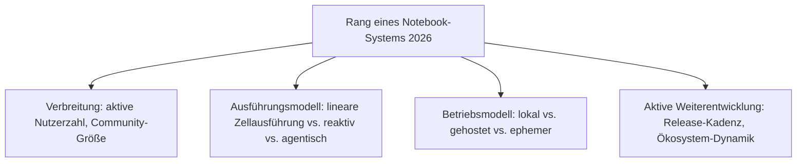
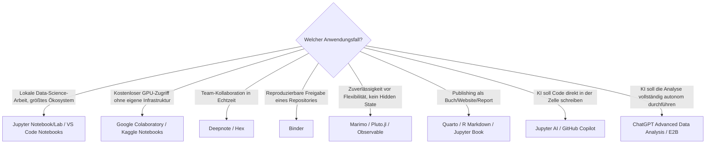

# Beste Notebook-Systeme 2026 — Top-20-Topliste

Die [Evolution und Architekturen digitaler Notebook-Systeme](evolution-digitaler-notebook-systeme.md) bündelt sechs eigenständige Zeitachsen — [Notebook-Vorläufer](evolution-digitaler-notebook-vorlaeufer.md), [IPython & Jupyter](evolution-digitaler-ipython-jupyter.md), [Cloud-Notebooks](evolution-digitaler-cloud-notebooks.md), [R-Markdown & Quarto](evolution-digitaler-rmarkdown-quarto.md), [reaktive Notebooks](evolution-digitaler-reaktive-notebooks.md) und [KI-native Notebooks](evolution-digitaler-ki-native-notebooks.md) — zu einem gemeinsamen Generationenmodell. Diese Seite übersetzt den gesamten Cluster in eine **Momentaufnahme 2026**: 20 Notebook-Systeme, die 2026 tatsächlich produktiv im Einsatz sind, quer über alle sechs Zeitachsen hinweg.

!!! note "Hinweis: Cluster-übergreifende Rangfolge statt Einzel-Chronologie"
    Anders als die sechs Evolution-Kapitel, die je eine Architekturlinie isoliert betrachten, mischt diese Topliste bewusst — ein klassisches Jupyter-Notebook (Generation 2) und ein KI-natives Agenten-Sandbox-System (Generation 6) stehen hier nebeneinander, weil beide 2026 gleichzeitig produktiv genutzt werden, nicht weil eines das andere abgelöst hätte.

---

## Bewertungskriterien

!!! warning "Achtung: Reaktive und agentische Systeme sind noch jung"
    Rang 11–13 (reaktive Notebooks) und 17–20 (KI-native Systeme) haben deutlich kürzere Produktionsreife-Historie als der klassische Jupyter-Kern (Rang 1–4) — vor einer Migration bestehender Workflows die aktuelle Stabilität und den Funktionsumfang prüfen. **Stand: August 2026.**

---

## Top 20 im Überblick

| Rang | System | Generation | Ausführungsmodell | Besondere Stärke |
|---|---|---|---|---|
| 1 | **[Jupyter Notebook / JupyterLab](evolution-digitaler-ipython-jupyter.md#generation-4-project-jupyter-die-abspaltung-2014)** | 2 (IPython/Jupyter) | linear, zustandsbehaftet | Nach wie vor der De-facto-Standard, größtes Kernel-Ökosystem aller Systeme dieser Liste |
| 2 | **Google Colaboratory** | 3 (Cloud) | linear, zustandsbehaftet, gehostet | Kostenloser GPU-Zugriff für die Masse, niedrigste Einstiegshürde |
| 3 | **VS Code Notebooks** (Jupyter-Erweiterung) | 2 (IPython/Jupyter) | linear, zustandsbehaftet, lokal | Nahtlose Integration in denselben Editor wie der übrige Code |
| 4 | **JupyterHub** | 2 (IPython/Jupyter) | linear, Multi-User-Deployment | Standardlösung für Notebook-Zugriff im Team-/Bildungskontext |
| 5 | **Databricks Notebooks** | 3 (Cloud) | linear, Spark-nativ, gehostet | Tiefste Integration in Big-Data-Pipelines dieser Liste |
| 6 | **Amazon SageMaker Studio Notebooks** | 3 (Cloud) | linear, gehostet, Enterprise-ML | Direkte Anbindung an AWS-ML-Infrastruktur ohne Umwege |
| 7 | **Deepnote** | 3 (Cloud) | linear, Echtzeit-Kollaboration | Google-Docs-artige gleichzeitige Mehrbenutzer-Bearbeitung |
| 8 | **Hex** | 3 (Cloud) | linear, App-Deployment-fähig | Notebooks direkt als interaktive Dashboards/Apps veröffentlichbar |
| 9 | **Kaggle Notebooks** | 3 (Cloud) | linear, gehostet, wettbewerbsgebunden | Direkter Zugriff auf Wettbewerbs-Datensätze ohne lokalen Download |
| 10 | **Binder** (mybinder.org) | 3 (Cloud) | linear, ephemer, aus Git | Reproduzierbare Umgebung aus einem Git-Repository ohne eigenes Hosting |
| 11 | **Marimo** | 5 (Reaktiv) | reaktiv, Dataflow-Graph | Reine `.py`-Dateien statt proprietärem Notebook-Format, git-freundlich |
| 12 | **Pluto.jl** | 5 (Reaktiv) | reaktiv, Dataflow-Graph | Referenzimplementierung für Reaktivität im wissenschaftlichen Rechnen (Julia) |
| 13 | **Observable** | 5 (Reaktiv) | reaktiv, Dataflow-Graph | Erstes reaktives Notebook-System, stärkste Verbreitung für Datenvisualisierung im Browser |
| 14 | **[Quarto](evolution-digitaler-rmarkdown-quarto.md#generation-4-quarto-lost-r-markdown-als-sprachunabhangiger-nachfolger-ab-2022)** | 4 (RMarkdown/Quarto) | Publishing über mehrere Sprachen hinweg | Sprachunabhängiger Nachfolger von R Markdown, konvergiert mit Jupyter |
| 15 | **R Markdown** | 4 (RMarkdown/Quarto) | Publishing, R-zentriert | Etablierter Enterprise-Reporting-Standard mit größter Bestandsbasis im R-Ökosystem |
| 16 | **Jupyter Book** | 4 (RMarkdown/Quarto) | Publishing, Jupyter-zentriert | Dieselbe Buch-/Website-Publishing-Philosophie wie bookdown, für die Jupyter-Welt |
| 17 | **Jupyter AI** | 6 (KI-nativ) | linear + KI-Chat/-Magics in der Zelle | Offizielles Jupyter-Sub-Projekt statt Drittanbieter-Erweiterung |
| 18 | **GitHub Copilot** (Notebook-Erweiterung) | 6 (KI-nativ) | linear + KI-Code-Vervollständigung | Breiteste Verbreitung unter den KI-Coding-Assistenten in Notebook-Umgebungen |
| 19 | **ChatGPT Advanced Data Analysis** (Code Interpreter) | 6 (KI-nativ) | autonome Code-Ausführungs-Agenten | Notebook-Zelle wird zur Blackbox — Nutzer beschreibt das Ziel, nicht den Code |
| 20 | **E2B** | 6 (KI-nativ) | Notebook-artige Agenten-Sandbox | Notebook-Architektur als allgemeines, isoliertes Ausführungswerkzeug für KI-Agenten statt Data-Science-Frontend |

---

## Highlights im Detail

### Rang 1–4: der klassische Jupyter-Kern bleibt die Referenz
Trotz fünf weiterer, jüngerer Generationen in diesem Cluster bleibt der 2011 begründete [Jupyter-Kern](evolution-digitaler-ipython-jupyter.md) 2026 die mit Abstand am weitesten verbreitete Basis — VS Code Notebooks und JupyterHub sind beide direkte Erweiterungen desselben Protokolls (Jupyter-Kernel-Spezifikation), keine Konkurrenzarchitekturen.

### Rang 7–8: Kollaboration und App-Deployment als Differenzierungsmerkmal der Cloud-Generation
Deepnote und Hex zeigen, wohin sich die 2013 begonnene [Cloud-Notebook-Generation](evolution-digitaler-cloud-notebooks.md) 2026 weiterentwickelt hat: weg vom reinen gehosteten Jupyter-Ersatz, hin zu Echtzeit-Mehrbenutzer-Bearbeitung (Deepnote) und direktem App-/Dashboard-Deployment aus demselben Notebook (Hex).

### Rang 11–13: das Hidden-State-Problem bleibt eine Nische, aber eine wachsende
Marimo, Pluto.jl und Observable lösen alle dasselbe Grundproblem klassischer Notebooks — eine Zelle kann Zustand hinterlassen, den eine spätere Zelle stillschweigend voraussetzt — durch einen Dataflow-Graphen statt linearer Ausführung. Marimos Entscheidung, reine `.py`-Dateien statt eines proprietären JSON-Formats zu verwenden, macht es 2026 zum git-freundlichsten System dieser drei.

### Rang 19–20: die Notebook-Zelle verschwindet als Bedienelement
ChatGPT Advanced Data Analysis und E2B markieren den radikalsten Bruch in diesem Cluster: Die namensgebende „Zelle" bleibt technisch bestehen, wird aber nicht mehr direkt vom Menschen bedient — ein KI-Agent schreibt, führt aus und interpretiert Code in ihr, während Nutzer nur noch das Ziel formulieren.

---

## Entscheidungshilfe nach Anwendungsfall

!!! tip "Tipp: Rust als quer liegende Implementierungsschicht"
    Mehrere Systeme dieser Liste (Marimo, moderne Jupyter-Erweiterungen, Polars-gestützte Cloud-Notebooks) nutzen im Hintergrund Rust-Bausteine für Performance — Details dazu bietet [Evolution und Architekturen digitaler Rust-Notebooks](evolution-digitaler-rust-notebooks.md), das quer zu allen sechs Generationen dieses Clusters liegt.

---

## 🔗 Verwandte Themen

- [Startseite](../../index.md) — zurück zur Dokumentations-Zentrale
- [Evolution und Architekturen digitaler Notebook-Systeme](evolution-digitaler-notebook-systeme.md) — übergeordnetes Generationenmodell, dessen aktuellen Stand diese Topliste zusammenfasst
- [Evolution und Architekturen digitaler IPython- & Jupyter-Systeme](evolution-digitaler-ipython-jupyter.md) — vertiefend zu Rang 1, 3–4
- [Evolution und Architekturen digitaler Cloud-Notebooks](evolution-digitaler-cloud-notebooks.md) — vertiefend zu Rang 2, 5–10
- [Evolution und Architekturen digitaler R-Markdown- & Quarto-Publishing-Systeme](evolution-digitaler-rmarkdown-quarto.md) — vertiefend zu Rang 14–16
- [Evolution und Architekturen digitaler Reaktiver Notebooks](evolution-digitaler-reaktive-notebooks.md) — vertiefend zu Rang 11–13
- [Evolution und Architekturen digitaler KI-nativer Notebook-Umgebungen](evolution-digitaler-ki-native-notebooks.md) — vertiefend zu Rang 17–20
- [Evolution und Architekturen digitaler Rust-Notebooks](evolution-digitaler-rust-notebooks.md) — quer liegende Implementierungsachse hinter mehreren Systemen dieser Liste
- [Beste Static-Site- & Docs-Generatoren 2026 (Top 20)](static-site-generatoren-2026-topliste.md) — angrenzende Topliste für publizierte statt interaktiv ausgeführte Inhalte
