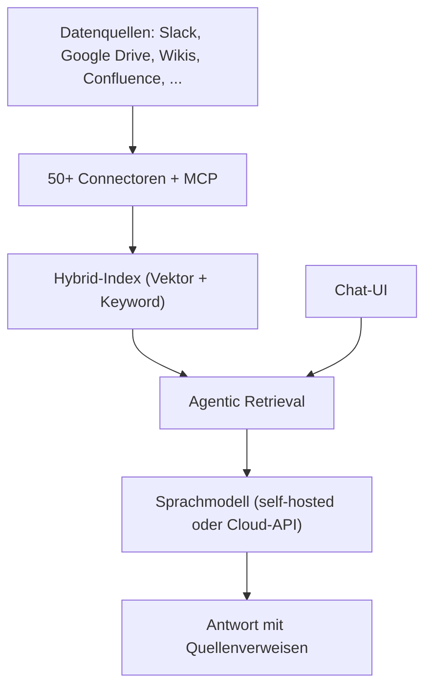

# Onyx (ehem. Danswer): Open-Source Enterprise-Such- & RAG-Plattform

**Onyx** — bis zur Umbenennung als **Danswer** bekannt — ist eine Open-Source-Anwendungsschicht für Sprachmodelle, die Chat-Oberfläche, Enterprise-Suche und Retrieval-Augmented Generation (RAG) in einer selbst hostbaren Plattform vereint. Ziel ist es, Unternehmen ein KI-Chat-System zu geben, das sich mit sämtlichen internen Datenquellen verbindet, ohne dass Daten den eigenen Kontrollbereich verlassen müssen.

Diese Seite vertieft den Eintrag zu Onyx aus dem Abschnitt „[RAG- & KI-gestützte Dokumenten- & Wiki-Tools](index.md#rag-ki-gestutzte-dokumenten-wiki-tools)" der [Dokumentations-Übersicht](index.md).

!!! note "Hinweis: Umbenennung von Danswer zu Onyx"
    Das Projekt hieß ursprünglich **Danswer** und wurde in **Onyx** umbenannt. Ältere Blogposts, Foren-Beiträge und Docker-Image-Namen können noch den alten Namen tragen — funktional handelt es sich um dasselbe, weiterentwickelte Projekt.

---

## Übersicht



!!! tip "Tipp: Zwei Deployment-Modi"
    Onyx unterscheidet zwischen **Lite** (Chat & Agenten ohne Indexierungs-Infrastruktur, unter 1 GB RAM) und **Standard** (vollständiger Vektor-/Keyword-Index, Background-Worker, ML-Inferenz-Server, Redis, MinIO). Für einen ersten Test genügt der Lite-Modus — produktive Enterprise-Suche über viele Datenquellen benötigt den Standard-Modus.

---

## Architektur-Bausteine

| Baustein | Funktion |
|---|---|
| **Chat UI** | Frontend zur Interaktion mit dem angebundenen Sprachmodell |
| **Connectors** | 50+ Indexierungs-Connectoren (Slack, Google Drive, Confluence, Wikis, GitHub, Notion, u. v. m.) plus **Model Context Protocol (MCP)**-Anbindung |
| **Search & RAG** | Hybrid-Index aus Vektor- und Keyword-Suche kombiniert mit agentischem Retrieval |
| **Agents** | Eigene Agenten mit Instruktionen, Wissensbasis und Actions — ähnlich dem Konzept aus [Custom Chat-Assistenten im Anbieter-Vergleich](../../künstliche-intelligenz/coding/custom-chat-assistenten-anbieter-vergleich.md) |

---

## Self-Hosting per Docker

```bash
git clone https://github.com/onyx-dot-app/onyx.git
cd onyx/deployment/docker_compose
docker compose -f docker-compose.dev.yml -p onyx-stack up -d
```

!!! warning "Achtung: Standard-Modus benötigt spürbare Ressourcen"
    Der Standard-Modus startet neben der Chat-UI zusätzlich Vektor-/Keyword-Indizes, Background-Job-Worker, einen ML-Inferenz-Server, Redis und MinIO als Blob-Storage. Für Produktivbetrieb mit mehreren Datenquellen ist ein dedizierter Server oder ein Kubernetes-/Helm-Deployment sinnvoller als ein einzelner Docker-Host.

Neben Docker Compose unterstützt Onyx auch **Kubernetes, Helm, Terraform** sowie Deployment bei den gängigen Cloud-Anbietern.

---

## Unterstützte Sprachmodelle

Onyx bindet praktisch alle gängigen Anbieter an — sowohl selbstgehostet als auch über Cloud-APIs:

- **Selbstgehostet**: Ollama, LiteLLM, vLLM (siehe [vLLM High-Throughput Serving](../../künstliche-intelligenz/coding/vllm-high-throughput-serving.md))
- **Cloud-APIs**: Anthropic, OpenAI, Google Gemini und weitere (siehe [Multi-LLM- & Sprachmodell-Anbieter im Vergleich](../../künstliche-intelligenz/coding/llm-anbieter-vergleich.md))

---

## Enterprise-Funktionen

| Funktion | Beschreibung |
|---|---|
| **RBAC** | Rollenbasierte Zugriffskontrolle auf Datenquellen und Antworten |
| **SSO** | Google OAuth, OIDC, SAML |
| **SCIM** | Automatisierte Nutzerverwaltung/Provisionierung |
| **Query-Analytics** | Nutzungsstatistiken und Query-Verlauf |
| **PII-Filterung** | Custom Code Execution zur Entfernung sensibler Daten aus Queries/Antworten |
| **Whitelabeling** | Eigenes Branding der Chat-Oberfläche |

---

## Lizenz & Hosting-Optionen

| Edition | Lizenz | Umfang |
|---|---|---|
| **Community Edition** | MIT | Kernfunktionen: Chat, Connectoren, RAG, Agenten |
| **Enterprise Edition** | proprietär | RBAC, SSO/SCIM, Whitelabeling, Analytics |
| **Onyx Cloud** | gehosteter Dienst | keine eigene Infrastruktur nötig |

---

## Einordnung gegenüber verwandten Tools

!!! tip "Tipp: Abgrenzung im eigenen Werkzeugkasten"
    - **Onyx vs. [OpenWiki](openwiki-repo-dokumentation-agent.md)**: Onyx ist eine Such-/Chat-Plattform über *viele* laufend synchronisierte Datenquellen (Slack, Drive, Wikis). OpenWiki generiert dagegen gezielt eine *statische* Dokumentations-Wiki aus einem einzelnen Code-Repository.
    - **Onyx vs. [AnythingLLM/Open WebUI](index.md#rag-ki-gestutzte-dokumenten-wiki-tools)**: Onyx ist stärker auf Enterprise-Suche mit vielen Connectoren und Zugriffskontrolle ausgelegt, AnythingLLM/Open WebUI eher auf einfache lokale Dokumenten-Chats.
    - **Onyx vs. Custom-GPT-Funktionen der Anbieter**: Die in Onyx integrierten „Agents" sind ein selbstgehostetes Pendant zu Gemini Gems, OpenAI Custom GPTs oder Claude Projects — siehe [Custom Chat-Assistenten im Anbieter-Vergleich](../../künstliche-intelligenz/coding/custom-chat-assistenten-anbieter-vergleich.md).

---

## Verwandte Themen

- [Startseite](../../index.md) — zurück zur Dokumentations-Zentrale
- [Dokumentenerstellung, Wikis & Notebooks](index.md) — Gesamtübersicht aller Dokumentations-Systeme
- [Native „LLM-first" Wiki-Tools & Agenten](llm-first-wiki-tools-agenten.md) — Einordnung agentischer Wiki-Konzepte
- [OpenWiki: Repo-Dokumentations-Agent (LangChain)](openwiki-repo-dokumentation-agent.md) — verwandtes, aber anders fokussiertes Tool
- [Multi-LLM- & Sprachmodell-Anbieter im Vergleich](../../künstliche-intelligenz/coding/llm-anbieter-vergleich.md) — Preise der von Onyx unterstützten Modell-Provider
