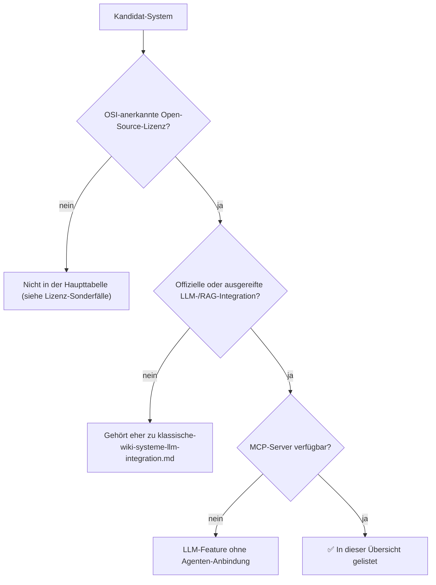

# Open-Source Wiki-, Wissensmanagement- & CMS-Systeme mit vollständiger LLM-, Agenten- & MCP-Unterstützung

Die vorangegangenen Kapitel behandeln KI-Integration getrennt nach Systemklasse: [Wiki-Systeme](klassische-wiki-systeme-llm-integration.md) und [Wissensmanagement/CMS](klassische-wissensmanagement-cms-llm-integration.md). Dieses Kapitel filtert quer über alle drei Klassen (Wiki, Wissensmanagement, CMS) nach einer engeren Schnittmenge: Systeme, die **gleichzeitig** (1) unter einer **OSI-anerkannten Open-Source-Lizenz** stehen, (2) über eine **ausgereifte LLM-/RAG-Integration** verfügen und (3) einen **MCP-Server** (Model Context Protocol) bereitstellen, der KI-Agenten echten Lese-/Schreibzugriff erlaubt — nicht nur einen Chat-Widget-Aufsatz.

!!! warning "Achtung: Funktionsumfang & Lizenzen ändern sich laufend"
    MCP-Support wird bei vielen dieser Projekte aktuell im Wochen- bis Monatstakt ausgebaut. Die Angaben hier sind eine **Momentaufnahme (Stand: Juli 2026)** — vor einer Entscheidung die aktuelle Dokumentation und Lizenzdatei des jeweiligen Projekts prüfen.

---

## Bewertungskriterien

| Kriterium | Bedeutung |
|---|---|
| **Lizenz** | Nur OSI-anerkannte Lizenzen (MIT, GPL, LGPL, AGPL) zählen hier als „Open Source" — Business-Source-License- oder ähnliche Source-available-Modelle stehen separat unten |
| **MCP-Support** | `offiziell` (vom Kernprojekt gepflegt) / `Community` (ausgereifter Drittanbieter-Server) / `keiner` |
| **Agentenfähigkeit** | `nur Lesen` (Suche/Abruf) / `Lesen+Schreiben` (CRUD auf Inhalte) / `autonom` (mehrstufige Aktionen ohne Zwischenschritt je Aktion) |

---

## Gesamtübersicht

| System | Kategorie | Lizenz | MCP-Support | Agentenfähigkeit | Modell frei wählbar? |
|---|---|---|---|---|---|
| **[Onyx](onyx-danswer-rag-plattform.md)** (ehem. Danswer) | Wissensmanagement/RAG | MIT (Community Edition) | **offiziell** (`onyx-mcp-server`) | Lesen+Schreiben, native Agents mit Actions | ja (Ollama, LiteLLM, vLLM, Anthropic, OpenAI, Gemini) |
| **[AnythingLLM](index.md#rag-ki-gestutzte-dokumenten-wiki-tools)** | Wissensmanagement/RAG | MIT | **offiziell** (natives MCP seit 2025) | Lesen+Schreiben über Agent Skills | ja, inkl. lokal via Ollama |
| **[OpenWiki](openwiki-repo-dokumentation-agent.md)** (LangChain) | Wissensmanagement/Repo-Doku | MIT | Sonderfall: keine MCP-Verbindung, sondern Referenzen in `AGENTS.md`/`CLAUDE.md` | Lesen+Schreiben (generiert & aktualisiert Wiki-Dateien) | ja, breite Provider-Liste |
| **[Wiki.js](klassische-wiki-systeme-llm-integration.md)** | Wiki | AGPL-3.0 | Community (GraphQL-basiert) | Lesen+Schreiben (CRUD, Seiten verschieben) | ja (MCP-Client-seitig) |
| **BookStack** | Wiki | MIT | Community (REST-basiert) | Lesen+Schreiben | ja |
| **[MediaWiki](mediawiki/mediawiki-ki-agent.md)** | Wiki | GPL-2.0 | Eigenbau (kein Standard-Server im Ökosystem) | Lesen+Schreiben, Human-in-the-Loop-Entwürfe | ja, frei per API-Aufruf |
| **[XWiki](xwiki/installieren.md)** | Wiki | LGPL-2.1 | kein MCP-Server, aber offizielle LLM-Extension mit RAG-Chatbot | Lesen (Chat-Antworten), On-Premise-fähig | ja, inkl. On-Premise-LLM |
| **DokuWiki** | Wiki | GPL-2.0 | kein MCP-Server, aber offizielle AIChat-/AI-Agent-Plugins | Lesen+Schreiben, respektiert ACL vollständig | ja (OpenAI, Claude, Gemini, Ollama) |
| **Drupal** | CMS | GPL-2.0+ | **offiziell** (Module `mcp`, `mcp_server`, `mcp_client`; STDIO + HTTP) | autonom (Hintergrund-Agenten, MCP Studio No-Code) | ja, 48+ Provider via Symfony AI |
| **Strapi** | Headless CMS | MIT (Community Edition) | **offiziell**, seit Strapi 5 im Core (Streamable HTTP) | Lesen+Schreiben+Publish/Unpublish | ja, entwicklerseitig frei |
| **Payload CMS** | Headless CMS | MIT | offiziell/Community-Server | Lesen+Schreiben (CRUD auf Collections) | ja |

---

## Highlights im Detail

### Onyx: der vollständigste Fall in dieser Liste
[Onyx](onyx-danswer-rag-plattform.md) vereint alle drei Kriterien am konsequentesten: MIT-lizenzierte Community Edition, native RAG-Pipeline über 50+ Connectoren und ein offizieller MCP-Server, der jedem MCP-fähigen Client (Claude Desktop, Claude Code, Cursor) direkten Zugriff auf die Wissensbasis gibt — inklusive der bestehenden Zugriffsrechte aus den Quellsystemen.

### Drupal: MCP als Drei-Module-Architektur
Drupal bildet MCP nicht als einzelnes Plugin ab, sondern als saubere Trennung dreier Module: **`mcp_server`** macht eine Drupal-Instanz selbst zum MCP-Server (Drupal-Inhalte für externe Agenten freigeben), **`mcp_client`** lässt Drupal umgekehrt externe MCP-Server als Werkzeuge nutzen, und **`mcp`** stellt die gemeinsame Basis (inkl. offiziellem PHP-SDK, einer Kooperation von PHP Foundation und Symfony-Projekt) bereit. Für Nicht-Entwickler gibt es zusätzlich **MCP Studio** als No-Code-Oberfläche zum Definieren eigener MCP-Tools.

### Strapi & Payload: MCP direkt im Core der Headless-CMS-Konkurrenten
Beide großen Open-Source-Headless-CMS haben MCP inzwischen als Kernfunktion statt als Plugin nachgezogen: Strapi liefert seit Version 5 einen eingebauten MCP-Server über Streamable HTTP mit vollem CRUD- und Publish/Unpublish-Zugriff, Payload CMS bietet einen äquivalenten Server für Collections inklusive Filterung, Pagination und lokalisierten Feldern.

### MediaWiki, XWiki, DokuWiki: reif bei LLM/RAG, zurückhaltend bei MCP
Die drei etablierten GPL-/LGPL-Wikis aus diesem Repository haben allesamt eine solide LLM-Integration ([MediaWiki KI-Agent](mediawiki/mediawiki-ki-agent.md), XWiki-LLM-Extension, DokuWiki-AIChat/-AI-Agent-Plugin) — aber **keinen** vom Kernprojekt gepflegten MCP-Server. Wer hier Agenten-Anbindung im MCP-Standard braucht, baut wie im [MediaWiki-KI-Agent-Kapitel](mediawiki/mediawiki-ki-agent.md#2-mcp-server-mediawiki-als-werkzeug-fur-allgemeine-agenten) beschrieben eine eigene, schlanke MCP-Schicht auf Basis der jeweiligen REST-/Action-API.

---

## Lizenz-Sonderfälle: technisch führend, aber nicht OSI-Open-Source

Zwei Systeme mit der derzeit **stärksten** MCP-Integration am Markt fallen streng genommen aus der obigen Liste heraus, weil ihre Lizenz nicht OSI-anerkannt ist — sie werden hier trotzdem korrekt eingeordnet erwähnt, weil sie technisch maßstabsetzend sind:

!!! warning "Achtung: Quellcode einsehbar ≠ Open Source"
    - **Outline**: Seit April 2026 bringt **jeder** Outline-Workspace einen eingebauten, offiziellen MCP-Server mit (`https://<subdomain>.getoutline.com/mcp`) — Suchen, Lesen, Erstellen, Bearbeiten, Kommentare, Verschieben, alles über den offenen MCP-Standard. Die Lizenz ist jedoch die **Business Source License (BSL)**, nicht OSI-anerkannt: Der kommerzielle Weiterverkauf als gehosteter Dienst ist ohne kommerzielle Lizenz untersagt, und die Bedingungen können sich von Release zu Release ändern.
    - **Open WebUI**: Wechselte 2025 von einer permissiven BSD-3-Lizenz zur eigenen **„Open WebUI License"** mit Pflicht-Branding-Klausel für Forks — Auslöser waren Marken-Missbrauchsfälle durch Dritte. Die native MCP-Unterstützung (seit v0.6.31) bleibt technisch exzellent, lizenzrechtlich zählt das Projekt aber nicht mehr als klassisches Open Source.

---

## Auswahlkriterium nach Anwendungsfall

!!! tip "Tipp: Welches System für welchen Einstiegspunkt?"
    - **Neues Projekt, maximale MCP-Reife gewünscht, Lizenz zweitrangig** → Outline oder Open WebUI trotz Lizenz-Sonderfall in Betracht ziehen.
    - **Strikt OSI-Open-Source gefordert (z. B. Behörden, Compliance)** → Onyx (RAG/Wissensmanagement), Drupal oder Strapi/Payload (CMS) als derzeit ausgereifteste Kombination aus Lizenz und MCP-Tiefe.
    - **Bestehendes MediaWiki/XWiki/DokuWiki, keine Migration gewünscht** → LLM-Integration nutzen wie in [Klassische Wiki-Systeme mit LLM-Integration](klassische-wiki-systeme-llm-integration.md) beschrieben, MCP-Schicht bei Bedarf selbst ergänzen (siehe [MediaWiki-KI-Agent-Beispiel](mediawiki/mediawiki-ki-agent.md)).
    - **Reines Repo-Doku-Wiki statt allgemeinem Wissensmanagement** → [OpenWiki](openwiki-repo-dokumentation-agent.md), auch ohne klassischen MCP-Server durch das Referenz-Prinzip in `AGENTS.md`/`CLAUDE.md` bereits agentenfreundlich.

---

## Verwandte Themen

- [Startseite](../../index.md) — zurück zur Dokumentations-Zentrale
- [Klassische Wiki-Systeme mit LLM-Integration](klassische-wiki-systeme-llm-integration.md)
- [Klassische Wissensmanagement-, KB- & CMS-Systeme mit LLM-Integration](klassische-wissensmanagement-cms-llm-integration.md)
- [Native „LLM-first" Wiki-Tools & Agenten](llm-first-wiki-tools-agenten.md)
- [OpenWiki: Repo-Dokumentations-Agent (LangChain)](openwiki-repo-dokumentation-agent.md)
- [Onyx (ehem. Danswer): RAG-Plattform](onyx-danswer-rag-plattform.md)
- [MediaWiki KI-Agent](mediawiki/mediawiki-ki-agent.md)
- [Dokumentenerstellung, Wikis & Notebooks](index.md) — Gesamtübersicht aller Dokumentations-Systeme
