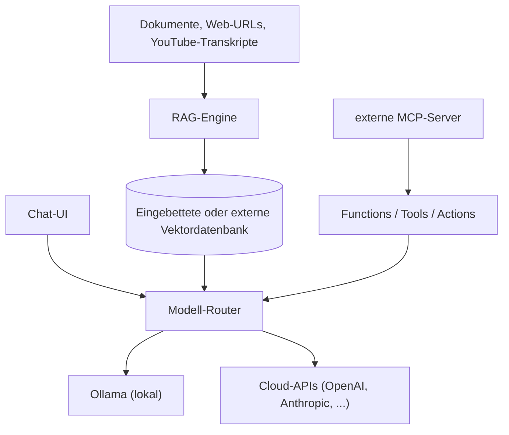

# Open WebUI: All-in-One RAG-System mit Agenten-Funktion

**Open WebUI** ist die am weitesten verbreitete selbst gehostete Chat-Oberfläche für lokale und Cloud-Sprachmodelle — mit eingebautem RAG-System, Agenten-Werkzeugen (Functions, Tools, Actions), nativer MCP-Anbindung und Rechteverwaltung für Teams. Anders als [AnythingLLM](anythingllm-rag-plattform.md) oder [Onyx](onyx-danswer-rag-plattform.md) hat sich Open WebUI ursprünglich als reine **Chat-Oberfläche für Ollama** entwickelt und ist seither zu einer vollständigen All-in-One-Plattform gewachsen.

!!! warning "Achtung: Kein reines OSI-Open-Source mehr (seit v0.6.6)"
    Open WebUI wechselte 2025 von einer permissiven **BSD-3-Lizenz** zur eigenen **„Open WebUI License"** mit Pflicht-Branding-Klausel für Forks (Auslöser waren Marken-Missbrauchsfälle durch Dritte). Der Quellcode bleibt einsehbar und selbst hostbar, zählt aber nicht mehr als klassisches Open Source — siehe auch die Einordnung in [Open-Source Systeme mit vollständiger LLM-, Agenten- & MCP-Unterstützung](open-source-llm-agent-mcp-systeme.md#highlights-im-detail). Vor kommerziellem/White-Label-Einsatz das aktuelle `LICENSE`-Dokument prüfen.

---

## Übersicht



!!! tip "Tipp: Funktionsumfang wächst schnell"
    Open WebUI hat eine der aktivsten Communities im Self-Hosting-LLM-Bereich (90.000+ GitHub-Stars) — Funktionsumfang und Plugin-Ökosystem erweitern sich entsprechend häufig. Vor einer Entscheidung die aktuelle Release-Notes-Seite prüfen.

---

## Architektur-Bausteine

| Baustein | Funktion |
|---|---|
| **Chat-UI** | ChatGPT-ähnliche Oberfläche, als PWA installierbar |
| **RAG-Engine** | Eingebautes Chunking/Embedding, wahlweise interne oder externe Vektordatenbank |
| **Functions** | In-Process-Erweiterungen: Tool-Aufrufe, Action-Buttons im Chat, Filter für Ein-/Ausgabe — der Nachfolger der älteren [Pipelines](../../künstliche-intelligenz/coding/open-webui-pipelines.md) |
| **MCP-Anbindung** | Native Unterstützung des Model Context Protocol seit v0.6.31 |
| **RBAC-Layer** | Modell-, Tool- und Wissensbasis-Zugriff granular pro Nutzer/Gruppe, LDAP-/OAuth-Sync |

---

## Installation

=== "Docker (Standard für Produktivbetrieb)"
    ```bash
    docker run -d -p 3000:8080 \
      --add-host=host.docker.internal:host-gateway \
      -v open-webui:/app/backend/data \
      -e WEBUI_SECRET_KEY="$(openssl rand -hex 32)" \
      --name open-webui \
      ghcr.io/open-webui/open-webui:main
    ```
    `WEBUI_SECRET_KEY` hält Sessions über Container-Neustarts hinweg stabil.

=== "Python (uv, lokale Entwicklung)"
    ```bash
    pip install open-webui
    open-webui serve
    ```
    Mit Python 3.11+ läuft der Server nach der Installation in wenigen Minuten.

=== "Kubernetes"
    Offizielle Helm-Charts im Projekt-Repository — für Multi-User-Teams mit vorhandener Cluster-Infrastruktur die produktionsnaheste Variante.

!!! note "Hinweis: GPU-Unterstützung"
    NVIDIA-GPUs benötigen das `:cuda`-Image-Tag, Apple Silicon läuft nativ über Metal — jeweils nur relevant, wenn Ollama im selben Host mitläuft (siehe [Lokales RAG & LLM-Serving](../../künstliche-intelligenz/coding/lokales-rag-ollama.md)).

---

## RAG-Funktionen

| Aspekt | Details |
|---|---|
| **Interne Vektordatenbank** | eingebettet, keine externe Infrastruktur nötig |
| **Externe Vektordatenbanken** | Qdrant, Milvus, PGVector (siehe [PostgreSQL + pgvector](../daten/datenbanken/pgvector-anleitung.md)) |
| **Chunking** | zeichen- oder tokenbasierter Text-Splitter, konfigurierbare Chunk-Größe und -Overlap, Markdown-Header-Splitting |
| **Dokumenttypen** | PDF, DOCX, TXT, Markdown, YouTube-Transkripte, Webinhalte |
| **Websuche im Chat** | `#` + URL bindet Webinhalte direkt in die Konversation ein |

!!! tip "Tipp: Chunk Min Size Target"
    Eine gut konfigurierte Mindestgröße für zusammengeführte Chunks kann laut offizieller Dokumentation die Chunk-Anzahl um über 90 % reduzieren und gleichzeitig die Abrufgenauigkeit verbessern — bei großen Wissensbasen ein wirkungsvoller erster Optimierungsschritt vor komplexeren RAG-Tuning-Maßnahmen.

---

## Agenten-Funktionen: Functions, Tools & Actions

Open WebUI unterscheidet mehrere Erweiterungsebenen für agentisches Verhalten:

| Ebene | Zweck | Ausführungsort |
|---|---|---|
| **Tools** | Funktionsaufrufe, die das Modell selbst auslöst (z. B. Websuche, Dateizugriff, eigene APIs) | In-Process |
| **Actions** | Buttons, die im Chat erscheinen und eine definierte Aktion auslösen | In-Process |
| **Filters** | Verändern Ein- oder Ausgabe vor bzw. nach der Modellantwort (Guardrails, Übersetzung, Formatierung) | In-Process |
| **[Pipelines](../../künstliche-intelligenz/coding/open-webui-pipelines.md)** | Komplexere Orchestrierung als eigener, separater Dienst | Externer Worker-Prozess |

**Functions** sind der leichtgewichtige, in den Hauptprozess integrierte Nachfolger der ursprünglichen Pipelines-Architektur — für die meisten Anwendungsfälle (Tool-Aufrufe, einfache Filter) reichen sie aus. Komplexere Orchestrierung, die von einem eigenen Prozess profitiert, bleibt Domäne der separat dokumentierten [Open-WebUI Pipelines](../../künstliche-intelligenz/coding/open-webui-pipelines.md).

Eine wachsende Community-Bibliothek liefert vorgefertigte Tools und Functions für Websuche, Dateizugriff und weitere Standardaufgaben, sodass eigene Python-Implementierung nur für spezifische Anforderungen nötig ist.

---

## MCP-Integration

Open WebUI unterstützt das **Model Context Protocol** nativ seit **v0.6.31** — technisch eine der ausgereiftesten MCP-Client-Implementierungen unter den selbst hostbaren Chat-Oberflächen (siehe [Beste MCP-Clients (Top 20)](../../künstliche-intelligenz/coding/mcp-client-topliste.md)). Angebundene MCP-Server stellen Datei-Zugriff, Datenbankabfragen, Websuche und beliebige benutzerdefinierte externe APIs als Werkzeuge zur Verfügung, die der Agent situativ aufruft.

---

## Rechteverwaltung & Multi-User-Betrieb

- **Rollen**: Admin (vollständige Konfiguration) vs. reguläre Nutzer
- **Granulare Kontrolle**: Modell-Zugriff, Tool-Verfügbarkeit und Wissensbasis-Freigabe lassen sich pro Nutzer oder Gruppe einschränken
- **Identitäts-Integration**: LDAP- und OAuth-Sync für bestehende Nutzerverzeichnisse
- **Registrierungs-Workflow**: Admin-Genehmigungsfluss für neue Konten, getrennte Workspaces pro Nutzer bei gemeinsam nutzbaren Team-Ressourcen

---

## Unterstützte Modell-Provider

Lokale Ollama-Instanzen laufen parallel zu Cloud-APIs (OpenAI, Anthropic, sowie beliebige OpenAI-kompatible Endpunkte) — der Modell-Router erlaubt, pro Chat oder Nutzer ein anderes Modell zu wählen, ohne die Oberfläche zu wechseln. Details und Preise der Cloud-Anbieter siehe [Multi-LLM- & Sprachmodell-Anbieter im Vergleich](../../künstliche-intelligenz/coding/llm-anbieter-vergleich.md).

---

## Einordnung gegenüber verwandten Tools

| Kriterium | Open WebUI | [AnythingLLM](anythingllm-rag-plattform.md) | [Onyx](onyx-danswer-rag-plattform.md) |
|---|---|---|---|
| Lizenz | „Open WebUI License" (BSD-3-Basis + Branding-Pflicht, seit v0.6.6) — kein reines OSI mehr | MIT | MIT (Community Edition) |
| Kernfokus | Chat-Oberfläche mit RAG + Agenten-Erweiterungen, größte Community | Lokale/private Dokumenten-Chats, Desktop-first | Enterprise-Suche über viele laufend synchronisierte Datenquellen |
| MCP-Support | offiziell, nativ seit v0.6.31 | offiziell, nativ | offiziell (`onyx-mcp-server`) |
| Agenten-Ebenen | Tools, Actions, Filters, Pipelines (mehrstufig) | No-Code Agent Builder | Agents mit Instruktionen/Actions |
| Typischer Einsatz | Schneller Einstieg, größtes Plugin-Ökosystem, primär Ollama-Nutzer | Einzelperson/kleines Team ohne Server-Infrastruktur | Unternehmen mit vielen Connectoren (Slack, Drive, Confluence, …) |

!!! tip "Tipp: Auswahl nach Anwendungsfall"
    - **Größte Community, schnellster Einstieg mit Ollama** → Open WebUI (Lizenzbedingungen vorher prüfen).
    - **Reines OSI-Open-Source ohne Zusatzbedingungen gewünscht** → [AnythingLLM](anythingllm-rag-plattform.md).
    - **Enterprise-Suche über viele externe Datenquellen mit RBAC/SSO** → [Onyx](onyx-danswer-rag-plattform.md).

---

## Verwandte Themen

- [Startseite](../../index.md) — zurück zur Dokumentations-Zentrale
- [Dokumentenerstellung, Wikis & Notebooks](index.md) — Gesamtübersicht aller Dokumentations-Systeme
- [Open-WebUI Pipelines & Filter Extensions](../../künstliche-intelligenz/coding/open-webui-pipelines.md) — vertiefter Praxis-Guide zur älteren, prozessgetrennten Erweiterungsschicht
- [AnythingLLM: All-in-One Desktop- & Docker-RAG-Plattform](anythingllm-rag-plattform.md) — reines OSI-Open-Source-Pendant
- [Onyx (ehem. Danswer): RAG-Plattform](onyx-danswer-rag-plattform.md) — Enterprise-Alternative mit breiterer Connector-Anbindung
- [Beste MCP-Clients (Top 20)](../../künstliche-intelligenz/coding/mcp-client-topliste.md) — Einordnung der MCP-Client-Reife von Open WebUI im Vergleich
- [Lokales RAG & LLM-Serving](../../künstliche-intelligenz/coding/lokales-rag-ollama.md) — Grundlagen zum lokalen Modellbetrieb via Ollama
