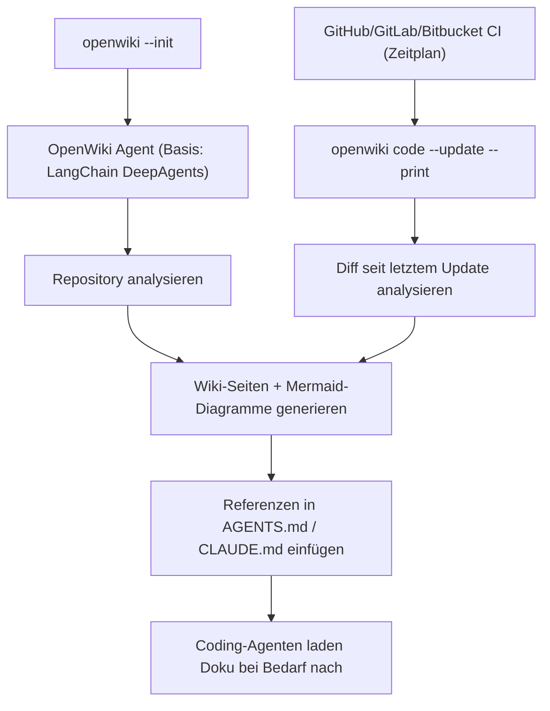

# OpenWiki: Open-Source Repo-Dokumentations-Agent (LangChain)

**OpenWiki** ist ein quelloffenes CLI-Tool von **LangChain**, das automatisch eine navigierbare Dokumentations-Wiki für ein Software-Repository generiert und laufend aktuell hält. Die Kernidee dahinter: Coding-Agenten schreiben besseren Code, wenn sie das Repository verstehen — und veraltete, manuell gepflegte Dokumentation ist in schnell wachsenden Codebasen der Regelfall, nicht die Ausnahme. OpenWiki automatisiert genau diesen Pflegeaufwand.

Diese Seite vertieft die Kategorie „[Auto-generierte Code-Wikis](llm-first-wiki-tools-agenten.md#3-auto-generierte-code-wikis-agent-erzeugt-das-wiki-selbst)" aus dem Kapitel [Native „LLM-first" Wiki-Tools & Agenten](llm-first-wiki-tools-agenten.md) mit konkreten Installations- und Bedienschritten.

!!! note "Hinweis: MIT-lizenziert"
    OpenWiki ist vollständig Open Source unter der **MIT-Lizenz** verfügbar: [github.com/langchain-ai/openwiki](https://github.com/langchain-ai/openwiki).

---

## Übersicht



!!! tip "Tipp: Referenzen statt Volltext im Prompt"
    Anders als frühere Ansätze (z. B. DeepWiki, AutoWiki) lädt OpenWiki nicht das gesamte generierte Wiki in den Agenten-Kontext. Stattdessen trägt es **Verweise** in bestehende Instruktionsdateien (`AGENTS.md`, `CLAUDE.md`) ein — Agenten rufen einzelne Wiki-Seiten erst bei Bedarf ab. Das spart Tokens und funktioniert auch bei Repos mit hunderten Dokumentationsseiten.

---

## Installation

=== "npm"
    ```bash
    npm install -g openwiki
    ```

=== "pnpm"
    ```bash
    pnpm add -g openwiki
    ```

---

## CLI-Befehle

| Befehl | Zweck |
|---|---|
| `openwiki --init` | Repository-Dokumentation initial einrichten (Code-Modus) |
| `openwiki personal --init` | Persönliche „Brain Wiki" einrichten (Personal-Modus) |
| `openwiki` | Interaktive CLI starten |
| `openwiki "Prompt"` | CLI mit initialer Anfrage starten |
| `openwiki --update` | Repository-Dokumentation aktualisieren |
| `openwiki personal --update` | Persönliche Wiki aktualisieren |
| `openwiki -p "Prompt"` | Einmaliger, nicht-interaktiver Lauf |
| `openwiki auth <provider>` | OAuth-Setup für Connectoren |
| `openwiki ngrok start` | Tunnel für Slack-OAuth starten |
| `openwiki ingest all` | Alle Connectoren ausführen (Personal-Modus) |
| `openwiki ingest <connector>` | Einzelnen Connector-Typ ausführen |

---

## Konfiguration

### Kern-Umgebungsvariablen

| Variable | Zweck |
|---|---|
| `OPENWIKI_PROVIDER` | Name des Inference-Providers |
| `OPENWIKI_MODEL_ID` | Modell-Identifier |
| `LANGSMITH_API_KEY` | Optional: Tracing über LangSmith |
| `OPENWIKI_TELEMETRY_DISABLED` | Anonyme Telemetrie deaktivieren (`1`) |
| `OPENWIKI_PROVIDER_RETRY_ATTEMPTS` | Retry-Anzahl bei Provider-Fehlern (Standard: `3`) |

### Provider-spezifische API-Keys

| Provider | Benötigte Variablen |
|---|---|
| OpenAI | `OPENAI_API_KEY` |
| Anthropic | `ANTHROPIC_API_KEY` (optional `ANTHROPIC_BASE_URL`) |
| Google Gemini (AI Studio) | `GEMINI_API_KEY` |
| Google Gemini Enterprise (Vertex AI) | `GOOGLE_CLOUD_PROJECT`, `GOOGLE_CLOUD_LOCATION` |
| AWS Bedrock | `BEDROCK_AWS_ACCESS_KEY_ID`, `BEDROCK_AWS_SECRET_ACCESS_KEY`, `BEDROCK_AWS_REGION` |
| OpenRouter | `OPENROUTER_API_KEY` |

!!! note "Hinweis: Breite Provider-Unterstützung"
    Zusätzlich zu den oben genannten unterstützt OpenWiki auch **Nebius, Fireworks, Baseten, NVIDIA NIM**, beliebige OpenAI-kompatible Endpunkte sowie den ChatGPT-Login-Modus von OpenAI — siehe [Multi-LLM- & Sprachmodell-Anbieter im Vergleich](../../künstliche-intelligenz/coding/llm-anbieter-vergleich.md) für Preise/Einordnung der jeweiligen Anbieter.

---

## Automatische Aktualisierung per CI/CD

Ein Scheduled-Workflow prüft regelmäßig die Commits seit dem letzten Wiki-Update, analysiert den Diff und aktualisiert nur die betroffenen Wiki-Abschnitte:

| Plattform | Datei |
|---|---|
| GitHub Actions | `.github/workflows/openwiki-update.yml` |
| GitLab CI | `.gitlab-ci.yml` (oder `openwiki-update.gitlab-ci.yml` einbinden) |
| Bitbucket Pipelines | `bitbucket-pipelines.yml` |

Der zentrale Befehl im CI-Kontext:

```bash
openwiki code --update --print
```

!!! warning "Achtung: Kosten durch API-Aufrufe im CI"
    Jeder Update-Lauf ruft das konfigurierte Sprachmodell auf und verursacht Token-Kosten (siehe [Token-Abrechnung vs. Abo](../../künstliche-intelligenz/coding/llm-anbieter-vergleich.md#token-abrechnung-vs-abo-der-wichtigste-unterschied-vor-der-anbieterwahl)). Bei sehr aktiven Repositories den Zeitplan (z. B. täglich statt bei jedem Commit) bewusst wählen, um die Kosten planbar zu halten.

---

## Projektstruktur

### Code-Modus (Repository-Dokumentation)

```text
openwiki/              # Generierte Dokumentation
├── INSTRUCTIONS.md    # Selbst verfasstes Briefing für die Repo-Wiki
└── *.md                # Generierte Wiki-Seiten inkl. Mermaid-Diagrammen
```

### Personal-Modus (persönliche Wissensbasis)

```text
~/.openwiki/
├── wiki/               # Generierte persönliche Wissensbasis
├── connectors/         # Rohdaten der angebundenen Quellen
├── .env                # Zugangsdaten
└── INSTRUCTIONS.md     # Instruktionen für die persönliche Wiki
```

Im Personal-Modus lassen sich zusätzliche Quellen anbinden: **Git-Repositories, Notion, Gmail, X/Twitter, Websuche (Tavily) und Hacker News.**

---

## Ausgabeformat

OpenWiki erzeugt sowohl im Code- als auch im Personal-Modus Bundles im **Google Open Knowledge Format (OKF) v0.1** — einem strukturierten, werkzeugübergreifenden Format für generiertes Wissen, das über die reine Markdown-Ausgabe hinausgeht.

---

## Einordnung gegenüber DeepWiki

| Kriterium | OpenWiki | DeepWiki (Cognition/Devin) |
|---|---|---|
| Lizenz | MIT, selbst gehostet/betrieben | proprietär, gehosteter Dienst |
| Agent-Kontext-Strategie | Referenzen in `AGENTS.md`/`CLAUDE.md`, Nachladen bei Bedarf | vollständige generierte Wiki-Seite |
| Modell-Wahl | frei wählbar (OpenAI, Anthropic, Gemini, Bedrock, OpenRouter, …) | vorgegeben durch den Dienst |
| CI-Integration | native GitHub-/GitLab-/Bitbucket-Workflows | primär Web-Oberfläche |
| Zusatzfunktion | Personal-Modus mit externen Connectoren (Notion, Gmail, …) | nicht vorhanden |

---

## Verwandte Themen

- [Startseite](../../index.md) — zurück zur Dokumentations-Zentrale
- [Native „LLM-first" Wiki-Tools & Agenten](llm-first-wiki-tools-agenten.md) — Gesamteinordnung von OpenWiki in die Werkzeuglandschaft
- [Dokumentenerstellung, Wikis & Notebooks](index.md) — Gesamtübersicht aller Dokumentations-Systeme
- [Multi-LLM- & Sprachmodell-Anbieter im Vergleich](../../künstliche-intelligenz/coding/llm-anbieter-vergleich.md) — Preise der von OpenWiki unterstützten Modell-Provider
