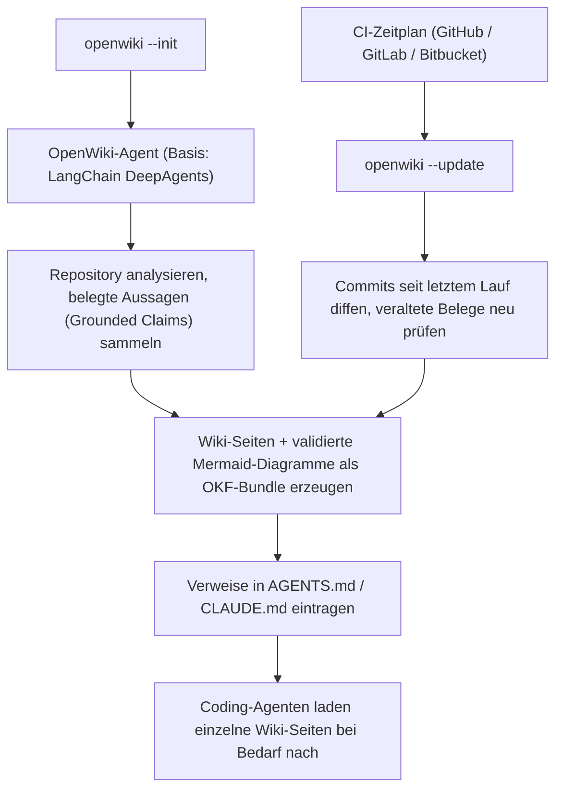

# OpenWiki: Open-Source Repo-Dokumentations-Agent (LangChain)

**OpenWiki** ist ein quelloffenes CLI-Tool von **LangChain**, das automatisch eine navigierbare Dokumentations-Wiki für ein Software-Repository generiert und laufend aktuell hält. Die Kernidee dahinter: Coding-Agenten schreiben besseren Code, wenn sie das Repository verstehen — und veraltete, manuell gepflegte Dokumentation ist in schnell wachsenden Codebasen der Regelfall, nicht die Ausnahme. OpenWiki automatisiert genau diesen Pflegeaufwand. Das Motto des Projekts: „built for agents, explored by humans".

Diese Seite vertieft die Kategorie „[Auto-generierte Code-Wikis](llm-first-wiki-tools-agenten.md#3-auto-generierte-code-wikis-agent-erzeugt-das-wiki-selbst)" aus dem Kapitel [Native „LLM-first" Wiki-Tools & Agenten](llm-first-wiki-tools-agenten.md) mit konkreten Installations- und Bedienschritten. Das zugrunde liegende Architekturmuster — RAG durch ein persistent kompiliertes Wiki ersetzen — ist eigenständig beschrieben unter [LLM-Wiki-Pattern (Karpathy-Muster)](llm-wiki-pattern-karpathy.md).

!!! note "Hinweis: MIT-lizenziert"
    OpenWiki ist vollständig Open Source unter der **MIT-Lizenz** verfügbar: [github.com/langchain-ai/openwiki](https://github.com/langchain-ai/openwiki).

---

## Übersicht


```mermaid
graph TD
    Init["openwiki --init"] --> Agent["OpenWiki-Agent (Basis: LangChain DeepAgents)"]
    Agent --> Scan["Repository analysieren, belegte Aussagen (Grounded Claims) sammeln"]
    Scan --> Wiki["Wiki-Seiten + validierte Mermaid-Diagramme als OKF-Bundle erzeugen"]
    Wiki --> Inject["Verweise in AGENTS.md / CLAUDE.md eintragen"]
    Inject --> Agents["Coding-Agenten laden einzelne Wiki-Seiten bei Bedarf nach"]
    CI["CI-Zeitplan (GitHub / GitLab / Bitbucket)"] --> Update["openwiki --update"]
    Update --> Diff["Commits seit letztem Lauf diffen, veraltete Belege neu prüfen"]
    Diff --> Wiki
```

!!! tip "Tipp: Referenzen statt Volltext im Prompt"
    Anders als frühere Ansätze (z. B. DeepWiki, AutoWiki) lädt OpenWiki nicht das gesamte generierte Wiki in den Agenten-Kontext. Stattdessen trägt es **Verweise** in bestehende Instruktionsdateien (`AGENTS.md`, `CLAUDE.md`) ein — Agenten rufen einzelne Wiki-Seiten erst bei Bedarf ab. Das spart Tokens und funktioniert auch bei Repos mit hunderten Dokumentationsseiten.

---

## Zwei Betriebsmodi

| Modus | Dokumentiert | Ausgabeort | Init-Befehl |
|---|---|---|---|
| **Code** (Standard) | das aktuelle Repository | `openwiki/` im Repo | `openwiki --init` |
| **Personal** | angebundene Wissensquellen | `~/.openwiki/wiki/` | `openwiki personal --init` |

Der Code-Modus ist für Repositories gedacht und im CI automatisierbar. Der Personal-Modus baut eine persönliche „Brain Wiki" aus externen Connectoren (siehe [Connectoren](#connectoren-personal-modus)).

---

## Erste Schritte (Code-Modus)

1. **Node.js ≥ 22** sicherstellen, dann global installieren: `npm install -g openwiki`.
2. **Provider wählen**, z. B. Anthropic:
   ```bash
   export OPENWIKI_PROVIDER=anthropic
   export ANTHROPIC_API_KEY=sk-ant-…
   export OPENWIKI_MODEL_ID=claude-sonnet-5
   ```
   Alternativ genügt bei OpenAI der ChatGPT-Login-Modus ohne API-Key.
3. Im **Wurzelverzeichnis des Repositories** `openwiki --init` ausführen. OpenWiki liest den Code, legt `openwiki/INSTRUCTIONS.md` als Selbst-Briefing an, erzeugt die Wiki-Seiten und trägt Verweise in `AGENTS.md` / `CLAUDE.md` ein.
4. `openwiki/INSTRUCTIONS.md` an die eigenen Schwerpunkte anpassen (die Datei wird bei Updates **nie überschrieben**) und `openwiki --update` erneut laufen lassen.
5. Optional: den mitgelieferten [CI-Workflow](#automatische-aktualisierung-per-cicd) einbinden, damit ein Zeitplan die Wiki nach relevanten Commits aktualisiert.
6. Optional: `openwiki visualize` für den interaktiven Graphen oder `openwiki integrations install claude`, um OpenWiki direkt in Claude Code mit dessen Modell und Repo-Werkzeugen laufen zu lassen.

---

## Installation

=== "npm (offiziell)"
    ```bash
    npm install -g openwiki
    ```
    Voraussetzung: **Node.js 22 oder neuer.**

=== "npx (ohne globale Installation)"
    ```bash
    npx openwiki --init
    ```

---

## CLI-Befehle

| Befehl | Zweck |
|---|---|
| `openwiki --init` | Repository-Wiki initial erzeugen (Code-Modus) |
| `openwiki --update` | Repository-Wiki inkrementell aktualisieren |
| `openwiki personal --init` / `--update` | Persönliche „Brain Wiki" einrichten bzw. aktualisieren |
| `openwiki` | Interaktive CLI im Code-Modus starten |
| `openwiki "Prompt"` | Interaktive CLI mit initialer Anfrage starten |
| `openwiki -p "Prompt"` | Einmaliger, nicht-interaktiver Lauf (für Skripte/CI) |
| `openwiki visualize [pfad]` | Interaktiver Knoten-Graph mit Live-Markdown-Ansicht |
| `openwiki visualize [pfad] --export <dir>` | Statisches HTML-Bundle exportieren |
| `openwiki integrations install <claude\|codex\|opencode>` | OpenWiki in einen Coding-Agenten einbinden |
| `openwiki integrations list` / `uninstall <…>` | Integrationen auflisten / entfernen |
| `openwiki auth <provider>` | OAuth-Setup für Connectoren (`slack`, `gmail`, `x`, `notion`, …) |
| `openwiki ngrok start` | Tunnel für Slack-OAuth starten |
| `openwiki ingest all` / `openwiki ingest <connector>` | Connectoren ausführen (Personal-Modus) |
| `openwiki --help` | Vollständige Hilfe anzeigen |

!!! note "Hinweis: `openwiki code …` als explizite Form"
    Da der Code-Modus der Standard ist, sind `openwiki --update` und `openwiki code --update` gleichbedeutend. Die generierten CI-Workflows verwenden die explizite Form `openwiki code --update --print`.

---

## In Coding-Agenten ausführen

Statt OpenWiki mit eigenem API-Key laufen zu lassen, kann es **innerhalb eines Coding-Agenten** ausgeführt werden — mit dessen authentifiziertem Modell und dessen nativen Repository-Werkzeugen:

```bash
openwiki integrations install claude    # oder: codex, opencode
```

Die Integration stellt dem Agenten die Operationen `openwiki_begin`, `openwiki_submit_plan`, `openwiki_next_page`, `openwiki_submit_page` und `openwiki_finish` bereit. So entstehen keine zusätzlichen Modell-Kosten neben dem ohnehin genutzten Agenten-Abo, und die Wiki-Generierung nutzt denselben Dateizugriff wie der Agent.

---

## Visualisierung & statischer Export

`openwiki visualize` startet einen lokalen Server mit einem interaktiven Knoten-Graphen der Wiki-Struktur und einem Markdown-Leser daneben:

```bash
openwiki visualize                       # öffnet den Browser automatisch
openwiki visualize openwiki --port 4000 --no-open
openwiki visualize openwiki --export ./wiki-html
```

Das exportierte HTML-Bundle ist statisch und lässt sich auf **GitHub Pages, MkDocs** oder jedem anderen Static-Host ausliefern — siehe [Beste Static-Site- & Docs-Generatoren 2026](static-site-generatoren-2026-topliste.md).

---

## Grounded Claims — belegte Aussagen

Im Code-Modus verankert OpenWiki wesentliche Aussagen an konkreten Fundstellen im Repository, etwa `repo://src/server.ts#L40-L82`. Die Belege liegen versioniert in einem `.claims/`-Verzeichnis neben der Wiki. Bei einem `openwiki --update` prüft der Agent, ob sich die referenzierten Code-Stellen geändert haben; **veraltete Belege lösen automatisch eine Neubewertung der betroffenen Seite aus**. Dadurch bleibt die Wiki nachvollziehbar an den tatsächlichen Code gekoppelt statt frei zu halluzinieren.

---

## Mermaid-Diagramm-Validierung

Eingebettete Mermaid-Diagramme werden nach jedem Lauf validiert. Ein fehlerhaftes Diagramm wird **nicht** unrepariert veröffentlicht, sondern auf lesbaren Text zurückgestuft und mit einer Reparatur-Notiz für den nächsten Update-Lauf versehen. (Für die manuelle Prüfung eigener Diagramme in diesem Repo: Skill `mermaid-validator`.)

---

## Konfiguration

### Kern-Umgebungsvariablen

| Variable | Zweck |
|---|---|
| `OPENWIKI_PROVIDER` | Name des Inference-Providers (z. B. `anthropic`, `openai`, `gemini`) |
| `OPENWIKI_MODEL_ID` | Modell-Identifier |
| `OPENWIKI_CONFIG_DIR` | Abweichender Zustands-/Konfigurationsordner (Standard: `~/.openwiki`) |
| `OPENWIKI_MAX_OUTPUT_TOKENS` | Obergrenze der Ausgabe-Tokens je Seite (z. B. `16384`) |
| `OPENWIKI_PROVIDER_RETRY_ATTEMPTS` | Retry-Anzahl bei Provider-Fehlern (Standard: `3`) |
| `OPENWIKI_LANGSMITH_API_KEY` | LangSmith-**Connector** (nur Code-Modus, siehe unten) |
| `LANGSMITH_API_KEY` | Optionales Tracing des OpenWiki-Laufs selbst über LangSmith |
| `OPENWIKI_TELEMETRY_DISABLED` / `DO_NOT_TRACK` | Anonyme Telemetrie deaktivieren (`1`) |

### Provider-spezifische Zugangsdaten

| Provider | Benötigte Variablen / Setup |
|---|---|
| OpenAI | `OPENAI_API_KEY` — **oder** ChatGPT-Login im Browser (Abo statt API-Key) |
| Anthropic | `ANTHROPIC_API_KEY` (optional `ANTHROPIC_BASE_URL`) |
| Google Gemini (AI Studio) | `GEMINI_API_KEY` |
| Google Gemini Enterprise (Vertex AI) | Google ADC (keyless), `GOOGLE_CLOUD_PROJECT`, `GOOGLE_CLOUD_LOCATION` |
| AWS Bedrock | `BEDROCK_AWS_ACCESS_KEY_ID`, `BEDROCK_AWS_SECRET_ACCESS_KEY`, `BEDROCK_AWS_REGION` |
| GitHub Copilot | `COPILOT_API_KEY` (OAuth-Token) bzw. bestehende GitHub-CLI-Session |
| OpenRouter | `OPENROUTER_API_KEY` |
| OpenAI-kompatibel | Base-URL + Key (Ollama, LM Studio, LiteLLM, Gateways) |

!!! note "Hinweis: Breite Provider-Unterstützung"
    Zusätzlich unterstützt OpenWiki **Nebius, Fireworks, Baseten** und **NVIDIA NIM** sowie beliebige OpenAI-kompatible Endpunkte — insgesamt dreizehn Provider „out of the box". Preise und Einordnung der Anbieter: [Multi-LLM- & Sprachmodell-Anbieter im Vergleich](../../künstliche-intelligenz/coding/llm-anbieter-vergleich.md).

---

## Pfad-Ausschluss (`.openwikiignore`)

Eine `.openwikiignore` im Repo-Wurzelverzeichnis (gitignore-Syntax) hält Pfade komplett aus der Analyse heraus — sie werden weder gelesen noch dokumentiert:

```text
secrets/
*.log
!logs/keep.log
```

---

## Automatische Aktualisierung per CI/CD

Ein Scheduled-Workflow prüft regelmäßig die Commits seit dem letzten Wiki-Update, analysiert den Diff und aktualisiert nur die betroffenen Wiki-Abschnitte. Ändert sich etwas, öffnet der Lauf automatisch einen Dokumentations-PR.

| Plattform | Vorlage → Ziel |
|---|---|
| GitHub Actions | `openwiki-update.yml` → `.github/workflows/openwiki-update.yml` |
| GitLab CI | `openwiki-update.gitlab-ci.yml` → in `.gitlab-ci.yml` einbinden |
| Bitbucket Pipelines | `openwiki-update.bitbucket-pipelines.yml` → `bitbucket-pipelines.yml`, dann Pipeline `openwiki-update` planen |

Der zentrale Befehl im CI-Kontext:

```bash
openwiki code --update --print
```

!!! tip "Tipp: Unterbrochene Läufe setzen fort"
    OpenWiki arbeitet seitenweise über eine dauerhafte, geordnete Warteschlange (`.run.json`). Bricht ein Lauf ab und bleibt der Checkout erhalten, wird beim nächsten Aufruf an der unterbrochenen Stelle weitergemacht. Frische CI-Runner starten dagegen sauber neu.

!!! warning "Achtung: Kosten durch API-Aufrufe im CI"
    Jeder Update-Lauf ruft das konfigurierte Sprachmodell auf und verursacht Token-Kosten (siehe [Token-Abrechnung vs. Abo](../../künstliche-intelligenz/coding/llm-anbieter-vergleich.md#token-abrechnung-vs-abo-der-wichtigste-unterschied-vor-der-anbieterwahl)). Bei sehr aktiven Repositories den Zeitplan (z. B. täglich statt bei jedem Commit) bewusst wählen, um die Kosten planbar zu halten. Alternative ohne Zusatzkosten: OpenWiki über `openwiki integrations install claude` im Coding-Agenten laufen lassen.

---

## Projektstruktur

### Code-Modus (Repository-Dokumentation)

```text
openwiki/                # Generierte Dokumentation
├── INSTRUCTIONS.md      # Selbst verfasstes Briefing (Nutzer passt an, wird nie überschrieben)
├── *.md                 # Generierte Wiki-Seiten inkl. Mermaid-Diagrammen
├── .claims/             # Versionierte Beleg-Sidecars zu den Grounded Claims
├── .run.json            # Zustand eines laufenden Generierungsvorgangs (Resume-Queue)
├── .last-update.json    # Zeitpunkt/Commit des letzten erfolgreichen Laufs
└── .langsmith.json      # LangSmith-Projektkonfiguration (falls aktiv)
```

Zusätzlich am Repo-Wurzelverzeichnis: `AGENTS.md` und `CLAUDE.md` erhalten einen `OPENWIKI`-Block mit Verweisen auf die Wiki.

### Personal-Modus (persönliche Wissensbasis)

```text
~/.openwiki/
├── wiki/                # Generierte persönliche Wissensbasis
├── connectors/          # Rohdaten der angebundenen Quellen
├── .env                 # Zugangsdaten
└── INSTRUCTIONS.md      # Instruktionen für die persönliche Wiki
```

---

## Connectoren (Personal-Modus)

Neun eingebaute Connectoren reichern die persönliche Wiki an:

| Connector | Quelle / Auth |
|---|---|
| **Custom MCP** | beliebiger HTTP- oder stdio-MCP-Server (nur lesende Tools) |
| **Git-Repositories** | lokale Repository-Pfade |
| **Notion** | gehosteter Notion-MCP-Server (OAuth) |
| **Gmail** | jüngere Mails über die Gmail-API (OAuth) |
| **X/Twitter** | Home-Timeline, Posts, Mentions, Bookmarks (OAuth 2.0 + PKCE) |
| **Slack** | ausgewählte Konversationen und Suchtreffer (OAuth, ggf. `openwiki ngrok start`) |
| **Websuche** | Tavily-Integration (`TAVILY_API_KEY`) |
| **Hacker News** | öffentliche Feed- und Such-APIs (ohne Zugangsdaten) |

!!! note "Hinweis: LangSmith-Connector im Code-Modus"
    Nur im Code-Modus verfügbar: der **LangSmith-Connector** reichert die Repo-Wiki mit Laufzeitverhalten aus LangSmith-Traces an — tatsächliche Tool-Aufrufe, Ergebnisse und Latenzen. Aktivierung über `OPENWIKI_LANGSMITH_API_KEY`.

---

## Ausgabeformat

OpenWiki erzeugt in beiden Modi Bundles im **Google Open Knowledge Format (OKF) v0.2** — ein strukturiertes, werkzeugübergreifendes Format für generiertes Wissen mit YAML-Frontmatter, Provenienz-Metadaten, versionierter Beleg-Verfolgung und validierten Mermaid-Diagrammen. Es geht damit über reine Markdown-Ausgabe hinaus.

---

## Telemetrie & Datenschutz

OpenWiki sendet standardmäßig **anonyme Nutzungsdaten** — ein `openwiki_run`-Ereignis pro Installations-ID mit Befehlstyp und Ergebnisstatus, beim Setup zusätzlich Modus, Provider- und Connector-Namen.

**Nie übertragen:** Dateiinhalte, Repository-Daten, Zugangsdaten, Prompts, Modell-Ausgaben, Dateipfade, URLs oder Laufzeiten.

Deaktivieren:

```bash
export OPENWIKI_TELEMETRY_DISABLED=1
export DO_NOT_TRACK=1
```

Die konkrete Nutzlast lässt sich mit `--telemetry-file=<pfad>` einsehen.

---

## Einordnung gegenüber DeepWiki

| Kriterium | OpenWiki | DeepWiki (Cognition/Devin) |
|---|---|---|
| Lizenz | MIT, selbst gehostet/betrieben | proprietär, gehosteter Dienst |
| Agent-Kontext-Strategie | Referenzen in `AGENTS.md`/`CLAUDE.md`, Nachladen bei Bedarf | vollständige generierte Wiki-Seite |
| Modell-Wahl | frei wählbar (13 Provider: OpenAI, Anthropic, Gemini, Bedrock, Copilot, OpenRouter, …) | vorgegeben durch den Dienst |
| Nachvollziehbarkeit | Grounded Claims mit `repo://`-Belegen, veraltete Belege triggern Neubewertung | keine expliziten Code-Belege |
| CI-Integration | native GitHub-/GitLab-/Bitbucket-Workflows mit Auto-PR | primär Web-Oberfläche |
| Ausführung im Coding-Agenten | `openwiki integrations install claude\|codex\|opencode` | nicht vorhanden |
| Zusatzfunktion | Personal-Modus mit externen Connectoren (Notion, Gmail, Slack, …) | nicht vorhanden |

---

## Verwandte Themen

- [Startseite](../../index.md) — zurück zur Dokumentations-Zentrale
- [LLM-Wiki-Pattern (Karpathy-Muster)](llm-wiki-pattern-karpathy.md) — das zugrunde liegende Architekturmuster
- [Native „LLM-first" Wiki-Tools & Agenten](llm-first-wiki-tools-agenten.md) — Gesamteinordnung von OpenWiki in die Werkzeuglandschaft
- [Dokumentenerstellung, Wikis & Notebooks](index.md) — Gesamtübersicht aller Dokumentations-Systeme
- [Beste Static-Site- & Docs-Generatoren 2026 (Top 20)](static-site-generatoren-2026-topliste.md) — Ziele für den statischen Visualizer-Export
- [Multi-LLM- & Sprachmodell-Anbieter im Vergleich](../../künstliche-intelligenz/coding/llm-anbieter-vergleich.md) — Preise der von OpenWiki unterstützten Modell-Provider
