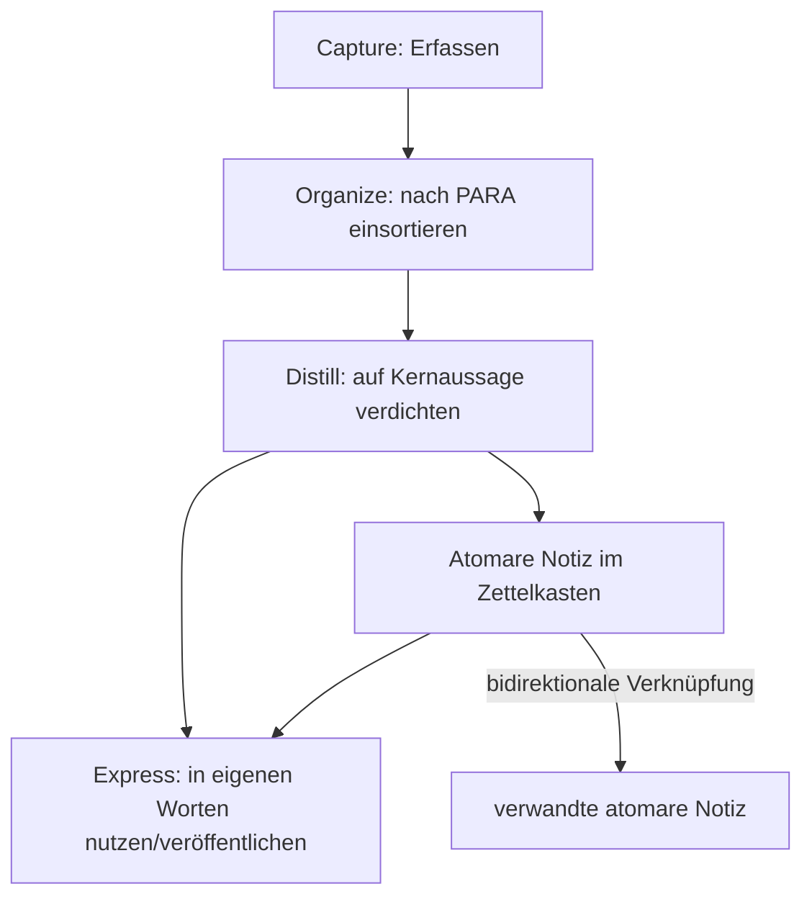

# Personal Knowledge Management (PKM) & Second Brain: Methoden und Werkzeuglandschaft

**Personal Knowledge Management (PKM)** — oft auch als **„Second Brain"** bezeichnet — ist keine einzelne Software, sondern eine Sammlung von **Methoden** dafür, wie ein Mensch Notizen, Ideen und Wissen so festhält, dass daraus über Zeit ein zusammenhängendes, durchsuchbares Denk-Werkzeug entsteht statt eines toten Notizarchivs. Dieses Kapitel ordnet die wichtigsten Methoden ein und zeigt, welche der bereits in diesem Repository dokumentierten Werkzeuge welche Methode konkret umsetzen.

!!! note "Hinweis: Abgrenzung zu den bisherigen Kapiteln"
    Wo das [LLM-Wiki-Pattern (Karpathy-Muster)](llm-wiki-pattern-karpathy.md) beschreibt, wie ein **KI-Agent** ein Wiki aus Quellen kompiliert, geht es hier um die **menschlichen** Methoden, die PKM-Werkzeuge seit Jahrzehnten (Zettelkasten seit den 1950ern) strukturieren — und darum, wie KI diese Methoden heute zunehmend unterstützt oder automatisiert. Die technische Architektur-Zeitachse der Werkzeuge selbst — von Hypertext-Vorläufern bis zu KI-nativen Canvas-Systemen — behandelt [Evolution und Architekturen digitaler PKM-Wissensgraphen & Block-Editoren](evolution-digitaler-pkm-wissensgraphen.md).

---

## Übersicht

---

## Vier Kernmethoden

=== "Zettelkasten (Niklas Luhmann)"
    Organisiert Notizen als **Netzwerk atomarer Ideen**, verbunden durch Verweise statt durch Ordnerhierarchie. Jede Notiz enthält genau einen Gedanken, bekommt eine eindeutige ID und wird mit thematisch verwandten Notizen verlinkt. Struktur entsteht **emergent** aus den Verknüpfungen, nicht durch vorab geplante Kategorien.

=== "PARA-Methode (Tiago Forte)"
    Organisiert nach **Handlungsrelevanz**, nicht nach Thema: **P**rojects (kurzfristige Ziele mit klarem Enddatum), **A**reas (fortlaufende Verantwortungsbereiche), **R**esources (Referenzmaterial), **A**rchives (nicht mehr aktives Material). Beantwortet die Frage „Wofür brauche ich das gerade?" statt „Wohin gehört das thematisch?".

=== "CODE-Framework (Tiago Forte)"
    Der Workflow, der Inhalte durch die vier Phasen **C**apture (erfassen) → **O**rganize (nach PARA einsortieren) → **D**istill (auf die Kernaussage verdichten, z. B. per Progressive Summarization) → **E**xpress (in eigenen Worten nutzen oder veröffentlichen) führt.

=== "Evergreen Notes (Andy Matuschak)"
    Kurze, **atomare** Notizen — konzeptionell nah am Zettelkasten —, die kontinuierlich überarbeitet statt einmalig geschrieben werden („evergreen" = nie „fertig"). Notizen werden so formuliert, dass sie unabhängig vom ursprünglichen Erfassungskontext verständlich bleiben.

!!! tip "Tipp: Die Methoden schließen sich nicht aus"
    Eine in der PKM-Community verbreitete Kombination lautet: **PARA für die Dateiablage, Zettelkasten fürs Denken, CODE als übergeordneter Workflow, der beides antreibt.** PARA sorgt für schnellen Zugriff auf handlungsrelevantes Material, der Zettelkasten für langfristig wachsendes, vernetztes Wissen.

---

## Gemeinsame Prinzipien

- **Atomare Notizen** statt langer Dokumente — eine Idee pro Notiz, unabhängig zitierbar und verlinkbar
- **Verlinkung statt Ordnerhierarchie** — Backlinks/bidirektionale Links erzeugen ein Netzwerk, in dem sich Struktur nachträglich zeigt, statt vorab festgelegt zu werden
- **Fortlaufende Pflege statt Einmalablage** — Notizen werden bei erneutem Zugriff überarbeitet und verfeinert (vgl. Evergreen Notes)
- **Eigene Formulierung statt Kopieren** — Inhalte werden beim Erfassen in eigene Worte übersetzt, was Verständnis erzwingt (Kern von „Distill" im CODE-Framework)

---

## Werkzeuglandschaft: welche Methode setzt welches Tool um

Dieses Repository dokumentiert PKM-Werkzeuge bereits an mehreren Stellen — diese Tabelle ordnet sie den obigen Methoden zu:

| Kategorie | Werkzeuge | Methodische Nähe |
|---|---|---|
| **Local-First, dateibasiert** | [Obsidian, Logseq](index.md#local-first-personal-knowledge-management-pkm) | Backlinks/bidirektionale Verknüpfung — direkte Software-Umsetzung des Zettelkasten-Prinzips auf Markdown-Basis |
| **KI-native PKM (KI strukturiert aktiv mit)** | [Tana, Mem.ai, Reflect Notes, Capacities, Heptabase, RemNote](llm-first-wiki-tools-agenten.md#1-ki-native-pkm-tools-personliches-wissensmanagement) | automatisiert den „Organize"-Schritt aus CODE — KI generiert Kategorien/Supertags/Cluster statt manueller PARA-Einsortierung |
| **KI-Service mit Multi-Plattform-Zugriff** | [Khoj](khoj-ki-zweites-gehirn.md) | explizit als „zweites Gehirn" positioniert; kombiniert Zettelkasten-artige Notizquellen (Org-Mode, Markdown) mit KI-gestützter semantischer Suche über „Express" hinaus (Chat-Antworten statt nur Notizabruf) |
| **Static-Site-Publishing des eigenen Zettelkastens** | [Quartz (v4)](index.md#5-lokale-dokumentations-wikis-wissensdatenbanken) | deckt die „Express"-Phase ab — veröffentlicht den eigenen, verlinkten Notizbestand als durchsuchbare Website |

---

## Wie KI die Methoden verändert

Die mühsamste Phase im CODE-Framework ist historisch **„Organize"** — Notizen konsequent in PARA einzusortieren oder im Zettelkasten sauber zu verlinken, kostet Disziplin, die viele Menschen über Zeit verlieren. Genau hier setzen KI-native PKM-Tools an: Ein Sprachmodell generiert Kategorien, schlägt Backlinks vor oder ordnet neue Notizen automatisch dem passenden PARA-Bereich zu — dasselbe Grundprinzip, das auch im Kapitel [KI strukturiert das Wiki autonom & Selfhosting-Migration](ki-autonome-wiki-strukturierung-selfhosting-migration.md) für **Team**-Wikis statt persönlicher Notizen beschrieben ist.

!!! warning "Achtung: Automatisierte Struktur ersetzt nicht das eigene Verdichten"
    KI kann „Organize" gut automatisieren, aber „Distill" — den Kerngedanken einer Quelle wirklich zu verstehen und in eigenen Worten festzuhalten — bleibt der Teil, der den eigentlichen Lerneffekt erzeugt. Ein KI-generiertes Zusammenfassungsnetz ersetzt kein selbst geschriebenes, verlinktes Zettelkasten-Netz — es kann aber die Hürde senken, überhaupt damit anzufangen.

---

## Verwandte Themen

- [Startseite](../../index.md) — zurück zur Dokumentations-Zentrale
- [Evolution und Architekturen digitaler PKM-Wissensgraphen & Block-Editoren](evolution-digitaler-pkm-wissensgraphen.md) — technische Architektur-Zeitachse der Werkzeuge selbst
- [Dokumentenerstellung, Wikis & Notebooks](index.md) — Gesamtübersicht, u. a. Obsidian, Logseq, Quartz
- [Native „LLM-first" Wiki-Tools & Agenten](llm-first-wiki-tools-agenten.md) — KI-native PKM-Tools im Detail
- [Khoj: KI-„Zweites Gehirn" für persönliche Wissenssuche](khoj-ki-zweites-gehirn.md) — konkretes Second-Brain-Werkzeug
- [LLM-Wiki-Pattern (Karpathy-Muster)](llm-wiki-pattern-karpathy.md) — verwandtes Konzept auf Team-/Repository-Ebene statt persönlicher Notizen
- [KI strukturiert das Wiki autonom & Selfhosting-Migration](ki-autonome-wiki-strukturierung-selfhosting-migration.md) — dasselbe Automatisierungsprinzip für Team-Wikis
