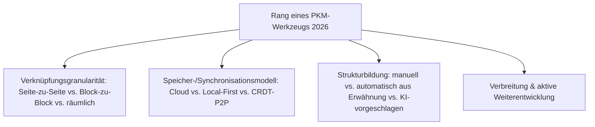
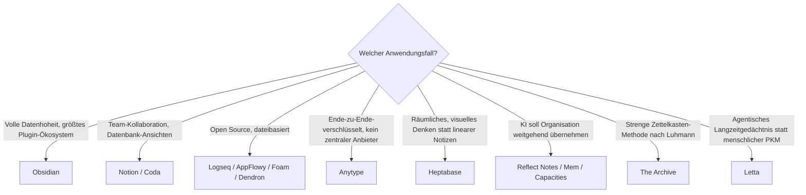

# Beste PKM-Wissensgraphen & Block-Editoren 2026 — Top-20-Topliste

Die [Evolution und Architekturen digitaler PKM-Wissensgraphen & Block-Editoren](evolution-digitaler-pkm-wissensgraphen.md) ordnet diese Kategorie chronologisch nach der **Architektur der Wissensverknüpfung** — wie Notizen technisch miteinander verbunden und synchronisiert werden. Diese Seite übersetzt die Chronologie in eine **Momentaufnahme 2026**: die 20 PKM-Werkzeuge mit der größten Verbreitung, aktivsten Weiterentwicklung und einflussreichsten Architektur — unabhängig von Lizenz oder Selfhosting-Fähigkeit.

!!! note "Hinweis: Lizenz spielt hier keine Filterrolle"
    Anders als [Wissenssysteme für den eigenen Selfhosting-Server](wissenssysteme-selfhosting-server-topliste.md) filtert diese Seite nicht nach OSI-Lizenz oder Selfhosting-Fähigkeit — proprietäre Cloud-Produkte (Notion, Roam Research, Tana) stehen gleichberechtigt neben lokalen und Open-Source-Alternativen, weil sie die Kategorie architektonisch mitgeprägt haben oder 2026 marktführend sind.

---

## Bewertungskriterien

!!! warning "Achtung: Architektonischer Einfluss ≠ größte aktuelle Nutzerzahl"
    Roam Research (Rang 3) und The Archive (Rang 13) haben die gesamte moderne PKM-Bewegung architektonisch geprägt, ohne 2026 die größte Nutzerbasis zu stellen — ihr Rang spiegelt historischen Einfluss und weiterhin aktive Nutzung wider, nicht Marktführerschaft. **Stand: August 2026.**

---

## Top 20 im Überblick

| Rang | System | Generation | Speichermodell | Besondere Stärke |
|---|---|---|---|---|
| 1 | **Obsidian** | 3 (Bidirektionale Verlinkung) | Local-First, Markdown-Dateien | Größtes Plugin-Ökosystem, volle Datenhoheit, dominante Marktposition |
| 2 | **Notion** | 4 (Block-Datenbanken/CRDT) | Cloud, Echtzeit-Kollaboration | Größte All-in-One-Nutzerbasis, Block-als-Datenbank-Prinzip als Branchenstandard |
| 3 | **Roam Research** | 3 (Bidirektionale Verlinkung) | Cloud-Datenbank | Löste 2019 die gesamte moderne Backlink-Bewegung aus |
| 4 | **[Logseq](evolution-digitaler-wissenssystem-programmiersprachen.md#generation-5-javascripttypescript-clojure-vollstack-und-funktionale-sprachen-moderner-pkm-web-apps-ab-2012)** | 3/5 (Verlinkung → CRDT) | Local-First, Markdown/Org-Mode | Führende Open-Source-Outliner-Alternative, Datalog-Wissensgraph-Kern |
| 5 | **Anytype** | 5 (Local-First CRDT & P2P) | verschlüsselt, IPFS-basiert, P2P | Führende Ende-zu-Ende-verschlüsselte Alternative ohne zentralen Anbieter-Server |
| 6 | **AppFlowy** | 5 (Local-First CRDT & P2P) | Local-First, CRDT-Sync | Reifste Open-Source-Notion-Alternative |
| 7 | **Tana** | 5 (Local-First CRDT & P2P) | Cloud, Supertag-basiert | Kombiniert strukturierte Abfragen (Datenbank) mit freiem Verlinkungsprinzip |
| 8 | **Heptabase** | 6 (Räumlich/KI-nativ) | Cloud + lokaler Export | Führendes räumliches Wissensmanagement auf unendlichen Zeichenflächen |
| 9 | **Reflect Notes** | 6 (Räumlich/KI-nativ) | Cloud | KI automatisiert den „Organize"-Schritt direkt im Erfassungsprozess |
| 10 | **Mem** (Mem.ai) | 6 (Räumlich/KI-nativ) | Cloud | Frühester Vertreter „selbstorganisierender" KI-nativer Notizen |
| 11 | **Capacities** | 6 (Räumlich/KI-nativ) | Cloud | Objektbasiertes statt seitenbasiertes Datenmodell, klare Content-Typen |
| 12 | **Craft** | 4 (Block-Datenbanken) | Cloud (Apple-Ökosystem-nah) | Höchste Design-/Interaktionsqualität unter den Block-Editoren dieser Liste |
| 13 | **Coda** | 4 (Block-Datenbanken) | Cloud, Echtzeit-Kollaboration | Kombiniert Dokument, Tabellenkalkulation und App-Baukasten auf einem Block-Modell |
| 14 | **TiddlyWiki** | 2 (Digitale Zettelkasten-Pioniere) | Einzeldatei | Nicht-lineares „Personal Wiki" in einer einzigen portablen HTML-Datei, seit 2004 aktiv |
| 15 | **The Archive** | 2 (Digitale Zettelkasten-Pioniere) | Local-First, Klartext | Konsequenteste Umsetzung von Luhmanns originaler Zettelkasten-Methode |
| 16 | **TheBrain** | 2 (Digitale Zettelkasten-Pioniere) | lokal/Cloud-Hybrid | Älteste noch aktiv gepflegte visuelle Mindmap-Metapher dieser Liste, seit 1996 |
| 17 | **Tinderbox** | 2 (Digitale Zettelkasten-Pioniere) | lokal (macOS) | Regelbasierte „Agenten" gruppieren Notizen automatisch — Vorläufer heutiger KI-Organisation |
| 18 | **Foam** | 3 (Bidirektionale Verlinkung) | Local-First, Markdown | VS-Code-Erweiterung statt eigenständiger App — Backlinks direkt im Code-Editor |
| 19 | **Dendron** | 3 (Bidirektionale Verlinkung) | Local-First, Markdown | Hierarchisches Namensschema kombiniert mit Backlink-Prinzip, ebenfalls VS-Code-nativ |
| 20 | **Letta** (ehem. MemGPT) | 6 (Räumlich/KI-nativ, agentisch) | agentischer Langzeitspeicher | Persönliche PKM-Entsprechung für autonome KI-Agenten statt menschliche Nutzer |

---

## Highlights im Detail

### Rang 1–2: die beiden Architektur-Pole der Kategorie
Obsidian und Notion repräsentieren 2026 die zwei dominanten, fast entgegengesetzten PKM-Philosophien: Obsidians Local-First-Markdown-Souveränität gegen Notions Cloud-native Block-Datenbank-Bequemlichkeit — beide mit der jeweils größten Nutzerbasis ihres Architekturlagers.

### Rang 3, 15, 17: die architektonischen Vordenker
Roam Research, The Archive und Tinderbox stehen nicht wegen aktueller Marktführerschaft so weit oben, sondern weil sie Prinzipien vorwegnahmen, die später zum Standard wurden — automatische Backlinks (Roam), methodische Zettelkasten-Treue (The Archive) und regelbasierte Auto-Organisation (Tinderbox) als früher Vorläufer der KI-gestützten Organisation aus Rang 8–11.

### Rang 5–7: Local-First trifft CRDT — die dritte Synthese
Anytype, AppFlowy und Tana zeigen 2026 den ausgereiften Stand jener Synthese, die [Generation 5 der Evolution-Chronologie](evolution-digitaler-pkm-wissensgraphen.md#generation-5-local-first-crdt-ende-zu-ende-verschlusselte-p2p-systeme-2021-2023) beschreibt: Datenhoheit wie in Generation 3, aber mit Echtzeit-Multiplayer-Fähigkeit wie in Generation 4 — ohne die Kompromisse einer zentralen Cloud-Datenbank.

### Rang 20: die Kategorie verlässt den menschlichen Nutzer
Letta markiert den radikalsten Bruch dieser Liste — dasselbe Grundproblem (persistentes, strukturiertes Gedächtnis über die Zeit) wird hier nicht für einen Menschen, sondern für einen autonomen KI-Agenten gelöst, der selbst der „Nutzer" des Wissensgraphen ist.

---

## Entscheidungshilfe nach Anwendungsfall

!!! tip "Tipp: Methodik vor Werkzeugwahl klären"
    Die technische Architektur dieser Liste beantwortet nicht, **wie** man Wissen organisiert — dafür siehe [Personal Knowledge Management (PKM) & Second Brain: Methoden](pkm-second-brain-methoden.md) (Zettelkasten, PARA, CODE, Evergreen Notes). Die passende Methode funktioniert oft in mehreren Werkzeugen dieser Liste gleichermaßen.

---

## 🔗 Verwandte Themen

- [Startseite](../../index.md) — zurück zur Dokumentations-Zentrale
- [Evolution und Architekturen digitaler PKM-Wissensgraphen & Block-Editoren](evolution-digitaler-pkm-wissensgraphen.md) — chronologisches Generationenmodell, dessen aktuellen Stand diese Topliste zusammenfasst
- [Bidirektionale Wissensgraphen & Real-time Block-Editoren (Top 15)](bidirektionale-wissensgraphen-realtime-block-editoren-2026-topliste.md) — dieselbe Kategorie, strenger gefiltert nach Lizenz, Speicherbackend und Entwicklungsaktivität
- [Produktionsreife Open-Source-PKM-Wissensgraphen & Block-Editoren nach Generation (Top 3)](produktionsreife-pkm-wissensgraphen-generationen-2026-topliste.md) — dieselben Kriterien plus Skala- und Reifegrad-Filter, sortiert nach Generation
- [Personal Knowledge Management (PKM) & Second Brain: Methoden](pkm-second-brain-methoden.md) — methodische Seite zu dieser technischen Topliste
- [Evolution und Architekturen digitaler Visueller, Local-First & Agentischer Wissenssysteme](evolution-digitaler-visuell-agentische-wissenssysteme.md) — Schwester-Zeitachse zu Rang 5–11 und 20
- [Die führenden Open-Source-Wissenssysteme 2026 (Top 20)](fuehrende-opensource-wissenssysteme-2026-topliste.md) — breiter gefasste Schwester-Topliste, dort nach OSI-Lizenz gefiltert
- [Beste Open-Source-Wissenssysteme für den eigenen Selfhosting-Server (Top 20)](wissenssysteme-selfhosting-server-topliste.md) — Selfhosting-Perspektive auf die Open-Source-Teilmenge dieser Liste
- [Khoj: KI-„Zweites Gehirn" für persönliche Wissenssuche](khoj-ki-zweites-gehirn.md) — semantische Such-/RAG-Ergänzung statt reiner Verlinkungsarchitektur
- [Native „LLM-first" Wiki-Tools & Agenten](llm-first-wiki-tools-agenten.md) — vertiefend zu Rang 9–11, 20
