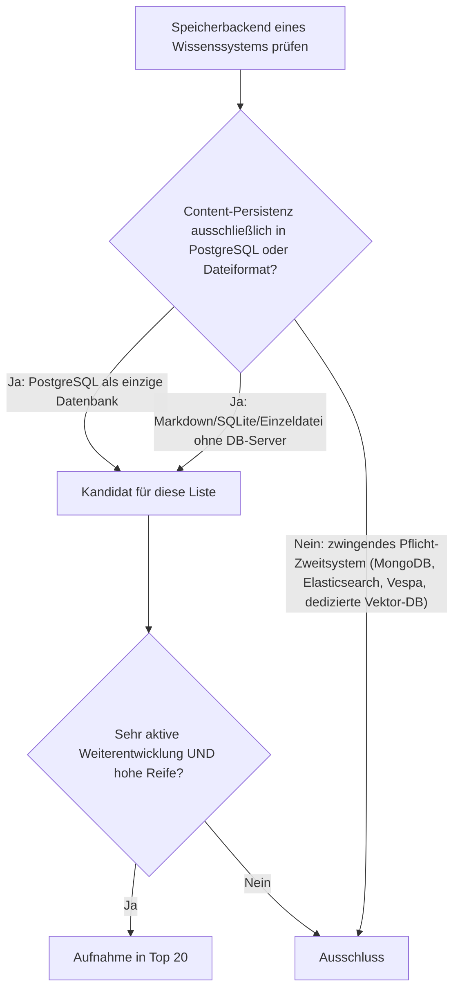
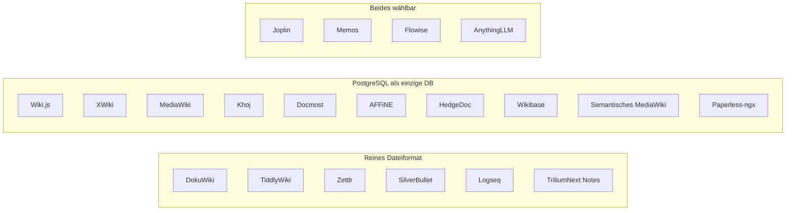
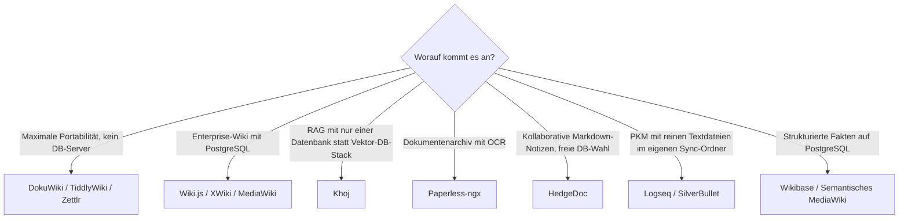

# Open-Source-Wissenssysteme mit PostgreSQL- oder Dateiformat-Speicherung, aktiver Weiterentwicklung & hoher Reife — Top-20-Topliste

Die [Topliste aktiver & reifer Open-Source-Wissenssysteme](aktive-reife-opensource-wissenssysteme-2026-topliste.md) filtert nach OSI-Lizenz, Entwicklungsaktivität und Reife. Diese Seite legt ein viertes Kriterium obendrauf, das gezielt den Betriebsaufwand adressiert: **Der eigentliche Wissensinhalt darf nur in PostgreSQL oder in einem reinen Dateiformat (Markdown, SQLite, Einzeldatei) persistiert werden** — kein zwingendes zweites oder drittes Pflicht-Backend wie MongoDB, Elasticsearch, Vespa oder eine dedizierte Vektor-Datenbank. Ein Selfhosting-Stack mit „nur einem Datenspeicher" ist einfacher zu betreiben, zu sichern und zu migrieren als einer mit drei verschiedenen Diensten.

!!! note "Hinweis: Nur OSI-anerkannte Lizenzen"
    Wie in der [Gesamtübersicht](open-source-llm-agent-mcp-systeme.md) zählen hier ausschließlich Systeme unter einer OSI-anerkannten Open-Source-Lizenz (MIT, GPL, LGPL, AGPL, BSD, Apache-2.0). Source-available-Sonderfälle wie Outline (BSL) oder Open WebUI (eigene Lizenz mit Branding-Pflicht) fallen unabhängig vom Speicherbackend heraus — konsistent mit der Handhabung in der [MCP-Topliste](wissensmanagement-mcp-server-topliste.md#lizenz-sonderfall).

!!! tip "Tipp: Cache/Queue zählt nicht als Pflicht-Zweitsystem"
    Ein Dienst wie Redis, der ausschließlich als Cache, Session-Store oder Job-Queue dient und keinen dauerhaften Wissensinhalt hält, disqualifiziert ein System hier **nicht** — solange der Content selbst vollständig aus PostgreSQL oder den Dateien rekonstruierbar bleibt. Bei Docmost (Rang 15) und AFFiNE (Rang 16) ist das explizit der Fall und unten vermerkt.

---

## Bewertungskriterien

!!! warning "Achtung: Momentaufnahme, Stand August 2026"
    Welches Backend ein Projekt „empfiehlt" oder „standardmäßig" nutzt, verändert sich mit neuen Major-Releases. Vor dem Aufsetzen eines Produktivsystems die aktuelle Installationsdokumentation des jeweiligen Projekts prüfen — insbesondere bei Rang 11–16, wo mehrere Backends parallel unterstützt werden.

---

## Top 20 im Überblick

| Rang | System | Kategorie | Lizenz | Speicherbackend | Aktivität/Reife |
|---|---|---|---|---|---|
| 1 | **[Wiki.js](klassische-wiki-systeme-llm-integration.md)** | Wiki | AGPL-3.0 | PostgreSQL (empfohlener Standard), auch MySQL/SQLite | Sehr aktiv, seit 2016 produktionsreif |
| 2 | **[MediaWiki](mediawiki/evolution-digitaler-mediawiki.md)** | Wiki | GPL-2.0 | PostgreSQL offiziell unterstützt (Standard MySQL/MariaDB) | Höchste Reife dieser Liste, durchgängig von der WMF weiterentwickelt |
| 3 | **XWiki** | Wiki | LGPL-2.1 | PostgreSQL offiziell unterstützt | Monatliche Releases, seit 2003 reif |
| 4 | **DokuWiki** | Wiki | GPL-2.0 | Reines Dateiformat, kein Datenbankserver | Reif seit 2004, stetige statt rasante Release-Kadenz |
| 5 | **TiddlyWiki** | PKM/Non-lineares Wiki | BSD-3-Clause | Einzeldatei (HTML) — reinstes Dateiformat dieser Liste | Ununterbrochen gepflegt seit 2004 |
| 6 | **Zettlr** | PKM/Zettelkasten-Editor | GPL-3.0 | Reine Markdown-Dateien, keine Datenbank | Kontinuierliche Releases, breite akademische Nutzerbasis |
| 7 | **Logseq** | PKM/Outliner | AGPL-3.0 | Markdown-/Org-Dateien (optional SQLite bei Logseq DB) | Aktive Migration auf die neue DB-Engine |
| 8 | **SilverBullet** | PKM/Markdown-Wiki | MIT | Markdown-Dateien im Dateisystem | Aktiv wachsendes Plug-System |
| 9 | **Joplin** | PKM/Notizen | MIT | Lokal SQLite/Markdown; Joplin-Server-Sync optional SQLite oder PostgreSQL | Sehr regelmäßige Releases über alle Plattformen |
| 10 | **TriliumNext Notes** (Community-Fork von Trilium Notes) | PKM/hierarchische Notizen | AGPL-3.0 | Einzelne SQLite-Datei | Nach Maintainer-Pause seit 2024 als Fork wieder sehr aktiv |
| 11 | **Memos** | Leichtgewichtige Notizen | MIT | SQLite (Standard) oder PostgreSQL | Schlank, aber durchgängig aktiv gepflegt |
| 12 | **[Flowise](flowise-visueller-flow-builder.md)** | Agenten-Workflow-Plattform | Apache-2.0 | SQLite (Standard) oder PostgreSQL, kein Pflicht-Fremdsystem | Hohe Release-Kadenz im LangChain-Ökosystem |
| 13 | **[Khoj](khoj-ki-zweites-gehirn.md)** | PKM/KI-natives „zweites Gehirn" | AGPL-3.0 | PostgreSQL mit pgvector — Vektorsuche direkt in der Datenbank | Sehr schnelle Integration neuer LLM-Fähigkeiten |
| 14 | **[AnythingLLM](anythingllm-rag-plattform.md)** | RAG/Wissensmanagement | MIT | SQLite + eingebettete Datei-Vektordatenbank (LanceDB) im Standardbetrieb | Aktive Discord-getriebene Entwicklung |
| 15 | **Docmost** | Wissensmanagement (Confluence-Alternative) | AGPL-3.0 | PostgreSQL als alleiniger Content-Speicher (Redis nur als Cache/Queue) | Jung, aber ungewöhnlich hohe Commit-Frequenz |
| 16 | **AFFiNE** | Wissensmanagement/Whiteboard | MIT | PostgreSQL als Metadaten-Speicher im Selfhosting-Betrieb | Wöchentliche Canary-Builds |
| 17 | **HedgeDoc** | Kollaborative Markdown-Notizen | AGPL-3.0 | PostgreSQL oder SQLite frei wählbar | Aktiv gepflegt, breite Editor-Community |
| 18 | **Wikibase** (Wikidata-Basis) | Strukturiertes Wissensmanagement | GPL-2.0 | PostgreSQL offiziell unterstützt (MediaWiki-Datenbankschicht) | Professionell von Wikimedia Deutschland weiterentwickelt |
| 19 | **Semantisches MediaWiki** | Wiki-Erweiterung (Semantik) | GPL-2.0+ | PostgreSQL offiziell unterstützt (MediaWiki-Datenbankschicht) | Seit professional.wiki-Sponsoring (ab 2023) wieder deutlich aktiver, siehe [Installation](semantische-mediawiki/installieren.md) |
| 20 | **Paperless-ngx** | Dokumentenarchiv/Wissensablage | GPL-3.0 | PostgreSQL empfohlen, SQLite möglich | Sehr aktive Weiterentwicklung, große Community seit dem Fork 2021 |

---

## Highlights im Detail

### Khoj: pgvector macht die zweite Datenbank überflüssig
Wo RAG-Plattformen wie Dify oder Onyx zwingend eine separate Vektor-Datenbank (Weaviate, Milvus, Vespa) neben PostgreSQL benötigen und deshalb aus dieser Liste herausfallen, löst [Khoj](khoj-ki-zweites-gehirn.md) dasselbe Problem mit der `pgvector`-Erweiterung **innerhalb** von PostgreSQL. Ein einziger Datenspeicher reicht für relationale Daten und Embeddings gleichermaßen — genau das Betriebsmodell, das diese Topliste auszeichnen soll.

### DokuWiki, TiddlyWiki & Zettlr: das reinste Dateiformat-Extrem
Diese drei Systeme brauchen keinen Datenbankserver überhaupt — Backup ist ein einfaches `rsync` oder `git commit` des Datenverzeichnisses, Restore ein Zurückkopieren der Dateien. Der Preis dafür ist eine im Vergleich zu den PostgreSQL-Systemen langsamere Release-Kadenz (insbesondere DokuWiki und TiddlyWiki), die aber ausreicht, um die Aktivitäts-Schwelle dieser Liste zu erfüllen — anders als etwa BookStack, das trotz vergleichbarer Reife am Speicherkriterium scheitert (siehe unten).

### Paperless-ngx: das einzige reine Dokumentenarchiv dieser Liste
Paperless-ngx erweitert den Scope bewusst um eine vierte Kategorie neben Wiki, PKM und RAG-Plattform: ein OCR-gestütztes Dokumentenarchiv, das eingehende PDFs/Scans automatisch verschlagwortet und durchsuchbar macht. Fachlich ein anderer Anwendungsfall als ein Wiki, aber technisch und lizenzrechtlich passt es exakt in dieses Raster — PostgreSQL als empfohlenes Backend, GPL-3.0, seit dem Fork von „Paperless" 2021 durchgängig sehr aktiv.

---

## Was bewusst nicht in dieser Liste steht

!!! warning "Achtung: Ausschluss trotz Open Source, Aktivität oder Reife"
    Drei Kategorien von Systemen fallen aus dieser Liste heraus, obwohl sie in verwandten Toplisten dieser Dokumentation auftauchen:

    - **Zwingendes Pflicht-Zweitsystem jenseits Postgres/Datei**: [Dify](dify-agenten-workflow-plattform.md) und [Onyx](onyx-danswer-rag-plattform.md) (ehem. Danswer) benötigen zusätzlich zu PostgreSQL zwingend eine dedizierte Vektor-Datenbank bzw. einen Suchindex (Weaviate/Milvus bei Dify, Vespa bei Onyx) — architektonisch das Gegenteil des „ein Datenspeicher reicht"-Prinzips dieser Liste.
    - **Kein PostgreSQL-Support**: BookStack (nur MySQL/MariaDB, kein offizieller PostgreSQL-Support trotz wiederholter Community-Nachfrage) und Growi (MongoDB-basiert) erfüllen das Speicherkriterium nicht, obwohl beide aktiv gepflegt und reif sind.
    - **Andere primäre Datenbank im Sync-Server**: Standard Notes' selbstgehosteter Sync-Server ist primär auf MySQL ausgelegt statt auf PostgreSQL oder Dateiformat.
    - **Lizenzausschluss unabhängig vom Speicherbackend**: Outline (BSL) und [Open WebUI](open-webui-rag-agenten-plattform.md) (eigene Lizenz mit Branding-Pflicht) — Details siehe [Lizenz-Sonderfälle in der MCP-Topliste](wissensmanagement-mcp-server-topliste.md#lizenz-sonderfall).

---

## Entscheidungshilfe nach Anwendungsfall

---

## 🔗 Verwandte Themen

- [Startseite](../../index.md) — zurück zur Dokumentations-Zentrale
- [Open-Source-Wissenssysteme mit aktiver Weiterentwicklung & hoher Reife (Top 20)](aktive-reife-opensource-wissenssysteme-2026-topliste.md) — Basis-Topliste ohne Speicherbackend-Filter
- [Die führenden Open-Source-Wissenssysteme 2026 (Top 20)](fuehrende-opensource-wissenssysteme-2026-topliste.md) — breiteste Schwester-Topliste nach Verbreitung
- [Beste Open-Source-Wissenssysteme für den eigenen Selfhosting-Server (Top 20)](wissenssysteme-selfhosting-server-topliste.md) — Selfhosting-Fokus, für den ein einfaches Speicherbackend direkt relevant ist
- [Wiki-Engines mit PostgreSQL- oder Dateiformat-Speicherung (Top 15)](wiki-engines-postgresql-dateiformat-2026-topliste.md) — dieselben Speicherkriterien, enger gefasst auf reine Wiki-Engines statt der gesamten Wissenssysteme-Klasse
- [Workspace-, Kollaborations- & Docs-as-Code-Plattformen (Top 20)](workspace-kollaboration-docs-as-code-2026-topliste.md) — dieselben Speicherkriterien für Team-Workspace-, Groupware- und Docs-as-Code-Hosting-Plattformen statt Wiki/PKM/RAG
- [Bidirektionale Wissensgraphen & Real-time Block-Editoren (Top 15)](bidirektionale-wissensgraphen-realtime-block-editoren-2026-topliste.md) — dieselben Speicherkriterien, enger gefasst auf bidirektionale PKM-Verlinkung und Block-Editoren
- [Semantische & RAG-Wissenssysteme mit PostgreSQL-/Dateiformat-Speicherung (Top 15)](semantische-rag-wissenssysteme-postgresql-dateiformat-2026-topliste.md) — dieselben Speicherkriterien, enger gefasst auf Vektordatenbanken, RAG-Frameworks und RAG-Plattformen
- [Visuelle, Local-First & agentische Wissenssysteme mit PostgreSQL-/Dateiformat-Speicherung (Top 15)](visuell-agentische-wissenssysteme-postgresql-dateiformat-2026-topliste.md) — dieselben Speicherkriterien, enger gefasst auf Canvas-Werkzeuge, CRDT-Infrastruktur und agentisches Gedächtnis
- [Multi-Agenten-Wissensökosysteme mit PostgreSQL-/Dateiformat-Speicherung (Top 14)](multiagenten-wissensoekosysteme-postgresql-dateiformat-2026-topliste.md) — dieselben Speicherkriterien, enger gefasst auf Multi-Agenten-Orchestrierungs-Frameworks
- [PostgreSQL DBA Praxis-Handbuch](../../entwicklung/infrastruktur/postgresql-dba-praxis.md) — vertiefend zur Datenbankschicht hinter den PostgreSQL-Rängen dieser Liste
- [Beste Wissensmanagement-Systeme (Open Source) mit MCP-Server (Top 20)](wissensmanagement-mcp-server-topliste.md) — enger gefasste Schwester-Topliste mit MCP-Support als Kernkriterium
- [Khoj: KI-„Zweites Gehirn" für persönliche Wissenssuche](khoj-ki-zweites-gehirn.md) — vertiefend zu Rang 13
- [Flowise: Visueller Flow-Builder für LangChain](flowise-visueller-flow-builder.md) — vertiefend zu Rang 12
- [AnythingLLM: All-in-One Desktop- & Docker-RAG-Plattform](anythingllm-rag-plattform.md) — vertiefend zu Rang 14
- [Dify: Visuelle Agenten- & Workflow-Plattform](dify-agenten-workflow-plattform.md) — Gegenbeispiel, ausgeschlossen wegen Pflicht-Vektor-DB
- [Onyx (ehem. Danswer): RAG-Plattform](onyx-danswer-rag-plattform.md) — Gegenbeispiel, ausgeschlossen wegen Pflicht-Suchindex Vespa
