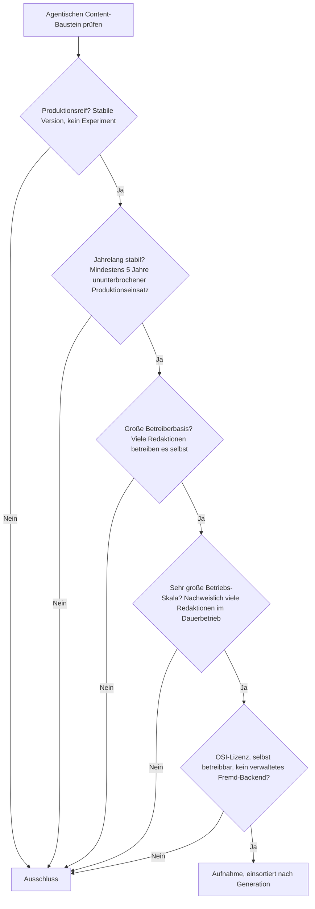
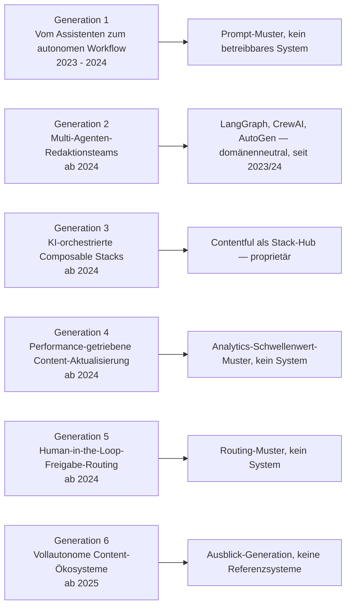
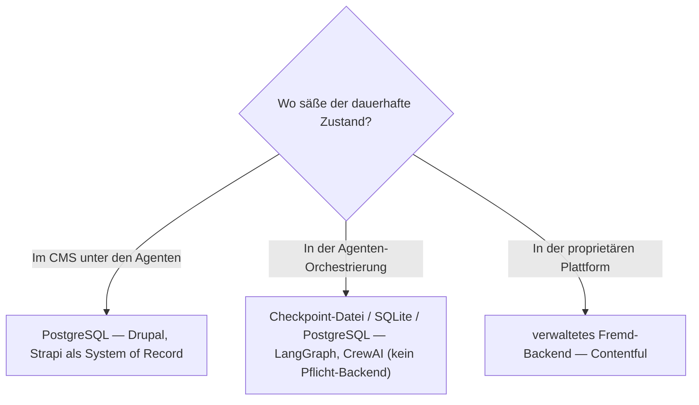

# Produktionsreife agentische Content-Ökosysteme nach Generation — Reifegrad, Lizenz & Betriebs-Skala (kein Treffer — jüngste CMS-Generation)

Die [Evolution und Architekturen digitaler Agentischer Content-Ökosysteme](evolution-digitaler-agentische-content-oekosysteme.md) zoomt in Generation 5 — die aktuelle und letzte — der [übergeordneten CMS-Zeitachse](evolution-digitaler-cms.md) hinein und teilt die agentische Linie in ein feineres Modell: vom KI-Assistenten zum autonomen Redaktions-Workflow (1), Multi-Agenten-Redaktionsteams (2), KI-orchestrierte Composable Stacks (3), performance-getriebene autonome Content-Aktualisierung (4), Human-in-the-Loop-Freigabe-Routing (5), vollautonome Content-Ökosysteme (6). Die [Topliste bester agentischer Content-Ökosysteme 2026](agentische-content-oekosysteme-2026-topliste.md) rankt die gesamte Kategorie. Diese Seite legt das **konservative** Fünf-Filter-Sieb der Familie an und sortiert nach Generation.

!!! warning "Achtung: Der klarste „kein Treffer" der CMS-Linie"
    Die Evolution-Seite sagt es selbst: Für diese Generation „existieren noch wenige vollständig ausgereifte Referenzsysteme". Die Architektur ist **erst seit 2023** real — jeder Filter, der fünf Jahre verlangt, schließt sie aus. Fast alle Generationen bestehen aus **Bausteinen/Mustern** (Recherche-Agent, Prüf-Agent, autonomes Freigabe-Routing), nicht aus Produkten; das eine genannte Produkt (**Contentful** als „Composable Stack Hub") ist proprietär. Die quelloffenen Orchestrierungs-Frameworks — **LangGraph**, **CrewAI**, **AutoGen** — sind domänenneutral, selbst 2023/24 entstanden und für Content-Produktion weder gebaut noch in Redaktions-Skala erprobt. Fazit wie bei den [agentischen Tutor-Ökosystemen](../e-learning/produktionsreife-agentische-tutor-oekosysteme-generationen-2026-topliste.md): **reifes CMS + etabliertes Agenten-Framework**.

---

## Die fünf harten Filter

!!! note "Hinweis: Muster sind keine Filterkandidaten"
    Ein „Recherche-Agent" oder „autonomes Freigabe-Routing" ist eine Rolle bzw. ein Architekturmuster, kein versioniertes System. Zählbar wären nur betreibbare, quelloffene Produkte oder Frameworks — und die sind hier entweder proprietär (Contentful) oder domänenneutrale Agenten-Frameworks unter fünf Jahren.

---

## Ergebnis: kein Treffer über sechs Generationsstufen

---

## Warum keine Generation einen Treffer liefert

- **Generation 1 (autonomer Redaktions-Workflow)**: reaktive KI-Vorschläge, KI-gestützte Redaktionsplanung, erste Agent-Pull-Request-Workflows — **Prompt- und Prozessmuster**, keine betreibbaren Systeme.
- **Generation 2 (Multi-Agenten-Redaktionsteams)**: die Rollentrennung Recherche-/Schreib-/Prüf-Agent wird mit **LangGraph** (seit 2024), **CrewAI** (2023), **AutoGen** (2023) gebaut — alle drei quelloffen, aber domänenneutral und unter fünf Jahren, dieselbe Einordnung wie auf der [Autonome-KI-Agenten-Schwesterseite](../../künstliche-intelligenz/produktionsreife-autonome-ki-agenten-generationen-2026-topliste.md).
- **Generation 3 (KI-orchestrierte Composable Stacks)**: **Contentful als „Composable Stack Hub"** — proprietär, siehe [Composable-CMS-Schwesterseite](produktionsreife-composable-cms-generationen-2026-topliste.md).
- **Generation 4 (performance-getriebene Aktualisierung)**: Ein Agent identifiziert schwache Seiten anhand von Analytics-Schwellenwerten und schlägt Änderungen vor — ein **Muster**, kein Produkt.
- **Generation 5 (Freigabe-Routing)**: Ein Agent ordnet Änderungen dem zuständigen Reviewer zu — wieder ein Muster.
- **Generation 6 (vollautonome Content-Ökosysteme)**: die **Ausblick-Generation**, 2026 ohne quelloffene oder verbreitete proprietäre Referenzsysteme.

---

## Dateibasiert oder PostgreSQL?

Gegenstandslos: kein selbst betreibbares agentisches Content-Ökosystem, dessen Speicher man prüfen könnte. Sobald eines entsteht, sitzt sein Zustand nach derselben Logik wie bei jedem CMS in **PostgreSQL** — die Agenten sind eine Schicht *darüber*, nicht ein Ersatz für das transaktionale System of Record.

Vertiefung zur Datenbankschicht: [PostgreSQL DBA Praxis-Handbuch](../../entwicklung/infrastruktur/postgresql-dba-praxis.md).

!!! warning "Achtung: Momentaufnahme, Stand August 2026"
    Diese Kategorie verändert sich am schnellsten aller CMS-Generationen. Ein erster Treffer entsteht frühestens, wenn eines der heutigen Agenten-Frameworks fünf Jahre Produktion erreicht **und** ein quelloffenes Content-Ökosystem darauf eine große Redaktions-Betreiberbasis aufbaut.

---

## Was bewusst nicht auf dieser Liste steht

| Baustein | Erfüllt nicht | Anmerkung |
|---|---|---|
| **LangGraph, CrewAI, AutoGen** | Reifezeit + Kategorie | Quelloffene Agenten-Orchestrierung, seit 2023/24, domänenneutral |
| **Contentful (Composable Stack Hub)** | Lizenz + Reifezeit | Proprietär, seit 2023 |
| **Recherche-/Schreib-/Prüf-Agent, Freigabe-Routing** | Kategorie | Rollen und Muster, keine versionierten Systeme |
| **Drupal, Strapi** | Kategorie dieser Seite | Reife CMS als System of Record unter den Agenten — auf der [klassischen](produktionsreife-klassische-cms-generationen-2026-topliste.md) bzw. [Headless-Schwesterseite](produktionsreife-headless-cms-generationen-2026-topliste.md) |

---

## 🔗 Verwandte Themen

- [Evolution und Architekturen digitaler Agentischer Content-Ökosysteme](evolution-digitaler-agentische-content-oekosysteme.md) — das feinere Generationenmodell, nach dem diese Liste sortiert ist
- [Beste agentische Content-Ökosysteme 2026 (Top 20)](agentische-content-oekosysteme-2026-topliste.md) — breiteste Basis-Topliste inklusive proprietärer Produkte und domänenneutraler Bausteine
- [Produktionsreife KI-Content-Erstellung in CMS nach Generation (kein Treffer)](produktionsreife-ki-content-erstellung-generationen-2026-topliste.md) — vorausgehende Generation, ebenfalls ohne Treffer
- [Produktionsreife Composable-CMS & MACH-Systeme nach Generation (kein Treffer)](produktionsreife-composable-cms-generationen-2026-topliste.md) — technische Grundlage für Generation 3
- [Produktionsreife agentische Tutor-Ökosysteme nach Generation (kein Treffer)](../e-learning/produktionsreife-agentische-tutor-oekosysteme-generationen-2026-topliste.md) — dieselbe Struktur im LMS-Kontext
- [Produktionsreife autonome KI-Agenten nach Generation (kein Treffer)](../../künstliche-intelligenz/produktionsreife-autonome-ki-agenten-generationen-2026-topliste.md) — dieselben Frameworks (LangGraph, CrewAI, AutoGen) fallen dort aus demselben Grund
- [LLM-Wiki-Pattern (Karpathy-Muster)](llm-wiki-pattern-karpathy.md) — das agentengestützte Pflegeprinzip, das dieses Repository selbst nutzt
- [PostgreSQL DBA Praxis-Handbuch](../../entwicklung/infrastruktur/postgresql-dba-praxis.md) — Datenbankschicht des CMS unter den Agenten
